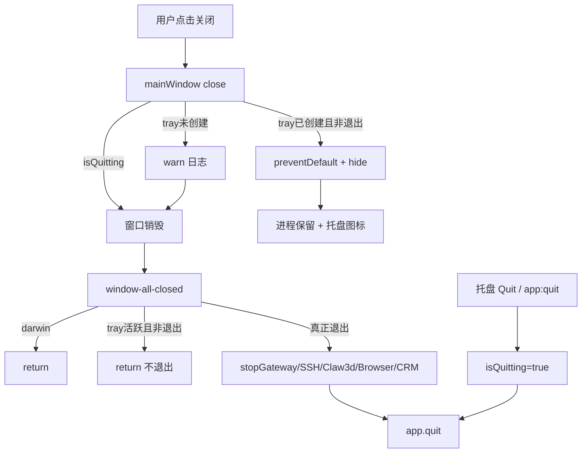

# v5.7.9 copilot-desktop-tray 实施计划

## 问题根因（已对照源码确认）

| 问题 | 现状 | 后果 |
|------|------|------|
| Windows 图标路径错误 | [`tray-manager.ts`](src/main/shell/tray-manager.ts) 写死 `resources/icon.ico`，仓库仅有 [`build/icon.ico`](build/icon.ico) 与 [`resources/icon.png`](resources/icon.png) | `nativeImage.createFromPath` 返回空图，托盘创建失败或不可见 |
| 打包未复制 ico | [`electron-builder.yml`](electron-builder.yml) `extraResources` 无 `icon.ico` | 安装后 `process.resourcesPath/icon.ico` 不存在 |
| 关闭后仍退出 | [`index.ts`](src/main/index.ts) `window-all-closed` 无条件 `app.quit()`；`close` 仅在 `trayManager.isCreated()` 时 `preventDefault` | Tray 失败时窗口真关闭 → 进程退出 |
| Quit 未统一 | Tray 菜单直接 `app.quit()`，未经 `isQuitting` 回调 | 与 PRD 要求的退出路径不一致（虽 `before-quit` 会补设，但应显式统一） |

现有能力**可复用**（无需新建架构）：
- [`TrayManager`](src/main/shell/tray-manager.ts)：左键切换、右键菜单、Gateway/Profile 状态、`--hidden`/`--tray` 启动
- [`index.ts`](src/main/index.ts)：`isQuitting`、`close` 隐藏逻辑、`app:quit` IPC、`before-quit` 清理链



---

## 实施范围（严格按 PRD 非目标）

- **改**：Main 进程托盘、窗口生命周期、打包配置、构建脚本
- **不改**：Renderer、WebOperator、Hermes Gateway、Profile Runtime、NSIS 主体、IPC 契约行为（`app:quit` 语义保持）

---

## Task 1：新增图标路径解析

**新建** [`src/main/shell/tray-icon-path.ts`](src/main/shell/tray-icon-path.ts)

- 导出 `resolveTrayIconPath()`，按 PRD §6.1 候选路径顺序（win32 / darwin / linux）
- 使用 `existsSync` 找首个存在文件；找不到抛 `[TRAY] Tray icon not found...`
- 成功时 `console.log('[TRAY] Tray icon resolved: ...')`

---

## Task 2：改造 TrayManager

**修改** [`src/main/shell/tray-manager.ts`](src/main/shell/tray-manager.ts)

1. 引入 `resolveTrayIconPath`，`createTrayManager` 中三平台 icon 字段统一用 resolved path（删除 `join(__dirname, '../../resources/icon.ico')` 等无效写死）
2. `TrayManager` 构造函数增加 `private readonly onQuit: () => void`
3. `loadIcon()`：`icon.isEmpty()` 时抛错；darwin 保留 `setTemplateImage(true)`
4. Quit 菜单改为 `this.onQuit()`，移除直接 `app.quit()`
5. `createTrayManager(..., onQuit = () => app.quit())` 签名扩展
6. 移除未使用的 `join` / `is` import（若确实不再引用）

---

## Task 3：改造 index.ts 托盘初始化与关闭逻辑

**修改** [`src/main/index.ts`](src/main/index.ts)

### 3.1 提前 Tray 初始化（PRD §6.3.1）

在 `createWindow()` **之后立即**初始化托盘（当前位于 ~1516 行 Modal 之后，需上移）：

```ts
if (mainWindow) {
  try {
    trayManager = createTrayManager(mainWindow, undefined, undefined, () => {
      isQuitting = true;
      app.quit();
    });
    trayManager.create();
    setHealthStatusCallback((running) => { ... });
    trayManager.setGatewayRunning(isGatewayRunning());
    console.log("[TRAY] Tray initialized");
  } catch (err) {
    console.error("[TRAY] Failed to initialize tray:", err);
  }
}
```

- **删除**后续重复的 Tray 初始化块（~1516–1534）
- **必须保留** Gateway health callback 与初始状态同步（随 Tray 块一起迁移）

### 3.2 可选但推荐：抽出 `quitApp()`

```ts
function quitApp(): void {
  isQuitting = true;
  app.quit();
}
```

供 `app:quit` IPC、Tray `onQuit`、更新安装退出路径共用。

### 3.3 增强 close 处理器（PRD §6.3.2）

```ts
mainWindow.on("close", (event) => {
  if (isQuitting) return;
  if (trayManager?.isCreated()) {
    event.preventDefault();
    mainWindow!.hide();
    console.log("[TRAY] Window hidden to tray");
    return;
  }
  console.warn("[TRAY] Tray is not available, window close will quit the app");
});
```

### 3.4 修复 window-all-closed（PRD §6.3.3）

```ts
app.on("window-all-closed", () => {
  if (process.platform === "darwin") return;
  if (trayManager?.isCreated() && !isQuitting) {
    console.log("[TRAY] window-all-closed ignored because tray is active");
    return;
  }
  // 原有 cleanup + app.quit()
});
```

### 3.5 保留不变

- `before-quit` 清理链（Gateway、Tray destroy、Shortcut destroy 等）
- `launchArgs.hidden` / `--tray` 启动逻辑
- `app:quit` IPC（改为调用 `quitApp()` 即可）

---

## Task 4：打包资源配置

**修改** [`electron-builder.yml`](electron-builder.yml)

1. `win.icon: build/icon.ico`
2. `extraResources` **最前**增加：
   ```yaml
   - from: build/icon.ico
     to: icon.ico
   ```
3. 保留现有 `nsis.installerIcon` / `uninstallerIcon`

---

## Task 5：构建前资源检查

**新建** [`scripts/check-tray-assets.cjs`](scripts/check-tray-assets.cjs)（检查 `build/icon.ico`、`resources/icon.png`）

**修改** [`package.json`](package.json)：

```json
"check:tray-assets": "node scripts/check-tray-assets.cjs",
"build:win": "npm run check:tray-assets && npm run build && electron-builder --win"
```

---

## Task 6：验证

```bash
npm run typecheck
npm run check:tray-assets
# Windows 环境
npm run build:win
```

**开发环境验收**（PRD §9.1）：
1. 控制台输出 `[TRAY] Tray icon resolved`
2. 托盘图标可见
3. 点关闭 → 窗口隐藏、进程保留
4. 托盘左键/菜单 Show/Hide/Quit 正常

**打包验收**（PRD §9.2、§12）：
1. 安装后托盘图标显示
2. 关闭隐藏到托盘，`desktop.exe` 仍在运行
3. `--hidden` / `--tray` 启动不显示主窗、托盘可用

**回归**（PRD §10）：窗口最小化/最大化、`window:close` 自定义标题栏、`app:quit`、更新退出、Gateway/SSH/Claw3d/BrowserToolServer/CRM Bridge/Shortcut 清理不受影响。

---

## Task 7：文档同步（rule 007）

按 [`.agents/skills/sync-project-docs/doc-map.md`](.agents/skills/sync-project-docs/doc-map.md) 增量更新：

| 文件 | 更新内容 |
|------|----------|
| [`AGENTS.md`](AGENTS.md) | 版本特性索引增加 **V5.7.9**；目录地图补充 `tray-icon-path.ts`；主进程模块速查 Tray 行 |
| [`docs/INDEX.md`](docs/INDEX.md) | V5.7.9 特性 bullet |
| [`docs/ARCHITECTURE.md`](docs/ARCHITECTURE.md) | 托盘生命周期 + close-to-tray / window-all-closed 兜底（摘要，不重复 IPC 全表） |

无需改：`docs/API_CONTRACTS.md`（无新 IPC）、`docs/renderer/**`（Renderer 无变更）

---

## 关键文件清单

| 操作 | 路径 |
|------|------|
| 新建 | `src/main/shell/tray-icon-path.ts` |
| 新建 | `scripts/check-tray-assets.cjs` |
| 修改 | `src/main/shell/tray-manager.ts` |
| 修改 | `src/main/index.ts` |
| 修改 | `electron-builder.yml` |
| 修改 | `package.json` |
| 文档 | `AGENTS.md`, `docs/INDEX.md`, `docs/ARCHITECTURE.md` |
