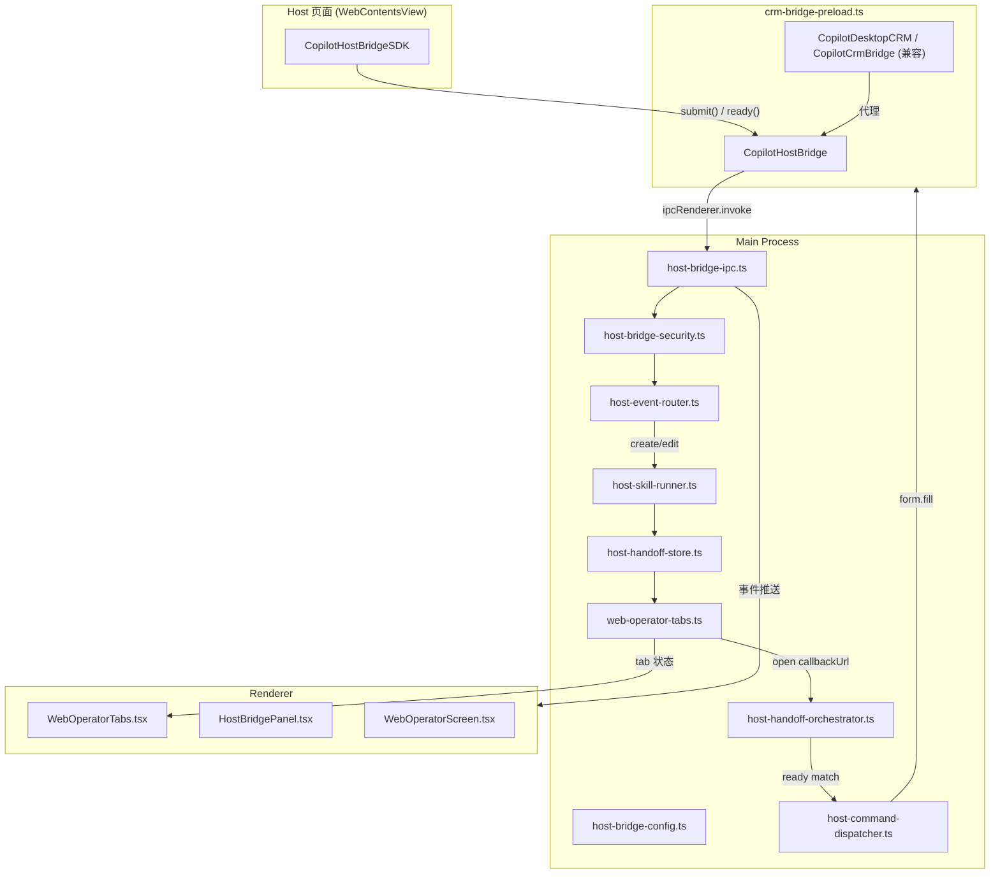

# V6.0 HostBridge JSSDK 标准化与 WebOperator 多页签

## 当前状态

现有代码基于 V5.7.x CrmBridge 实现，主要文件：
- 共享类型：[src/shared/crm-bridge/](src/shared/crm-bridge/) (5 文件)
- Main 逻辑：[src/main/crm-bridge/](src/main/crm-bridge/) (14 文件)
- Preload：[src/preload/crm-bridge-preload.ts](src/preload/crm-bridge-preload.ts)
- Renderer API：[src/preload/browser-api.ts](src/preload/browser-api.ts) (`aiosBrowser` 中 4 个 CRM 方法)
- UI：[src/renderer/src/screens/WebOperator/CrmEventPanel.tsx](src/renderer/src/screens/WebOperator/CrmEventPanel.tsx)
- 配置：[resources/crm-bridge/crm-bridge.config.json](resources/crm-bridge/crm-bridge.config.json)
- Demo JSSDK：[resources/crm-bridge/crm-lite-jssdk.js](resources/crm-bridge/crm-lite-jssdk.js)

WebOperator 当前为**单 WebContentsView**（`ShellBrowserViewAdapter` 管理 `web-operator` layer），不支持多页签。

## 架构变更概览

## 实施计划（按 PRD 推荐提交顺序）

### Task 1: HostBridge 共享类型与协议

**新增文件：**
- `src/shared/crm-bridge/host-bridge-contract.ts` — v6.0 核心类型
  - `HostBridgeSubmitEvent`、`HostPageReadyEvent`、`HostBridgePageContext`
  - `HostDesktopCommandType`、`DesktopHostFormFillCommand`、`HostDesktopCommandAck`
  - `HostSkillRunResult`、`WebOperatorTab`、`HostHandoffRecord`
  - `HostBridgeEvents` 常量（IPC channel 名、Renderer 事件名）
- `src/shared/crm-bridge/host-bridge-schema.ts` — v6.0 事件校验
  - 校验 `source: "host-web"`、`protocolVersion: "6.0"`
  - 校验 `formType`/`action`/`skillName`/`callbackUrl`
  - 复用 `estimatePayloadBytes`、`hasForbiddenSecrets`
- `src/shared/crm-bridge/host-bridge-errors.ts` — 错误码扩展
- `src/shared/crm-bridge/host-bridge-legacy-adapter.ts` — 旧事件/command 转换
  - `crm.product.context.submit` -> `host.bridge.submit`
  - `crm.page.ready` -> `host.page.ready`
  - `desktop.crm.form.fill` -> `desktop.host.form.fill` 等

**修改：** `src/shared/crm-bridge/index.ts` 导出新类型

### Task 2: HostBridge 配置文件

**新增文件：**
- `resources/crm-bridge/bridge-config.template.json` — v6.0 格式模板（含 `sites`/`routes`/`allowedFormTypes`/`allowedActions`/`allowedSkills`/`security`）
- `src/main/crm-bridge/host-bridge-config.ts` — v6.0 配置加载器
  - 7 级 fallback 优先级（userData -> profileHome -> resources -> DEFAULT）
  - 首次启动复制模板到 `app.getPath("userData")/bridge-config.json`
  - `getHostBridgeConfig()` / `reloadHostBridgeConfig()` / `getHostBridgeConfigPath()` / `openHostBridgeConfigFile()`

**保留：** `crm-bridge-config.ts` 不删除，作为 legacy fallback

### Task 3: Preload HostBridge API

**修改：** [src/preload/crm-bridge-preload.ts](src/preload/crm-bridge-preload.ts)
- 新增 `CopilotHostBridge` 全局对象：`version`/`protocolVersion`/`isAvailable`/`submit`/`ready`/`emit`/`emitReady`
- `submit()` 构建 `HostBridgeSubmitEvent` → `ipcRenderer.invoke("host-bridge:emit", ...)`
- `ready()` 构建 `HostPageReadyEvent` → `ipcRenderer.invoke("host-bridge:page-ready", ...)`
- 新增 postMessage 双向通道：`host.bridge.submit`/`host.page.ready`/`host.desktop.command`/`host.desktop.command.result`
- 保留 `CopilotDesktopCRM` / `CopilotCrmBridge` 兼容对象
- 保留旧 `crm.desktop.bridge` / `crm.desktop.command` 通道

**修改：** [src/preload/index.d.ts](src/preload/index.d.ts)
- 新增 `CopilotHostBridge` / `CopilotHostBridgeSDK` 全局类型声明

### Task 4: Main HostBridge IPC + 安全 + 事件

**新增文件：**
- `src/main/crm-bridge/host-bridge-ipc.ts` — 注册 `host-bridge:*` 的 13 个 IPC channel
  - `host-bridge:emit` / `host-bridge:page-ready` / `host-bridge:list-events` / `host-bridge:get-last-event`
  - `host-bridge:send-command` / `host-bridge:command-result`
  - `host-bridge:get-config` / `host-bridge:get-config-path` / `host-bridge:reload-config` / `host-bridge:open-config-file`
  - `host-bridge:get-last-handoff` / `host-bridge:list-handoffs` / `host-bridge:clear-handoff`
  - 旧 `crm-bridge:*` channel 内部转发到新 handler
- `src/main/crm-bridge/host-bridge-security.ts` — v6.0 安全校验
  - origin 白名单（从 config `sites[].allowedOrigins` 读取）
  - formType/action/skillName 白名单校验
  - callbackUrl origin 校验
- `src/main/crm-bridge/host-event-store.ts` — 事件存储（复用模式）
- `src/main/crm-bridge/host-event-router.ts` — `formType:action:skillName` 路由匹配

**修改：** `src/main/crm-bridge/index.ts` 同时初始化新旧 IPC

### Task 5: WebOperator 多页签

**新增文件：**
- `src/main/browser/web-operator-tabs.ts` — Main 侧 tab 管理器
  - `WebOperatorTabManager` 类：内存 tab 列表
  - 每个 tab 对应一个 `ShellViewManager` 的 layer（`web-operator-tab-{tabId}`）
  - `createTab(url, kind, hostBridge?)` / `activateTab(tabId)` / `closeTab(tabId)` / `getActiveTab()` / `listTabs()`
  - `openHostCallbackTab(input)` — 安全校验 callbackUrl origin、复用同 requestId tab、绑定 handoff
  - 注册 IPC：`web-operator-tabs:list/create/activate/close/get-active/open-callback`
- `src/renderer/src/screens/WebOperator/WebOperatorTabs.tsx` — tab bar 组件
  - 显示所有 tab（标题/loading/handoff 状态指示器）
  - 新建/激活/关闭 tab 操作
  - host-callback tab 特殊样式：`product:create`/`product:edit`

**修改：**
- [src/renderer/src/screens/WebOperator/WebOperatorScreen.tsx](src/renderer/src/screens/WebOperator/WebOperatorScreen.tsx) — 在 `BrowserToolbar` 下方插入 `WebOperatorTabs`
- [src/renderer/src/components/shell/WebContentsHost.tsx](src/renderer/src/components/shell/WebContentsHost.tsx) — 支持根据活跃 tab 切换 layerId

### Task 6: Host Handoff 编排与 Command 分发

**新增文件：**
- `src/main/crm-bridge/host-handoff-store.ts` — v6.0 handoff 数据（新结构 `HostHandoffRecord`，8 状态：`pending → callback-opening → callback-loaded → ready-received → delivering → delivered → failed → expired`）
- `src/main/crm-bridge/host-handoff-orchestrator.ts` — 编排流程
  - `handleHostSubmitEvent()` — create/edit: 调 skill runner → 创建 handoff → 打开 callbackUrl tab
  - `handleHostPageReady()` — 匹配 pending handoff → 下发 `desktop.host.form.fill`
- `src/main/crm-bridge/host-command-dispatcher.ts` — v6.0 command 分发
  - 识别 `desktop.host.*` 新 command
  - 兼容 `desktop.crm.*` 旧 command（alias 映射）
- `src/main/crm-bridge/host-command-result-store.ts` — command ack 等待/resolve

### Task 7: Host Skill Runner (Mock)

**新增文件：**
- `src/main/crm-bridge/host-skill-runner.ts`
  - `runHostSkill(event: HostBridgeSubmitEvent): Promise<HostSkillRunResult>`
  - `analytic/view` — 返回 mock 分析结果（侧栏展示）
  - `create/edit` — 返回 mock `fillFormPayload`（fields + subTables），用于 handoff
  - 后续对接真实 Hermes Agent skill

### Task 8: WebOperator Host Context Panel

**新增文件：**
- `src/renderer/src/screens/WebOperator/HostBridgePanel.tsx` — 替代 CrmEventPanel

**面板内容：**
- Host Context 标题
- requestId / formType / action / skillName / callbackUrl 展示
- pageContext（entityType / entityId / entityName / url）
- 最新 handoff 状态 + 最新 command ack
- 配置文件路径展示
- 调试按钮：Reload config / Open config / Open callbackUrl / Send test fillForm / Clear handoff / Copy pageContext

**修改：** [src/renderer/src/screens/WebOperator/panels/](src/renderer/src/screens/WebOperator/panels/) 注册新面板

### Task 9: crm-lite Demo 升级

**修改：** [resources/crm-bridge/crm-lite-jssdk.js](resources/crm-bridge/crm-lite-jssdk.js)
- 新增 `window.CopilotHostBridgeSDK` 对象（`submit`/`ready`/`onCommand`/`ack`）
- 新增 `window.CopilotHostBridge` 对象
- 旧 `submitProductContext()` 内部转为 `submit({ formType: "product", action: "view" })`
- 支持 `desktop.host.form.fill` command 接收与处理
- 保留旧对象 + 旧 command 兼容

**需要在 demo 项目（crm-lite-layui-electron-demo）修改的文件（不在本仓库）：**
- product-view.html — 三个按钮：AI 分析 / AI 新建草稿 / AI 编辑
- product-form.html — ready() + onCommand() 接收 fillForm

### Task 10: 测试与回归

- `pnpm typecheck` 通过
- `pnpm lint` 通过
- `pnpm test` 通过
- `pnpm build` 通过
- 文档同步（AGENTS.md / docs/INDEX.md / docs/API_CONTRACTS.md / docs/renderer/）

## 文件变更汇总

**新增文件（约 17 个）：**
- `src/shared/crm-bridge/host-bridge-contract.ts`
- `src/shared/crm-bridge/host-bridge-schema.ts`
- `src/shared/crm-bridge/host-bridge-errors.ts`
- `src/shared/crm-bridge/host-bridge-legacy-adapter.ts`
- `src/main/crm-bridge/host-bridge-config.ts`
- `src/main/crm-bridge/host-bridge-ipc.ts`
- `src/main/crm-bridge/host-bridge-security.ts`
- `src/main/crm-bridge/host-bridge-types.ts` (如需独立文件)
- `src/main/crm-bridge/host-event-store.ts`
- `src/main/crm-bridge/host-event-router.ts`
- `src/main/crm-bridge/host-handoff-store.ts`
- `src/main/crm-bridge/host-handoff-orchestrator.ts`
- `src/main/crm-bridge/host-command-dispatcher.ts`
- `src/main/crm-bridge/host-command-result-store.ts`
- `src/main/crm-bridge/host-skill-runner.ts`
- `src/main/browser/web-operator-tabs.ts`
- `src/renderer/src/screens/WebOperator/WebOperatorTabs.tsx`
- `src/renderer/src/screens/WebOperator/HostBridgePanel.tsx`
- `resources/crm-bridge/bridge-config.template.json`

**修改文件（约 8 个）：**
- `src/shared/crm-bridge/index.ts`
- `src/preload/crm-bridge-preload.ts`
- `src/preload/browser-api.ts`（新增 hostBridge 相关方法）
- `src/preload/index.d.ts`
- `src/main/crm-bridge/index.ts`
- `src/main/index.ts`（注册新 IPC）
- `src/renderer/src/screens/WebOperator/WebOperatorScreen.tsx`
- `src/renderer/src/screens/WebOperator/panels/` 面板注册

**不删除的旧文件（保留兼容）：**
- 所有 `crm-*` 前缀文件保留，旧 IPC channel 内部转发到新 handler

## 关键设计决策

1. **目录不改名** — `src/main/crm-bridge/` 保留，新文件用 `host-*` 前缀（PRD 明确要求）
2. **多页签实现** — 每个 tab 对应一个 `ShellViewManager` layer，通过 `activateView` / `deactivateView` 切换显示
3. **Skill Runner 先 mock** — 返回固定 fillFormPayload，后续对接 Hermes
4. **配置迁移到 userData** — 首次启动复制模板，用户可编辑
5. **兼容层** — 旧全局对象代理到新对象、旧 IPC 转发、旧 command alias 映射
