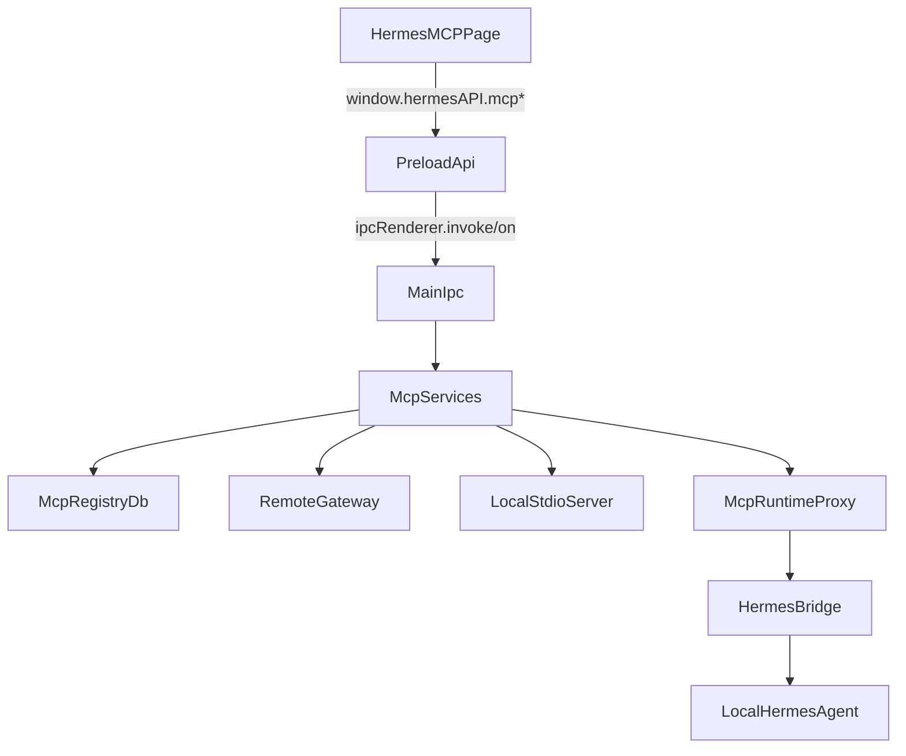

# Hermes MCP v6.1 实施计划

## 范围确认
- 目标版本：`v6.1_mcp-skill-gateway`，按 PRD `[D:\git_ai\copilot-full\copilot-desktop\prd\v6.1_mcp-skill-gateway.md](D:\git_ai\copilot-full\copilot-desktop\prd\v6.1_mcp-skill-gateway.md)` 的完整链路规划。
- 页面接入方式：新增独立 Hermes 左侧导航项 `mcp`，并将 `HermesMCPPage` 注册到 `[D:\git_ai\copilot-full\copilot-desktop\src\renderer\src\screens\Hermes\registry\hermes-pages.tsx](D:\git_ai\copilot-full\copilot-desktop\src\renderer\src\screens\Hermes\registry\hermes-pages.tsx)`。
- 现有 `skills` 页保留，MCP 专属管理能力集中到新 `mcp` 页中，避免一次性重写当前 skills/tool 页面。

## 关键边界
- Renderer 只消费 `[D:\git_ai\copilot-full\copilot-desktop\src\preload\index.ts](D:\git_ai\copilot-full\copilot-desktop\src\preload\index.ts)` 暴露的 `window.hermesAPI`，不直接访问文件系统、token、stdio 进程。
- IPC 注册统一落到 `[D:\git_ai\copilot-full\copilot-desktop\src\main\index.ts](D:\git_ai\copilot-full\copilot-desktop\src\main\index.ts)`，实际业务逻辑拆入新的 `src/main/mcp/` 目录。
- Renderer 页面导航需要同步修改 `[D:\git_ai\copilot-full\copilot-desktop\src\renderer\src\screens\Hermes\constants.ts](D:\git_ai\copilot-full\copilot-desktop\src\renderer\src\screens\Hermes\constants.ts)`、`HermesDefaultContext`、`HermesSidebar` 和 `HERMES_PAGE_REGISTRY`。
- 共享契约需要新增 `src/shared/mcp/`，避免 `preload` / `main` / `renderer` 各自复制类型。

## 结构草图

## 文件变更清单
- Renderer
  - 更新 `[D:\git_ai\copilot-full\copilot-desktop\src\renderer\src\screens\Hermes\constants.ts](D:\git_ai\copilot-full\copilot-desktop\src\renderer\src\screens\Hermes\constants.ts)`：新增 `mcp` 导航 key 和 sidebar item。
  - 更新 `[D:\git_ai\copilot-full\copilot-desktop\src\renderer\src\screens\Hermes\context\HermesDefaultContext.tsx](D:\git_ai\copilot-full\copilot-desktop\src\renderer\src\screens\Hermes\context\HermesDefaultContext.tsx)`：把新导航纳入持久化状态。
  - 更新 `[D:\git_ai\copilot-full\copilot-desktop\src\renderer\src\screens\Hermes\registry\hermes-pages.tsx](D:\git_ai\copilot-full\copilot-desktop\src\renderer\src\screens\Hermes\registry\hermes-pages.tsx)`：注册 `HermesMCPPage`。
  - 新增 `src/renderer/src/screens/Hermes/pages/MCP/HermesMCPPage.tsx`。
  - 新增 `src/renderer/src/screens/Hermes/pages/MCP/components/*` 与 `hooks/*`，承载 Server 列表、技能绑定、调用测试、事件时间线、Artifact 列表。
  - 可能更新 `Hermes.css` 以支持新页面布局。
- Shared
  - 新增 `src/shared/mcp/`：MCP server、tool、binding、invocation、artifact、事件、错误码、IPC 输入输出类型。
- Preload
  - 更新 `[D:\git_ai\copilot-full\copilot-desktop\src\preload\index.ts](D:\git_ai\copilot-full\copilot-desktop\src\preload\index.ts)`：新增 `hermesAPI.mcp*` 方法与 `onMcp*` 订阅。
  - 更新 `[D:\git_ai\copilot-full\copilot-desktop\src\preload\index.d.ts](D:\git_ai\copilot-full\copilot-desktop\src\preload\index.d.ts)`：声明完整 MCP API。
- Main
  - 新增 `src/main/mcp/` 子模块：registry、client、tool sync、skill binding、runtime proxy、bridge installer、invocation、artifact、audit、db、types、index。
  - 更新 `[D:\git_ai\copilot-full\copilot-desktop\src\main\index.ts](D:\git_ai\copilot-full\copilot-desktop\src\main\index.ts)`：注册 `mcp:*` IPC 和事件转发。
  - 可能接入现有 `skills.ts` / `profiles.ts` / `hermes.ts` / `migrations` / `utils.ts`，用于 wrapper materialization、gateway restart、profile 路径解析。
- 文档
  - 任务完成后按 skill 更新 `AGENTS.md`、`docs/INDEX.md`、`docs/API_CONTRACTS.md`、`docs/ARCHITECTURE.md`、`docs/renderer/screens/INDEX.md`，并补充 Hermes Screen 相关文档。

## 分阶段实施
### 阶段 0：实施前基线
- 创建或补齐 `specs/current-agent-task.md`、`specs/current-agent-state.md`、`specs/current-agent-log.md`，让后续执行满足仓库规则。
- 审视现有 `listMcpServers` 旧接口，决定复用还是保留为 legacy，避免与新 `mcp:*` 契约混名冲突。

### 阶段 1：Shared 契约与存储模型
- 在 `src/shared/mcp/` 定义：`McpServer`、`McpTool`、`McpSkillBinding`、`McpInvocation`、`McpArtifact`、`McpRuntimeEvent`、错误码和输入 DTO。
- 为 `mcp-registry.db` 设计初始化与 migration 入口，优先复用现有桌面 migration 风格。
- 明确 profile 相关字段全部显式透传，避免 default / named profile 混用。

### 阶段 2：Main MCP 服务层
- 实现 `src/main/mcp/mcp-db.ts` 与 registry CRUD。
- 实现 `mcp-client-service.ts`，优先覆盖 `streamable_http`，再接 `stdio`。
- 实现 `mcp-tool-sync-service.ts`，完成 `tools/list` 同步和本地 upsert。
- 实现 `mcp-skill-binding-service.ts`，负责 wrapper skill 生成、binding 导出、profile 绑定。
- 实现 `mcp-runtime-proxy.ts` 与 `mcp-bridge-installer.ts`，打通本地 Hermes Agent -> Desktop proxy -> MCP tools/call 的链路。
- 统一事件与审计出口，供 Renderer 订阅调用进度与状态变化。

### 阶段 3：IPC 与 Preload
- 在 `src/main/index.ts` 中新增 `mcp:list-servers`、`mcp:create-server`、`mcp:update-server`、`mcp:delete-server`、`mcp:set-server-enabled`、`mcp:test-connection`、`mcp:sync-tools`、`mcp:list-tools`、`mcp:set-tool-enabled`、`mcp:bind-tool`、`mcp:unbind-tool`、`mcp:check-bridge`、`mcp:install-bridge`、`mcp:invoke-test`、`mcp:list-invocations`、`mcp:list-artifacts` 等 handler。
- 定义 `onMcpEvent`、`onMcpServerStatus`、`onMcpInvocationEvent` 的发送与取消订阅模式，对齐现有 `onChatChunk` 风格。
- 在 preload 中把这些 channel 包装成稳定 API，并在 `index.d.ts` 中完成类型声明。

### 阶段 4：Hermes MCP 页面
- 在 Hermes 左侧导航增加 `mcp`，并注册 `HermesMCPPage`。
- `HermesMCPPage` 采用“页内三分区”而非继续扩张左侧主导航：
  - `MCP 服务`：Server 卡片、搜索、启停、测试连接、同步工具、编辑对话框。
  - `技能绑定`：聚合展示 MCP tools 映射出的 skills，支持启用、profile 绑定、schema 查看、测试调用。
  - `市场`：本期空状态，仅展示后续 roadmap。
- 页面需包含最少四种状态：loading、empty、error、ready；长任务用事件时间线和调用面板承接，而不是阻塞表单。
- 复用现有 Hermes 样式语义，避免引入新的全局布局体系。

### 阶段 5：验证与文档同步
- 类型验证：`pnpm exec tsc --noEmit` 或等价现有 typecheck。
- 重点验证：
  - 新导航能切换到 `HermesMCPPage`。
  - Renderer 仅通过 `window.hermesAPI` 访问新能力。
  - `mcp-registry.db` 初始化可重复执行。
  - Server CRUD / tools/list / tools/call / profile binding 至少覆盖一条 happy path。
  - `mcp-skill-bridge` 缺失、server disabled、tool disabled、profile 未绑定时能返回标准错误码。
- 收尾执行文档同步 skill，增量更新核心 docs 与 renderer screen 文档。

## UI 与交互约束
- `HermesMCPPage` 是独立左导航页，但页面内部承载 PRD 的 `MCP / 技能 / 市场` 三块管理视图，避免把左导航塞满二级能力。
- Token、token_ref、stdio command 明文不进入 UI store；UI 只见掩码或状态。
- 对 `stdio` 类型 server 的 command/args 编辑需要明确“受限/需确认”的文案和错误反馈。
- 对 gateway 正在运行且绑定变化影响 profile 的情况，需要给出“需重启/可自动重启”的显式提示。

## 验收清单
- 新增 `mcp` 导航并能正常渲染 `HermesMCPPage`。
- 新增完整 `mcp:*` Main/Preload 契约，Renderer 不绕过 `hermesAPI`。
- 支持 MCP Server 注册、编辑、删除、启用、停用、测试连接、同步工具。
- 支持把同步到的 MCP tools 映射为 Desktop Skills，并按 profile 绑定。
- 支持本地 Hermes Agent 通过 `mcp-skill-bridge` 调用 Desktop MCP runtime proxy。
- 支持展示 invocation、SSE 事件、artifact 列表。
- 满足 profile 隔离、token 不入 Renderer、stdio 受控启动、标准错误码与审计记录。
- 完成文档同步，不遗漏 `docs/API_CONTRACTS.md` 与 `docs/renderer/screens/*`。