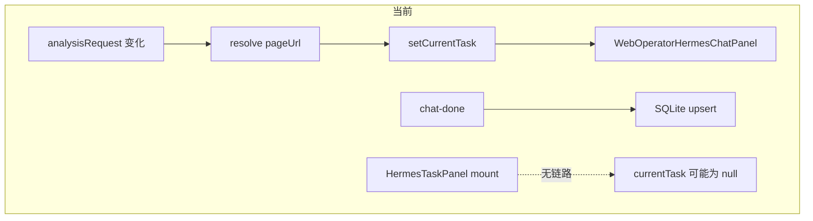
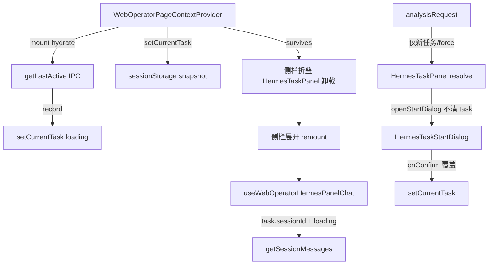

# v6.3.1_hotfix — WebOperator 任务 Chat 持久化与恢复

## 目标

| 需求 | 实现要点 |
|------|----------|
| A — 弹 Dialog 不清 Chat | 确认移除 `openStartDialog` 前的 `setCurrentTask(null)`（当前已注释，改为正式删除） |
| B — 冷启动恢复最后一次 Chat | `web-operator-task-session:get-last-active` + Provider mount hydrate |
| Context 提升 | `currentTask` / `setCurrentTask` 在 [`WebOperatorPageContext.tsx`](src/renderer/src/screens/WebOperator/context/WebOperatorPageContext.tsx) |
| 轻量持久化 | `sessionStorage` 快照（侧栏折叠 / 离开 WebOperator 后 Provider 卸载时兜底） |
| 恢复优先级 | **SQLite `getLastActive` 优先**；无 record 时再读 sessionStorage |

## 现状与缺口



- [`HermesTaskPanel.tsx`](src/renderer/src/screens/WebOperator/HermesTaskPanel.tsx)：`currentTask` 为本地 `useState`；侧栏折叠时 [`WebOperatorScreen.tsx`](src/renderer/src/screens/WebOperator/WebOperatorScreen.tsx) 卸载 `WebOperatorPanels`，任务与 Chat 内存一并丢失。
- 已有 SQLite 绑定（[`web-operator-task-session-store.ts`](src/main/web-operator-task-session-store.ts)），但**仅**在 `analysisRequest` 或 Dialog 确认后写入/读取。
- `setCurrentTask(null)` 在 L189/L206 已注释，需在实现中**删除**并加 HostBridge 防重复触发。

## 目标数据流



---

## 1. Main / Shared / Preload — `getLastActive`

**契约** — [`web-operator-task-session-contract.ts`](src/shared/web-operator/web-operator-task-session-contract.ts)

- 新增 `WebOperatorTaskSessionGetLastActiveResult = { record: WebOperatorTaskSessionRecord | null }`
- `WebOperatorTaskSessionAPI.getLastActive(): Promise<...>`

**Store** — [`web-operator-task-session-store.ts`](src/main/web-operator-task-session-store.ts)

```sql
SELECT ... FROM task_session
WHERE status = 'active'
ORDER BY updated_at DESC
LIMIT 1
```

- 导出 `getLastActiveTaskSession()`，无行时返回 `{ record: null }`

**IPC** — [`web-operator-task-session-ipc.ts`](src/main/web-operator-task-session-ipc.ts)

- 注册 `web-operator-task-session:get-last-active`（无参数）
- 在 [`src/main/index.ts`](src/main/index.ts) 确认 `registerWebOperatorTaskSessionIpc()` 已调用（保持现有注册）

**Preload** — [`web-operator-task-session-api.ts`](src/preload/web-operator-task-session-api.ts) + [`index.d.ts`](src/preload/index.d.ts) `window.webOperatorTaskSession.getLastActive`

---

## 2. Renderer — sessionStorage 轻量缓存

**新文件** — `src/renderer/src/screens/WebOperator/lib/web-operator-current-task-cache.ts`

- Key：`weboperator-current-task-v1`
- 类型：`WebOperatorCurrentTaskSnapshot`（可序列化字段：`taskId`, `pageUrl`, `sessionId`, `pageContext`, `skill`, `hostBridge?`；**不存** `action: "running"` / 未完成的 `userPrompt`）
- `readCurrentTaskSnapshot()` / `writeCurrentTaskSnapshot(task)` / `clearCurrentTaskSnapshot()`
- `write` 规则：有 `sessionId` 时强制 `action: "loading"`；无 `sessionId` 时可不写或只写 pending 元数据（避免重启误触发 autoRun）

**辅助** — `recordToTaskInput(record): HermesPanelTaskInput`（`action: "loading"`, `sessionId` 来自 record, `pageContext` 来自 `record.pageContext`）

---

## 3. Context — 提升 `currentTask`

**类型** — [`web-operator-page-context-types.ts`](src/renderer/src/screens/WebOperator/context/web-operator-page-context-types.ts)

```ts
currentTask: HermesPanelTaskInput | null;
setCurrentTask: (task: HermesPanelTaskInput | null) => void;
```

**Provider** — [`WebOperatorPageContext.tsx`](src/renderer/src/screens/WebOperator/context/WebOperatorPageContext.tsx)

- `useState` + `setCurrentTask` 包装：更新 state 后调用 `writeCurrentTaskSnapshot`；`null` 时 `clear`
- `taskSessionUpsertedIdRef`（`useRef<string | null>`）迁入 Context，供 `onTaskSessionReady` 去重 upsert
- **Mount hydrate**（`useEffect` 一次，`[]` 或稳定 ref）：
  1. `getLastActive()` → 有 `record` → `setCurrentTask(recordToTaskInput(record))`，同步 `setPageContextState` / `setPageUrl`
  2. 否则 `readCurrentTaskSnapshot()` → 有效则 `setCurrentTask`（同样 `loading` + `sessionId`）
  3. 失败仅 `console.warn`，不阻断 WebOperator
- **`requestHermesAnalysis` 守卫**（A 延伸 + HostBridge）：
  - 若 `!input.force` 且 `currentTask?.taskId === buildTaskId(input.pageUrl)`（在 Renderer 复用与 Main 相同的 hash 逻辑，或从 `resolve` 返回的 `taskId` 比较）：**直接 return**，仍可选更新 `pageContext`/`pageUrl` 但不新 `analysisRequest`
  - `force: true`（HostBridge「AI 分析」）仍走原流程

> `buildTaskId` 建议抽到 `src/shared/web-operator/build-task-id.ts`（Main store 与 Renderer 共用），避免重复实现。

---

## 4. HermesTaskPanel 瘦身

[`HermesTaskPanel.tsx`](src/renderer/src/screens/WebOperator/HermesTaskPanel.tsx)

- 删除本地 `useState(currentTask)`，改用 `useWebOperatorPageContext()` 的 `currentTask` / `setCurrentTask` / `taskSessionUpsertedIdRef`
- 删除 L189/L206 注释掉的 `setCurrentTask(null)`
- `handleDialogConfirm` → `setCurrentTask({...})`（覆盖，不清空）
- `handleTaskSessionReady` → upsert + 更新 snapshot（经 `setCurrentTask` 或显式 `write`）
- `analysisRequest` effect 逻辑不变，但 `setCurrentTask` 走 Context
- **不再**在 Panel 内做 hydrate（已由 Provider 负责）

---

## 5. HostBridgePanel — 减少误触发

[`HostBridgePanel.tsx`](src/renderer/src/screens/WebOperator/HostBridgePanel.tsx)

- `triggerHermesAnalysis` / mount `useEffect`：在调用 `requestHermesAnalysis` 前，若 Context 已有同 `taskId`（`buildTaskId(pageUrl)`）的 `currentTask` 且 `!force`，跳过（与 Context 守卫双保险）

---

## 6. Chat 重挂载行为（无需改 hook 即可工作）

[`useWebOperatorHermesPanelChat.ts`](src/renderer/src/components/hermes/hooks/useWebOperatorHermesPanelChat.ts)

- 保持：`task.action === "loading" && task.sessionId` → `loadSessionHistory`
- 侧栏折叠后 remount：Context 中 `currentTask` 仍在 → 自动从 `hermesAPI.getSessionMessages` 恢复 UI
- **本版不新增** `action: "ready"`（可选后续 hotfix）；`loading` 不阻塞 Composer

---

## 7. 测试与验证

**单元测试**（新建 `tests/web-operator-task-session-store.test.ts`）

- 插入两条 `task_session`，`updated_at` 不同 → `getLastActiveTaskSession` 返回较新记录
- 空库 → `record: null`

**手动验收**

1. 完成任务 Chat → 切 `host-context` → 回 `hermes-task`：消息仍在
2. 折叠侧栏再展开：任务标题 + 历史消息恢复
3. 完全退出 WebOperator 工作区再进入：加载 SQLite 最后一次 active 任务
4. HostBridge 自动事件：同 `pageUrl` 活跃任务时不弹 Dialog、不清 Chat
5. Dialog 确认「新建会话」：覆盖 `currentTask` 并 autoRun

**命令**：`pnpm run typecheck`（必过）

---

## 8. 文档（007-sync-project-docs）

| 文件 | 更新 |
|------|------|
| [`docs/API_CONTRACTS.md`](docs/API_CONTRACTS.md) | § WebOperator Task Session 增加 `get-last-active` |
| [`docs/renderer/screens/web-operator/HERMES_TASK_FLOW.md`](docs/renderer/screens/web-operator/HERMES_TASK_FLOW.md) | Context currentTask、hydrate、恢复优先级 |
| [`AGENTS.md`](AGENTS.md) / [`docs/INDEX.md`](docs/INDEX.md) | 版本行 **V6.3.1** |
| 新建 [`prd/v6.3.1_hermes-task-persist-hotfix.md`](prd/v6.3.1_hermes-task-persist-hotfix.md) | 需求与验收（简短） |

---

## 不在本版范围

- `HermesTaskStartDialog` 内管理 `currentTask`（保持展示层）
- 侧栏折叠时保活 `WebOperatorPanels` DOM（Context + SQLite 已覆盖）
- `action: "ready"` 状态机与 Gateway 侧 SKILL 约束
