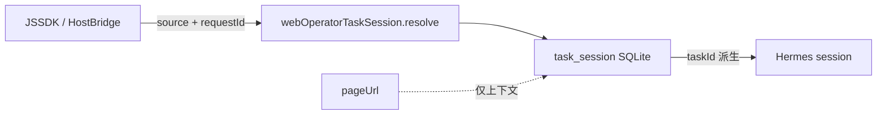

# v6.3.3 WebOperator Task Session 绑定键调整

## 问题与目标

当前 [`src/main/web-operator-task-session-store.ts`](src/main/web-operator-task-session-store.ts) 以 `page_url UNIQUE` 作为业务键，[`build-task-id.ts`](src/shared/web-operator/build-task-id.ts) 用 `pageUrl` hash 生成 `taskId`。同一页面多次 JSSDK 请求会误复用同一 Hermes 会话。

**目标绑定链**（PRD §15）：



---

## 现状要点（已确认）

| 模块 | 当前行为 | 需改 |
|------|----------|------|
| [`web-operator-task-session-contract.ts`](src/shared/web-operator/web-operator-task-session-contract.ts) | `ResolveInput` 仅 `pageUrl`；`UpsertInput` 含 `taskId` | 增 `source/requestId`，移除 upsert 的 `taskId` |
| [`build-task-id.ts`](src/shared/web-operator/build-task-id.ts) | `buildTaskId(pageUrl)` | 改为 `buildTaskId(source, requestId)` |
| Store | v1 表 + `page_url UNIQUE`；`resolve(pageUrl)`；upsert 吃外部 `taskId`；**含遗留 `debugger`** | v2 schema + migration + 内部生成 `taskId` |
| [`HermesTaskPanel.tsx`](src/renderer/src/screens/WebOperator/HermesTaskPanel.tsx) | `resolve({ pageUrl })` / `upsert({ taskId, ... })` | 传 `source/requestId`，不再传 `taskId` |
| [`WebOperatorPageContext.tsx`](src/renderer/src/screens/WebOperator/context/WebOperatorPageContext.tsx) | 自生成 `requestId`；按 `pageUrl` 去重 | 显式 `source`；按 `source+requestId` 去重 |
| [`HostBridgePanel.tsx`](src/renderer/src/screens/WebOperator/HostBridgePanel.tsx) | 传 `hostBridgeRequestId` 但未作为 task session 键 | `source: "web-host-bridge"` + `requestId: event.requestId` |

Preload [`web-operator-task-session-api.ts`](src/preload/web-operator-task-session-api.ts) 仅透传 IPC，**channel 名不变**；类型随 shared contract 自动更新。

---

## 实施阶段

### 阶段 1 — Shared 契约与 taskId 生成

**文件**：[`src/shared/web-operator/web-operator-task-session-contract.ts`](src/shared/web-operator/web-operator-task-session-contract.ts)、[`src/shared/web-operator/build-task-id.ts`](src/shared/web-operator/build-task-id.ts)

- 新增 `WebOperatorTaskSessionIdentity { source, requestId }`
- `WebOperatorTaskSessionRecord` 增加 `source`、`requestId`
- `WebOperatorTaskSessionResolveInput` → `{ source, requestId, pageUrl? }`
- `WebOperatorTaskSessionLookupResult` → 增加 `source`、`requestId`；`pageUrl` 改可选
- `WebOperatorTaskSessionUpsertInput` → 移除 `taskId`，增加 `source`、`requestId`
- `buildTaskId(source, requestId)`：
  - `normalize`: trim；空串抛 `"source is required"` / `"requestId is required"`
  - `task_id = "wot_" + sha256(\`${source}:${requestId}\`).slice(0, 32)`
- Store 继续 `export { buildTaskId }` 重导出（保持测试入口）

**不采用** PRD §10.2 的 `pageUrl` IPC fallback（PRD 明确不推荐长期保留）；缺 `requestId` 直接拒绝。

---

### 阶段 2 — Store schema v2 + migration

**文件**：[`src/main/web-operator-task-session-store.ts`](src/main/web-operator-task-session-store.ts)

**新表结构**（PRD §5.1）：

```sql
CREATE TABLE task_session (
  task_id TEXT PRIMARY KEY,
  source TEXT NOT NULL,
  request_id TEXT NOT NULL,
  page_url TEXT NOT NULL,          -- 去掉 UNIQUE
  session_id TEXT NOT NULL UNIQUE,
  page_context_json TEXT NOT NULL,
  skill TEXT NOT NULL DEFAULT '',
  status TEXT NOT NULL DEFAULT 'active',
  created_at TEXT NOT NULL,
  updated_at TEXT NOT NULL,
  UNIQUE(source, request_id)
);
-- 索引：source+request_id、page_url、session_id
```

**Migration**（事务内，PRD §5.3）：

1. 创建 `schema_meta(key, value)`，目标版本 `task_session_schema_version = 2`
2. `hasColumn(db, table, col)` 检测是否已 v2
3. v1→v2：建 `task_session_v2` → 读旧行 → 写入兼容身份：
   - `source = "legacy-page-url"`
   - `request_id = old.page_url`
   - `task_id = buildTaskId(source, request_id)`（重算，不保留旧 hash）
4. DROP 旧表 → RENAME → 建索引 → 写 schema version
5. 空库直接建 v2

**函数改造**：

- `resolveTaskSession(input)`：按 `source + request_id` 查询；返回派生 `taskId`
- `upsertTaskSession(input)`：内部 `buildTaskId`；`ON CONFLICT(source, request_id) DO UPDATE`
- `rowToRecord` / 所有 SELECT 补 `source, request_id`
- `getLastActiveTaskSession` / `removeTaskSession` 保持语义（按 `task_id` 删）
- **删除** 第 139 行遗留 `debugger`

---

### 阶段 3 — IPC 校验

**文件**：[`src/main/web-operator-task-session-ipc.ts`](src/main/web-operator-task-session-ipc.ts)

| Channel | 新校验 |
|---------|--------|
| `resolve` | `source`、`requestId` 必填 string；调用 `resolveTaskSession(input)` |
| `upsert` | `source`、`requestId`、`pageUrl`、`sessionId`、`pageContext` 必填；**不再校验 taskId** |

---

### 阶段 4 — Renderer 调用链

核心原则：**Renderer 不再生成或传入 `taskId` 给 upsert**；`taskId` 仅作为 Main 返回值用于 UI 去重与展示。

#### 4.1 类型扩展

| 文件 | 变更 |
|------|------|
| [`components/hermes/types.ts`](src/renderer/src/components/hermes/types.ts) | `HermesPanelTaskInput`、`HermesPanelTaskSessionReadyInput` 增 `source`、`requestId` |
| [`web-operator-page-context-types.ts`](src/renderer/src/screens/WebOperator/context/web-operator-page-context-types.ts) | `WebOperatorHermesAnalysisRequest` 增 `source` |
| [`web-operator-current-task-cache.ts`](src/renderer/src/screens/WebOperator/lib/web-operator-current-task-cache.ts) | Snapshot 增 `source/requestId`；`recordToTaskInput` 映射新字段；**storage key 升至 `weboperator-current-task-v2`** |

#### 4.2 `requestHermesAnalysis` 入口

[`WebOperatorPageContext.tsx`](src/renderer/src/screens/WebOperator/context/WebOperatorPageContext.tsx)：

- 入参增 `source?: string`（默认 `"manual"`）、`requestId?: string`
- HostBridge 场景：`requestId = input.requestId ?? hostBridgeRequestId`；无 requestId 则 **return**（不创建 analysisRequest）
- 去掉 `isSameWebOperatorTaskPageUrl` 页面去重；改为 `currentTask?.source === source && currentTask?.requestId === requestId` 时仅更新 pageContext
- `setAnalysisRequest` 写入明确 `source` + `requestId`

#### 4.3 HostBridge

[`HostBridgePanel.tsx`](src/renderer/src/screens/WebOperator/HostBridgePanel.tsx)：

- `triggerHermesAnalysis` / `runAnalyze` 传 `source: "web-host-bridge"`、`requestId: event.requestId`
- 去掉 `isSameWebOperatorTaskPageUrl` 跳过逻辑；改为同 `source+requestId` 跳过（与 Context 一致）

#### 4.4 HermesTaskPanel 解析与持久化

[`HermesTaskPanel.tsx`](src/renderer/src/screens/WebOperator/HermesTaskPanel.tsx)：

```ts
// resolve
await window.webOperatorTaskSession.resolve({
  source: req.source,
  requestId: req.requestId,
  pageUrl: req.pageUrl,
});

// setCurrentTask — 携带 source/requestId + lookup.taskId（来自 Main）
// upsert（chat-done 回调）
await window.webOperatorTaskSession.upsert({
  source: task.source,
  requestId: task.requestId,
  pageUrl, sessionId, pageContext, skill,
});
```

[`useWebOperatorHermesPanelChat.ts`](src/renderer/src/components/hermes/hooks/useWebOperatorHermesPanelChat.ts)：`onTaskSessionReady` 回调补充 `source/requestId`（从 `taskRef.current` 读取）。

#### 4.5 `normalize-task-page-url.ts`

保留 `normalizeWebOperatorTaskPageUrl` 供 pageUrl trim；`isSameWebOperatorTaskPageUrl` 在 task-session 路径上**不再用于去重**（可保留供其他用途或标注 deprecated，不删以免扩大 diff）。

---

### 阶段 5 — 测试

**文件**：[`tests/web-operator-task-session-store.test.ts`](tests/web-operator-task-session-store.test.ts)

| 用例 | 覆盖 |
|------|------|
| `buildTaskId(source, requestId)` 稳定性 / 差异性 | 同键同 id；不同 requestId 或 source 不同 id |
| upsert 创建 / 同键更新 | `created_at` 不变、`updated_at` 变 |
| 同 pageUrl 不同 requestId | 两条记录 |
| resolve 按 source+requestId | 命中 / 未命中 |
| v1→v2 migration | 旧行 → `legacy-page-url` + `page_url` |
| 空 source / requestId | 抛错 |

继续使用 `setTaskSessionDbPathForTests` 隔离 SQLite。

---

### 阶段 6 — 文档同步（收尾必做）

按 [007-sync-project-docs](.cursor/rules/007-sync-project-docs.mdc) 增量更新：

- [`docs/API_CONTRACTS.md`](docs/API_CONTRACTS.md) § WebOperator Task Session：resolve/upsert 参数、`buildTaskId` 规则、schema v2
- [`docs/renderer/screens/web-operator/HERMES_TASK_FLOW.md`](docs/renderer/screens/web-operator/HERMES_TASK_FLOW.md)：绑定键、HostBridge source、upsert 字段
- [`docs/INDEX.md`](docs/INDEX.md) + [`AGENTS.md`](AGENTS.md)：新增 **V6.3.3** 版本行

---

## 验收标准（PRD §13 + §11）

```bash
pnpm typecheck
pnpm lint
pnpm test
```

**手动场景**：

1. 同 `pageUrl`、不同 `requestId` → 两条 `task_session`、不同 `session_id`
2. 同 `source+requestId` 重复触发 → 复用记录、`updated_at` 更新
3. 不同 `source`、同 `requestId` → 两条记录
4. 旧库首次启动 → 自动 migration，`legacy-page-url` 兼容行可 resolve
5. HostBridge 自动分析 → `source=web-host-bridge`，`requestId=event.requestId`

---

## 风险与约束

- **SQLite 重建表**必须在事务中；失败不提交
- **旧 taskId 删除**：migration 后 `remove(oldTaskId)` 可能失效（PRD 接受，不加 `legacy_task_id`）
- **不改动**：Hermes `state.db`、Gateway 协议、BrowserController、hermesDefaultChat IPC
- **不触碰** `#command by loudon` 注释块

---

## 关键文件清单

| 层 | 文件 |
|----|------|
| Shared | `web-operator-task-session-contract.ts`, `build-task-id.ts` |
| Main | `web-operator-task-session-store.ts`, `web-operator-task-session-ipc.ts` |
| Preload | `web-operator-task-session-api.ts`（类型跟随，逻辑不变） |
| Renderer | `HermesTaskPanel.tsx`, `WebOperatorPageContext.tsx`, `web-operator-page-context-types.ts`, `HostBridgePanel.tsx`, `web-operator-current-task-cache.ts`, `components/hermes/types.ts`, `useWebOperatorHermesPanelChat.ts` |
| Test | `tests/web-operator-task-session-store.test.ts` |
| Docs | `API_CONTRACTS.md`, `HERMES_TASK_FLOW.md`, `INDEX.md`, `AGENTS.md` |
