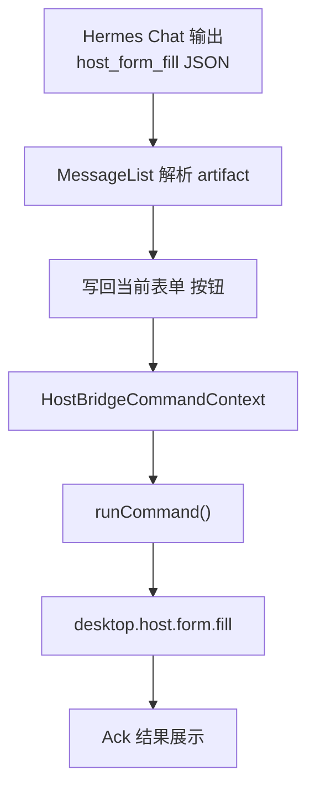

# v6.3.4 WebOperator Hermes-to-Host Form Fill

## 架构概览



## 当前架构要点

- `runCommand()` 目前在 [`HostBridgePanel.tsx`](src/renderer/src/screens/WebOperator/HostBridgePanel.tsx) 内部定义（L55-65），通过 `window.aiosBrowser.sendHostCommand` 发送命令
- `HostBridgePanel` 与 `HermesTaskPanel` 均在 [`WebOperatorPanels.tsx`](src/renderer/src/screens/WebOperator/panels/WebOperatorPanels.tsx) 中渲染，共享 `WebOperatorPageContextProvider`
- Hermes assistant 消息在 [`WebOperatorHermesPanelMessageList.tsx`](src/renderer/src/components/hermes/panel/WebOperatorHermesPanelMessageList.tsx) 中渲染
- `lastEvent` 来自 [`use-host-bridge-events.ts`](src/renderer/src/screens/WebOperator/hooks/use-host-bridge-events.ts)
- 类型 `HostDesktopCommand` / `HostBridgeResult` 定义在 [`host-bridge-contract.ts`](src/shared/crm-bridge/host-bridge-contract.ts)

## 实施阶段

### 阶段 1：抽出 HostBridge Command Context

将 `runCommand` 从 `HostBridgePanel` 抽为可复用的 React Context，使 HermesTaskPanel / HermesChatPanel 也能调用。

**新增文件：**
- `src/renderer/src/screens/WebOperator/host-bridge/HostBridgeCommandContext.tsx` -- Provider + hook
- `src/renderer/src/screens/WebOperator/host-bridge/types.ts` -- Context value 类型

**Context value 类型：**

```ts
type HostBridgeCommandContextValue = {
  lastEvent: HostBridgeStoredEvent | null;
  runCommand: (command: HostDesktopCommand) => Promise<HostBridgeResult | null>;
  sending: boolean;
  lastCommandResult: HostBridgeResult | null;
};
```

**修改文件：**
- [`WebOperatorScreen.tsx`](src/renderer/src/screens/WebOperator/WebOperatorScreen.tsx) -- 在 `WebOperatorPageContextProvider` 内嵌套 `HostBridgeCommandProvider`
- [`HostBridgePanel.tsx`](src/renderer/src/screens/WebOperator/HostBridgePanel.tsx) -- 移除内部 `runCommand`，改用 `useHostBridgeCommand()`；`lastEvent` 仍来自 `useHostBridgeEvents()` 但同步给 Context

### 阶段 2：定义 HostFormFillArtifact 类型 + 解析器

**新增文件：**
- `src/renderer/src/components/hermes/panel/host-form-fill/types.ts`

```ts
export type HostFormFillArtifact = {
  type: "host.form.fill";
  formType: string;
  action: string;
  confidence?: number;
  fields: Record<string, unknown>;
  subTables?: Record<string, unknown[]>;
};
```

- `src/renderer/src/components/hermes/panel/host-form-fill/extractHostFormFillArtifact.ts`
  - 从 assistant message content 中用正则匹配 ` ```host_form_fill\n{...}\n``` ` 代码块
  - 只取最后一个匹配
  - JSON.parse 失败返回 null
  - 校验 `type === "host.form.fill"` 且 `fields` 非空

### 阶段 3：实现字段标准化工具

**新增文件：**
- `src/renderer/src/components/hermes/panel/host-form-fill/normalizeProductFillFields.ts`
  - 价格 `"¥2,999"` -> `2999`
  - 电池 `"6200mAh / 80W 快充"` -> `6200`
  - 日期统一 `YYYY-MM-DD`
  - 状态 `"草稿"` -> `"draft"`
  - 删除 undefined/null/"" 字段

### 阶段 4：Hermes Panel 消息增加"写回当前表单"按钮

**新增文件：**
- `src/renderer/src/components/hermes/panel/host-form-fill/HostFormFillActionButton.tsx`

按钮状态机：`idle` -> `pending` -> `success` / `error` / `timeout`

按钮显示条件：
- assistant 消息存在 host_form_fill artifact
- HostBridge lastEvent 存在（即页面有 bridge）

按钮 onClick：
```ts
await runCommand({
  commandId: `cmd_fill_${Date.now()}`,
  type: "desktop.host.form.fill",
  formType: artifact.formType || lastEvent?.formType || "product",
  action: artifact.action || "create",
  payload: {
    fields: normalizeProductFillFields(artifact.fields),
    subTables: artifact.subTables ?? {},
  },
  createdAt: new Date().toISOString(),
  expectAck: true,
  timeoutMs: 12000,
});
```

**修改文件：**
- [`WebOperatorHermesPanelMessageList.tsx`](src/renderer/src/components/hermes/panel/WebOperatorHermesPanelMessageList.tsx) -- 在 assistant 消息气泡底部渲染 `HostFormFillActionButton`（每条 assistant 消息检测是否含 artifact）

### 阶段 5：调整 Hermes task prompt

**修改文件：**
- [`build-task-first-message.ts`](src/renderer/src/components/hermes/lib/build-task-first-message.ts) -- 在 HostBridge block 末尾追加表单写回指令
- [`constants.ts`](src/renderer/src/components/hermes/constants.ts) -- 在 `DEFAULT_PANEL_SYSTEM_PROMPT` 末尾追加 host_form_fill 输出要求

追加 prompt 内容：
```
当任务需要把提取结果写回 Web 表单时，在回复末尾输出 host_form_fill JSON 代码块。
JSON 必须可被 JSON.parse；type 固定为 host.form.fill；
formType 使用当前 pageContext.formType；
fields 只输出表单字段；subTables 没有数据时输出空对象。
不要要求 callbackURL；不要声明已完成表单填充——实际调用由桌面端按钮完成。
```

### 阶段 6：测试

**新增文件：**
- `tests/extractHostFormFillArtifact.test.ts`
- `tests/normalizeProductFillFields.test.ts`

测试覆盖：
- 解析合法 host_form_fill JSON
- 多个代码块取最后一个
- 非法 JSON 返回 null
- type 错误返回 null
- fields 为空返回 null
- 价格/电池/日期/状态标准化

### 阶段 7：Typecheck + 文档同步

- `pnpm run typecheck` 通过
- 按 007-sync-project-docs 规则增量更新 `AGENTS.md` 版本特性索引、`docs/API_CONTRACTS.md`（若有 IPC 变更）、`docs/renderer/screens/web-operator/` 相关文档

## 文件变更汇总

| 操作 | 文件路径 |
|------|----------|
| 新增 | `src/renderer/src/screens/WebOperator/host-bridge/HostBridgeCommandContext.tsx` |
| 新增 | `src/renderer/src/screens/WebOperator/host-bridge/types.ts` |
| 新增 | `src/renderer/src/components/hermes/panel/host-form-fill/types.ts` |
| 新增 | `src/renderer/src/components/hermes/panel/host-form-fill/extractHostFormFillArtifact.ts` |
| 新增 | `src/renderer/src/components/hermes/panel/host-form-fill/normalizeProductFillFields.ts` |
| 新增 | `src/renderer/src/components/hermes/panel/host-form-fill/HostFormFillActionButton.tsx` |
| 新增 | `tests/extractHostFormFillArtifact.test.ts` |
| 新增 | `tests/normalizeProductFillFields.test.ts` |
| 修改 | `src/renderer/src/screens/WebOperator/WebOperatorScreen.tsx` |
| 修改 | `src/renderer/src/screens/WebOperator/HostBridgePanel.tsx` |
| 修改 | `src/renderer/src/components/hermes/panel/WebOperatorHermesPanelMessageList.tsx` |
| 修改 | `src/renderer/src/components/hermes/lib/build-task-first-message.ts` |
| 修改 | `src/renderer/src/components/hermes/constants.ts` |

## 关键约束

- 不新增 IPC channel -- 完全复用现有 `window.aiosBrowser.sendHostCommand` 和 `window.aiosBrowser.getActiveWebOperatorTab`
- 不新增 Main Process 能力
- Renderer 不直接访问 Node.js
- HostBridgePanel 原有 `sendTestFill` 功能不受影响
- 按钮写回需用户手动点击，首版不自动写回
