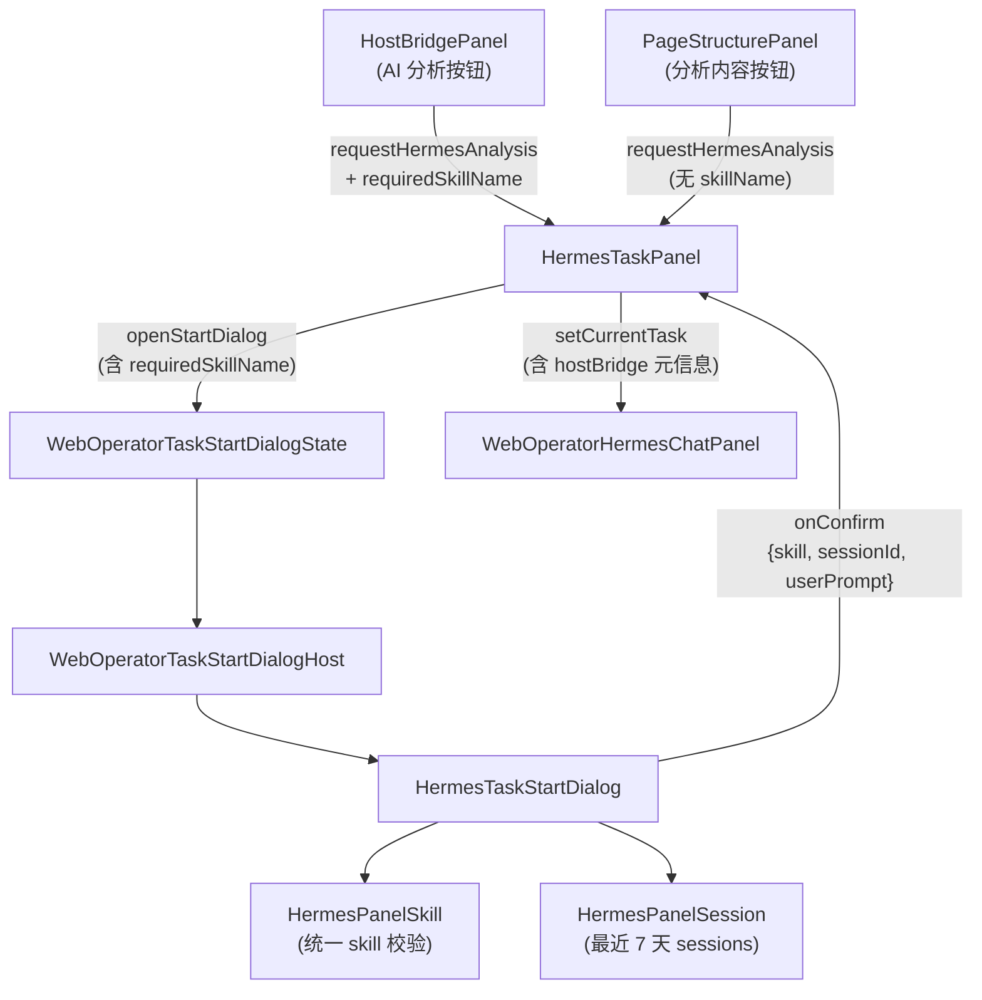

# v6.3 WebOperator HermesTaskStartDialog 组件化改造

## 现状分析

当前代码结构：
- [`HermesTaskStartDialog.tsx`](src/renderer/src/screens/WebOperator/HermesTaskStartDialog.tsx) 内部直接调用 `window.hermesAPI.listInstalledSkills` 加载 skills，硬编码 `DEFAULT_SKILL`，无 session 选择
- [`HermesTaskPanel.tsx`](src/renderer/src/screens/WebOperator/HermesTaskPanel.tsx) 的 `handleDialogConfirm` 只接收 `{ userPrompt, skill }`，`sessionId` 固定为 `null`
- [`WebOperatorTaskStartDialogHost.tsx`](src/renderer/src/screens/WebOperator/WebOperatorTaskStartDialogHost.tsx) 只透传 `pageContext` / `onConfirm` / `onCancel`
- [`web-operator-page-context-types.ts`](src/renderer/src/screens/WebOperator/context/web-operator-page-context-types.ts) 的 `WebOperatorTaskStartDialogState` 只有 4 个字段，`handlers.onConfirm` 不含 `sessionId`
- [`types.ts`](src/renderer/src/components/hermes/types.ts) 的 `HermesPanelTaskInput` 无 `hostBridge` 元信息
- [`HostBridgePanel.tsx`](src/renderer/src/screens/WebOperator/HostBridgePanel.tsx) 的「AI 分析」按钮调用 `requestHermesAnalysis`，未传 `requiredSkillName`
- Preload 已有 `listInstalledSkills`（行 414-418）、`syncSessionCache`（行 456-465）、`listCachedSessions`（行 442-454）

已有 IPC 能力充足，无需新增 Main/Preload 通道。

**重要约束**：用户明确要求不修改 debugger 调试代码（`skills.ts:71` 的 `debugger;`、`HostBridgePanel.tsx:149` 的 `debugger;`）。

## 数据流改造

## 实施步骤

### Task 1: 新增 HermesPanelSkill 组件

创建 [`src/renderer/src/components/hermes/panel/HermesPanelSkill.tsx`](src/renderer/src/components/hermes/panel/HermesPanelSkill.tsx) 和配套 CSS。

- Props: `profile`, `value`, `requiredSkillName`, `allowDefault`, `disabled`, `onChange`, `onValidationChange`
- 类型: `HermesPanelSkillOption`, `HermesPanelSkillValidation`
- 从 `window.hermesAPI.listInstalledSkills(profile)` 加载
- `matchSkillName` 兼容 `name` / `category/name` 匹配
- `requiredSkillName` 存在时锁定选择、不存在则 invalid 禁止提交
- 4 态: loading / valid / invalid / error

### Task 2: 新增 HermesPanelSession 组件

创建 [`src/renderer/src/components/hermes/panel/HermesPanelSession.tsx`](src/renderer/src/components/hermes/panel/HermesPanelSession.tsx) 和配套 CSS。

- Props: `profile`, `value`, `days`, `limit`, `disabled`, `onChange`, `onLoaded`
- 先 `syncSessionCache()` 再 `listCachedSessions(limit, 0)`
- 过滤 `startedAt >= now - days * 86400`
- 默认选项"新建会话"返回 `null`

### Task 3: 导出组件

- 新建 [`src/renderer/src/components/hermes/panel/index.ts`](src/renderer/src/components/hermes/panel/index.ts)，导出 `HermesPanelSkill`、`HermesPanelSession` 及所有现有 panel 组件
- 修改 [`src/renderer/src/components/hermes/index.ts`](src/renderer/src/components/hermes/index.ts)，增加 `export * from "./panel"` 及相关类型导出

### Task 4: 改造 Context 类型

修改 [`web-operator-page-context-types.ts`](src/renderer/src/screens/WebOperator/context/web-operator-page-context-types.ts)：

- `WebOperatorTaskStartDialogState` 增加 `profile?`, `requiredSkillName?`, `formType?`, `action?`, `callbackUrl?`, `defaultSessionId?`, `missingSkill?`, `missingSkillMessage?`
- `WebOperatorTaskStartDialogHandlers.onConfirm` input 增加 `sessionId: string | null`

### Task 5: 改造 HermesPanelTaskInput 类型

修改 [`types.ts`](src/renderer/src/components/hermes/types.ts)：

- `HermesPanelTaskInput` 增加 `hostBridge?` 可选字段（含 `requestId`, `formType`, `action`, `callbackUrl`, `skillName`）

### Task 6: 改造 HermesTaskStartDialog

修改 [`HermesTaskStartDialog.tsx`](src/renderer/src/screens/WebOperator/HermesTaskStartDialog.tsx)：

- Props 扩展：增加 `pageUrl`, `profile`, `requiredSkillName`, `formType`, `action`, `callbackUrl`, `defaultSessionId`, `missingSkill`, `missingSkillMessage`
- 删除内部 `listInstalledSkills` 逻辑
- 集成 `HermesPanelSkill` + `HermesPanelSession`
- 提交按钮受 `skillValidation.status` 控制
- `onConfirm` 返回 `{ userPrompt, skill, sessionId }`
- 顶部展示 pageUrl / formType / action / callbackUrl

### Task 7: 改造 HermesTaskPanel

修改 [`HermesTaskPanel.tsx`](src/renderer/src/screens/WebOperator/HermesTaskPanel.tsx)：

- `StartDialogState` 扩展全部新字段
- `handleDialogConfirm` 接收 `sessionId`
- `setCurrentTask` 使用 `input.sessionId`（非固定 `null`）
- `setCurrentTask` 写入 `hostBridge` 元信息
- `openStartDialog` 透传新字段

### Task 8: 改造 WebOperatorTaskStartDialogHost

修改 [`WebOperatorTaskStartDialogHost.tsx`](src/renderer/src/screens/WebOperator/WebOperatorTaskStartDialogHost.tsx)：

- 透传所有新增 props（`pageUrl`, `profile`, `requiredSkillName`, `formType`, `action`, `callbackUrl`, `defaultSessionId`, `missingSkill`, `missingSkillMessage`）

### Task 9: 改造 HostBridgePanel

修改 [`HostBridgePanel.tsx`](src/renderer/src/screens/WebOperator/HostBridgePanel.tsx)：

- `runAnalyze` 中 `requestHermesAnalysis` 传入 HostBridge 元信息（`requiredSkillName`, `formType`, `action`, `callbackUrl`）
- 不读取 `bridge-config.template.json.allowedSkills`
- 不做最终 skill 阻断——交给 Dialog 的 `HermesPanelSkill` 统一校验
- **不修改** `debugger;` 语句

### Task 10: 改造 requestHermesAnalysis 签名

修改 [`WebOperatorPageContext.tsx`](src/renderer/src/screens/WebOperator/context/WebOperatorPageContext.tsx) 和 [`web-operator-page-context-types.ts`](src/renderer/src/screens/WebOperator/context/web-operator-page-context-types.ts)：

- `requestHermesAnalysis` 输入增加可选的 HostBridge 字段
- `WebOperatorHermesAnalysisRequest` 增加可选的 `requiredSkillName`, `formType`, `action`, `callbackUrl`

### Task 11: 改造 buildTaskFirstMessage

修改 [`build-task-first-message.ts`](src/renderer/src/components/hermes/lib/build-task-first-message.ts)：

- 增加 `hostBridge?` 参数
- 有 hostBridge 时在消息中拼入 requestId / formType / action / callbackUrl / skillName 元信息

### Task 12: 回归验证

- `pnpm typecheck` 确认全链路类型通过
- `pnpm lint` 检查规范
- `pnpm build` 确认构建通过
