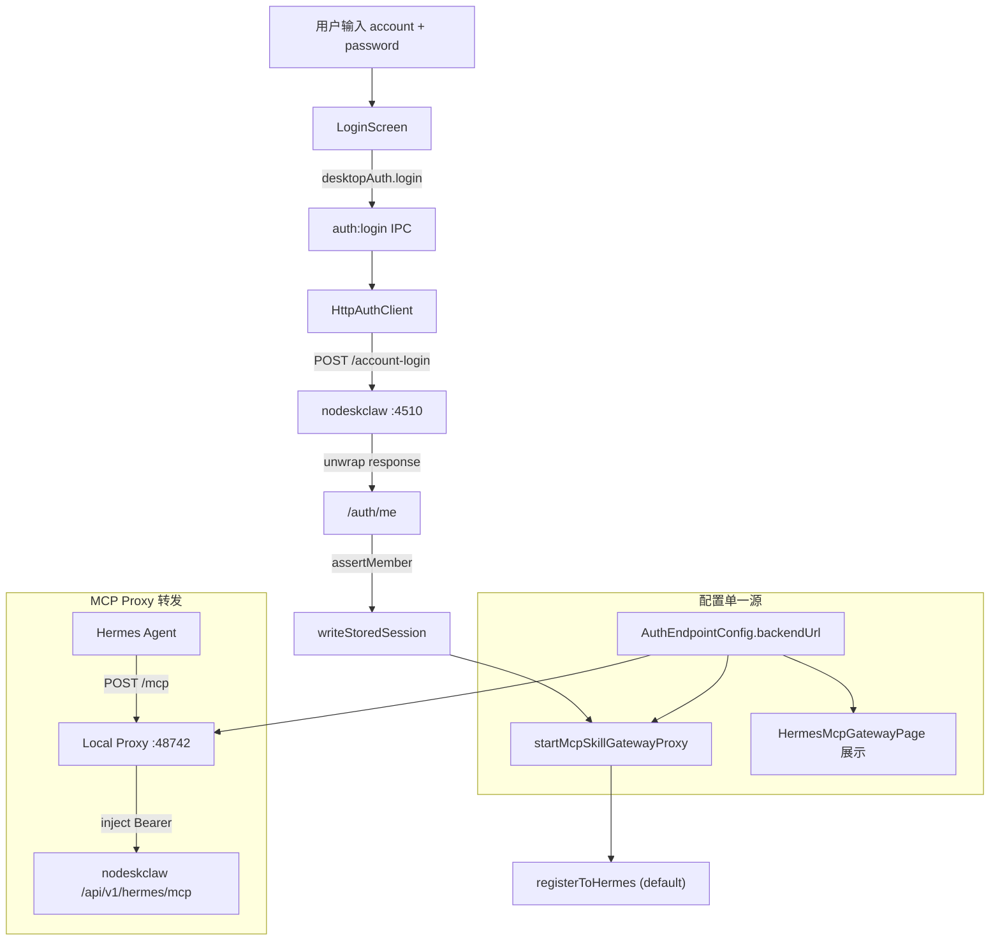

# v6.4.1 MCP Backend Desktop 实施计划

## 当前状态总结

- 默认 `backendUrl` = `http://127.0.0.1:8000`（需改为 `http://192.168.0.118:4510`）
- 登录用 `POST /login` + `{ email, password }`（需改为 `POST /account-login` + `{ account, password }`）
- `McpSkillGatewayRuntimeConfig` 保留独立 `backendBaseUrl` 字段（需废弃，统一从 AuthEndpointConfig 读）
- `testRemoteMcpSkillGateway()` 直接请求远程 backend（需改为通过 Local Proxy）
- Login UI 只支持 email 格式验证（需改为 account 通用输入）

---

## Task 1: 修改 Auth Contract

文件: [`src/shared/auth/auth-contract.ts`](src/shared/auth/auth-contract.ts)

改动:
- `LoginInput` 增加 `account?: string`，`email` 改为可选（兼容）
- `DesktopAuthUser` 增加 nodeskclaw member 字段：`currentOrgId`、`orgRole`、`portalOrgRole`、`isSuperAdmin`、`mustChangePassword`、`email`、`phone`、`avatarUrl`
- `toPublicState` 保持兼容无需改动

---

## Task 2: 修改 Auth URL

文件: [`src/shared/auth/auth-url.ts`](src/shared/auth/auth-url.ts)

改动:
- `AuthUrlPath` 增加 `"account-login"`
- `getDefaultAuthEndpointConfig()` 的 `backendUrl` 改为 `http://192.168.0.118:4510`，`aiosHomeUrl` 改为 `http://192.168.0.118:4517`（或暂保持原值）
- `normalizeBackendBaseUrl()` 已存在，确认能剥离 `/api/v1/auth` 等后缀（当前实现已覆盖）

---

## Task 3: 新增 nodeskclaw Auth Response Parser

新文件: `src/main/auth/nodeskclaw-auth-response.ts`

内容:
- `NodeDeskClawApiResponse<T>` 接口
- `NodeDeskClawLoginResponse` / `NodeDeskClawTokenResponse` / `NodeDeskClawUserInfo` 接口
- `unwrapNodeDeskClawResponse<T>()` — code != 0 throw，data 缺失 throw
- `mapNodeDeskClawSession()` — 映射为 `StoredAuthSession`

---

## Task 4: 重写 HttpAuthClient

文件: [`src/main/auth/auth-client.ts`](src/main/auth/auth-client.ts)

改动:
- `login()`: 使用 `account-login`，body `{ account, password }`，调用 `unwrapNodeDeskClawResponse`，然后 `fetchMe()` + `assertMember()`
- `refresh()`: refresh 后 `fetchMe()` + `assertMember()`，因为 nodeskclaw refresh 不返回 user
- 新增 `fetchMe()`、`assertMember()`
- `mapLoginResponse` 替换为 `mapNodeDeskClawSession`
- `MockAuthClient` 兼容 `account` 字段

---

## Task 5: 修改 Login UI

文件:
- [`src/renderer/src/modules/auth/components/LoginForm.tsx`](src/renderer/src/modules/auth/components/LoginForm.tsx)
- [`src/renderer/src/modules/auth/LoginScreen.tsx`](src/renderer/src/modules/auth/LoginScreen.tsx)
- [`src/renderer/src/modules/auth/last-login-email.ts`](src/renderer/src/modules/auth/last-login-email.ts)

改动:
- `LoginForm` props: `email` 改名 `account`，`onEmailChange` 改名 `onAccountChange`
- 移除 email 格式校验 `isValidEmail`，改为非空验证
- label 改为 `auth.account`，placeholder 改为「邮箱 / 手机号 / 用户名」
- `LoginScreen`: state `email` 改 `account`，调用 `desktopAuth.login({ endpointConfig, account, password })`
- `last-login-email.ts` 改名或复用为 `last-login-account`（存储 key 不变，值兼容）

---

## Task 6: MCP Runtime config 去除独立 backendBaseUrl

文件:
- [`src/shared/mcp-skill-gateway-runtime/mcp-skill-gateway-runtime-contract.ts`](src/shared/mcp-skill-gateway-runtime/mcp-skill-gateway-runtime-contract.ts)
- [`src/main/mcp-skill-gateway-runtime/mcp-skill-gateway-config.ts`](src/main/mcp-skill-gateway-runtime/mcp-skill-gateway-config.ts)

改动:
- 接口 `McpSkillGatewayRuntimeConfig` 删除 `backendBaseUrl` 字段
- `DEFAULT_MCP_SKILL_GATEWAY_CONFIG` 删除 `backendBaseUrl`
- `normalizeConfig()` 忽略历史配置中的 `backendBaseUrl`
- 新增 `resolveBackendBaseUrl()` 纯函数：只从 `readAuthEndpointConfig().backendUrl` 读
- `McpSkillGatewayRuntimeStatus` 的 `backendBaseUrl` 改为从 auth config 计算

---

## Task 7: 修改 MCP Proxy

文件: [`src/main/mcp-skill-gateway-runtime/mcp-skill-gateway-proxy.ts`](src/main/mcp-skill-gateway-runtime/mcp-skill-gateway-proxy.ts)

改动:
- `resolveRemoteTarget()` 不再从 `config.backendBaseUrl` 取值，直接从 `readAuthEndpointConfig().backendUrl` 计算
- `GET /health` 返回增加 `remoteMcpUrl`、`localMcpUrl`、`status: "running"`
- `/health` 中 `backendBaseUrl` 从 auth config 读取

---

## Task 8: 修改 Test Remote MCP

文件: [`src/main/mcp-skill-gateway-runtime/mcp-skill-gateway-health.ts`](src/main/mcp-skill-gateway-runtime/mcp-skill-gateway-health.ts)

改动:
- `testRemoteMcpSkillGateway()` 改为通过 Local Proxy (`http://127.0.0.1:{port}/mcp`) 发送 `tools/list`
- 不再直接带 token 请求远端，由 Proxy 注入 Authorization
- 返回结构增加 `localProxyUrl`、`remoteMcpUrl`、`toolCount`

---

## Task 9: 修改 Hermes 注册器

文件: [`src/main/mcp-skill-gateway-runtime/mcp-skill-gateway-register.ts`](src/main/mcp-skill-gateway-runtime/mcp-skill-gateway-register.ts)

改动:
- 注册前校验 proxy health（`backendBaseUrl` 一致性）
- `McpSkillGatewayProfileRegistration` 增加 `expectedUrl`、`urlMatched`、`backendMatched`、`ready`
- `listMcpSkillGatewayProfileRegistrations` 计算并返回一致性字段

---

## Task 10: 修改 HermesMcpGatewayPage

文件: [`src/renderer/src/screens/Hermes/pages/McpGateway/HermesMcpGatewayPage.tsx`](src/renderer/src/screens/Hermes/pages/McpGateway/HermesMcpGatewayPage.tsx)

改动:
- Login 区增加 member verified / portalOrgRole / Backend URL
- Local Proxy 区增加 Remote MCP URL 展示
- Registration 表格增加 Expected URL / URL matched / Backend matched / Ready 列
- 新增 Consistency check 区块
- ready=false 时显示不一致警告和重新注册提示

---

## Task 11: 生命周期接入

文件:
- [`src/main/auth/auth-ipc.ts`](src/main/auth/auth-ipc.ts)
- [`src/main/mcp-skill-gateway-runtime/mcp-skill-gateway-lifecycle.ts`](src/main/mcp-skill-gateway-runtime/mcp-skill-gateway-lifecycle.ts)

改动:
- `auth:login` handler: 传递 `account`（兼容 email），调用 `onMcpSkillGatewayLoginSuccess`（已有）
- `onMcpSkillGatewayLoginSuccess` 中删除 `backendBaseUrl` 写入
- `buildMcpSkillGatewayRuntimeStatus` 中 `backendBaseUrl` 从 auth config 读
- `auth:logout` handler: 调用 `onMcpSkillGatewayLogout`（已有）

---

## Task 12: 测试与构建修复

新增/修改测试:
- `tests/nodeskclaw-auth-response.test.ts` — unwrap 逻辑
- `tests/mcp-skill-gateway-config.test.ts` — 确认 backendBaseUrl 不在 config
- `tests/mcp-skill-gateway-proxy.test.ts` — health / mcp 转发
- `tests/mcp-skill-gateway-register.test.ts` — 一致性字段

验收命令:
```
pnpm typecheck
pnpm test
pnpm lint
pnpm build
```

---

## 数据流（改造后）



---

## 关键约束

- `backendUrl` 唯一源: `AuthEndpointConfig`（用户登录时选定）
- 测试期默认: `http://192.168.0.118:4510`
- Hermes `config.yaml` 只写 `http://127.0.0.1:48742/mcp`，禁止写 token/远程 URL
- Test remote MCP 必须经 Local Proxy，禁止 Renderer 直连 backend
- `email` 字段保留为兼容，新流程使用 `account`
