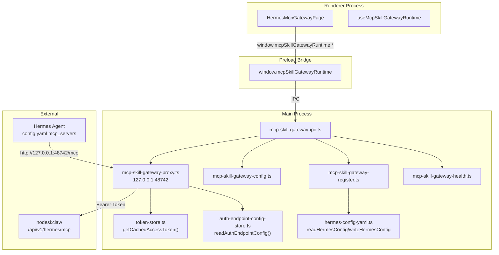

# V6.4 MCP Skill Gateway Desktop 实施计划

## 架构总览

## 已有可复用基础设施

- **Token**：`src/main/auth/token-store.ts` — `getCachedAccessToken()` 同步读内存缓存
- **Endpoint**：`src/main/auth/auth-endpoint-config-store.ts` — `readAuthEndpointConfig()` 读 backendUrl
- **YAML**：`src/main/hermes-config/hermes-config-yaml.ts` — `readHermesConfig(profile)` / `writeHermesConfig(profile, doc)` 使用 `js-yaml`（已有依赖）
- **Profile 路径**：`src/main/utils.ts` — `profileHome(profile)`
- **HTTP Proxy 参考**：`src/main/mcp/mcp-runtime-proxy.ts`（port 18781，Node http server 模式）
- **IPC 注册**：`src/main/index.ts` line ~459 附近，try/catch 包裹
- **Preload 暴露**：`src/preload/index.ts` line ~878 `contextBridge.exposeInMainWorld`

## Task 1：共享契约

**文件**：`src/shared/mcp-skill-gateway-runtime/mcp-skill-gateway-runtime-contract.ts`

定义全部类型：
- `McpSkillGatewayRuntimeConfig` — 含 enabled / backendBaseUrl / mcpEndpointPath / localProxyHost / localProxyPort / autoStartProxy / autoRegisterToHermes / autoRestartHermesGateway / registeredProfiles / updatedAt
- `McpSkillGatewayRuntimeStatus` — proxyStatus(running/stopped/failed) / loggedIn / backendBaseUrl / localProxyUrl / lastError / registeredProfileCount
- `McpSkillGatewayHealthResult` — ok / service / loggedIn / backendBaseUrl / target / error
- `McpSkillGatewayActionResult` — ok / error / errorCode
- `McpSkillGatewayRegisterResult` — changed / configPath / profile / url / error / errorCode
- `McpSkillGatewayProfileRegistration` — profile / configPath / registered / enabled / url / lastChecked
- `McpSkillGatewayDesktopErrorCode` — 12 个错误码（PRD §14）
- `McpSkillGatewayRuntimeAPI` — Preload API interface（13 方法，PRD §9.1）
- 默认配置常量 `DEFAULT_MCP_SKILL_GATEWAY_CONFIG`

## Task 2：Runtime Config Store

**文件**：`src/main/mcp-skill-gateway-runtime/mcp-skill-gateway-config.ts`

- JSON 文件存储于 `app.getPath("userData")/mcp-skill-gateway-runtime-config.json`（参考 `auth-endpoint-config-store.ts` 模式）
- `getConfig()` — 读取，合并默认值；`backendBaseUrl` 为空时从 `readAuthEndpointConfig().backendUrl` 回退
- `saveConfig(patch)` — 合并写入，更新 `updatedAt`
- `resetConfig()` — 删除文件恢复默认

## Task 3：Local MCP Proxy

**文件**：`src/main/mcp-skill-gateway-runtime/mcp-skill-gateway-proxy.ts`

参考 `mcp-runtime-proxy.ts` 模式，使用 Node `http.createServer`：
- 监听 `127.0.0.1:48742`（可配置）
- `GET /health` — 返回 Proxy 健康状态
- `POST /mcp` — 读 `getCachedAccessToken()` 注入 `Authorization: Bearer`，转发到 `backendBaseUrl + mcpEndpointPath`，返回原始 JSON-RPC 响应
- 错误处理：未登录 → `-32010`；未配置 → `-32011`；远程失败 → `-32012`；Token 过期（401） → `-32013`
- 请求体限 2MB，超时 60s
- 日志脱敏（`mcp-skill-gateway-log.ts`）

导出：`startProxy()` / `stopProxy()` / `restartProxy()` / `isProxyRunning()` / `getProxyUrl()`

## Task 4：Hermes MCP 注册器

**文件**：`src/main/mcp-skill-gateway-runtime/mcp-skill-gateway-register.ts`

- `registerMcpSkillGatewayToHermes({ profile, localProxyPort, enabled })` — 使用 `readHermesConfig(profile)` 读取现有 YAML，仅更新 `doc.mcp_servers.mcp_skill_gateway = { enabled, type: "http", url }`，然后 `writeHermesConfig(profile, doc)` 写回
- `unregisterMcpSkillGatewayFromHermes(profile)` — 设 `enabled: false`
- `listProfileRegistrations()` — 遍历 `registeredProfiles`，读取每个 profile 的 `config.yaml` 检查 `mcp_servers.mcp_skill_gateway` 状态
- 幂等：重复执行不产生多余节点；端口变更时更新 url

## Task 5：IPC 注册

**文件**：`src/main/mcp-skill-gateway-runtime/mcp-skill-gateway-ipc.ts`

注册 12 个 `ipcMain.handle` channel（PRD §9.2）：
- `mcp-skill-gateway-runtime:get-status` / `get-config` / `save-config`
- `start-proxy` / `stop-proxy` / `restart-proxy` / `test-proxy` / `test-remote-mcp`
- `register-to-profile` / `unregister-from-profile` / `list-profile-registrations`
- `read-proxy-logs`

导出 `registerMcpSkillGatewayRuntimeIpc()`

## Task 6：Preload API

**新增文件**：`src/preload/mcp-skill-gateway-runtime-api.ts`

**修改文件**：
- [`src/preload/index.ts`](src/preload/index.ts) — import + `contextBridge.exposeInMainWorld("mcpSkillGatewayRuntime", ...)`（contextIsolated + else 两处）
- [`src/preload/index.d.ts`](src/preload/index.d.ts) — `Window` 接口添加 `mcpSkillGatewayRuntime: McpSkillGatewayRuntimeAPI`

## Task 7：生命周期接入

**修改文件**：[`src/main/index.ts`](src/main/index.ts)

- import `registerMcpSkillGatewayRuntimeIpc` 并在 IPC 注册区（约 line 459 附近）try/catch 调用
- import `autoStartMcpSkillGatewayProxy` 和 `stopMcpSkillGatewayProxy`
- `app.whenReady` 后：如果已登录 + enabled + autoStartProxy → 自动启动 Proxy + 自动注册 default profile
- `before-quit`：调用 `stopMcpSkillGatewayProxy()`

**修改文件**：[`src/main/auth/auth-ipc.ts`](src/main/auth/auth-ipc.ts)

- `auth:login` 成功后：触发 Proxy 自动启动 + default profile 注册（异步，不阻塞登录返回）
- `auth:logout` 后：停止 Proxy

## Task 8：Renderer 页面

**新增文件**：
- `src/renderer/src/screens/Hermes/pages/McpGateway/HermesMcpGatewayPage.tsx` — 5 区域面板（登录状态 / Proxy 状态 / Profile 注册表 / 启动策略配置 / 嵌入窗口入口）
- `src/renderer/src/screens/Hermes/hooks/useMcpSkillGatewayRuntime.ts` — 数据加载 Hook

**修改文件**：
- [`src/renderer/src/screens/Hermes/constants.ts`](src/renderer/src/screens/Hermes/constants.ts) — `HermesNavItemKey` 添加 `"mcpGateway"`；`HERMES_NAV_ITEMS` 添加导航项
- [`src/renderer/src/screens/Hermes/registry/hermes-pages.tsx`](src/renderer/src/screens/Hermes/registry/hermes-pages.tsx) — 添加 McpGatewayPage lazy import + 注册

**i18n**：在 en / zh-CN locale 文件补齐 `workspaces.nav.mcpGateway` key

## Task 9：嵌入窗口入口

在 `HermesMcpGatewayPage.tsx` 中：
- 读取 `readAuthEndpointConfig().aiosHomeUrl`（通过 `desktopAuth.getState()` 获取）
- 按钮点击调用 `window.aiosBrowser.open(url)` 或 `shellView.navigate` 跳转到 Portal 的 `/hermes/skills`、`/hermes/mcp`、`/instances` 页面
- 路由路径配置化，不硬编码

## Task 10：测试

**新增文件**：`src/main/mcp-skill-gateway-runtime/__tests__/`
- `mcp-skill-gateway-config.test.ts` — 默认值 / 合并 / 重置
- `mcp-skill-gateway-register.test.ts` — 注册幂等 / 保留已有 mcp_servers / unregister 设 enabled=false
- `mcp-skill-gateway-proxy.test.ts` — 未登录返回 -32010 / 端口占用 / 远程 401→-32013

## 辅助文件（按需）

- `src/main/mcp-skill-gateway-runtime/mcp-skill-gateway-errors.ts` — 错误码常量（可合并到 contract）
- `src/main/mcp-skill-gateway-runtime/mcp-skill-gateway-log.ts` — 日志工具（脱敏 Authorization/token/password）
- `src/main/mcp-skill-gateway-runtime/mcp-skill-gateway-health.ts` — `testProxy()` / `testRemoteMcp()` 实现

## 新增文件清单（共约 12 个新文件）

| 文件 | 类型 |
|---|---|
| `src/shared/mcp-skill-gateway-runtime/mcp-skill-gateway-runtime-contract.ts` | 共享契约 |
| `src/main/mcp-skill-gateway-runtime/mcp-skill-gateway-config.ts` | Config Store |
| `src/main/mcp-skill-gateway-runtime/mcp-skill-gateway-proxy.ts` | HTTP Proxy |
| `src/main/mcp-skill-gateway-runtime/mcp-skill-gateway-register.ts` | YAML 注册器 |
| `src/main/mcp-skill-gateway-runtime/mcp-skill-gateway-ipc.ts` | IPC handlers |
| `src/main/mcp-skill-gateway-runtime/mcp-skill-gateway-health.ts` | 健康检查 |
| `src/main/mcp-skill-gateway-runtime/mcp-skill-gateway-log.ts` | 日志脱敏 |
| `src/main/mcp-skill-gateway-runtime/mcp-skill-gateway-errors.ts` | 错误码 |
| `src/preload/mcp-skill-gateway-runtime-api.ts` | Preload API |
| `src/renderer/src/screens/Hermes/pages/McpGateway/HermesMcpGatewayPage.tsx` | 页面 |
| `src/renderer/src/screens/Hermes/hooks/useMcpSkillGatewayRuntime.ts` | Hook |
| `src/main/mcp-skill-gateway-runtime/__tests__/*.test.ts` | 测试（3 个文件） |

## 修改文件清单（共约 5 个）

| 文件 | 变更内容 |
|---|---|
| `src/main/index.ts` | import + IPC 注册 + before-quit stop + 自动启动 |
| `src/main/auth/auth-ipc.ts` | login 后启动 Proxy；logout 后停止 |
| `src/preload/index.ts` | import + contextBridge 暴露 |
| `src/preload/index.d.ts` | Window 声明 |
| `src/renderer/src/screens/Hermes/constants.ts` | 新 nav item |
| `src/renderer/src/screens/Hermes/registry/hermes-pages.tsx` | 页面注册 |

## 执行顺序约束

Task 1 → Task 2 → Task 3 → Task 4 → Task 5 → Task 6 → Task 7 → Task 8/9 → Task 10 → typecheck + lint
