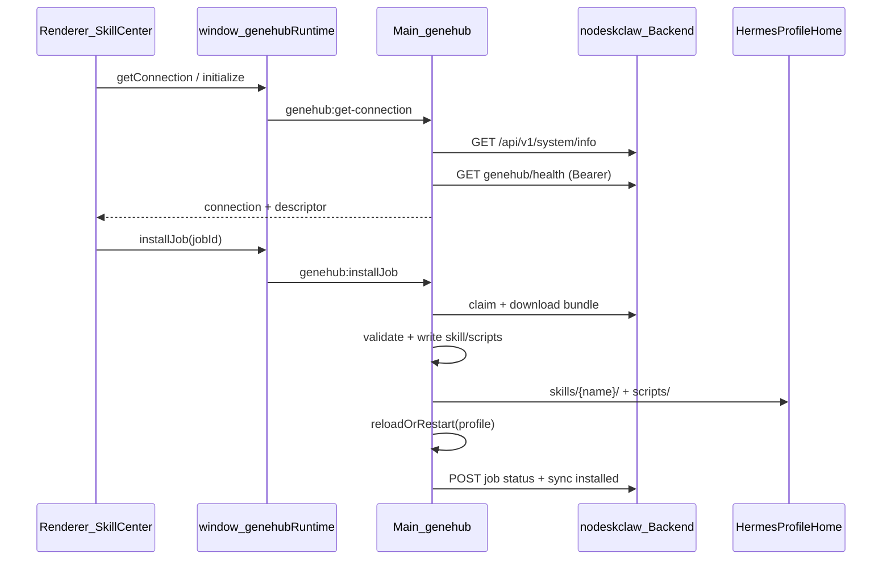

# v6.5 GeneHub Hermes Skill Sync 实施计划

版本：**v6.5_genehub-hermes-skill-sync**  
依赖服务端：**nodeskclaw team_v3.4_genehub-hermes-skill-registry**

---

## 架构与数据流



**硬性边界（PRD §2 / §12）：**
- `AuthEndpointConfig.backendUrl` 为唯一远程源（复用 [`resolveBackendBaseUrl()`](src/main/mcp-skill-gateway-runtime/mcp-skill-gateway-config.ts)）
- Token 仅 Main 读取（复用 [`getCachedAccessToken()`](src/main/auth/token-store.ts) / MCP token provider 模式）
- Renderer **禁止** 传任意 URL/本地路径；所有安装由 Main 根据服务端 job + bundle 执行
- 路径写入经 `profileHome(profile)` + hermesHome 沙箱校验

---

## Layout Decision（Renderer）

| 项 | 决策 |
|---|---|
| route type | **existing workspace 内新增 Hermes 子页**（Local Hermes Tab → 新侧栏项） |
| page template | **DataManagementTemplate**（四 Tab：可安装 / 已安装 / 待安装 / 日志） |
| shell inheritance | 继承 Local Hermes 壳（[`HermesSidebar`](src/renderer/src/screens/Hermes/components/HermesSidebar.tsx) + 中栏 outlet）；无 Portal WebView |
| layout files | 新增页面组件 + registry 注册；**不改** `Layout.tsx` / `App.tsx` 生命周期 |
| Copilot | 不接入 Copilot；仅 IPC 数据面板 |
| forbidden | 不改 `provider/*`、`components/ui/*`；不上传/发布/审核入口 |

**导航：** 在 [`HERMES_NAV_ITEMS`](src/renderer/src/screens/Hermes/constants.ts) 新增 `skillCenter`（图标 `Library` 或 `Package`），与现有本地 `skills` 页并存——本地 skills 继续管 bundled/installed 文件浏览；Skill Center 专管企业 GeneHub。

---

## Phase 1 — 共享契约与连接层（含「获取 GeneHub 连接」）

### 1.1 新增共享类型

[`src/shared/genehub/genehub-contract.ts`](src/shared/genehub/genehub-contract.ts)（+ [`genehub-errors.ts`](src/shared/genehub/genehub-errors.ts)）

核心 DTO（对齐 PRD §7 / §9）：
- `GeneHubConnectionStatus`：`connected | degraded | unauthorized | forbidden | offline | misconfigured | disabled`
- `GeneHubDescriptor`（从 `system/info.genehub` 解析，镜像 MCP [`McpBackendDescriptor`](src/main/mcp-skill-gateway-runtime/mcp-backend-descriptor.ts)）
- `GeneHubConnection`：`backendBaseUrl`、`loggedIn`、`memberVerified`、`descriptor`、`apiBaseUrl`、`health`、`lastError`
- `GeneHubSkill`、`InstallJob`、`GeneHubBundle`、`HermesProfileDto`、`InstallLogEntry`、`GeneHubRuntimeAPI`

本地错误码：PRD §11 全量枚举 → `GeneHubErrorCode`

### 1.2 GeneHub 连接发现（用户请求的「获取连接」）

[`src/main/genehub/genehub-backend-descriptor.ts`](src/main/genehub/genehub-backend-descriptor.ts)

```ts
// GET {backendBaseUrl}/api/v1/system/info → body.genehub
interface SystemInfoGeneHubBlock {
  enabled?: boolean;
  name?: string;
  apiPrefix?: string;        // 默认 /api/v1/desktop
  healthEndpoint?: string;   // 默认 /api/v1/desktop/genehub/health
  requiresAuth?: boolean;
  minServerVersion?: string;
}
```

- 60s 缓存 + `invalidateGeneHubDescriptorCache()`
- 错误码：`GENEHUB_BACKEND_URL_MISSING`、`GENEHUB_DESCRIPTOR_MISSING`、`GENEHUB_BACKEND_UNREACHABLE`

[`src/main/genehub/genehub-connection.ts`](src/main/genehub/genehub-connection.ts)

聚合连接状态：
1. `resolveBackendBaseUrl()` + 登录态 + member 校验（`currentOrgId` + `portalOrgRole`，同 MCP Gateway 页逻辑）
2. `fetchGeneHubDescriptor()`
3. 带 Bearer 探测 `healthEndpoint`
4. 输出 `GeneHubConnection`

**说明：** 服务端 `system/info.genehub` 字段以 team_v3.4 为准；若联调时字段名有偏差，仅在 descriptor 层适配，不扩散到 Renderer。

---

## Phase 2 — Main 基础设施（PRD Task 2–4）

| 模块 | 路径 | 职责 |
|---|---|---|
| deviceIdentity | [`src/main/genehub/device-identity.ts`](src/main/genehub/device-identity.ts) | 稳定 `deviceFingerprint`（OS user + appId + machineId hash；fallback UUID 持久化到 userData） |
| hermesProfileResolver | [`src/main/genehub/hermes-profile-resolver.ts`](src/main/genehub/hermes-profile-resolver.ts) | 读 profile-runtime DB + `profileHome()` → `HermesProfile[]` |
| genehubClient | [`src/main/genehub/genehub-client.ts`](src/main/genehub/genehub-client.ts) | 封装 PRD §10 全部 HTTP；统一 `unwrapNodeDeskClawResponse`；401 → 清 session 钩子 |
| genehubHttp | [`src/main/genehub/genehub-http.ts`](src/main/genehub/genehub-http.ts) | `fetch` 包装：Bearer、timeout、错误映射 |

**genehubClient 方法（PRD §7.1）：**
- `registerDevice` → `POST /api/v1/desktop/devices/register`
- `registerHermesProfile` → `POST /api/v1/desktop/hermes/profiles/register`
- `heartbeat` → `POST /api/v1/desktop/heartbeat`
- `listAuthorizedSkills` → `GET /api/v1/desktop/genehub/skills?profile_id=`
- `createInstallJob` → `POST /api/v1/desktop/hermes/install-jobs`
- `listPendingJobs` → `GET .../install-jobs/pending`
- `claimJob` / `downloadBundle` / `updateJobStatus` / `syncInstalledSkills`

本地配置：[`src/main/genehub/genehub-config.ts`](src/main/genehub/genehub-config.ts) 持久化 PRD §13（`~/.hermes/desktop/genehub-config.json` 或 `app.getPath("userData")`）

---

## Phase 3 — 安装执行链（PRD Task 5–8）

| 模块 | 要点 |
|---|---|
| [`skill-package-validator.ts`](src/main/genehub/skill-package-validator.ts) | manifest/bundle schema、skill_name 正则、hash/signature、路径穿越/绝对路径拒绝 |
| [`hermes-skill-writer.ts`](src/main/genehub/hermes-skill-writer.ts) | temp → backup → atomic rename；`{hermesHome}/skills/{skill_name}` + `scripts/*`；删 `.skills_prompt_snapshot.json`；写 `{hermesHome}/genehub/installed/{gene_slug}.json` |
| [`hermes-restart-service.ts`](src/main/genehub/hermes-restart-service.ts) | 优先 gateway reload（若未来有 API）；否则 `restartGateway()` 或 `profile-runtime restartProfile`；`probeGatewayHealth` 验证 |
| [`installed-skill-store.ts`](src/main/genehub/installed-skill-store.ts) | 读写在 hermesHome 下的 installed metadata |
| [`skill-install-worker.ts`](src/main/genehub/skill-install-worker.ts) | 状态机：claimed→downloading→validating→installing→installed/failed；每阶段 `updateJobStatus` + 本地 jsonl 日志 |
| [`genehub-install-log.ts`](src/main/genehub/genehub-install-log.ts) | `appData/genehub/install-logs.jsonl`，保留 1000 条 |

**与现有 skills 模块关系：** 保留 [`src/main/skills.ts`](src/main/skills.ts) CLI 安装路径不动；GeneHub 走独立 writer，不调用 `hermes skills install` CLI（PRD 要求 Bundle 校验 + 回滚）。

---

## Phase 4 — 调度与生命周期（PRD Task 9）

[`src/main/genehub/genehub-scheduler.ts`](src/main/genehub/genehub-scheduler.ts)

- 登录后 / App ready：`initializeGeneHub()` = register device + register profiles + heartbeat + `syncInstalledSkills`
- 定时器：heartbeat 60s、pending jobs 60s（`autoInstallAssignedJobs=false` 默认）
- `stopGeneHubScheduler()` 供 logout / quit 清理
- 在 [`auth-ipc.ts`](src/main/auth/auth-ipc.ts) 挂接 `onGeneHubLoginSuccess` / `onGeneHubLogout`（平行于 MCP hooks）
- 在 [`index.ts`](src/main/index.ts) app ready 后 `autoInitializeGeneHubIfReady()`（需已登录）

---

## Phase 5 — IPC + Preload（PRD Task 10 + 连接 IPC）

[`src/main/genehub/genehub-ipc.ts`](src/main/genehub/genehub-ipc.ts) → [`src/main/genehub/index.ts`](src/main/genehub/index.ts) 导出

| Channel | 说明 |
|---|---|
| `genehub:get-connection` | **获取连接**（descriptor + health + auth）；支持 `forceRefresh` |
| `genehub:probe-connection` | 强制刷新 + 健康探测 |
| `genehub:initialize` | 手动触发 device/profile 注册 + 首次 sync |
| `genehub:list-authorized-skills` | `{ profileId? }` |
| `genehub:list-pending-jobs` | `{ profileId? }` |
| `genehub:create-install-job` | `{ profileId, geneSlug, action: install\|update\|uninstall }` |
| `genehub:install-job` | `{ jobId }` — 执行 worker |
| `genehub:update-skill` | 封装 create + install |
| `genehub:uninstall-skill` | 封装 create + install |
| `genehub:sync-installed-skills` | `{ profileId? }` |
| `genehub:get-install-logs` | `{ limit? }` |

Preload：[`src/preload/genehub-runtime-api.ts`](src/preload/genehub-runtime-api.ts) → `window.genehubRuntime`  
注册：[`src/preload/index.ts`](src/preload/index.ts) + [`src/preload/index.d.ts`](src/preload/index.d.ts)  
Main 注册：[`src/main/index.ts`](src/main/index.ts) `setupIPC()` 内 `registerGeneHubIpc()`

更新 [`docs/API_CONTRACTS.md`](docs/API_CONTRACTS.md) § GeneHub Runtime。

---

## Phase 6 — Renderer Skill Center（PRD Task 11）

新增文件（PRD §8）：
- [`src/renderer/src/screens/Hermes/pages/GeneHub/GeneHubSkillCenterPage.tsx`](src/renderer/src/screens/Hermes/pages/GeneHub/GeneHubSkillCenterPage.tsx)
- [`GeneHubConnectionCard.tsx`](src/renderer/src/screens/Hermes/pages/GeneHub/components/GeneHubConnectionCard.tsx) — 展示 backend URL、连接状态、member 校验、探测/重新同步按钮
- [`GeneHubSkillCard.tsx`](src/renderer/src/screens/Hermes/pages/GeneHub/components/GeneHubSkillCard.tsx)
- [`GeneHubInstallJobList.tsx`](src/renderer/src/screens/Hermes/pages/GeneHub/components/GeneHubInstallJobList.tsx)
- [`GeneHubInstalledSkillList.tsx`](src/renderer/src/screens/Hermes/pages/GeneHub/components/GeneHubInstalledSkillList.tsx)
- [`GeneHubInstallLogPanel.tsx`](src/renderer/src/screens/Hermes/pages/GeneHub/components/GeneHubInstallLogPanel.tsx)
- Hook：[`useGeneHubRuntime.ts`](src/renderer/src/screens/Hermes/hooks/useGeneHubRuntime.ts)

注册：[`hermes-pages.tsx`](src/renderer/src/screens/Hermes/registry/hermes-pages.tsx) + [`constants.ts`](src/renderer/src/screens/Hermes/constants.ts)

**UI 状态（每 Tab）：** loading / empty / error / retry；安装按钮 loading + 禁用规则（PRD §8.1）；**禁止**上传/发布/审核按钮。

i18n：[`src/shared/i18n/locales/en/workspaces.ts`](src/shared/i18n/locales/en/workspaces.ts) + zh-CN 增补 `workspaces.hermes.geneHub.*` 与 `nav.skillCenter`（PRD §17 文案）。

视觉：复用 Hermes 现有 `hermes-page` / `hermes-badge` / `hermes-dl-row` 模式（参考 [`HermesMcpGatewayPage.tsx`](src/renderer/src/screens/Hermes/pages/McpGateway/HermesMcpGatewayPage.tsx)）。

---

## Phase 7 — 测试（PRD Task 13）

| 测试文件 | 覆盖 |
|---|---|
| `tests/genehub-backend-descriptor.test.ts` | system/info 缺失/成功、缓存 |
| `tests/genehub-connection.test.ts` | 未登录、member 缺失、health 失败 |
| `tests/device-identity.test.ts` | fingerprint 稳定性 |
| `tests/skill-package-validator.test.ts` | 非法 skill_name、路径穿越、hash mismatch |
| `tests/hermes-skill-writer.test.ts` | 写入、回滚、snapshot 清理（tmp dir） |
| `tests/skill-install-worker.test.ts` | 状态机、失败回传（mock client） |
| `tests/genehub-client.test.ts` | 401、API 错误映射 |

验收命令：`npm run typecheck` + `npm test`（定向 vitest 上述文件）。

---

## Phase 8 — 文档同步

按 [`.agents/skills/sync-project-docs/SKILL.md`](.agents/skills/sync-project-docs/SKILL.md) 增量更新：
- [`AGENTS.md`](AGENTS.md) — 版本行 + `src/main/genehub/` 目录 + `window.genehubRuntime`
- [`docs/INDEX.md`](docs/INDEX.md) — V6.5 特性索引
- [`docs/API_CONTRACTS.md`](docs/API_CONTRACTS.md) — GeneHub IPC 表
- [`docs/renderer/screens/`](docs/renderer/screens/) — 新增 GeneHub Skill Center 页说明

更新 agent specs：[`specs/current-agent-task.md`](specs/current-agent-task.md) / [`specs/current-agent-state.md`](specs/current-agent-state.md)

---

## 关键复用点

| 已有能力 | GeneHub 用法 |
|---|---|
| [`mcp-backend-descriptor.ts`](src/main/mcp-skill-gateway-runtime/mcp-backend-descriptor.ts) | 复制 descriptor + cache 模式 → genehub |
| [`mcp-token-provider.ts`](src/main/mcp-skill-gateway-runtime/mcp-token-provider.ts) | 同样 auth 状态，可抽 `getDesktopAccessToken()` 共用 |
| [`nodeskclaw-auth-response.ts`](src/main/auth/nodeskclaw-auth-response.ts) | API 响应解包 |
| [`profileHome()`](src/main/utils.ts) + profile-runtime | Profile 解析 |
| [`restartGateway()`](src/main/hermes.ts) / profile-runtime restart | hermesRestartService |
| MCP Gateway 页连接卡片 UX | GeneHubConnectionCard 交互范式 |

---

## 风险与联调假设

1. **服务端契约：** `system/info.genehub` 与 Bundle JSON schema 以 team_v3.4 实现为准；Desktop 在 shared 类型 + validator 集中适配。
2. **Gateway reload：** 若 team_v3.4 无 reload skills API，按 PRD 降级为 restart（已在 hermesRestartService 设计）。
3. **多 Profile：** UI 默认 `default` profile；IPC 接受 `profileId`，与 profile-runtime name 对齐。
4. **体量：** 全量 Task 1–13 建议按 Phase 1→8 顺序提交，每 Phase 完成后 typecheck + 对应测试绿灯再进入下一阶段。

---

## 验收清单（PRD §16 摘要）

- 启动后 device/profile 注册 + heartbeat 正常
- Skill Center 四 Tab 可展示可安装/已安装/pending/日志
- 安装后 `{hermesHome}/skills/{skill_name}/SKILL.md` 存在，snapshot 已删，状态回传服务端
- 无上传/发布/审核入口；Renderer 不写 fs；非法路径/skill_name 被拒绝
- `genehub:get-connection` 可独立展示 nodeskclaw GeneHub 连接状态（backend + health + auth）
