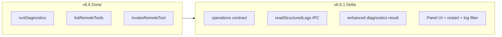

# V6.6.1 MCP Gateway Operations — copilot-desktop 实施计划

## 现状（v6.6 已完成）

v6.6 已交付核心链路，可直接复用：

| 能力 | 文件 |
|------|------|
| 一键诊断（8 步） | [`mcp-gateway-diagnostics.ts`](src/main/mcp-skill-gateway-runtime/mcp-gateway-diagnostics.ts) |
| tools/list 缓存 60s | [`mcp-tools-cache.ts`](src/main/mcp-skill-gateway-runtime/mcp-tools-cache.ts) |
| 只读 invoke test | [`mcp-gateway-invoke-test.ts`](src/main/mcp-skill-gateway-runtime/mcp-gateway-invoke-test.ts) |
| 3 个 IPC | [`mcp-skill-gateway-ipc.ts`](src/main/mcp-skill-gateway-runtime/mcp-skill-gateway-ipc.ts) |
| UI 三区段 | `McpGateway*Section.tsx` + [`HermesMcpGatewayPage.tsx`](src/renderer/src/screens/Hermes/pages/McpGateway/HermesMcpGatewayPage.tsx) |

**v6.6.1 定位**：在现有代码上**增量增强**，不重写 Proxy/注册逻辑；对齐 PRD 运营化字段、错误码、UI 交互与安全约束。



---

## Stage 1: 新增 Operations 契约层

新建 [`src/shared/mcp-skill-gateway-runtime/mcp-gateway-operations-contract.ts`](src/shared/mcp-skill-gateway-runtime/mcp-gateway-operations-contract.ts)（PRD §8.1），从现有 contract 抽离/扩展运营类型：

- `McpGatewayOperationsErrorCode` — PRD §10 的 `MCP_OP_*` 错误码（保留 v6.6 `MCP_DIAG_*` 作 alias 映射，避免破坏已有测试）
- `DiagnosticCheck` — 对齐 PRD §7.1（含 `checkedAt`）
- 增强 `McpGatewayToolPreview`：
  - `category`: `"hermes" | "genehub" | "system" | "unknown"`（从 tool name 前缀推断）
  - `permission`: `"read" | "write" | "admin"`（替代当前 `riskLevel: read/write/admin` 混用）
  - `riskLevel`: `"low" | "medium" | "high"`（read→low, write→medium, admin→high）
  - `lastSyncedAt`: string
- 增强 `McpGatewayInvokeTestInput`：主字段 `arguments`（兼容现有 `input`）
- 增强 `McpGatewayInvokeTestResult`：增加 `toolName`、`permission`
- 增强 `McpGatewayDiagnosticsResult`：增加 `checkedAt`、`toolsList`、`defaultProfileRegistration`、`hermesGateway` 独立检查项
- `McpGatewayProxyLogEntry` — 从 [`mcp-skill-gateway-log.ts`](src/main/mcp-skill-gateway-runtime/mcp-skill-gateway-log.ts) 提升到 shared

[`mcp-skill-gateway-runtime-contract.ts`](src/shared/mcp-skill-gateway-runtime/mcp-skill-gateway-runtime-contract.ts) 改为 re-export operations 类型，并在 `McpSkillGatewayRuntimeAPI` 追加：

```typescript
readStructuredLogs(lines?: number): Promise<McpGatewayProxyLogEntry[]>;
```

---

## Stage 2: Main — 诊断与工具映射增强

### 2.1 [`mcp-gateway-diagnostics.ts`](src/main/mcp-skill-gateway-runtime/mcp-gateway-diagnostics.ts)

- 补全 PRD §7.1 的 10 步流程：独立 `toolsList`、`defaultProfileRegistration`、`hermesGateway` 检查
- 返回 `checkedAt: new Date().toISOString()`
- 错误码映射到 `MCP_OP_*`（对外），内部保留 `MCP_DIAG_*` 兼容

### 2.2 [`mcp-tools-cache.ts`](src/main/mcp-skill-gateway-runtime/mcp-tools-cache.ts)

新增工具元数据推断函数（不依赖 nodeskclaw 额外字段）：

```typescript
inferToolCategory(name)   // hermes.* → hermes, genehub.* → genehub
inferToolPermission(name) // 现有 READ/WRITE/ADMIN 集合
inferRiskLevel(permission) // read→low, write→medium, admin→high
```

`listRemoteMcpTools()` 返回完整 `McpGatewayToolPreview`（含 `lastSyncedAt` 来自缓存 `updatedAt`）。

可选：新增 [`mcp-gateway-tools-cache.ts`](src/main/mcp-skill-gateway-runtime/mcp-gateway-tools-cache.ts) 作为 re-export 薄层，满足 PRD 文件名要求，避免大规模 import 迁移。

### 2.3 [`mcp-gateway-invoke-test.ts`](src/main/mcp-skill-gateway-runtime/mcp-gateway-invoke-test.ts)

- 接受 `arguments` 或 `input`（向后兼容）
- JSON 参数校验失败 → `MCP_OP_INVALID_JSON_ARGUMENTS`
- 非 read 工具 → `MCP_OP_TOOL_PERMISSION_DENIED` + 文案「v6.9 审批流后开放」
- 结果 JSON 超 256KB 时截断并标记
- 返回 `toolName`、`permission`

### 2.4 [`mcp-skill-gateway-log.ts`](src/main/mcp-skill-gateway-runtime/mcp-skill-gateway-log.ts)

新增：

```typescript
readStructuredMcpGatewayLogs(lines?: number): McpGatewayProxyLogEntry[]
```

解析 JSONL 日志行，过滤非法行，不暴露 Authorization。

---

## Stage 3: IPC + Preload

[`mcp-skill-gateway-ipc.ts`](src/main/mcp-skill-gateway-runtime/mcp-skill-gateway-ipc.ts) 新增：

```text
mcp-skill-gateway-runtime:read-structured-logs → readStructuredMcpGatewayLogs(lines)
```

[`mcp-skill-gateway-runtime-api.ts`](src/preload/mcp-skill-gateway-runtime-api.ts) + [`index.d.ts`](src/preload/index.d.ts) 同步 `readStructuredLogs`。

---

## Stage 4: Renderer UI 面板化重构

将现有 `*Section.tsx` 升级为 PRD §8.5 命名（可保留 Section 作 alias 或直接 rename）：

| 组件 | 职责 |
|------|------|
| `McpGatewayDiagnosticsPanel.tsx` | 诊断步骤列表 + 复制诊断报告 JSON |
| `McpGatewayToolsPreview.tsx` | 按 **category** 分组；write/admin 禁用 invoke；inputSchema 折叠 |
| `McpGatewayInvokeTestPanel.tsx` | tool 下拉（来自 remoteTools）+ **JSON textarea** 参数；256KB 结果截断提示 |
| `McpGatewayRegistrationPanel.tsx` | 从主页面 registration 区块抽出；显示 `hermesRestartRequired` |
| `McpGatewayLogsPanel.tsx` | 结构化日志；level/method/errorCode 过滤 + 搜索 |

[`HermesMcpGatewayPage.tsx`](src/renderer/src/screens/Hermes/pages/McpGateway/HermesMcpGatewayPage.tsx) 编排上述 Panel，并新增 **Hermes Gateway 重启横幅**（PRD §7.6）：

- 触发条件：`diagnosticsResult.hermesRestartRequired` 或 `registerResult.hermesRestartRequired`
- 按钮：「稍后重启」/「立即重启 Hermes Gateway」→ `window.hermesAPI.restartGateway()`（Local Hermes default profile）

[`useMcpSkillGatewayRuntime.ts`](src/renderer/src/screens/Hermes/hooks/useMcpSkillGatewayRuntime.ts) 增加：

- `structuredLogs` 状态
- `loadStructuredLogs()`
- `copyDiagnosticsReport()` 辅助

---

## Stage 5: i18n

在 [`en/workspaces.ts`](src/shared/i18n/locales/en/workspaces.ts) / [`zh-CN/workspaces.ts`](src/shared/i18n/locales/zh-CN/workspaces.ts) 补充：

- 重启横幅文案（PRD §7.6 原文）
- write/admin 工具禁止 invoke 提示
- 日志过滤 label
- category / permission / riskLevel 展示
- JSON 参数校验错误

---

## Stage 6: 测试

| 文件 | 覆盖 |
|------|------|
| [`mcp-gateway-diagnostics.test.ts`](tests/mcp-gateway-diagnostics.test.ts) | 扩展：checkedAt、toolsList/hermesGateway 独立检查 |
| **新建** `mcp-gateway-tools-cache.test.ts` | category/permission/riskLevel 推断、TTL 60s |
| [`mcp-gateway-invoke-test.test.ts`](tests/mcp-gateway-invoke-test.test.ts) | 扩展：JSON 校验、256KB 截断、MCP_OP_TOOL_PERMISSION_DENIED |
| **新建或扩展** preload/ipc 测试 | `read-structured-logs` surface |

验收命令：`npm run typecheck` + `npm test`

---

## Stage 7: 文档同步

- [`docs/API_CONTRACTS.md`](docs/API_CONTRACTS.md) — 新增 `read-structured-logs` channel + operations 类型说明
- [`AGENTS.md`](AGENTS.md) — 版本行增加 **V6.6.1 MCP Gateway Operations**
- [`docs/INDEX.md`](docs/INDEX.md) — V6.6.1 特性段落

---

## 安全边界（PRD §9，必须遵守）

- Renderer 仅经 `window.mcpSkillGatewayRuntime`；不直连 nodeskclaw
- Token 不进 Renderer / config.yaml
- invoke 仅 read 工具；write/admin 只展示
- 日志 redact Authorization；结果 ≤ 256KB 展示

## 明确不做（PRD §4）

GeneHub Marketplace、skill 落盘、写操作审批流（留 v6.9）、Renderer 直连远端 MCP
