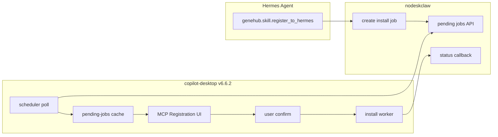

# V6.6.2 GeneHub MCP Registration — copilot-desktop 实施计划

## 现状与缺口

**已有能力（可直接复用）**

| 能力 | 文件 |
|------|------|
| pending jobs 拉取 | [`genehub-client.ts`](src/main/genehub/genehub-client.ts) `listPendingJobs` |
| 安装流水线 claim→download→validate→write→restart→sync | [`skill-install-worker.ts`](src/main/genehub/skill-install-worker.ts) |
| scheduler 定时 poll | [`genehub-scheduler.ts`](src/main/genehub/genehub-scheduler.ts) `pollPendingJobs` |
| GeneHub Skill Center 基础 UI | [`GeneHubSkillCenterPage.tsx`](src/renderer/src/screens/Hermes/pages/GeneHub/GeneHubSkillCenterPage.tsx) + [`useGeneHubRuntime.ts`](src/renderer/src/screens/Hermes/hooks/useGeneHubRuntime.ts) |
| MCP Gateway 运营页 | [`HermesMcpGatewayPage.tsx`](src/renderer/src/screens/Hermes/pages/McpGateway/HermesMcpGatewayPage.tsx) |

**v6.6.2 缺口（PRD §2）**

- `InstallJob` 无 `source` / `profileName` / `createdAt` / `lastUpdatedAt`
- scheduler 在 `autoInstallAssignedJobs=false` 时**不写缓存、不通知 UI**（仅 `continue`）
- 无 MCP 专用「待确认」面板、Bundle 预览 Drawer、忽略操作
- [`hermes-skill-writer.ts`](src/main/genehub/hermes-skill-writer.ts) 未写 `genehub.json` provenance（PRD §6.6）
- [`skill-package-validator.ts`](src/main/genehub/skill-package-validator.ts) 未校验 `compatibility.profiles`；`verifySignature` 读静态默认而非 runtime config
- MCP Gateway 页无 GeneHub 联动卡片

---

## Stage 1: 契约与错误码

**文件**: [`src/shared/genehub/genehub-contract.ts`](src/shared/genehub/genehub-contract.ts)

- 新增 `InstallJobSource = "mcp_agent_request" | "desktop_manual" | "server_assigned"`
- 扩展 `InstallJob`：`source`、`profileName?`、`createdAt?`、`lastUpdatedAt?`
- 新增类型：
  - `GeneHubPendingJobCache`（PRD §6.2）
  - `GeneHubInstallBundlePreview`（manifest + files/scripts 相对路径列表，不含敏感本地绝对路径）
  - `GeneHubRegistrationSummary`（pending 数、lastInstalled、lastFailed）
- 扩展 `GeneHubRuntimeAPI`（PRD §7.2）：
  - `listMcpRegistrationJobs(input?)`
  - `previewInstallBundle(jobId)`
  - `ignoreInstallJob(jobId)`
  - `getRegistrationSummary()`（供 MCP Gateway 卡片）

**文件**: [`src/shared/genehub/genehub-errors.ts`](src/shared/genehub/genehub-errors.ts)

- 补齐 PRD §10：`GENEHUB_NOT_INITIALIZED`、`GENEHUB_JOB_NOT_FOUND`、`GENEHUB_JOB_NOT_PENDING`、`GENEHUB_JOB_CLAIM_FAILED`、`GENEHUB_PATH_NOT_ALLOWED`（alias 现有 `GENEHUB_INVALID_FILE_PATH`）、`GENEHUB_SYNC_INSTALLED_FAILED`

**文件**: [`src/main/genehub/genehub-client.ts`](src/main/genehub/genehub-client.ts)

- `mapGeneHubJob` 映射 `source`（`job_source` / `source`）、`profile_name`、`created_at`、`updated_at`

---

## Stage 2: Main — 缓存、忽略、scheduler 行为

**新建** [`src/main/genehub/pending-jobs-cache.ts`](src/main/genehub/pending-jobs-cache.ts)

- 路径：`profileHome()/desktop/genehub/pending-jobs.json`
- `readPendingJobsCache()` / `writePendingJobsCache(jobs)`
- `mergePendingJobs(fresh: InstallJob[])` 合并去重（按 `jobId`）

**新建** [`src/main/genehub/ignored-jobs-store.ts`](src/main/genehub/ignored-jobs-store.ts)

- 路径：`profileHome()/desktop/genehub/ignored-jobs.json`（jobId 集合）
- `ignoreInstallJob(jobId)` / `isJobIgnored(jobId)`

**修改** [`src/main/genehub/genehub-scheduler.ts`](src/main/genehub/genehub-scheduler.ts) `pollPendingJobs`

PRD §6.2 / §6.10 行为：

1. 拉取各 profile 的 pending jobs → **始终写入 cache**
2. 对 `source=mcp_agent_request`：`appendInstallLog({ step: "job_detected" })`；**永不自动 claim/install**
3. 对 `source=server_assigned`：仅当 `autoInstallAssignedJobs=true` 且 job 可安装时调用 `runInstallJob`
4. 对 `source=desktop_manual`：不自动执行（已由 UI 触发）
5. poll 完成后可选 `BrowserWindow` 广播 `genehub:pending-jobs-changed`（Main→Renderer 刷新 hook）

**新建** [`src/main/genehub/mcp-registration-service.ts`](src/main/genehub/mcp-registration-service.ts)

- `listMcpRegistrationJobs()`：cache + live API 合并，过滤 `mcp_agent_request`、排除 ignored、按 status 分组
- `getRegistrationSummary()`：pending 数 + 从 install logs / installed store 取 last success/fail
- `previewInstallBundle(jobId)`：校验 job 存在且 pending → `downloadBundle` → 返回 sanitized preview（scripts 默认折叠字段由 UI 控制）；若 backend 要求 claim 才给 bundle，则 fallback 为 job metadata + 明确 error

---

## Stage 3: Main — 安装流水线增强

**修改** [`src/main/genehub/skill-install-worker.ts`](src/main/genehub/skill-install-worker.ts)

- `runInstallJob(jobId, options?: { userConfirmed?: boolean })`
  - `source=mcp_agent_request` 且 `!userConfirmed` → `GENEHUB_JOB_NOT_PENDING` / 拒绝执行
  - 用户从 UI 确认时传 `userConfirmed: true`，并 log `user_confirmed`
- 补全 PRD §6.7 步骤：`write_complete`、`restart_complete`、`sync_installed`（在现有 step 间插入）
- 失败路径保持 `updateJobStatus(failed)` + install log

**修改** [`src/main/genehub/hermes-skill-writer.ts`](src/main/genehub/hermes-skill-writer.ts)

- 安装成功后写入 `skills/<skillName>/genehub.json`（PRD §6.6 provenance 示例）

**修改** [`src/main/genehub/skill-package-validator.ts`](src/main/genehub/skill-package-validator.ts)

- 从 `getGeneHubConfig()` 读取 `verifySignature`（非静态 DEFAULT）
- `compatibility.profiles` 不匹配当前 profile → warning 或阻断（与 PRD §6.5 一致，默认阻断）
- 路径违规统一抛 `GENEHUB_PATH_NOT_ALLOWED`

---

## Stage 4: IPC + Preload

**修改** [`src/main/genehub/genehub-ipc.ts`](src/main/genehub/genehub-ipc.ts)

| Channel | 行为 |
|---------|------|
| `genehub:list-mcp-registration-jobs` | `listMcpRegistrationJobs` |
| `genehub:preview-install-bundle` | `previewInstallBundle(jobId)` |
| `genehub:ignore-install-job` | `ignoreInstallJob(jobId)` |
| `genehub:get-registration-summary` | `getRegistrationSummary()` |
| `genehub:install-job` | 透传 `userConfirmed: true` 给 worker（MCP 确认安装） |

**修改** [`src/preload/genehub-runtime-api.ts`](src/preload/genehub-runtime-api.ts) + [`src/preload/index.d.ts`](src/preload/index.d.ts)

- 暴露上述 4 个新方法；`installJob` 签名不变（Main 侧默认 confirmed）

---

## Stage 5: Renderer — GeneHub Skill Center

**新建组件**（[`src/renderer/src/screens/Hermes/pages/GeneHub/components/`](src/renderer/src/screens/Hermes/pages/GeneHub/components/)）

| 组件 | 职责 |
|------|------|
| `GeneHubMcpRegistrationPanel.tsx` | PRD §6.1：按「待确认 / 安装中 / 已完成 / 失败」分组；展示 source、profile、时间戳、错误 |
| `GeneHubInstallJobDrawer.tsx` | PRD §8.3：job metadata + bundle preview + validation 摘要 + 相关 logs |
| `GeneHubMcpRegistrationJobCard.tsx` | 单 job 卡片：确认安装 / 查看详情 / 忽略 / 查看日志 |

**修改** [`GeneHubSkillCenterPage.tsx`](src/renderer/src/screens/Hermes/pages/GeneHub/GeneHubSkillCenterPage.tsx)

- 新增 tab `mcpRegistration`（「MCP 发起的安装请求」）
- 编排 `GeneHubMcpRegistrationPanel` + Drawer

**修改** [`useGeneHubRuntime.ts`](src/renderer/src/screens/Hermes/hooks/useGeneHubRuntime.ts)

- 状态：`mcpRegistrationJobs`、`registrationSummary`
- 方法：`loadMcpRegistrationJobs`、`previewBundle`、`ignoreJob`、`confirmInstallJob(jobId)`
- 订阅 `genehub:pending-jobs-changed`（Preload 需暴露 `onPendingJobsChanged` unsubscribe）

**增强** [`GeneHubInstallJobList.tsx`](src/renderer/src/screens/Hermes/pages/GeneHub/components/GeneHubInstallJobList.tsx)

- 通用 pending tab 保留；MCP panel 使用 richer card（区分 source 文案）

---

## Stage 6: Renderer — MCP Gateway 联动

**新建** [`McpGatewayGeneHubRegistrationCard.tsx`](src/renderer/src/screens/Hermes/pages/McpGateway/McpGatewayGeneHubRegistrationCard.tsx)

PRD §6.8 字段：

- pending registration jobs 数量
- last installed skill / last failed job
- 「打开 GeneHub Skill Center」按钮（切换 Local Hermes 导航至 `skillCenter` + mcpRegistration tab，或文档化 deep-link state）

**修改** [`HermesMcpGatewayPage.tsx`](src/renderer/src/screens/Hermes/pages/McpGateway/HermesMcpGatewayPage.tsx)

- 在 status card 下方插入 GeneHub 小卡片；复用 `useGeneHubRuntime` 或轻量 `getRegistrationSummary` 调用

---

## Stage 7: i18n

[`src/shared/i18n/locales/en/workspaces.ts`](src/shared/i18n/locales/en/workspaces.ts) / [`zh-CN/workspaces.ts`](src/shared/i18n/locales/zh-CN/workspaces.ts)

- `workspaces.hermes.geneHub.mcpRegistration.*`：分组标题、source 文案、确认/忽略/预览、Drawer 字段
- `workspaces.hermes.mcpGateway.geneHubRegistration.*`：联动卡片文案

---

## Stage 8: 测试

| 文件 | 覆盖 |
|------|------|
| **新建** `tests/genehub-pending-jobs-cache.test.ts` | cache 读写、merge |
| **新建** `tests/genehub-mcp-registration.test.ts` | list/filter/ignore/summary |
| 扩展 [`tests/genehub-scheduler.test.ts`](tests/genehub-scheduler.test.ts) | mcp job 写 cache、不 auto-install |
| 扩展 [`tests/skill-install-worker.test.ts`](tests/skill-install-worker.test.ts) | userConfirmed 门禁、新 log steps |
| 扩展 [`tests/skill-package-validator.test.ts`](tests/skill-package-validator.test.ts) | profiles compatibility、verifySignature from config |
| 扩展 [`tests/preload-genehub-runtime.test.ts`](tests/preload-genehub-runtime.test.ts) 或新建 | 新 IPC surface |

验收：`npm run typecheck` + `npm test`

---

## Stage 9: 文档同步

- [`docs/API_CONTRACTS.md`](docs/API_CONTRACTS.md) § GeneHub Runtime — 4 个新 channel + `InstallJob.source`
- [`AGENTS.md`](AGENTS.md) — 版本行 **V6.6.2** + 版本特性索引
- [`docs/INDEX.md`](docs/INDEX.md) — V6.6.2 段落

---

## 安全边界（PRD §9，必须遵守）

- Renderer 仅经 `window.genehubRuntime`；Bundle 预览/安装全在 Main
- `mcp_agent_request` **默认不自动安装**（即使未来 `autoInstallAssignedJobs=true` 也不静默安装 MCP 请求）
- Token 不进 Renderer；install log redact 敏感字段
- `ignoreInstallJob` 仅本地 dismiss，不 claim

## 明确不做（PRD §4）

Skill 发布/审核、多级审批、通用 write 工具审批、Renderer 直写 `~/.hermes`、Marketplace 重构
