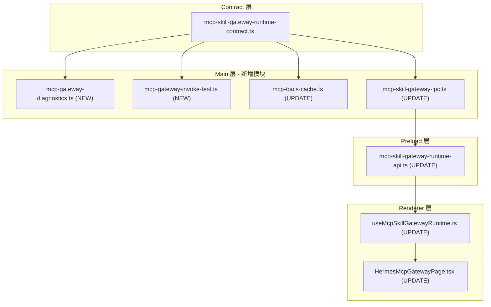

# V6.6 MCP Skill Gateway E2E - copilot-desktop 实施计划

## 现状分析

整个 MCP Skill Gateway Runtime 模块**已基本就绪**，包括：

- **Contract**: [`src/shared/mcp-skill-gateway-runtime/mcp-skill-gateway-runtime-contract.ts`](src/shared/mcp-skill-gateway-runtime/mcp-skill-gateway-runtime-contract.ts) -- 12 个 API 方法 + 完整类型
- **Main 模块**: [`src/main/mcp-skill-gateway-runtime/`](src/main/mcp-skill-gateway-runtime/) -- 12 个文件（proxy / config / health / lifecycle / register / tools-cache / errors / log / descriptor / token-provider / ipc / index）
- **Preload**: [`src/preload/mcp-skill-gateway-runtime-api.ts`](src/preload/mcp-skill-gateway-runtime-api.ts) + [`index.d.ts`](src/preload/index.d.ts) 已声明
- **Renderer**: [`HermesMcpGatewayPage.tsx`](src/renderer/src/screens/Hermes/pages/McpGateway/HermesMcpGatewayPage.tsx) + [`useMcpSkillGatewayRuntime.ts`](src/renderer/src/screens/Hermes/hooks/useMcpSkillGatewayRuntime.ts) 已存在

PRD v6.6 在此基础上**增量添加 3 项新能力**：一键诊断、工具列表、Invoke Test。

## 变更范围



---

## Stage 1: Contract 类型扩展

文件：[`src/shared/mcp-skill-gateway-runtime/mcp-skill-gateway-runtime-contract.ts`](src/shared/mcp-skill-gateway-runtime/mcp-skill-gateway-runtime-contract.ts)

新增接口：

- `McpGatewayDiagnosticsErrorCode` -- PRD A7 定义的 9 个诊断错误码
- `DiagnosticCheckResult` -- 每步诊断结果 `{ step, ok, label, detail?, error?, errorCode? }`
- `McpGatewayDiagnosticsResult` -- 诊断总结果（PRD A4.2）
- `McpGatewayToolPreview` -- 工具预览条目 `{ name, description, inputSchema, source?, riskLevel?, enabled? }`
- `McpGatewayInvokeTestInput` -- `{ toolName, input }`
- `McpGatewayInvokeTestResult` -- `{ ok, durationMs, result?, errorCode?, errorMessage? }`

扩展 `McpSkillGatewayRuntimeAPI` 接口，追加 3 个方法：

```typescript
runDiagnostics(): Promise<McpGatewayDiagnosticsResult>;
listRemoteTools(): Promise<McpGatewayToolPreview[]>;
invokeRemoteTool(input: McpGatewayInvokeTestInput): Promise<McpGatewayInvokeTestResult>;
```

---

## Stage 2: Main 新增诊断模块

新文件：[`src/main/mcp-skill-gateway-runtime/mcp-gateway-diagnostics.ts`](src/main/mcp-skill-gateway-runtime/mcp-gateway-diagnostics.ts)

实现 `runMcpSkillGatewayDiagnostics()` 函数，按 PRD A3.2 顺序执行 8 步检查：

1. `desktopAuth` 检查（token 存在性）
2. proxy 状态检查
3. `startProxy()` 如未运行则自动启动
4. `testProxy()` 本地 health
5. `testRemoteMcp()` 远端 MCP 连通
6. `registerToProfile("default")` 确保注册
7. `listProfileRegistrations()` 确认注册状态
8. `tools/list` 获取工具列表 preview

依赖现有模块：`mcp-token-provider`、`mcp-skill-gateway-proxy`、`mcp-skill-gateway-health`、`mcp-skill-gateway-register`。

---

## Stage 3: Main 新增 Invoke Test 模块

新文件：[`src/main/mcp-skill-gateway-runtime/mcp-gateway-invoke-test.ts`](src/main/mcp-skill-gateway-runtime/mcp-gateway-invoke-test.ts)

实现 `invokeRemoteMcpTool(input)` 函数：

- 通过本地 Proxy `POST /mcp` 发送 `tools/call` JSON-RPC
- 记录 durationMs
- 本阶段默认只允许只读工具（`hermes.instances.list` / `hermes.instance.status` / `hermes.skills.list`），写工具返回拒绝
- 调用写入 audit log（复用 `mcp-skill-gateway-log.ts`）

---

## Stage 4: Main 更新 Tools Cache

文件：[`src/main/mcp-skill-gateway-runtime/mcp-tools-cache.ts`](src/main/mcp-skill-gateway-runtime/mcp-tools-cache.ts)

- 新增 `listRemoteMcpTools()` 函数：先检查缓存 TTL（PRD 要求 60s，当前 24h），未过期返回缓存，否则通过 Proxy 发 `tools/list` 刷新
- 缓存文件更新为 `~/.hermes/desktop/mcp-skill-gateway-tools.json`（当前为 `mcp-tools-cache.json`，路径基本一致）
- 缓存条目增加 `source` / `riskLevel` / `enabled` 等字段对齐 `McpGatewayToolPreview`

---

## Stage 5: Main IPC 注册 3 个新 channel

文件：[`src/main/mcp-skill-gateway-runtime/mcp-skill-gateway-ipc.ts`](src/main/mcp-skill-gateway-runtime/mcp-skill-gateway-ipc.ts)

在 `registerMcpSkillGatewayRuntimeIpc()` 中追加：

```text
mcp-skill-gateway-runtime:run-diagnostics   -> runMcpSkillGatewayDiagnostics()
mcp-skill-gateway-runtime:list-remote-tools  -> listRemoteMcpTools()
mcp-skill-gateway-runtime:invoke-remote-tool -> invokeRemoteMcpTool(input)
```

---

## Stage 6: Preload API 扩展

文件：[`src/preload/mcp-skill-gateway-runtime-api.ts`](src/preload/mcp-skill-gateway-runtime-api.ts)

追加 3 个方法的 ipcRenderer.invoke 封装。Contract 类型更新后，TypeScript 会自动要求 Preload 实现对齐。

---

## Stage 7: Renderer Hook 扩展

文件：[`src/renderer/src/screens/Hermes/hooks/useMcpSkillGatewayRuntime.ts`](src/renderer/src/screens/Hermes/hooks/useMcpSkillGatewayRuntime.ts)

新增状态与方法：

- `diagnosticsResult` 状态
- `remoteTools` 状态
- `invokeResult` 状态
- `runDiagnostics()` -- 调用 + 状态更新
- `listRemoteTools()` -- 调用 + 状态更新
- `invokeRemoteTool(input)` -- 调用 + 状态更新

---

## Stage 8: Renderer 页面增强

文件：[`src/renderer/src/screens/Hermes/pages/McpGateway/HermesMcpGatewayPage.tsx`](src/renderer/src/screens/Hermes/pages/McpGateway/HermesMcpGatewayPage.tsx)

当前页面已有 ~497 行，按 PRD A3 新增/改造 4 个区域：

**A3.1 Gateway 总览**（现有 Gateway 卡片区改造）：补充 `toolCount` / `registeredProfileCount` / `hermesRestartRequired` 等字段展示。

**A3.2 一键诊断**（新增区域）：
- "一键检查 MCP Gateway" 按钮
- 诊断运行中 → 步骤进度列表（每步 ok/fail 图标 + label）
- 诊断结果 JSON 摘要

**A3.3 MCP Tools Preview**（新增区域）：
- 工具列表表格/卡片：`name` / `description` / `inputSchema` / `source`
- 刷新按钮

**A3.4 Invoke Test**（新增区域）：
- 默认测试 `hermes.skills.list` + `instance_ref` 输入框
- 运行按钮 → 显示 ok/failed + durationMs + result JSON

考虑将各区域提取为子组件以控制文件体积（< 250 行/组件）。

---

## Stage 9: i18n 补齐

文件：`src/shared/i18n/locales/{en,zh-CN}/` 对应模块

为新增 UI 元素补充翻译 key：
- `workspaces.hermes.mcpGateway.diagnostics*` -- 诊断相关
- `workspaces.hermes.mcpGateway.toolsPreview*` -- 工具列表相关
- `workspaces.hermes.mcpGateway.invokeTest*` -- 调用测试相关

---

## Stage 10: 测试

在 `tests/` 下新增：
- `mcp-gateway-diagnostics.test.ts` -- mock 各步骤返回，验证诊断流程
- `mcp-gateway-invoke-test.test.ts` -- mock proxy 转发，验证只读权限检查

---

## Stage 11: 文档同步

按 007-sync-project-docs 规则更新：
- [`docs/API_CONTRACTS.md`](docs/API_CONTRACTS.md) -- 新增 3 个 IPC channel
- [`AGENTS.md`](AGENTS.md) -- 版本行更新
- [`docs/INDEX.md`](docs/INDEX.md) -- 版本特性索引

---

## 安全边界（PRD A8 / A6 必须遵守）

- Token 仅在 Main Proxy 注入，不进 Renderer / config.yaml
- Proxy 仅 `127.0.0.1` 监听
- Request body < 2MB（已实现）
- Invoke Test 默认只允许只读工具
- 错误日志不输出 Authorization header
- Hermes config.yaml 只写 `http://127.0.0.1:48742/mcp`

## 不做的事

- GeneHub marketplace UI（v6.6.2）
- GeneHub skill 注册落盘（v6.6.1）
- 写操作工具的确认弹窗（第二阶段）
- nodeskclaw 后端修改（子 PRD B）
