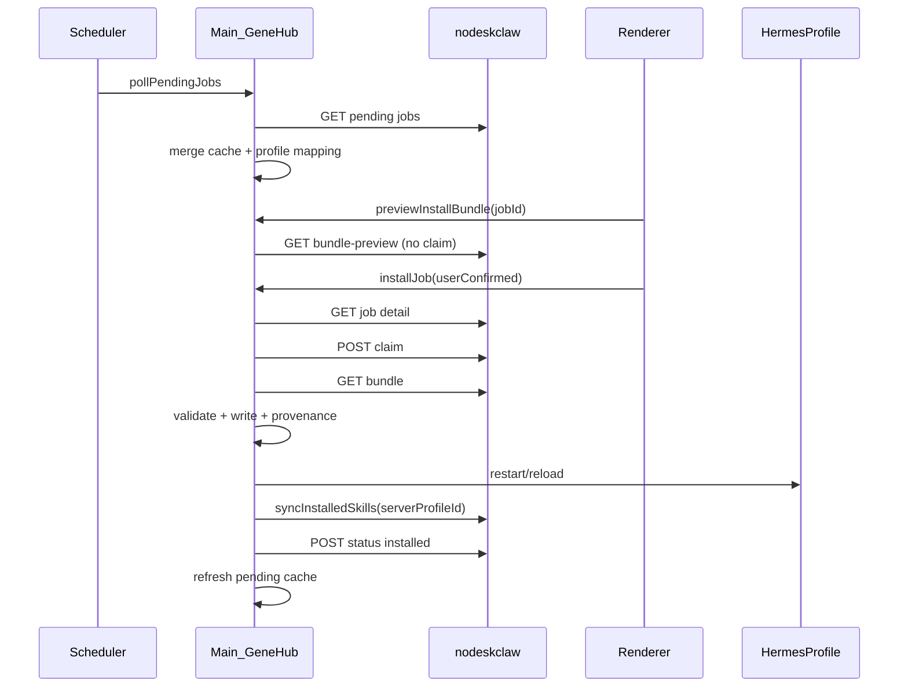

# v6.7.1 GeneHub MCP Registration Hardening 实现计划

## 现状与差距

v6.6.2 已有 MCP Registration 骨架（[`mcp-registration-service.ts`](src/main/genehub/mcp-registration-service.ts)、[`skill-install-worker.ts`](src/main/genehub/skill-install-worker.ts)、GeneHub Skill Center UI、[`McpGatewayGeneHubRegistrationCard.tsx`](src/renderer/src/screens/Hermes/pages/McpGateway/McpGatewayGeneHubRegistrationCard.tsx)），但与 PRD 存在以下**关键阻断**：

| PRD 要求 | 当前实现 | 问题 |
|---|---|---|
| preview 不 claim | [`previewInstallBundle`](src/main/genehub/mcp-registration-service.ts) 调用 `downloadBundle` | 会 claim/下载完整 bundle |
| ignore 同步服务端 | [`ignoreInstallJob`](src/main/genehub/ignored-jobs-store.ts) 仅写本地 JSON | 服务端仍为 pending |
| serverProfileId 映射 | [`genehub-session.ts`](src/main/genehub/genehub-session.ts) 内存 Map | 重启丢失；pending job 的 `profileName` 可能为空 |
| sync 用 server id | worker 中 `syncInstalledSkills({ profileId: profile.profileId })` | 用的是**本地** profileId |
| 安装前 profile 解析 | `resolveHermesProfile(job.profileId)` | `job.profileId` 是 **server** id，易解析失败 |
| 签名校验 | [`validateGeneHubBundle`](src/main/genehub/skill-package-validator.ts) 仅 `signature === "invalid"` | 占位逻辑 |
| scripts provenance | [`installGeneHubBundle`](src/main/genehub/hermes-skill-writer.ts) 直接覆盖 scripts | 无 provenance 检查/备份 |



---

## 阶段 1：Shared 契约与错误码

**文件**：[`src/shared/genehub/genehub-contract.ts`](src/shared/genehub/genehub-contract.ts)、[`src/shared/genehub/genehub-errors.ts`](src/shared/genehub/genehub-errors.ts)

- 扩展 `GeneHubRuntimeConfig`：`trustedPublicKeys: string[]`（默认 `[]`，`verifySignature` 保持默认 `true`）
- 新增 `GeneHubProfileMapping` / `GeneHubProfileMappingEntry`（PRD §6.2）
- 扩展 `GeneHubInstallBundlePreview`（或新增 `GeneHubBundlePreview` 别名）对齐 PRD §6.3：`manifestHash`、`bundleHash`、`compatibility`、`validationPreview`、`files[].kind`、`scripts[].riskLevel` 等；**不含**脚本正文
- 扩展 `GeneHubRegistrationSummary`：`inProgressMcpJobCount`、`lastSyncAt`（PRD §6.10）
- 新增 `GeneHubInstallResult`（PRD §8）
- 新增错误码：`GENEHUB_PROFILE_MAPPING_MISSING`、`GENEHUB_SCRIPT_PROVENANCE_MISMATCH`、`GENEHUB_SCRIPT_OVERWRITE_BLOCKED`（PRD §6.6/6.8）

---

## 阶段 2：Profile Mapping 持久化

**新建**：[`src/main/genehub/genehub-profile-mapping.ts`](src/main/genehub/genehub-profile-mapping.ts)

- 读写 `~/.hermes/desktop/genehub/profile-mapping.json`（via `profileHome()`）
- API：
  - `saveProfileMappingEntry({ localProfileId, localProfileName, serverProfileId, deviceId })`
  - `resolveLocalProfileByServerId(serverProfileId)` → `{ localProfileName, localProfileId, serverProfileId } | null`
  - `resolveServerProfileId(localProfileId | localProfileName)` → string | null
  - `hasProfileMapping(serverProfileId)` 供 UI/worker 禁用安装

**集成点**：
- [`genehub-scheduler.ts`](src/main/genehub/genehub-scheduler.ts) `initializeGeneHub`：`registerHermesProfile` 成功后写入 mapping（保留现有 `setGeneHubServerProfileId` 内存缓存）
- [`genehub-session.ts`](src/main/genehub/genehub-session.ts)：`resolveGeneHubServerProfileId` 优先读 mapping 文件，fallback 内存 Map
- [`mcp-registration-service.ts`](src/main/genehub/mcp-registration-service.ts) `fetchAndCachePendingJobs`：`profileName` 为空时用 mapping 补全；映射缺失时保留 job 但标记不可安装（返回/透传 `profileMappingMissing` 或在 list 结果中带 flag）

---

## 阶段 3：GeneHub Client 新 API

**文件**：[`src/main/genehub/genehub-client.ts`](src/main/genehub/genehub-client.ts)

新增方法（路径相对 `descriptor.apiPrefix`，与现有 `/hermes/install-jobs/...` 一致）：

```ts
fetchBundlePreview(jobId): Promise<GeneHubBundlePreview>   // GET .../bundle-preview
ignoreInstallJob(jobId): Promise<{ success: boolean; status: "cancelled" }>  // POST .../ignore
getInstallJob(jobId): Promise<InstallJob>                    // GET .../install-jobs/{id}（安装前刷新状态）
```

- 新增 `mapBundlePreview(raw)` 映射 snake_case → shared 类型
- **禁止** preview 路径调用 `claim` / `downloadBundle`

---

## 阶段 4：MCP Registration Service 修复

**文件**：[`src/main/genehub/mcp-registration-service.ts`](src/main/genehub/mcp-registration-service.ts)

1. **`previewInstallBundle`**：改调 `genehubClient.fetchBundlePreview`；失败时返回 `previewLimited: true` + metadata，不抛致命错误（PRD §6.3.5）
2. **`ignoreInstallJob`**（async）：
   - 校验 job 为 `pending` + `mcp_agent_request`（非 pending/已安装则拒绝）
   - 调用 `genehubClient.ignoreInstallJob`
   - `appendInstallLog` step=`ignored`
   - `fetchAndCachePendingJobs()` + `emitPendingJobsChanged()`
   - **移除**对 [`ignored-jobs-store.ts`](src/main/genehub/ignored-jobs-store.ts) 作为主路径的依赖（可保留只读兼容或删除 `isJobIgnored` 过滤，改由服务端 `cancelled` 状态分组）
3. **`listMcpRegistrationJobs`**：
   - `isMcpJob` 保持严格：`source === "mcp_agent_request"`（source 缺失不算 MCP job）
   - `groupMcpJob`：`cancelled` → `failed` 分组；`installed` → `completed`
   - 不再本地 hide ignored jobs；failed 分组展示 `errorCode`/`errorMessage`
4. **`getRegistrationSummary`**：补充 `inProgressMcpJobCount`（`groups.in_progress.length`）、`lastSyncAt`（从 connection/scheduler 或 mapping `updatedAt`）

导出 `fetchAndCachePendingJobs` 供 worker finally 调用。

---

## 阶段 5：Install Worker 完整链路

**文件**：[`src/main/genehub/skill-install-worker.ts`](src/main/genehub/skill-install-worker.ts)

调整 `runInstallJob` 顺序（PRD §6.6）：

1. MCP job 必须 `userConfirmed === true`
2. **`getInstallJob(jobId)`** 刷新状态；非 `pending` 则 `GENEHUB_JOB_NOT_PENDING`
3. 通过 **serverProfileId → profile mapping** 解析本地 `HermesProfileDto`（非 `resolveHermesProfile(job.profileId)` 直接匹配）
4. mapping 缺失 → `GENEHUB_PROFILE_MAPPING_MISSING`
5. `claim` → `download` → `validating` status → `validate` → `installing` status → write → restart → **`syncInstalledSkills({ profileId: serverProfileId })`**
6. `installed` / `failed` 必须 `updateJobStatus`
7. **`finally`**：`fetchAndCachePendingJobs()` + `emitPendingJobsChanged()`

**IPC**：[`genehub-ipc.ts`](src/main/genehub/genehub-ipc.ts) `genehub:install-job` 接受可选 `{ userConfirmed?: boolean }`（MCP 默认需 true；manual 链路保持 true）

---

## 阶段 6：签名校验（PRD §6.7）

**文件**：[`src/main/genehub/skill-package-validator.ts`](src/main/genehub/skill-package-validator.ts)、[`src/main/genehub/genehub-config.ts`](src/main/genehub/genehub-config.ts)

- 新增 `verifyGeneHubSignature(manifest, config)`：
  - `verifySignature=true` 且 `manifest.signature` 为空 → `GENEHUB_SIGNATURE_INVALID`
  - `verifySignature=true` 且 `trustedPublicKeys.length === 0` → `GENEHUB_SIGNATURE_INVALID`
  - 对 `manifestHash + bundleHash`（PRD：signature 覆盖二者）做 `crypto.createVerify` 验签；任一 trusted key 通过即可
  - 算法：优先 Ed25519（nodeskclaw 常见）；若 server heartbeat `serverConfig` 提供 `signature_algorithm` 则跟随
- `verifySignature=false`：跳过验签但 `appendInstallLog` warning
- 移除占位 `signature === "invalid"` 判断

**配置来源**：`saveGeneHubConfig` 在 heartbeat 收到 `trusted_public_keys` 时合并（可选）；本地 config 可手动维护测试 key

---

## 阶段 7：Scripts Provenance 保护（PRD §6.8）

**新建**：[`src/main/genehub/script-provenance.ts`](src/main/genehub/script-provenance.ts)

- 受控目录：`{hermesHome}/scripts/`（复用现有 `assertSafeRelativePath`）
- 读取/写入 sidecar：`{scriptPath}.genehub.json` 或集中 manifest `{hermesHome}/scripts/.genehub-provenance.json`（选 sidecar，与 skill `genehub.json` 一致）
- 规则：无 provenance → 阻断；geneSlug 不匹配 → `GENEHUB_SCRIPT_PROVENANCE_MISMATCH`；匹配 → 备份后覆盖

**集成**：[`hermes-skill-writer.ts`](src/main/genehub/hermes-skill-writer.ts) 在写 scripts 前调用 `assertScriptProvenanceAllowed(...)`；安装成功后写入 provenance sidecar

---

## 阶段 8：Scheduler / Cache 刷新（PRD §6.9）

**文件**：[`pending-jobs-cache.ts`](src/main/genehub/pending-jobs-cache.ts)、[`genehub-scheduler.ts`](src/main/genehub/genehub-scheduler.ts)

- bump cache version → `v6.7.1`
- `mergePendingJobs`：服务端 `installed`/`cancelled`/`failed` 覆盖本地 stale pending
- scheduler：`mcp_agent_request` + `pending` **永不** auto-install（现有逻辑已满足）；install/ignore 后由 worker/service 触发 refresh

---

## 阶段 9：Preload / IPC 契约

**文件**：[`src/preload/genehub-runtime-api.ts`](src/preload/genehub-runtime-api.ts)、[`src/preload/index.d.ts`](src/preload/index.d.ts)

- `installJob(jobId, options?: { userConfirmed?: boolean })` 传 options 到 IPC
- `ignoreInstallJob` 返回 `{ ok, status? }` 对齐 PRD
- 更新 [`docs/API_CONTRACTS.md`](docs/API_CONTRACTS.md) GeneHub 段（6 个 channel + 行为说明）

---

## 阶段 10：Renderer UI

### GeneHub Skill Center
**文件**：
- [`GeneHubMcpRegistrationJobCard.tsx`](src/renderer/src/screens/Hermes/pages/GeneHub/components/GeneHubMcpRegistrationJobCard.tsx)：mapping 缺失时禁用「确认安装」+ 提示；展示 `errorCode`
- [`GeneHubInstallJobDrawer.tsx`](src/renderer/src/screens/Hermes/pages/GeneHub/components/GeneHubInstallJobDrawer.tsx)：展示 `validationPreview`（hasSkill、requiresSignature、pathWarnings 等）；独立「预览 Bundle」按钮（打开 drawer 时加载 preview，不触发 install）
- [`GeneHubMcpRegistrationPanel.tsx`](src/renderer/src/screens/Hermes/pages/GeneHub/components/GeneHubMcpRegistrationPanel.tsx)：`in_progress` 组禁用重复 confirm

### MCP Gateway 联动卡片
**文件**：[`McpGatewayGeneHubRegistrationCard.tsx`](src/renderer/src/screens/Hermes/pages/McpGateway/McpGatewayGeneHubRegistrationCard.tsx)

- 展示：pending count、**installing count**、last installed、last failed、**last sync time**
- 点击跳转 Skill Center MCP Registration tab（已有 `writeGeneHubSkillCenterTab`）

### i18n
[`src/shared/i18n/locales/en/workspaces.ts`](src/shared/i18n/locales/en/workspaces.ts) + zh-CN：新增 mapping 缺失、validation preview、ignore 成功、installing count 等 key

---

## 阶段 11：测试（PRD §9，优先 P0 单测）

新建/扩展 Vitest（mock fs + client，不启 dev server）：

| 文件 | 覆盖点 |
|---|---|
| `tests/genehub-profile-mapping.test.ts` | 读写 mapping、server↔local 解析 |
| `tests/genehub-script-provenance.test.ts` | 无 provenance 阻断、mismatch、允许覆盖 |
| `tests/skill-package-validator.test.ts` | signature 缺失/无效/有效、verifySignature=false warning |
| `tests/skill-install-worker.test.ts` | userConfirmed 门禁、serverProfileId sync、finally refresh |
| `tests/genehub-preview-ipc.test.ts` | preview 不调 downloadBundle |
| `tests/genehub-ignore-ipc.test.ts` | ignore 调服务端 + refresh |
| `tests/genehub-mcp-registration-service.test.ts` | source 缺失不误判、分组逻辑 |

运行：`npm test -- --run tests/genehub-*.ts tests/skill-*.ts`

---

## 阶段 12：文档同步

按 [`.agents/skills/sync-project-docs/SKILL.md`](.agents/skills/sync-project-docs/SKILL.md) 增量更新：

- [`AGENTS.md`](AGENTS.md) 版本行 + V6.7.1 特性索引
- [`docs/INDEX.md`](docs/INDEX.md)
- [`docs/API_CONTRACTS.md`](docs/API_CONTRACTS.md) GeneHub IPC + profile-mapping 路径

更新 [`specs/current-agent-state.md`](specs/current-agent-state.md) / [`specs/current-agent-task.md`](specs/current-agent-task.md) 阶段进度。

---

## 验收对照（PRD §10）

1. MCP job 稳定显示（source 严格匹配 + mapping 补 profileName）
2. `mcp_agent_request` pending 不自动安装
3. preview 不改变 job 状态（bundle-preview API）
4. 确认后完整 install 链路 + Hermes skills 目录出现 SKILL.md
5. sync 使用 serverProfileId
6. ignore 同步服务端 cancelled
7. failed 展示 errorCode/errorMessage
8. verifySignature 阻断缺失/无效签名
9. scripts provenance 阻断非法覆盖
10. 文档与 typecheck/test 通过

---

## 风险与假设

- **nodeskclaw v6.7.1** 已部署 `bundle-preview` / `ignore` / 扩展 pending schema；若接口字段 snake_case 与 PRD 略有差异，在 `mapBundlePreview` / `mapGeneHubJob` 做兼容
- **签名算法**：PRD 未指定；实现 Ed25519 + 可选 RSA-SHA256 fallback，并通过 heartbeat `serverConfig` 覆盖
- **ignored-jobs-store**：v6.7.1 后降级为 legacy；主路径以服务端 `cancelled` 为准
