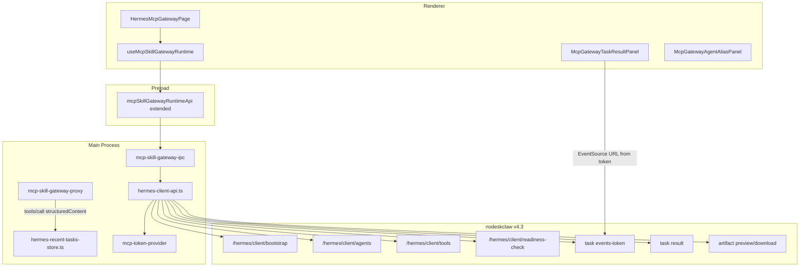

# v7.0 MCP Skill Gateway 功能闭环实施计划

## 现状与缺口

**已有（可复用，不重写）：**

| 能力 | 关键文件 |
|------|----------|
| `/system/info` MCP descriptor | [`mcp-backend-descriptor.ts`](src/main/mcp-skill-gateway-runtime/mcp-backend-descriptor.ts) |
| Local Proxy + Bearer/Profile headers | [`mcp-skill-gateway-proxy.ts`](src/main/mcp-skill-gateway-runtime/mcp-skill-gateway-proxy.ts) |
| 一键诊断（probe 驱动） | [`mcp-gateway-diagnostics.ts`](src/main/mcp-skill-gateway-runtime/mcp-gateway-diagnostics.ts) |
| Tools Preview / Invoke Test / 授权面板 | [`McpGatewayToolsPreview.tsx`](src/renderer/src/screens/Hermes/pages/McpGateway/McpGatewayToolsPreview.tsx) 等 |
| Preload `window.mcpSkillGatewayRuntime` | [`mcp-skill-gateway-runtime-api.ts`](src/preload/mcp-skill-gateway-runtime-api.ts) |
| GeneHub 联动卡片 | [`McpGatewayGeneHubRegistrationCard.tsx`](src/renderer/src/screens/Hermes/pages/McpGateway/McpGatewayGeneHubRegistrationCard.tsx) |

**缺口（PRD v7.0 全部未实现）：**

- `GET /api/v1/hermes/client/*` REST client（bootstrap / agents / tools / readiness）
- task events token、task result、artifact preview/download
- `tools/call` → `structuredContent.task_id` 捕获与 recent task cache
- UI：Client Contract 卡、Agent Alias、按 Agent 过滤 Tools、Readiness Drawer、Task Result Panel
- 诊断增强：bootstrap + readiness + client tools filter

**用户决策：**

- 扩展现有 **`window.mcpSkillGatewayRuntime`**，不新增 `window.hermesMcpClient`
- nodeskclaw v4.3 服务端契约已可用，按 PRD 路径直接对接

---

## 目标架构



---

## 阶段 1：契约与 Main Client（TDD 先行）

### 1.1 Shared 类型与错误码

新建 [`src/shared/hermes-client/hermes-client-contract.ts`](src/shared/hermes-client/hermes-client-contract.ts)（PRD §8 全量类型）+ [`hermes-client-errors.ts`](src/shared/hermes-client/hermes-client-errors.ts)（PRD §16 `HERMES_CLIENT_*`）。

扩展 [`mcp-skill-gateway-runtime-contract.ts`](src/shared/mcp-skill-gateway-runtime/mcp-skill-gateway-runtime-contract.ts) 配置：

```ts
enableHermesClientBootstrap?: boolean;      // default true
enableAgentAliasToolsFilter?: boolean;      // default true
enableTaskResultPanel?: boolean;            // default true
enableSseTokenEventSource?: boolean;        // default true
```

同步 [`mcp-skill-gateway-config.ts`](src/main/mcp-skill-gateway-runtime/mcp-skill-gateway-config.ts) 的 `normalizeConfig` / `DEFAULT_MCP_SKILL_GATEWAY_CONFIG`。

### 1.2 Hermes Client HTTP 层

在 [`src/main/mcp-skill-gateway-runtime/`](src/main/mcp-skill-gateway-runtime/) 新增：

| 文件 | 职责 |
|------|------|
| `hermes-client-http.ts` | 复用 [`genehub-http.ts`](src/main/genehub/genehub-http.ts) 模式：`resolveBackendBaseUrl` + `getMcpAccessToken` + `unwrapNodeDeskClawResponse`；日志 redact Authorization |
| `hermes-client-api.ts` | PRD §6.2 七个方法 + mapper（snake_case → TS） |
| `hermes-client-mappers.ts` | `HermesClientAgent` / `Tool` / `Bootstrap` 字段归一化 |
| `hermes-recent-tasks-store.ts` | 读写 `userData/hermes-mcp/recent-tasks.json`，上限 ~50 条，去重按 `taskId` |

**API 路径（按 PRD + v4.3 契约，实现时以实际响应微调）：**

- `GET /api/v1/hermes/client/bootstrap?profile_name=`
- `GET /api/v1/hermes/client/agents`
- `GET /api/v1/hermes/client/agents/:agentAlias`
- `GET /api/v1/hermes/client/tools`（query: `agent_alias`, `profile_name`, `workspace_id`, `keyword`）
- `POST /api/v1/hermes/client/readiness-check`（body: agentAlias/toolName/profileName/workspaceId）
- `POST /api/v1/hermes/tasks/:taskId/events-token`（或契约等价路径）
- `GET /api/v1/hermes/tasks/:taskId/result`
- `GET` artifact preview / download（使用 bootstrap `artifacts.*_url_template` 或 result 内 URL，Main 注入 Bearer）

**Desktop context 注入：** bootstrap 请求附带 `device_id`（复用 [`getDeviceIdentity()`](src/main/genehub/device-identity.ts)）、`profile_name`（默认 `default`）。

### 1.3 单测（阶段 1 完成门槛）

- `tests/hermes-client-bootstrap.test.ts`
- `tests/hermes-client-agents.test.ts`
- `tests/hermes-client-tools-filter.test.ts`
- `tests/hermes-readiness-check.test.ts`
- 扩展 `tests/mcp-backend-descriptor.test.ts`（v4.3 `mcp.enabled=false` 场景）

---

## 阶段 2：IPC / Preload 扩展（不新增全局对象）

在 [`mcp-skill-gateway-ipc.ts`](src/main/mcp-skill-gateway-runtime/mcp-skill-gateway-ipc.ts) 注册 PRD §15 channels（前缀统一为 `mcp-skill-gateway-runtime:` 或 `hermes-client:` — **推荐 `hermes-client:`** 便于 [`docs/API_CONTRACTS.md`](docs/API_CONTRACTS.md) 分区，Preload 仍挂在 `mcpSkillGatewayRuntime`）：

```text
hermes-client:get-bootstrap
hermes-client:list-agents
hermes-client:get-agent
hermes-client:list-tools
hermes-client:readiness-check
hermes-client:create-events-token
hermes-client:get-task-result
hermes-client:preview-artifact
hermes-client:download-artifact
hermes-client:get-recent-tasks
hermes-client:clear-recent-tasks
```

扩展 [`mcp-skill-gateway-runtime-api.ts`](src/preload/mcp-skill-gateway-runtime-api.ts) + [`mcp-skill-gateway-runtime-contract.ts`](src/shared/mcp-skill-gateway-runtime/mcp-skill-gateway-runtime-contract.ts) 的 `McpSkillGatewayRuntimeAPI` 接口。

更新 [`src/preload/index.d.ts`](src/preload/index.d.ts)（`Window.mcpSkillGatewayRuntime` 新方法）。

**安全约束（PRD §6.3）：** IPC input 禁止任意 URL；artifact 仅接受 `artifactId` 或服务端返回的受控 path；download 走 `dialog.showSaveDialog` + Main `fetch` 写盘。

扩展 `tests/preload-mcp-skill-gateway-runtime.test.ts` 断言新 surface。

---

## 阶段 3：Proxy / Invoke 结构化任务捕获

### 3.1 structuredContent 解析

新建 [`hermes-structured-task.ts`](src/main/mcp-skill-gateway-runtime/hermes-structured-task.ts)：

```ts
extractTaskHintsFromToolResult(result: unknown): {
  taskId?: string;
  eventUrl?: string;
  eventTokenUrl?: string;
  resultUrl?: string;
  artifactUrl?: string;
}
```

在以下两处调用并写入 `hermes-recent-tasks-store`：

1. [`mcp-skill-gateway-proxy.ts`](src/main/mcp-skill-gateway-runtime/mcp-skill-gateway-proxy.ts) — `tools/call` 成功分支（约 L770 后）
2. [`mcp-gateway-invoke-test.ts`](src/main/mcp-skill-gateway-runtime/mcp-gateway-invoke-test.ts) — invoke 成功时

扩展 structured log 字段（可选 `taskId`），**不**记录 token。

扩展 `McpGatewayInvokeTestResult` 增加 `taskHints?: RecentHermesTask` 供 UI 一键打开 Task Result Panel。

单测：`tests/mcp-structured-task-result.test.ts`

### 3.2 诊断增强

扩展 [`runMcpSkillGatewayDiagnostics`](src/main/mcp-skill-gateway-runtime/mcp-gateway-diagnostics.ts)（`enableHermesClientBootstrap` 为 true 时）：

| 新 step | 判定 |
|---------|------|
| `clientBootstrap` | `getHermesClientBootstrap()` 成功 |
| `clientAgents` | `listHermesClientAgents()` 非空（含 common-writer） |
| `clientToolsFilter` | `listHermesClientTools({ agentAlias: "common-writer" })` 有结果 |
| `clientReadiness` | `runHermesReadinessCheck({ agentAlias: "common-writer" })` |

保持现有 probe 逻辑不变（v2 修复约束）。

---

## 阶段 4：Renderer UI（Hermes > MCP Gateway）

在 [`HermesMcpGatewayPage.tsx`](src/renderer/src/screens/Hermes/pages/McpGateway/HermesMcpGatewayPage.tsx) 集成新面板（遵循现有 `hermes-mcp-gateway-section` 样式，不引入新路由）：

| 组件 | PRD 对应 |
|------|----------|
| `McpGatewayClientContractCard.tsx` | §10.1 — descriptor、bootstrap、deviceId、profile、agent aliases、remote health |
| `McpGatewayAgentAliasPanel.tsx` | §10.2 — 列表 + 查看 tools / readiness / 打开 Portal Agent 页 |
| `McpGatewayReadinessDrawer.tsx` | §10.4 — 输入 + checks 网格 + errors/routing |
| `McpGatewayTaskResultPanel.tsx` | §10.5 — task 状态、EventSource timeline、artifact 预览/下载 |
| 增强 `McpGatewayToolsPreview.tsx` | §10.3 — Agent/Profile/Category/Keyword 筛选；展示 `title/uiSchema/examples/agentAlias` |

扩展 [`useMcpSkillGatewayRuntime.ts`](src/renderer/src/screens/Hermes/hooks/useMcpSkillGatewayRuntime.ts)：

- bootstrap / agents / clientTools / readiness / recentTasks / taskResult 状态
- `subscribeTaskEvents(taskId)` — 调用 `createEventsToken` 后 `new EventSource(url)`（`enableSseTokenEventSource`）
- invoke 成功后若含 `taskHints` 自动选中 Task Result Panel

**GeneHub 联动（§14）：** 在 Client Contract 卡或 Readiness 失败项中，若 `skill_exists=false` 显示跳转 Skill Center 提示（`window.genehubRuntime` / 现有 registration card），**不自动安装**。

**i18n：** 在 `src/shared/i18n/locales/en/` 与 `zh-CN/` 的 `workspaces.ts`（或现有 mcpGateway 模块）增量 key。

---

## 阶段 5：Artifact Preview / Download（P0 Main 代理）

- `previewArtifact(artifactId)` → Main fetch → 返回 `{ contentType, text?, base64? }`（markdown/json/txt 优先 text）
- `downloadArtifact(artifactId)` → Main fetch stream → `showSaveDialog` → 写用户选择路径
- Renderer **永不**接触 Bearer；EventSource token **不**持久化到 config

单测：`tests/hermes-task-events-token.test.ts`；Renderer：`tests/hermes-task-result-panel.test.tsx`、`tests/hermes-agent-alias-panel.test.tsx`

---

## 阶段 6：文档与验收

按 [007-sync-project-docs](.cursor/rules/007-sync-project-docs.mdc) 增量更新：

- [`docs/API_CONTRACTS.md`](docs/API_CONTRACTS.md) — 新 `hermes-client:*` IPC 表
- [`AGENTS.md`](AGENTS.md) / [`docs/INDEX.md`](docs/INDEX.md) — V7.0 版本特性行
- 可选：[`docs/renderer/screens/`](docs/renderer/screens/) Local Hermes MCP Gateway 小节

**验收对照 PRD §18（14 条）：** 以诊断报告 + UI 截图 + vitest 全绿为 DoD。

---

## 实施顺序与依赖

```text
阶段1 契约+Client+单测
  → 阶段2 IPC/Preload
  → 阶段3 structuredContent + 诊断
  → 阶段4 UI（依赖 2+3）
  → 阶段5 Artifact（可与 4 并行）
  → 阶段6 文档 + 全量 test + typecheck
```

**分支：** `feat/hermes-v4.3-desktop-client-integration`（PRD §19）

**风险与缓解：**

| 风险 | 缓解 |
|------|------|
| 服务端字段与 PRD 略偏 | `hermes-client-mappers.ts` 集中兼容 snake/camel |
| EventSource CORS | events-token URL 应由 nodeskclaw 返回桌面可访问 origin；失败时 UI 显示 `HERMES_CLIENT_EVENT_STREAM_*` |
| Tools 双数据源（MCP list vs client tools） | `enableAgentAliasToolsFilter=true` 时用 client API；否则保持现有 `listRemoteTools` |

---

## 关键复用点（避免重复实现）

- HTTP/鉴权：对齐 [`genehub-http.ts`](src/main/genehub/genehub-http.ts) + [`mcp-token-provider.ts`](src/main/mcp-skill-gateway-runtime/mcp-token-provider.ts)
- deviceId：[`getDeviceIdentity()`](src/main/genehub/device-identity.ts)
- descriptor fallback：已有 [`resolveRemoteMcpUrlFromDescriptor`](src/main/mcp-skill-gateway-runtime/mcp-backend-descriptor.ts)
- UI 授权 badge：[`mcp-gateway-authorization-ui.ts`](src/renderer/src/screens/Hermes/pages/McpGateway/mcp-gateway-authorization-ui.ts)
