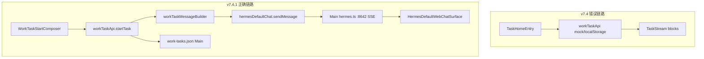

# v7.4.1 Work 工作台 Hotfix 实施计划

## 问题诊断（v7.4 与 PRD 偏差）

当前 [`pages/Tasks/`](src/renderer/src/screens/Hermes/pages/Tasks/) 实现与 [prd_work/v7.4.1_hotfix.md](prd_work/v7.4.1_hotfix.md) 核心原则冲突：

| 问题 | 现状 | PRD 要求 |
|------|------|----------|
| 会话底座 | 自建 `TaskStream` + `TaskComposer` + mock SSE | 复用 [`HermesDefaultWebChatSurface`](src/renderer/src/screens/Hermes/pages/Chat/HermesDefaultWebChatSurface.tsx) + `window.hermesDefaultChat` → 8642 |
| 任务绑定 | `WorkTask` 无 `sessionId`；[`workTaskApi`](src/renderer/src/screens/Hermes/api/workTaskApi.ts) 用 localStorage + mock 流 | `WorkTask.sessionId` 必填；首条消息走 Hermes Chat API |
| 导航 | primary 含 tasks/workbench/chat/expertRuns/artifacts | 仅 **任务 / 专家 / 专家团队** + 能力管理 + 高级设置 |
| 最近任务 | `MOCK_TASKS` / mock 卡片 | `hermesDefaultApi.sessions` + `work-tasks.json` metadata |
| UI | 原生 `<select>`（[`TeamSelector`](src/renderer/src/screens/Hermes/pages/Tasks/components/composer/TeamSelector.tsx) 等） | 统一 Popover/Dropdown；修复 i18n 乱码 |



---

## 架构决策（Hotfix 范围）

1. **不新建 `screens/Work/`** — 继续在 [`screens/Hermes/pages/Tasks/`](src/renderer/src/screens/Hermes/pages/Tasks/) 内改，最小改动止血
2. **任务窗口 = Hermes Chat 增强壳**，公式：`WorkTaskWindow = HermesDefaultWebChatSurface + WorkTaskContextBar + WorkTaskRightDock`
3. **保留 v7.4 stream-blocks 代码**但移出主聊天区（主区不再渲染）；v7.4.2 再迁入 RightDock TeamPanel
4. **废弃 Renderer localStorage 任务存储**；改 Main 写 `~/.hermes/desktop/work-tasks.json`
5. **`VITE_WORK_MOCK_MODE` 默认关闭**；开发环境可保留 mock 事件预览入口，不得作为默认发送路径

---

## Task 1：导航与信息架构收敛

**修改** [`constants.ts`](src/renderer/src/screens/Hermes/constants.ts)：

- primary 仅保留：`tasks`、`experts`、`expertTeams`
- 从 primary **移除或 `visible: false`**：`workbench`、`chat`、`expertRuns`、`artifacts`
- `sessions` 保留在 advanced（PRD 高级设置区）
- capability / advanced 分组保持，默认折叠行为沿用 `HermesSidebar` 现有逻辑

**修改** [`registry/hermes-pages.tsx`](src/renderer/src/screens/Hermes/registry/hermes-pages.tsx)：

- `chat` / `expertRuns` / `artifacts` / `workbench` 页面组件保留注册（回归验收），但导航不可达或仅 deep-link

**修改** [`HermesDefaultContext.tsx`](src/renderer/src/screens/Hermes/context/HermesDefaultContext.tsx)：

- 默认 `activeNavItem` 保持 `tasks`
- `navigateToExpertRun` 改为打开任务窗口 + 右 Dock（不再切 expertRuns 页）

**i18n**：核对 [`zh-CN/workspaces.ts`](src/shared/i18n/locales/zh-CN/workspaces.ts) / [`en/workspaces.ts`](src/shared/i18n/locales/en/workspaces.ts) 中 `nav.*` 与 `hermes.tasks.*` 编码；修复任何 `????` 来源（UTF-8 乱码行）

**验收**：左侧主导航 ≤3 个 primary 项；无「任务/对话」双入口割裂感

---

## Task 2：数据模型与 Main 持久化

**扩展** [`src/shared/work/work-task-contract.ts`](src/shared/work/work-task-contract.ts)：

```ts
// 关键新增字段（对齐 PRD §8）
sessionId: string;
profile: string;
source: "work_home" | "expert" | "team" | "web_operator" | "session_resume";
permissionMode: "default" | "confirm_each" | "auto_low_risk";
```

新增类型：`WorkTaskStartInput`、`WorkTaskStartResult`、`WorkTaskSessionBinding`、`WorkTasksJson`

**新建** Main 模块：

- [`src/main/work/work-task-store.ts`](src/main/work/work-task-store.ts) — 读写 `profileHome()` → `desktop/work-tasks.json`
- 扩展 [`work-ipc.ts`](src/main/work/work-ipc.ts)：
  - `work:task-start` — 创建 metadata + binding
  - `work:task-list` — 返回 tasks + bindings
  - `work:task-resume` — 按 taskId 取 sessionId
  - 移除/降级 `work:task-send` mock 占位为 no-op 或委托 Hermes（Renderer 不再依赖）

**Preload** [`work-api.ts`](src/preload/work-api.ts) + [`index.d.ts`](src/preload/index.d.ts)：暴露 `task.start` / `list` / `resume`

---

## Task 3：任务启动绑定 Hermes Session

**新建** [`workTaskMessageBuilder.ts`](src/renderer/src/screens/Hermes/api/workTaskMessageBuilder.ts)：

- 按 PRD §8.4 组装结构化首条 prompt（团队/专家/技能/应用/权限/上下文）

**重构** [`workTaskApi.ts`](src/renderer/src/screens/Hermes/api/workTaskApi.ts)：

```ts
export const workTaskApi = {
  async startTask(input: WorkTaskStartInput): Promise<WorkTaskStartResult> {
    // 1. buildFirstMessage(input)
    // 2. hermesProfileApi(default).chat.sendMessage({ session_id?, messages })
    // 3. window.work.task.start({ ...metadata, sessionId })  // Main 持久化
    // 4. return { taskId, sessionId, profile }
  },
  async resumeTask(taskId): Promise<...>,
  async listRecentTasks(): Promise<WorkTask[]>,  // sessions ⨝ metadata
};
```

**新建** [`useWorkTaskSessionBinding.ts`](src/renderer/src/screens/Hermes/hooks/useWorkTaskSessionBinding.ts)：

- 管理 `activeTaskId` ↔ `sessionId` ↔ `HermesDefaultContext.setActiveSessionId`

**发送行为**（[`TaskHomeEntry`](src/renderer/src/screens/Hermes/pages/Tasks/components/TaskHomeEntry.tsx)）：

1. `startTask` → 获得 `sessionId`
2. `setActiveSessionId(sessionId)`
3. 进入任务窗口（非 mock 状态机）

**验收**：Hermes `state.db` / 会话历史可见首条 `[Work 任务]` 结构化消息；刷新后可 `resumeTask`

---

## Task 4：任务窗口复用 Hermes Chat

**重构** [`TaskWindow.tsx`](src/renderer/src/screens/Hermes/pages/Tasks/components/TaskWindow.tsx)：

```text
TaskWindow
  ├─ WorkTaskHeader（标题 / sessionId / profile / 模型 / 状态）
  ├─ WorkTaskContextBar（团队/模式/技能/应用/权限 chips）
  ├─ HermesDefaultWebChatSurface（复用，绑定 activeSessionId）
  └─ WorkTaskRightDock（折叠，v7.4.1 简化版）
```

**删除主路径依赖**（不删文件，断开引用）：

- [`TaskConversationRegion`](src/renderer/src/screens/Hermes/pages/Tasks/components/TaskConversationRegion.tsx) 内的 `TaskStream` + 第二套 `TaskComposer`
- [`useWorkTaskStore`](src/renderer/src/screens/Hermes/features/task-store/useWorkTaskStore.tsx) 的 mock 事件 reducer 作为主聊天状态

**调整** [`useHermesDefaultWebChat`](src/renderer/src/screens/Hermes/pages/Chat/hooks/useHermesDefaultWebChat.ts)：

- 支持可选 `forcedSessionId` prop（任务窗口传入，不破坏独立 Chat 页）

**新建** [`WorkTaskContextBar.tsx`](src/renderer/src/screens/Hermes/pages/Tasks/components/WorkTaskContextBar.tsx) — 展示/编辑任务上下文 chips

**验收**：任务窗口仅 **一套** Hermes 输入框；保留搜索/模型/附件/新对话/清空/会话按钮/SSE/tool progress

---

## Task 5：任务首页与最近任务真实化

**重构首页** [`TaskHomeEntry.tsx`](src/renderer/src/screens/Hermes/pages/Tasks/components/TaskHomeEntry.tsx)：

- 顶部状态条：Gateway / Profile / 当前模型 / Expert MCP（复用 [`useHermesDefaultRuntime`](src/renderer/src/screens/Hermes/hooks/useHermesDefaultRuntime.ts) + workbench 健康卡片逻辑）
- 缩小 Hero 区域
- `TaskComposer` → `WorkTaskStartComposer`（Popover 选择器 + 附件按钮）

**选择器改造**（禁止原生 select）：

- [`TeamSelector`](src/renderer/src/screens/Hermes/pages/Tasks/components/composer/TeamSelector.tsx) → 读 `workApi.teams.list()`，Popover + 搜索
- [`ExpertSelector`](src/renderer/src/screens/Hermes/pages/Tasks/components/composer/ExpertSelector.tsx) → `workApi.experts`
- [`SkillSelector`](src/renderer/src/screens/Hermes/pages/Tasks/components/composer/SkillSelector.tsx) → `hermesDefaultApi.skills` / MCP tools 摘要
- [`PermissionSelector`](src/renderer/src/screens/Hermes/pages/Tasks/components/composer/PermissionSelector.tsx) → Popover 三档（对齐 PRD `confirm_each` / `auto_low_risk`）

**最近任务** [`RecentTaskCards.tsx`](src/renderer/src/screens/Hermes/pages/Tasks/components/RecentTaskCards.tsx)：

- 数据源：`workTaskApi.listRecentTasks()` = `hermesDefaultApi.sessions.list` LEFT JOIN `work-tasks.json`
- 点击：`resumeTask` → `setActiveSessionId` → 打开 TaskWindow

**移除**：`WorkTasksPage` 中 `buildSalesCombatMockEvents` 注入逻辑

---

## Task 6：样式修复与文档

**CSS** [`Hermes.css`](src/renderer/src/screens/Hermes/Hermes.css)：

- 任务首页紧凑布局；ContextBar chips；RightDock 折叠
- 统一 composer toolbar 对齐；去除大面积空白

**精简 store**：`features/task-store` 仅保留任务 metadata UI 状态（activeTask、rightDock tab），删除事件流 reducer 主路径

**文档同步**（007 rule）：

- [`docs/API_CONTRACTS.md`](docs/API_CONTRACTS.md) — `work:task-start/list/resume` 替换 mock send
- [`docs/renderer/screens/Hermes.md`](docs/renderer/screens/Hermes.md) — v7.4.1 架构说明
- [`AGENTS.md`](AGENTS.md) — 版本行 + Preload `window.work.task` 职责更新

**验证**：

```bash
npm run typecheck
npm run build
```

---

## 不改 / 延后

- **不改**：`Layout.tsx` / `HermesShell.tsx` 壳层逻辑；`hermes.ts` Gateway 核心；旧 Chat/ExpertRuns/Artifacts 页面源码（仅隐藏导航）
- **v7.4.2**：RightDock 完整 TeamPanel / DiagnosticsPanel；stream-blocks 迁入右侧
- **v7.5**：nodeskclaw Expert Team SSE；结构化 task payload 替代 prompt 注入

---

## 风险与注意

- `permissionMode` 枚举需与 shared 契约、i18n、UI 三处同步迁移（`confirm_sensitive` → `confirm_each`）
- 任务窗口嵌入 Chat 时须与 `HermesDefaultContext.activeSessionId` 同步，避免双 session 状态
- Main `work-tasks.json` 写入须走 `profileHome()` / `desktop/` 路径，禁止 Renderer 写盘
