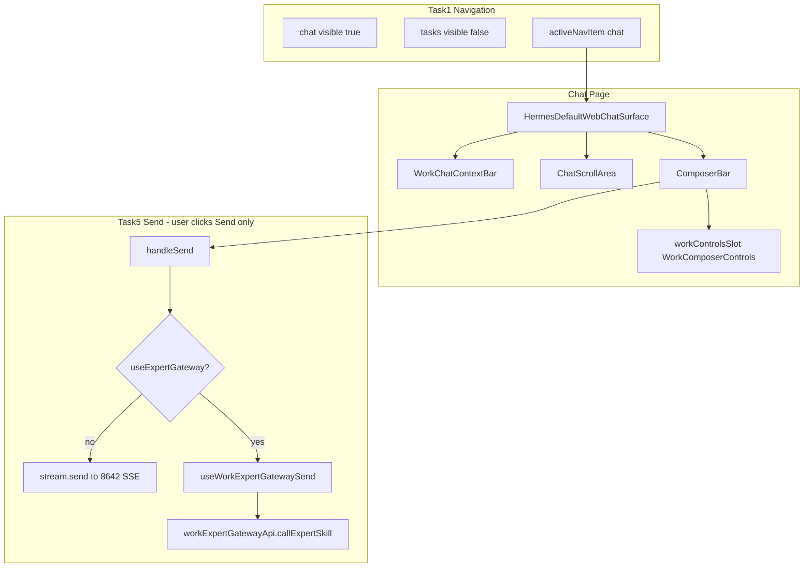

# v7.4.2 Chat-first Work Controls 实施计划

## 现状与 PRD 差距

v7.4.1 已实现但**与 v7.4.2 冲突**的部分：

| 区域 | 当前代码 | v7.4.2 要求 |
|------|----------|-------------|
| 导航 | [`constants.ts`](src/renderer/src/screens/Hermes/constants.ts)：`tasks` 可见、`chat` `visible: false` | `chat` 可见且排第一；`tasks` `visible: false` |
| 默认页 | [`HermesDefaultContext.tsx`](src/renderer/src/screens/Hermes/context/HermesDefaultContext.tsx)：`activeNavItem` 默认 `"tasks"` | 默认 `"chat"` |
| 主界面 | [`WorkTasksPage`](src/renderer/src/screens/Hermes/pages/Tasks/WorkTasksPage.tsx) + `TaskHomeEntry` / `WorkTaskStartComposer` 预调用 `startTask` → `hermesDefaultChat.sendMessage` | **不优化**；用户从 Chat 页直接对话 |
| 发送 | 任务页先发送再进 Chat | 仅在 Chat 原 Send 按钮触发；Expert 路径与 Hermes 路径二选一 |
| Work UI | 独立 `pages/Tasks/components/composer/*` | 迁入 `pages/Chat/components/work/*`，挂到 `ComposerBar` 插槽 |

v7.4.2 **明确不改** [`pages/Tasks/**`](src/renderer/src/screens/Hermes/pages/Tasks/)（仅导航隐藏）；**不重写** [`HermesDefaultWebChatSurface`](src/renderer/src/screens/Hermes/pages/Chat/HermesDefaultWebChatSurface.tsx) / [`useHermesDefaultChatStream`](src/renderer/src/screens/Hermes/pages/Chat/hooks/useHermesDefaultChatStream.ts) 整体，只做最小扩展。



---

## Task 1：恢复 Chat 主入口

**修改**

- [`constants.ts`](src/renderer/src/screens/Hermes/constants.ts)
  - `tasks`：`visible: false`
  - `chat`：移除 `visible: false`（或 `visible: true`），排在 primary 首位
  - `workbench` / `expertRuns` / `artifacts` 保持隐藏
- [`HermesDefaultContext.tsx`](src/renderer/src/screens/Hermes/context/HermesDefaultContext.tsx)
  - `readStorage(STORAGE_KEYS.activeNavItem, "chat")` 替换 `"tasks"`
  - `navigateToExpertRun`：改回 `setActiveNavItem("chat")`（不再跳转 tasks）
- [`hermes-pages.tsx`](src/renderer/src/screens/Hermes/registry/hermes-pages.tsx)：无需删 `TasksPage` 注册，靠 `visible: false` 过滤即可（`buildHermesPageDefinitions` 已支持）

**验收**：打开 Local Hermes → 默认 Chat；侧栏可见 Chat；原 Chat 可正常 `stream.send`。

---

## Task 2：ComposerBar Work 控件插槽

**修改**

- [`ComposerBar.tsx`](src/renderer/src/screens/Hermes/pages/Chat/ComposerBar.tsx)
  - 新增可选 prop：`workControlsSlot?: React.ReactNode`
  - 渲染位置：`textarea` 下方、`hermes-webchat-toolbar` 上方（与 PRD §11.3 一致）

**新增**

- [`pages/Chat/components/work/WorkComposerControls.tsx`](src/renderer/src/screens/Hermes/pages/Chat/components/work/WorkComposerControls.tsx)
  - 组合：`GatewayStatusBadge` + `ExpertSelector` + `ExpertSkillSelector` + `PermissionSelector` + Clear 按钮
  - **English literals only**（`const LABELS = { ... }`），禁止 `t(...)` 新文案

**修改**

- [`HermesDefaultWebChatSurface.tsx`](src/renderer/src/screens/Hermes/pages/Chat/HermesDefaultWebChatSurface.tsx)
  - 引入 `useWorkChatContext()`，将 `<WorkComposerControls />` 传入 `ComposerBar` 的 `workControlsSlot`
  - **不在** `forcedSessionId` / TaskWindow 场景重复一套控件（Task 页已隐藏；若 `hideActiveExpertBar` 为 true 可同时不渲染 Work 控件，避免任务遗留路径干扰）

**验收**：Chat 页 Composer 内出现 Expert / Skill / Permission；原 Send / Model / Attachment 不变。

---

## Task 3：WorkChatContextBar + 状态 Hook

**新增类型** — [`types/work-chat.ts`](src/renderer/src/screens/Hermes/types/work-chat.ts)

按 PRD §9.1 定义：`ExpertGatewayStatus`、`WorkPermissionMode`、`WorkChatSelectedExpert`、`WorkChatSelectedSkill`、`WorkChatContext`。

**新增 Hook** — [`hooks/useWorkChatContext.ts`](src/renderer/src/screens/Hermes/pages/Chat/hooks/useWorkChatContext.ts)

- 管理 `gatewayStatus` / `selectedExpert` / `selectedSkill` / `permissionMode`
- 派生：`useExpertGateway = selectedExpert && selectedSkill && gatewayStatus === "remote"`
- 提供：`setExpert`、`setSkill`、`setPermissionMode`、`clearContext`
- mount 时调用 `workExpertGatewayApi.getHealth()` 更新 gateway 状态

**新增组件** — [`WorkChatContextBar.tsx`](src/renderer/src/screens/Hermes/pages/Chat/components/work/WorkChatContextBar.tsx)

- 展示条件（PRD §8.2）：任一非默认即显示
- Chips：Gateway / Expert / Skill / Permission + Clear
- 点击 chip 打开对应 selector（复用同一 popover 组件或 ref 触发）

**修改** — `HermesDefaultWebChatSurface`：在 Search toolbar 与 `ChatScrollArea` 之间插入 `<WorkChatContextBar />`。

---

## Task 4：Expert Gateway API 与选择器

**新增 API** — [`api/workExpertGatewayApi.ts`](src/renderer/src/screens/Hermes/api/workExpertGatewayApi.ts)

薄封装层（**唯一**允许直接触达 `window.hermesExperts` 的 Renderer 模块）：

| 方法 | 底层复用 |
|------|----------|
| `getHealth()` | [`workApi.gateway.health()`](src/renderer/src/screens/Hermes/api/workApi.ts) → 映射为 `ExpertGatewayStatus` |
| `listAuthorizedExperts()` | `workApi.experts.list()` → 映射为 `WorkChatSelectedExpert` |
| `listExpertSkills(slug)` | `workApi.experts.listCatalogSkills(slug)` → 映射为 `WorkChatSelectedSkill` |
| `callExpertSkill(input)` | `workApi.experts.callCatalogSkill(...)` → 归一化为 `WorkExpertGatewayCallResult`（提取 `responseText` / error） |

**新增组件**（均只 import `workExpertGatewayApi`，禁止 `window.hermesExperts`）：

- [`GatewayStatusBadge.tsx`](src/renderer/src/screens/Hermes/pages/Chat/components/work/GatewayStatusBadge.tsx)
- [`ExpertSelector.tsx`](src/renderer/src/screens/Hermes/pages/Chat/components/work/ExpertSelector.tsx) — 加载/刷新/empty/error；选 expert 后 **清空 skill**
- [`ExpertSkillSelector.tsx`](src/renderer/src/screens/Hermes/pages/Chat/components/work/ExpertSkillSelector.tsx) — 依赖 `selectedExpert.slug`
- [`PermissionSelector.tsx`](src/renderer/src/screens/Hermes/pages/Chat/components/work/PermissionSelector.tsx) — `Default` / `Ask each time`

**UI 复用**：可参考 v7.4.1 的 [`ComposerPopoverSelect`](src/renderer/src/screens/Hermes/pages/Tasks/components/composer/ComposerPopoverSelect.tsx) 模式，但**复制到 Chat/work/** 或抽到 `components/work/ComposerPopoverSelect.tsx`，避免依赖 `pages/Tasks/**`（PRD §19.3 不修改 Tasks）。

---

## Task 5：发送链路增强（无预发送）

**最小扩展** — [`useHermesDefaultChatStream.ts`](src/renderer/src/screens/Hermes/pages/Chat/hooks/useHermesDefaultChatStream.ts)

新增并 export：

```ts
appendLocalMessage(message: { role: "user" | "assistant"; content: string }): void;
setExternalRunState(state: HermesChatRunState): void; // creating | streaming | completed | error | idle
```

- `appendLocalMessage`：复用现有 `newId()` + `setMessages` 逻辑（与 `send()` 内 user message 追加一致）
- **不**把 Expert Gateway 调用写进此 hook

**新增** — [`hooks/useWorkExpertGatewaySend.ts`](src/renderer/src/screens/Hermes/pages/Chat/hooks/useWorkExpertGatewaySend.ts)

`sendToExpertGateway({ text, attachmentIds, modelId, sessionId, profile })` 流程（PRD §15.4）：

1. 校验 expert + skill
2. `appendLocalMessage` user
3. `setExternalRunState("creating")`
4. `workExpertGatewayApi.callExpertSkill`
5. 成功 → `appendLocalMessage` assistant；失败 → assistant error 文本 + `setLastError` / StatusToast
6. `setExternalRunState("completed" | "error")`
7. 清空 composer text（与 Hermes send 成功后行为一致）

**修改** — `HermesDefaultWebChatSurface.handleSend`：

```ts
if (workContext.useExpertGateway) {
  void expertGatewaySend.sendToExpertGateway({ ... });
} else {
  void stream.send(...);
}
```

**禁止**：选择 expert/skill 时自动发送；`TaskHomeEntry` / `workTaskApi.startTask` 预发送路径保持不用（tasks 已隐藏）。

---

## Task 6：样式、English-only、文档与验收

**CSS** — [`Hermes.css`](src/renderer/src/screens/Hermes/Hermes.css)

- `.hermes-work-composer-controls`、`.hermes-work-chat-context-bar`、popover 样式
- 与现有 `.hermes-webchat-composer` 对齐间距

**语言规则**（PRD §20）

- 新增 Work 控件：**仅 English constants**
- **不**改 `src/shared/i18n/**`、不新增 i18n key
- 旧 Chat 组件现有 `t(...)` 可保留

**文档同步**（007 rule，增量）

- [`docs/API_CONTRACTS.md`](docs/API_CONTRACTS.md) — 补充 v7.4.2 Chat-first / Expert Gateway send 说明（非新 IPC）
- [`docs/renderer/screens/Hermes.md`](docs/renderer/screens/Hermes.md) — Chat + Work controls 架构
- [`AGENTS.md`](AGENTS.md) — 版本特性 v7.4.2 行；说明 `tasks` 非默认入口

**验证**

```bash
npm run typecheck
npm run build
```

---

## 关键约束清单

- Chat = 唯一主入口；`ComposerBar` = 唯一输入区
- 不新建第二套 Chat / Composer / TaskStream
- React 组件 **禁止** `window.hermesExperts`；经 `workExpertGatewayApi`
- Expert Gateway 结果 v7.4.2 **仅本地 UI 展示**，不强制写 `state.db`
- [`pages/Tasks/**`](src/renderer/src/screens/Hermes/pages/Tasks/) 源码保留、导航隐藏，不做功能继续优化

## 风险

- 用户 localStorage 中 `activeNavItem: "tasks"` 会在首次进入仍看到 tasks：可在 `HermesDefaultContext` 初始化时若读到 `tasks` 则迁移为 `chat`（一次性 fallback）
- `callCatalogSkill` 返回结构需对照 [`hermes-experts-contract`](src/shared/hermes-experts/hermes-experts-contract.ts) 做 response 文本提取；adapter 层集中处理
- `permissionMode: "ask_each_time"` 本版只透传 API，不做完整审批 UI
