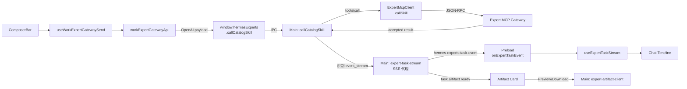

# v7.5: Expert Gateway v6.2 Stream Adapter 实施计划

## 现状分析

当前代码（v7.4.2）已有完整的 Expert MCP Gateway 调用链路：

- **Main Process**: `src/main/hermes-experts/expert-mcp-client.ts` 中 `ExpertMcpClient.callSkill()` 使用旧的 `{prompt, context}` 格式发送 JSON-RPC `tools/call`
- **Main Process**: `src/main/hermes-experts/expert-runtime.ts` 中 `callCatalogSkill()` 处理调用结果，假定同步返回 responseText
- **Preload**: `src/preload/hermes-experts-api.ts` 暴露 `callCatalogSkill` 等 IPC 方法
- **Renderer**: `workExpertGatewayApi.ts` 中 `resolveResponseText()` 已有 `event_stream` 识别占位（返回静态文案 "Streaming timeline will be available in v7.5."）
- **Renderer**: `useWorkExpertGatewaySend.ts` 仅处理同步返回路径

v7.5 需要将此链路升级为支持 OpenAI-compatible payload + event_stream SSE 异步模式。

## 核心改动链路

## 文件变更清单

### 新建文件 (7)

| 文件 | 层级 | 职责 |
|------|------|------|
| `src/shared/hermes-experts/expert-task-stream-contract.ts` | Shared | OpenAI payload、accepted result、task event、artifact 类型契约 |
| `src/main/hermes-experts/expert-task-stream.ts` | Main | SSE 代理：subscribe/unsubscribe，断线重连 3 次 |
| `src/main/hermes-experts/expert-artifact-client.ts` | Main | Artifact list/preview/download IPC handler |
| `src/renderer/src/screens/Hermes/pages/Chat/hooks/useExpertTaskStream.ts` | Renderer | 订阅 task event，维护 timeline 状态 |
| `src/renderer/src/screens/Hermes/pages/Chat/components/work/ExpertTaskTimelineBlock.tsx` | Renderer | Task timeline 可视化（accepted/started/progress/completed/failed） |
| `src/renderer/src/screens/Hermes/pages/Chat/components/work/ExpertTaskArtifactCard.tsx` | Renderer | Artifact 卡片（Preview / Download 按钮） |
| `src/renderer/src/screens/Hermes/pages/Chat/components/work/WorkExpertOutputPanel.tsx` | Renderer | 右侧 Artifact 预览面板 |

### 修改文件 (8)

| 文件 | 改动要点 |
|------|----------|
| `src/shared/hermes-experts/hermes-experts-contract.ts` | `CallCatalogSkillInput` 增加 `payload` 字段；`CallCatalogSkillResult` 增加 event_stream 字段 |
| `src/main/hermes-experts/expert-mcp-client.ts` | `callSkill` 方法支持 OpenAI-compatible arguments（当有 `payload` 时直接传入） |
| `src/main/hermes-experts/expert-runtime.ts` | `callCatalogSkill` 识别 event_stream accepted result，返回 taskId/eventSseUrl |
| `src/main/hermes-experts/hermes-experts-ipc.ts` | 注册 `subscribe-task-events`、`unsubscribe-task-events`、`list-task-artifacts`、`preview-artifact`、`download-artifact` IPC |
| `src/preload/hermes-experts-api.ts` | 新增 `subscribeExpertTaskEvents`、`unsubscribeExpertTaskEvents`、`onExpertTaskEvent`、`onExpertTaskStreamError`、`onExpertTaskStreamClosed`、artifact IPC 封装 |
| `src/preload/index.d.ts` | 补充新增 Preload 方法类型声明 |
| `src/renderer/src/screens/Hermes/api/workExpertGatewayApi.ts` | `callExpertSkill` 改为 OpenAI-compatible payload 模式；识别 event_stream 返回值 |
| `src/renderer/src/screens/Hermes/pages/Chat/hooks/useWorkExpertGatewaySend.ts` | 增加 event_stream 分支：append timeline block、调用 subscribeExpertTaskEvents |

### 样式补充

| 文件 | 改动要点 |
|------|----------|
| `src/renderer/src/screens/Hermes/Hermes.css` | 新增 timeline block、artifact card、output panel 样式 |

## 分阶段实施

### Task 1: Contract（共享类型）

在 `src/shared/hermes-experts/expert-task-stream-contract.ts` 定义：

- `OpenAICompatibleExpertPayload` — messages/model/stream/metadata
- `ExpertGatewayCallResult` = Accepted | Sync | Error（discriminated union）
- `ExpertTaskEvent` — 6 种事件类型
- `SubscribeExpertTaskEventsInput/Result`
- `ExpertArtifact`/`ExpertArtifactPreview`/`ExpertArtifactDownloadResult`
- `ExpertTaskStreamError`

修改 `hermes-experts-contract.ts`：
- `CallCatalogSkillInput` 增加 `payload?: OpenAICompatibleExpertPayload`
- `CallCatalogSkillResult` 增加 `taskId`/`eventSseUrl`/`artifactUrl`/`streaming`/`mode` 字段

### Task 2: OpenAI-compatible Payload（Renderer API + Main callSkill）

修改 `workExpertGatewayApi.ts`：
- `callExpertSkill` 构造 OpenAI-compatible messages payload
- 将 payload 传入 `callCatalogSkill` 的新 `payload` 字段
- `resolveResponseText` 改为返回 `ExpertGatewayCallResult` discriminated union

修改 `expert-mcp-client.ts`：
- `callSkill` 的 arguments 类型扩展为 `ExpertCallArguments | OpenAICompatibleExpertPayload`
- 当传入 payload 有 `messages` 字段时，直接用作 `params.arguments`

修改 `expert-runtime.ts`：
- `callCatalogSkill` 识别 `structuredContent` 中的 `taskId`/`eventSseUrl`/`streaming`
- 返回 `CallCatalogSkillResult` 中包含 event_stream 字段

### Task 3: Main SSE Proxy

新建 `src/main/hermes-experts/expert-task-stream.ts`：
- `subscribeExpertTaskEvents(input, webContents)` — 使用 Main token 连接 eventSseUrl
- SSE 解析（`data:` 行分割）
- normalize 事件类型到 `ExpertTaskEvent`
- 通过 `webContents.send("hermes-experts:task-event", event)` 推送
- 支持 `unsubscribeExpertTaskEvents(taskId)` 关闭连接
- 断线重连最多 3 次（2s/4s/8s 指数退避）
- 错误/关闭事件通过 `hermes-experts:task-stream-error` / `hermes-experts:task-stream-closed` 推送

### Task 4: Preload API + IPC 注册

修改 `hermes-experts-api.ts`：
- 新增 `subscribeExpertTaskEvents` → `ipcRenderer.invoke`
- 新增 `unsubscribeExpertTaskEvents` → `ipcRenderer.invoke`
- 新增 `onExpertTaskEvent` → `ipcRenderer.on` + 返回 unsubscribe
- 新增 `onExpertTaskStreamError` → `ipcRenderer.on` + 返回 unsubscribe
- 新增 `onExpertTaskStreamClosed` → `ipcRenderer.on` + 返回 unsubscribe
- 新增 `listExpertTaskArtifacts` / `previewExpertArtifact` / `downloadExpertArtifact`

修改 `hermes-experts-ipc.ts`：
- 注册 `hermes-experts:subscribe-task-events` / `hermes-experts:unsubscribe-task-events`
- 注册 `hermes-experts:list-task-artifacts` / `hermes-experts:preview-artifact` / `hermes-experts:download-artifact`

修改 `index.d.ts`：
- `HermesExpertsAPI` 接口补充新方法声明

### Task 5: Chat Hook

新建 `useExpertTaskStream.ts`：
- 订阅 `onExpertTaskEvent`
- 维护 `taskId -> events[]` 映射
- 提供 `startStream(taskId, eventSseUrl)` / `stopStream(taskId)`
- useEffect cleanup 调用 unsubscribe

修改 `useWorkExpertGatewaySend.ts`：
- 接收 `useExpertTaskStream` 返回的 helpers
- event_stream accepted result 时：append timeline block + 调用 `subscribeExpertTaskEvents`
- sync_result 时：保持原有逻辑

### Task 6: Timeline UI

新建 `ExpertTaskTimelineBlock.tsx`：
- 状态指示器（accepted / running / completed / failed）
- progress 消息列表
- completed 时显示 resultText
- failed 时显示错误信息

### Task 7: Artifact UI

新建 `ExpertTaskArtifactCard.tsx`：
- 显示 artifact name / mimeType
- Preview / Download 按钮

新建 `WorkExpertOutputPanel.tsx`：
- Artifact 列表
- 内嵌预览区（markdown/json/txt）

### Task 8: Validation

- `npm run typecheck`
- `npm run build`
- 普通 Chat 不受影响回归
- Expert Gateway event_stream 验收

## 禁止事项

- 不修改普通 Chat `send-message` IPC / `src/main/hermes.ts`
- 不修改 `expert-route-guard.ts`（已有的禁止字段检查保持不变）
- 不新增完整 Work TaskWindow / 第二套 Composer
- 不让 Renderer 直接请求 nodeskclaw / 持有 token
- 不新增中文 UI 文案、不新增 i18n key
