```mermaid
flowchart LR
  deployScript["deploy-copilot-serve.ps1"] --> clone["git clone ai-os-full"]
  clone --> portalSrc["runtime/portal/src"]
  portalSrc --> pnpmInstall["pnpm install"]
  pnpmInstall --> userEnv["Set User COPILOT_PORTAL_ROOT"]
  userEnv --> runtimeJson["merge desktop-runtime.json"]
  runtimeJson --> desktopApp["SMC Copilot 重启"]
  desktopApp --> aiosPaths["resolveEffectivePortalRoot"]
  aiosPaths --> startAiOs["aios:start spawn frontend"]
```

# ver5.3.4_hotfix — Portal 部署与 COPILOT_PORTAL_ROOT 读取优化

## 背景与根因

`aios:start` 在 [`src/main/aios/aios-runtime-supervisor.ts`](src/main/aios/aios-runtime-supervisor.ts) 调用 `isAiOsInstalled()`，要求 monorepo 根目录同时存在 `package.json`、`backend/`、`frontend/`。

当前已安装环境 `%LOCALAPPDATA%\Programs\SMC Copilot\runtime\portal\` 为空；企业安装流水线不 clone Portal。`COPILOT_PORTAL_ROOT` 虽可在用户环境或 `.env` 中设置，但存在两处读取缺陷：

1. [`src/main/runtime/runtime-paths.ts`](src/main/runtime/runtime-paths.ts) 的 `buildCopilotRuntimeEnv()` **无条件覆盖** `COPILOT_PORTAL_ROOT` 为 `paths.portalSourceRoot`（空目录），spawn 子进程时丢失用户设置。
2. `resolvePortalSourceRoot()` 仅做文件系统探测，**不读取** `process.env.COPILOT_PORTAL_ROOT` 与 `desktop-runtime.json` 中已持久化的路径。

Git 仓库已确认：`https://github.com/loudon84/ai-os-full.git`（本地目录名 `smc-coworker-full`）。

## 目标布局（用户选定：V5.3 标准）

```text
$INSTDIR/runtime/portal/
  src/                  ← git clone 目标（monorepo 根：package.json + backend/ + frontend/）
  node_modules/         ← pnpm install 产出
  .env.local            ← aios-config 生成
  logs/
```

用户级环境变量：

```text
COPILOT_PORTAL_ROOT=<绝对路径>\runtime\portal\src
COPILOT_PORTAL_RUNTIME_ROOT=<绝对路径>\runtime\portal
```



---

## 1. 扩展部署脚本

**文件：** [`build/scripts/deploy-copilot-serve.ps1`](build/scripts/deploy-copilot-serve.ps1)

在现有 copilot-serve 流程之后（或并行模块化函数），新增 Portal 段：

| 新增参数 | 默认值 |
|---|---|
| `$PortalRepoUrl` | `https://github.com/loudon84/ai-os-full.git` |
| `$PortalBranch` | `master`（与 serve 脚本一致） |
| `$SkipPortal` | `$false` |
| `$SkipServe` | `$false`（可选，便于只部署 Portal） |

**路径常量：**

- `$PortalRuntimeRoot = Join-Path $InstallRoot "runtime\portal"`
- `$PortalMonorepoRoot = Join-Path $PortalRuntimeRoot "src"`（clone 目标）

**复用现有基础设施：**

- `Write-DeployLog`、`Invoke-DeployNativeRetry`、`Test-Git` 等
- 新增 `Test-Node`（校验 Node 18+，推荐 24.x）、`Test-Pnpm`（或 `corepack enable` + `pnpm`）
- `Sync-PortalRepo`：逻辑同 `Sync-Repo`（`-Force` 时删目录重 clone；否则 shallow fetch + reset）
- clone 完成后校验 `package.json`、`backend/`、`frontend/` 存在，否则 fail fast

**依赖安装：**

```powershell
Push-Location $PortalMonorepoRoot
pnpm install   # 有 lockfile 时用 --frozen-lockfile
Pop-Location
```

**环境变量与持久化（对齐 serve 段 `Set-UserEnvVars`）：**

```powershell
[Environment]::SetEnvironmentVariable("COPILOT_PORTAL_ROOT", $PortalMonorepoRoot, "User")
[Environment]::SetEnvironmentVariable("COPILOT_PORTAL_RUNTIME_ROOT", $PortalRuntimeRoot, "User")
```

**写入 `desktop-runtime.json`**（通过脚本内 inline JSON merge，或调用 Node 小工具；优先 inline 读写 `$InstallRoot\runtime\desktop-runtime.json`）：

- `portalRuntimeRoot`、`portalSourceRoot` 设为上述路径

**日志与状态：**

- 扩展 deploy log 标题为 `deploy-runtime` 语义（保留原 log 文件名或改为 `deploy-runtime.log`，二选一，建议保留原文件名避免破坏现有运维脚本）
- `deploy-state.json` 增加 `portalRoot`、`portalBranch`、`portalStatus` 字段

**收尾：**

- `-RestartDesktop` 时重启桌面应用（已有逻辑复用），确保新 User wants 生效

---

## 2. 统一 Portal 根路径解析（Main 进程）

**新建或扩展：** [`src/main/aios/aios-paths.ts`](src/main/aios/aios-paths.ts)

导出单一入口 `resolveEffectivePortalMonorepoRoot(): string | null`，优先级：

1. `process.env.COPILOT_PORTAL_ROOT`（trim 后，通过 `isPortalMonorepoRoot` 校验）
2. [`desktop-runtime.json`](src/main/enterprise/desktop-runtime-config.ts) 的 `portalSourceRoot`（若 monorepo 有效）
3. 现有 `portalMonorepo
RootCandidates()` 文件系统探测顺序（保留 `runtime/ai-os-full` legacy fallback）

`loop 改造：**

- `resolvePortalMonorepoRoot()`、`isAiOsInstalled()`、`getAiOsPaths()` 均基于 `resolveEffectivePortalMonorepoRoot()`
- fallback 仍返回 `paths.portalSourceRoot`，但 `isAiOsInstalled()` 必须对 fallback 再校验 monorepo 结构

**[`src/main/runtime/runtime-paths.ts`](src/main/runtime/runtime-paths.ts) 改动：**

- `resolvePortalSourceRoot()` 优先返回 `resolveEffectivePortalMonorepoRoot()`（若 non-null）
- `buildCopilotRuntimeEnv()` 修正为：

```typescript
COPILOT_PORTAL_ROOT: base.COPILOT_PORTAL_ROOT?.trim()
  || resolveEffectivePortalMonorepoRoot()
  || paths.portalSourceRoot,
COPILOT_PORTAL_RUNTIME_ROOT: base.COPILOT_PORTAL_RUNTIME_ROOT?.trim() || paths.portalRuntimeRoot,
```

**[`src/main/aios/aios-runtime-supervisor.ts`](src/main/aios/aios-runtime-supervisor.ts)：**

- `startAiOs` 抛错改为可诊断消息，包含期望路径与 `COPILOT_PORTAL_ROOT` 当前值，error code 对齐 `AIOS_NOT_INSTALLED`

**[`src/main/enterprise/shim-manager.ts`](src/main/enterprise/shim-manager.ts)：**

- `updatePortalShim` 的 `cd /d` 与 `COPILOT_PORTAL_ROOT` 使用 `resolveEffectivePortalMonorepoRoot()`，与 Runtime 启动一致

**缓存刷新：**

- 部署后若桌面未重启，已有 [`refreshAllRuntimePathCaches()`](src/main/runtime/refresh-runtime-paths.ts) 在 migration/shim 时调用；`aios:start` 前若检测到 env 与 cache 不一致，调用 `clearPathCache()`（轻量 guard）

---

## 3. Portal Runtime UI / IPC 优化

**新增 IPC：** `aios:get-portal-info`（[`src/main/aios/aios-ipc.ts`](src/main/aios/aios-ipc.ts)）

返回类型（加到 [`src/shared/aios/aios-contract.ts`](src/shared/aios/aios-contract.ts)）：

```typescript
interface AiOsPortalInfo {
  installed: boolean;
  portalRoot: string | null;       // monorepo 根（effective）
  portalRuntimeRoot: string;
  envPortalRoot: string | null;    // process.env 原始值
  configPortalRoot: string | null; // desktop-runtime.json
}
```

**Preload：** [`src/preload/aios-api.ts`](src/preload/aios-api.ts) + [`src/preload/index.d.ts`](src/preload/index.d.ts) 暴露 `getPortalInfo()`

**UI：** [`src/renderer/src/screens/SettingsDrawer/server/PortalRuntimeSection.tsx`](src/renderer/src/screens/SettingsDrawer/server/PortalRuntimeSection.tsx)

- 展示 `portalRoot` 与 `installed` 状态
- 未安装时提示运行 deploy 脚本或设置 `COPILOT_PORTAL_ROOT`
- Doctor / Start 失败时显示 resolved path（不再只有裸 `Portal is not installed`）

**i18n：** [`src/shared/i18n/locales/en/portal.ts`](src/shared/i18n/locales/en/portal.ts) + zh-CN 补 key（`portalRootLabel`、`portalNotInstalledHint` 等）

---

## 4. 测试

| 文件 | 覆盖点 |
|---|---|
| 新建 `tests/aios-paths.test.ts` | `COPILOT_PORTAL_ROOT` 优先；无效 env 回退 filesystem；`isAiOsInstalled` true/false |
| 扩展 [`tests/runtime-paths.test.ts`](tests/runtime-paths.test.ts) | `buildCopilotRuntimeEnv` 保留 env；`resolvePortalSourceRoot` 读 env |

---

## 5. 文档同步（ver5.3.4_hotfix 收尾）

按 [`.agents/skills/sync-project-docs/SKILL.md`](.agents/skills/sync-project-docs/SKILL.md) 增量更新：

- [`AGENTS.md`](AGENTS.md) — V5.3.4 deploy 脚本能力、Portal 环境变量
- [`docs/API_CONTRACTS.md`](docs/API_CONTRACTS.md) — `aios:get-portal-info`
- [`docs/ARCHITECTURE.md`](docs/ARCHITECTURE.md) — Portal 部署路径与 env 优先级

---

## 验收清单

1. 运行 `deploy-copilot-serve.ps1`（不加 `-SkipPortal`）后，`runtime/portal/src` 含 `backend/`、`frontend/`、`package.json`
2. 用户环境变量 `COPILOT_PORTAL_ROOT` 指向 `...\runtime\portal\src`（绝对路径）
3. 重启 SMC Copilot，Settings → Portal Runtime 显示 installed + 路径
4. `aios:start` 不再报 `Portal is not installed`；frontend 进程在 monorepo 根目录 spawn `pnpm --filter @portal/web start`
5. `pnpm test` / `pnpm run typecheck` 通过

## 不在本次范围

- 将 serve 部署路径从 legacy `runtime/copilot-serve` 迁移到 V5.3 `runtime/serve/src`（独立 hotfix）
- 实现 preload 已声明但未注册的 `aios:install` IPC（可后续单独做）
