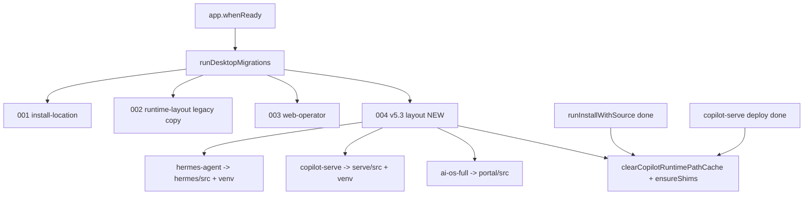

# ver5.3 Code Review 修复计划

## 背景

ver5.3 主任务（Task A–H）已完成，但 review 发现 14 项待修复。本计划**不重复**已完成的目录契约改造，仅针对 review 缺口做增量修复。

## 现状摘要

| 项 | 状态 |
|---|---|
| [`src/main/runtime/runtime-paths.ts`](src/main/runtime/runtime-paths.ts) | 已实现，但 **未纳入 Git**（`?? src/main/runtime/`） |
| 迁移框架 | [`migration-runner.ts`](src/main/migrations/migration-runner.ts) schema v3，[`index.ts:1350`](src/main/index.ts) 已调用 `runDesktopMigrations()` |
| v2 迁移 | [`legacy-hermes-migration.ts`](src/main/migrations/legacy-hermes-migration.ts) 复制目标为 `location.agentDir`（= `runtime/hermes`），**未拆分到 `src/` + `venv/`** |
| Serve/Portal 磁盘迁移 | **缺失** |
| Hermes legacy 解析 | [`aios-paths.ts`](src/main/aios/aios-paths.ts) 有 `ai-os-full` fallback；[`runtime-paths.ts`](src/main/runtime/runtime-paths.ts) **无** `hermes-agent` fallback |
| venv 创建 | [`installer.ts:561`](src/main/installer.ts)、[`python-venv-installer.ts:58`](src/main/enterprise/python-venv-installer.ts) 仍用 `python -m venv` |
| shim | [`shim-manager.ts:71-72`](src/main/enterprise/shim-manager.ts) 硬编码 8765；[`shim-manager.ts:92`](src/main/enterprise/shim-manager.ts) 用 `npm run start`（与 [`aios-process.ts`](src/main/aios/aios-process.ts) 的 `pnpm --filter` 不一致） |
| 路径缓存 | `clearCopilotRuntimePathCache()` / `clearPathCache()` 安装后**未调用** |
| 无关变更 | [`WorkspaceRightPanel.tsx`](src/renderer/src/screens/Workspaces/components/WorkspaceRightPanel.tsx) 删除了 Inspector 四 tab 切换 |



---

## Phase 1 — Critical（必须先做）

### C1：纳入 `runtime-paths.ts`

- `git add src/main/runtime/runtime-paths.ts`（确保整个 `src/main/runtime/` 目录被跟踪）
- 验收：`git ls-files src/main/runtime/` 有输出

### C2：v5.3 磁盘级迁移（schema v4）

**新增** [`src/main/migrations/004-v53-runtime-layout.ts`](src/main/migrations/004-v53-runtime-layout.ts)

在同一 `installDir/runtime/` 下执行**就地迁移**（目标已存在则 skip，写 `runtime/logs/migration.log`）：

| 旧路径 | 新路径 | 规则 |
|---|---|---|
| `runtime/hermes-agent/` | `runtime/hermes/src/` + `runtime/hermes/venv/` | 源码（pyproject.toml 等）→ `src/`；`venv`/`.venv` → `hermes/venv` |
| `runtime/copilot-serve/` | `runtime/serve/src/` + `runtime/serve/venv/` | 同上 |
| `runtime/ai-os-full/` | `runtime/portal/src/` | 整目录内容 → `portal/src`（保留 monorepo 根 `package.json`） |

**修复** [`legacy-hermes-migration.ts`](src/main/migrations/legacy-hermes-migration.ts)：
- 跨安装目录复制目标改为 `location.hermesSourceRoot`（非 `agentDir`）
- venv 单独复制到 `join(location might need separate handling)

**更新** [`migration-runner.ts`](src/main/migrations/migration-runner.ts)：
- `CURRENT_SCHEMA_VERSION = 4`
- schema `< 4` 时调用 `migrateV53RuntimeLayout(location)`

**迁移后**：
- `mergeRuntimeConfig(createDefaultRuntimeConfig())` 刷新 `desktop-runtime.json` 路径字段
- `clearCopilotRuntimePathCache()` + `clearPathCache()` + `ensureShims()`

### C3：还原无关 UI 变更

- **Revert** [`WorkspaceRightPanel.tsx`](src/renderer/src/screens/Workspaces/components/WorkspaceRightPanel.tsx) 到 HEAD：
  - 恢复 `RightPanelBody` + `useWorkspaces().activeRightTab` 四 tab 切换（workspace / skills / memory / runtime）
- 验收：Workspaces 右栏 tab 可切换，与 v5.3 安装改动无关

---

## Phase 2 — Medium

### M1：统一 venv 创建（`uv venv --python=3.12`）

**新增** [`src/main/enterprise/python-venv-creator.ts`](src/main/enterprise/python-venv-creator.ts)（或放在 `runtime/` 下）：

```typescript
createPythonVenv(venvDir: string, options?: { pythonVersion?: string }): VenvCreateResult
// 1. uv venv --python=3.12 <dir>
// 2. fallback: py -3.12 -m venv / python3.12 -m venv / python -m venv
```

**替换调用方**：
- [`installer.ts`](src/main/installer.ts) `runInstallWithSource` step 2
- [`python-venv-installer.ts`](src/main/enterprise/python-venv-installer.ts) `createOrReuseSharedVenv`

### M2：serve.cmd 动态端口

- [`shim-manager.ts`](src/main/enterprise/shim-manager.ts) `updateServeShim` 引入 `getCopilotServePort()`（来自 [`copilot-serve-paths.ts`](src/main/copilot-serve/copilot-serve-paths.ts)）
- `--port` 与 `COPILOT_SERVE_PORT` 环境变量均使用解析值

### M3：portal.cmd 与 aios-process 对齐

**抽取** [`src/main/utils/pnpm-resolver.ts`](src/main/utils/pnpm-resolver.ts)：`findPnpm()`（从 `aios-process.ts` 移出）

- [`aios-process.ts`](src/main/aios/aios-process.ts) 改为 import 共享 util
- [`shim-manager.ts`](src/main/enterprise/shim-manager.ts) `updatePortalShim` 写入解析到的 `pnpm` 路径 + `pnpm --filter @portal/web start`（与 Main Process spawn 一致）

### M4：Hermes legacy 路径 fallback

在 [`runtime-paths.ts`](src/main/runtime/runtime-paths.ts) `resolveCopilotRuntimePaths()` 中：

- 若 `runtime/hermes/src` 无 payload 但 `runtime/hermes-agent` 有 → 解析时 fallback 到 legacy 路径（仅读取，不移动；移动由 v4 迁移负责）
- 模式对齐 [`copilot-serve-paths.ts`](src/main/copilot-serve/copilot-serve-paths.ts) `legacyServeRoots()` 与 [`aios-paths.ts`](src/main/aios/aios-paths.ts) `resolvePortalMonorepoRoot()`

### M5 + M6：路径缓存失效

**新增** [`src/main/runtime/refresh-runtime-paths.ts`](src/main/runtime/refresh-runtime-paths.ts)：

```typescript
export function refreshAllRuntimePathCaches(): void {
  clearCopilotRuntimePathCache();
  clearPathCache(); // aios-paths
  invalidateInstallerPathCache(); // installer
}
```

**installer.ts 改造**（M6）：
- 移除模块顶层的 `const _resolved = resolveRuntimePaths()` 冻结导出
- 方案：内部全部改用 `resolveRuntimePaths()` 按需解析；对外保留 `HERMES_*` 导出改为 **getter 函数** 或 `getInstallerHermesPaths()`，并更新直接 import `HERMES_REPO` 等的消费方（预计 [`hermes-local-adapter.ts`](src/main/hermes-local-adapter.ts)、[`copilot-serve-paths.ts`](src/main/copilot-serve/copilot-serve-paths.ts)、[`hermes.ts`](src/main/hermes.ts) 等 ~5–8 处）

**调用 `refreshAllRuntimePathCaches()` 的时机**：
- [`installer.ts`](src/main/installer.ts) `runInstallWithSource` 末尾
- [`copilot-serve-deploy.ts`](src/main/copilot-serve/copilot-serve-deploy.ts) deploy 成功回调
- [`migration-runner.ts`](src/main/migrations/migration-runner.ts) v4 迁移完成后
- [`first-run-wizard.ts`](src/main/enterprise/first-run-wizard.ts) 若涉及路径刷新

---

## Phase 3 — Minor

### m1：文档澄清 legacy fallback

- 增量更新 [`AGENTS.md`](AGENTS.md) V5.3 段落：说明「新布局为 canonical；旧目录名仅作**读取 fallback + 一次性迁移**」
- 同步 [`docs/ARCHITECTURE.md`](docs/ARCHITECTURE.md) runtime 布局小节

### m2：清理 `normalizeRuntimeConfig` dead code

- [`desktop-runtime-config.ts`](src/main/enterprise/desktop-runtime-config.ts)：
  - 删除未使用的 `serveRuntimeRoot` 局部变量（L100）
  - 将 `endsWith("hermes-agent")` 改为更精确判断（如 `includes("hermes-agent")` 且非 `hermes/src` 路径，或正则 `/[/\\]hermes-agent[/\\]?$/`）

### m3：路径解析单测

**新增** [`tests/runtime-paths.test.ts`](tests/runtime-paths.test.ts)（Vitest + `vi.mock("fs")`）：

- 标准布局解析正确
- Hermes/Serve/Portal legacy fallback 生效
- `clearCopilotRuntimePathCache()` 后重新解析

### m4：runtime-bundle-manager 集成验证

- 手动/注释验收：`getDesktopAgentDir()` 返回 `runtime/hermes/src`，bundle 解压目标正确
- 若 [`runtime-bundle-manager.ts`](src/main/enterprise/runtime-bundle-manager.ts) 有直接硬编码旧路径，一并修正（调研时确认）

### m5：`buildCopilotRuntimeEnv` 用于 installer exec

- [`installer.ts`](src/main/installer.ts) 中 `execFile`/`execSync`/`spawn`（`runHermesDoctor`、`runHermesBackup` 等）的 `env` 改为 `buildCopilotRuntimeEnv({ ...process.env, PATH: getEnhancedPath(), ... })`

---

## 验收清单

```bash
npm run typecheck
npm test
git status  # runtime-paths.ts 已跟踪；WorkspaceRightPanel 无无关 diff
```

**功能验收**（Windows）：
1. 旧安装（含 `runtime/hermes-agent`）启动 App → v4 迁移日志写入 → 新目录存在且 Gateway 可启动
2. 全新安装 → `runtime/hermes/src` + `runtime/hermes/venv`，venv 优先由 uv 创建
3. `bin/serve.cmd` 端口与 Settings 中 `copilotServePort` 一致
4. `bin/portal.cmd` 使用 pnpm 启动
5. 同 session 安装完成后无需重启 App，Hermes 路径即生效
6. Workspaces 右栏四 tab 正常切换

---

## 文件变更预估

| 操作 | 文件 |
|---|---|
| 新增 | `004-v53-runtime-layout.ts`、`python-venv-creator.ts`、`pnpm-resolver.ts`、`refresh-runtime-paths.ts`、`tests/runtime-paths.test.ts` |
| 修改 | `migration-runner.ts`、`legacy-hermes-migration.ts`、`runtime-paths.ts`、`shim-manager.ts`、`installer.ts`、`python-venv-installer.ts`、`desktop-runtime-config.ts`、`aios-process.ts`、`copilot-serve-deploy.ts`、`first-run-wizard.ts` + ~5 处 HERMES_* 消费方 |
| Revert | `WorkspaceRightPanel.tsx` |
| Git add | `src/main/runtime/runtime-paths.ts` |
| 文档 | `AGENTS.md`、`docs/ARCHITECTURE.md`（m1） |

**不在本计划范围**：PRD Task D 完整 Portal Runtime 模块（`portal-runtime/*`）— 当前 review 仅要求 shim/process 对齐，不扩展新 IPC 模块。
