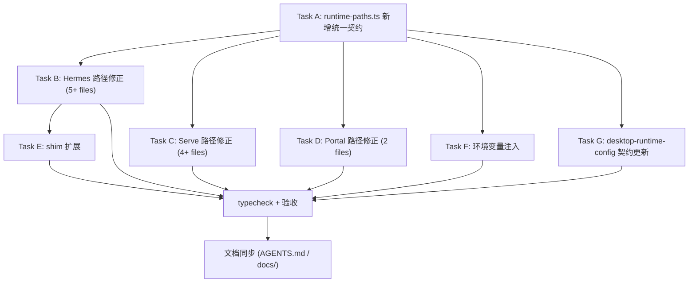

# ver5.3 安装与部署目录结构优化计划

## 核心变更

将 runtime 目录命名从旧风格统一为 ver5.3 标准：

| 旧路径 | 新路径 |
|---|---|
| `runtime/hermes-agent/` (源码+venv 混排) | `runtime/hermes/src/` + `runtime/hermes/venv/` |
| `runtime/copilot-serve/` (源码+.venv 混排) | `runtime/serve/src/` + `runtime/serve/venv/` |
| `runtime/ai-os-full/` | `runtime/portal/src/` |

## 变更影响分析

当前代码中硬编码了旧路径的**4 个核心解析模块 + 若干消费方**。需要按依赖层级从底向上修改。

---

## Task A: 统一 Runtime Path Contract

**新增** [`src/main/runtime/runtime-paths.ts`](src/main/runtime/runtime-paths.ts)

- 导出 `CopilotRuntimePaths` 接口（PRD 第 10 节 Task A），作为所有模块的统一路径契约
- 提供 `resolveCopilotRuntimePaths()` 函数，一次解析所有三个 runtime 的完整路径
- 路径逻辑：

```typescript
export interface CopilotRuntimePaths {
  installRoot: string;
  runtimeRoot: string;
  downloadsRoot: string;
  binDir: string;

  hermesRuntimeRoot: string;   // runtime/hermes
  hermesSourceRoot: string;    // runtime/hermes/src
  hermesVenv: string;          // runtime/hermes/venv
  hermesPython: string;        // runtime/hermes/venv/Scripts/python.exe
  hermesExe: string;           // runtime/hermes/venv/Scripts/hermes.exe

  serveRuntimeRoot: string;    // runtime/serve
  serveSourceRoot: string;     // runtime/serve/src
  serveVenv: string;           // runtime/serve/venv
  servePython: string;         // runtime/serve/venv/Scripts/python.exe

  portalRuntimeRoot: string;   // runtime/portal
  portalSourceRoot: string;    // runtime/portal/src
  portalNodeModules: string;   // runtime/portal/node_modules (或 src/node_modules)
}
```

---

## Task B: 修改 Hermes 路径（5 个文件）

### B1. [`src/main/enterprise/windows/install-location-resolver.ts`](src/main/enterprise/windows/install-location-resolver.ts)

- `DesktopInstallLocation.agentDir` 从 `join(installDir, "runtime", "hermes-agent")` 改为 `join(installDir, "runtime", "hermes")`
- `locationFromInstallDir()` 内 `agentDir` 修正

### B2. [`src/main/enterprise/windows/path-resolver.ts`](src/main/enterprise/windows/path-resolver.ts)

- `getDesktopAgentDir()` 返回值从 `loc.agentDir`（指向 `runtime/hermes-agent`）改为 `join(loc.runtimeRoot, "hermes")`
- `resolveRuntimePaths()` 内 `hermesRepo` 从 `getDesktopAgentDir()` 改为 `join(hermesRuntime, "src")`，`hermesVenv` 从 `join(hermesRepo, "venv")` 改为 `join(hermesRuntime, "venv")`（hermesRuntime = `runtime/hermes`）
- `getEnhancedPathWin32()` 内 `loc.agentDir` 相关路径对齐新结构

### B3. [`src/main/enterprise/hermes-agent-source-installer.ts`](src/main/enterprise/hermes-agent-source-installer.ts)

- `installHermesAgentFromUserSource()` 安装目标从 `getDesktopAgentDir()` → `runtime/hermes` 改为 → `runtime/hermes/src`
- git clone / zip 解压的 targetPath 使用 `runtime/hermes/src`
- `hasProjectFiles()` 检查路径对齐

### B4. [`src/main/enterprise/shim-manager.ts`](src/main/enterprise/shim-manager.ts)

- `updateHermesShim()` 和 `ensureShims()` 内 `loc.agentDir` 改为新路径
- hermes.cmd shim 中 venv 路径从 `runtime/hermes-agent/venv/Scripts/hermes.exe` 改为 `runtime/hermes/venv/Scripts/hermes.exe`
- 按 PRD 第 5.3 节扩展 hermes.cmd 内容，增加环境变量设置

### B5. [`src/main/installer.ts`](src/main/installer.ts)

- `runInstallWithSource()` 内 `getDesktopAgentDir()` 调用和 venv 创建路径从 `agentDir/venv` 改为 `runtime/hermes/venv`
- 源码安装目标从 `agentDir` 改为 `runtime/hermes/src`

### B6. 其他 Hermes 路径消费方（约 8 个文件需检查/更新）

- `src/main/enterprise/runtime-state-resolver.ts` — `agentPath` 和 `venvExists` 检测路径
- `src/main/enterprise/python-venv-installer.ts` — venv 创建目标路径
- `src/main/enterprise/runtime-bundle-manager.ts` — bundle 解压目标路径
- `src/main/enterprise/desktop-runtime-config.ts` — `createDefaultRuntimeConfig()` 中 `agentDir`
- `src/main/enterprise/enterprise-installer.ts` — 安装流水线中的路径
- `src/main/hermes-local-adapter.ts` — Gateway spawn 时的 hermes 路径
- `src/main/hermes.ts` — Gateway 启停中引用的路径
- `src/main/profiles.ts` — Profile 与 hermes-agent 的交互路径

---

## Task C: 修改 Serve 路径（4 个文件）

### C1. [`src/main/copilot-serve/copilot-serve-paths.ts`](src/main/copilot-serve/copilot-serve-paths.ts)

- `resolveCopilotServeRoot()` 查找路径从 `runtime/copilot-serve` 改为 `runtime/serve/src`
- `resolveCopilotServeRuntimeDir()` 兜底路径对齐
- `resolvePythonExecutable()` venv 路径从 `serveRoot/.venv/Scripts/python.exe` 改为 `runtime/serve/venv/Scripts/python.exe`
- `applyCopilotServeEnvFromDisk()` venv 候选路径对齐

### C2. [`src/main/copilot-serve/copilot-serve-process.ts`](src/main/copilot-serve/copilot-serve-process.ts)

- `resolvePythonExecutable()` 中 `.venv` 候选路径改为 `runtime/serve/venv`

### C3. [`src/main/copilot-serve/copilot-serve-preflight.ts`](src/main/copilot-serve/copilot-serve-preflight.ts)

- 预检路径对齐

### C4. [`src/main/copilot-serve/copilot-serve-deploy.ts`](src/main/copilot-serve/copilot-serve-deploy.ts)

- 部署脚本路径、venv 创建路径对齐

### C5. [`src/main/enterprise/desktop-runtime-config.ts`](src/main/enterprise/desktop-runtime-config.ts)

- `createDefaultRuntimeConfig()` 中 `copilotServeDir` 从 `runtime/copilot-serve` 改为 `runtime/serve/src`

---

## Task D: 修改 Portal/AiOs 路径（2 个核心文件）

### D1. [`src/main/aios/aios-paths.ts`](src/main/aios/aios-paths.ts)

- `aiosRoot` 从 `join(runtimeRoot, "ai-os-full")` 改为 `join(runtimeRoot, "portal", "src")`（或 `portal`，视 monorepo 结构而定）
- `backendDir` / `frontendDir` 子路径保持 `backend` / `frontend`
- `isAiOsInstalled()` 检测路径对齐

### D2. [`src/main/aios/aios-process.ts`](src/main/aios/aios-process.ts)

- `spawnBackend()` / `spawnFrontend()` 中 cwd 使用新路径

---

## Task E: shim 扩展（bin/ 目录）

按 PRD 第 4 节扩展 shim-manager：

- 新增 `serve.cmd` shim（启动 copilot-serve）
- 新增 `portal.cmd` shim（启动 portal）
- 更新 `hermes.cmd` shim 内容（增加环境变量如 PRD 5.3 节）

---

## Task F: 环境变量注入

按 PRD 第 3 节，在进程 spawn 时注入标准化环境变量：

- `COPILOT_INSTALL_ROOT` / `COPILOT_RUNTIME_ROOT` / `COPILOT_DOWNLOADS_ROOT`
- `HERMES_RUNTIME_ROOT` / `HERMES_SOURCE_ROOT` / `HERMES_VENV` / `HERMES_PYTHON`
- `COPILOT_SERVE_RUNTIME_ROOT` / `COPILOT_SERVE_ROOT` / `COPILOT_SERVE_VENV` / `COPILOT_SERVE_PYTHON`
- `COPILOT_PORTAL_RUNTIME_ROOT` / `COPILOT_PORTAL_ROOT`

---

## Task G: desktop-runtime-config.ts 契约更新

- `DesktopRuntimeConfig` interface 新增字段：`hermesRuntimeRoot` / `hermesSourceRoot` / `serveRuntimeRoot` / `serveSourceRoot` / `portalRuntimeRoot` / `portalSourceRoot`
- `createDefaultRuntimeConfig()` 使用新路径
- 保持向后兼容：读取旧 config 时，缺失的新字段自动填充默认值

---

## 执行顺序



## 验收标准

- `npm run typecheck` 通过
- 所有路径引用不再包含 `hermes-agent`、`copilot-serve`（作为目录名）、`ai-os-full`
- 新路径结构符合 PRD 第 11 节标准目录
- shim 文件（`hermes.cmd` / `serve.cmd` / `portal.cmd`）内容正确
- `DesktopRuntimeConfig` 向后兼容旧配置文件
- 文档同步完成
