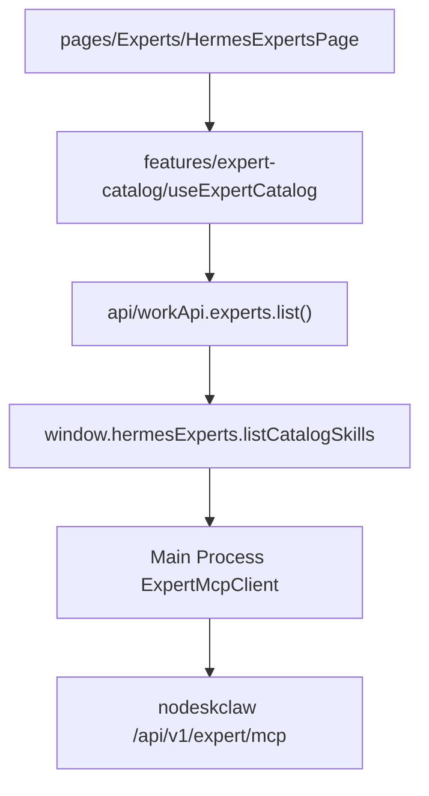

# v1.3 Work 产品线化与 AI Coding 工程结构优化

## 命名约定（必读）

| 层级 | 名称 | 说明 |
|------|------|------|
| **产品** | **SMC Copilot** | 对外产品名不变；**不**改名为 WorkBuddy |
| **UX 参考** | WorkBuddy（腾讯） | 仅交互/流程参考；文档中可写「WorkBuddy 式」；**禁止**作为代码标识符或对外品牌 |
| **Work 域** | Work / 工作台 | 原「本地 Hermes」产品概念收敛为 **Work 专家工作台** |
| **代码 Screen** | `screens/Hermes/` | 目录与 workspace id `local-hermes` **暂不改名**，降低重构风险 |
| **Renderer API 封装** | `workApi.ts` | 语义层；内部仍调 `window.hermesExperts` |
| **Preload 全局对象** | v1.3 **不新增** `window.work` | 与 PRD 方案 A 一致；若 v1.4+ 再评估 `window.work` |

**变量 / 文件命名对照（实施时统一）：**

| 旧计划名（勿用） | 正确名 |
|------------------|--------|
| `workbuddyApi` / `workbuddyApi.ts` | `workApi` / `api/workApi.ts` |
| `window.workbuddy` | v1.3 不新增；未来若加则为 `window.work` |
| `WorkBuddyExpert` 等 | `WorkExpert`、`WorkRun`、`WorkArtifact`、`WorkError` |
| `docs/specs/v1.3-workbuddy-product-line/` | `docs/specs/work-product/` |
| `.cursor/rules/workbuddy-product-line.mdc` | `.cursor/rules/work-product.mdc` |
| 「WorkBuddy 专家工作台」 | **「Work 专家工作台」** |

---

## 现状分析

当前 `screens/Hermes/` 结构已有基础骨架：

- `registry/hermes-pages.tsx` — 15 个 lazy 页面的 flat 映射
- `panels/HermesShell.tsx` — 三栏布局（sidebar + center + right panel）
- `components/HermesSidebar.tsx` — 基于 `HERMES_NAV_ITEMS` 的扁平导航（无分组）
- `constants.ts` — `HermesNavItemKey` 类型 + nav items 数组 + layout 常量
- `context/HermesDefaultContext.tsx` — 全量 Context（nav/session/panel/runtime/models/skills...）

**核心问题**：15 个导航项扁平排列，业务用户难以聚焦主流程；无 feature-sliced 分层；pages 直接调用 `window.*` API。

## 设计决策（采用 PRD 推荐默认 + 命名修正）

- **产品身份**：SMC Copilot 不变；Work 域仅指「专家工作台」能力模块
- **DECISION-001**：顶部 Tab「本地 Hermes」改名为 **「Work 专家工作台」**（仅 i18n，内部 id `local-hermes` 不变）
- **DECISION-002**：高级设置保留在左侧折叠区（v1.3 不迁入 Settings Drawer）
- **DECISION-004**：v1.3 **不新增** `window.work`；Renderer 通过 `api/workApi.ts` 语义封装 `window.hermesExperts`

## Phase 1: Page Registry 升级 + Shell 导航分组

**目标**：左侧导航从扁平列表升级为三段分组（主流程 / 能力管理 / 高级设置），支持折叠。

### 修改文件

- [`src/renderer/src/screens/Hermes/constants.ts`](src/renderer/src/screens/Hermes/constants.ts)
  - 新增 `HermesPageSection` 类型：`"primary" | "capability" | "advanced"`
  - 给每个 nav item 添加 `section` 字段
  - 新增 `LayoutDashboard` icon 到 workbench（已有）
  - 新增 `FileBox` icon 到 artifacts

- [`src/renderer/src/screens/Hermes/registry/hermes-pages.tsx`](src/renderer/src/screens/Hermes/registry/hermes-pages.tsx)
  - 导出 `HermesPageDefinition` 接口（含 key/label/icon/section/visible/requiresGateway）
  - 将 flat Record 改为带元数据的 registry 数组
  - 保持 lazy component 映射

- [`src/renderer/src/screens/Hermes/components/HermesSidebar.tsx`](src/renderer/src/screens/Hermes/components/HermesSidebar.tsx)
  - 按 `section` 分组渲染
  - `capability` 和 `advanced` 组默认折叠，带展开/折叠 toggle
  - 分组标题用 i18n key

### 新增文件

- `src/renderer/src/screens/Hermes/model/page.ts` — `HermesPageSection`、`HermesPageDefinition` 类型定义

### i18n 变更

- `src/shared/i18n/locales/en/workspaces.ts` + `zh-CN/workspaces.ts`
  - 新增分组标题 key：`workspaces.nav.section.primary`、`.capability`、`.advanced`
  - workspace-registry 中 `local-hermes` 的 label 改为 **「Work 专家工作台」**（en 可用 `Work Expert Workspace`）

## Phase 2: Domain Model + API Client 抽象

**目标**：建立统一的 Renderer 域模型与 API 封装层，pages 不再直接调用 `window.hermesExperts`。

### 新增文件

- `src/renderer/src/screens/Hermes/model/expert.ts` — `WorkExpert`、`WorkExpertSkill` 接口
- `src/renderer/src/screens/Hermes/model/expert-team.ts` — `WorkExpertTeam`、`WorkTeamMember`
- `src/renderer/src/screens/Hermes/model/run.ts` — `WorkRun`、`ExpertRunStatus`
- `src/renderer/src/screens/Hermes/model/artifact.ts` — `WorkArtifact`
- `src/renderer/src/screens/Hermes/model/error.ts` — `WorkErrorCode`、`WorkError`
- `src/renderer/src/screens/Hermes/api/workApi.ts` — 统一 API 客户端（仅调用 `window.hermesExperts`）

### API Client 结构

```typescript
export const workApi = {
  gateway: { health(), diagnostics() },
  experts: { list(), get(id), listCatalogSkills(slug), summon(input) },
  teams: { list(), get(id), summon(input) },
  runs: { list(), get(id), getResult(id), getTimeline(id) },
  artifacts: { listByRun(runId), preview(id), download(id) },
};
```

### 约束

- `workApi` 内部只调用 `window.hermesExperts` / `window.hermesAPI`
- 返回值转换为 `model/` 中定义的 `Work*` 域类型
- 不引入新状态库，继续使用 React Context + hooks
- v1.3 **不**暴露 `window.work` Preload 对象

## Phase 3: AI Coding Spec Pack + Rules（工程基建）

### 新增文件

- `docs/specs/work-product/00-overview.md` — Work 域总体概述（产品仍为 SMC Copilot）
- `.cursor/rules/work-product.mdc` — Work 模块约束规则

### `.cursor/rules/work-product.mdc` 内容要点

```
- 产品名：SMC Copilot；screens/Hermes 承载 Work 专家工作台（非 WorkBuddy 品牌）
- WorkBuddy 仅作 UX 参考，禁止写入产品名、appId、对外文案
- pages → feature hooks → api/workApi.ts → window.hermesExperts / window.hermesAPI
- 禁止 pages 直接调用 window.hermesExperts
- 禁止 components 直接调 API
- 禁止 Renderer fetch nodeskclaw 或持有 token
```

## 数据流（优化后）



## 不改范围

- 不改 MainPage / WorkspaceOutlet / workspace-registry 的路由逻辑
- 不改 Main Process / Preload 层（`hermes-experts-api.ts` 已稳定；v1.3 不新增 `window.work`）
- 不改 `HermesShell` 三栏 grid 布局结构（仅改 sidebar 分组）
- 不引入新全局状态库
- 不删除任何现有页面入口
- **不**将产品或仓库改名为 WorkBuddy

## 验收标准

- TypeScript typecheck 通过（`npm run typecheck`）
- 导航按三段分组显示，高级区默认折叠
- 所有 15 个页面仍可访问
- 专家召唤流程不受影响（`callCatalogSkill` 链路不变）
- 顶栏 Tab 文案显示为 **「Work 专家工作台」**
- 代码与文档中无 `workbuddy` / `WorkBuddy` 作为标识符（UX 参考说明除外）
