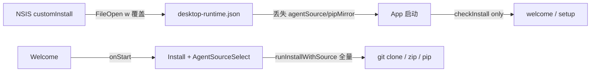
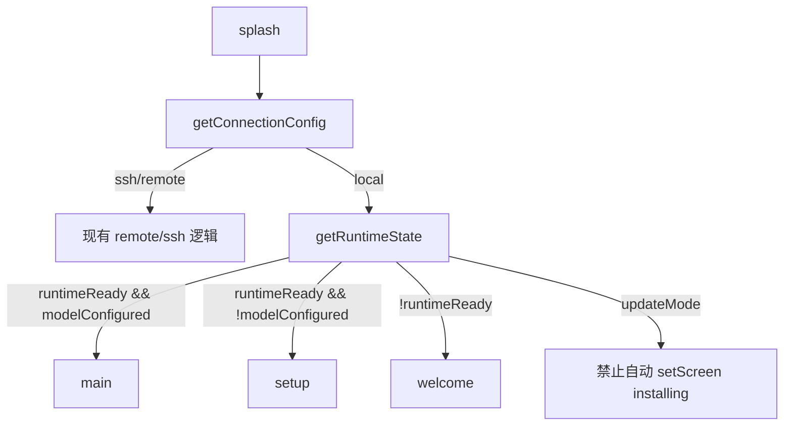
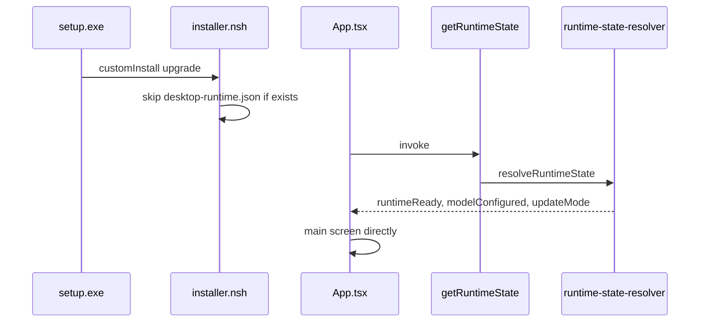

# Hermes Desktop 更新安装幂等化

## 现状与根因

当前升级后仍可能进入 Welcome/Install/Setup 的主因有三处：



| 问题点 | 当前行为 | 目标 |
|--------|----------|------|
| [build/installer.nsh](build/installer.nsh) L108-120 | 每次 `customInstall` 用 `w` **整文件覆盖** `desktop-runtime.json` | 文件已存在则跳过（PRD §5.8 B.4） |
| [src/renderer/src/App.tsx](src/renderer/src/App.tsx) L58-65 | `checkInstall()`：`installed` = venv 二进制存在；`hasApiKey` = model 配置 | 优先 `getRuntimeState()`，区分 `runtimeReady` / `modelConfigured` / `updateMode` |
| [src/main/installer.ts](src/main/installer.ts) L566+ | `runInstallWithSource` **始终** clone/解压 + pip | `runtimeReady` 时仅 `ensureShims` + `mergeRuntimeConfig` |
| [src/main/enterprise/enterprise-installer.ts](src/main/enterprise/enterprise-installer.ts) L74-78 | 仅检查 `install-marker` | 检查完整 `runtimeReady`（agent + venv + CLI） |

已有可复用能力：

- [src/main/migrations/001-install-location.ts](src/main/migrations/001-install-location.ts) 的 **merge** 模式（保留 `agentSource`/`pipMirror`）→ 提炼为 `mergeRuntimeConfig`
- [src/main/enterprise/first-run-wizard.ts](src/main/enterprise/first-run-wizard.ts) `DETECT_AGENT` 已在 agent 存在时 `stage=completed`（L84-90）
- [provisionDefaultHermesHome](src/main/enterprise/enterprise-config-provisioner.ts) 已对 `config.yaml`/`.env` 做 **exists 才写**（满足硬约束）
- `enterprise:update` 已只做 venv/pip + shim，不 clone（L255-272）

---

## Phase 1：NSIS Upgrade Guard

**文件：** [build/installer.nsh](build/installer.nsh)

1. **`preInit` 末尾**（解析完 `ExistingInstallDir` 后）增加：

```nsis
StrCpy $INSTDIR "$ExistingInstallDir"
```

确保升级安装向导默认目录为旧 `InstallLocation`（当前仅写 registry，未显式设 `$INSTDIR`）。

2. **`customInstall` 中 `desktop-runtime.json` 改为条件写入：**

```nsis
IfFileExists "$INSTDIR\runtime\desktop-runtime.json" +3 0
  FileOpen $2 "$INSTDIR\runtime\desktop-runtime.json" w
  ; ... 现有 hybrid identity JSON ...
  FileClose $2
```

3. **保持不变：** `CreateDirectory` 树、`hermes-agent` 不 `RMDir`、`AddToPathSafe`、registry、shim、`RunRuntimePrecheck`、`~/.hermes` 不触碰。

**验收：** 覆盖安装后 `desktop-runtime.json` 中 `agentSource`/`pipMirror` 仍在；`runtime/hermes-agent` 目录仍在。

---

## Phase 2：RuntimeStateResolver（核心）

**新增类型：** [src/shared/enterprise/runtime-state-contract.ts](src/shared/enterprise/runtime-state-contract.ts)

```ts
export interface RuntimeState {
  installDir: string;
  agentPath: string;
  agentSourceExists: boolean;
  venvExists: boolean;
  hermesCliExists: boolean;
  modelConfigured: boolean;
  runtimeReady: boolean;       // agent + venv + cli
  needsAgentInstall: boolean;  // !runtimeReady
  needsModelSetup: boolean;    // local 且 !modelConfigured
  updateMode: boolean;         // 见下
}
```

**新增模块：** [src/main/enterprise/runtime-state-resolver.ts](src/main/enterprise/runtime-state-resolver.ts)

| 字段 | 判定逻辑 |
|------|----------|
| `agentSourceExists` | `resolveInstallLocation().agentDir` 存在且含 `pyproject.toml` 或 `setup.py`（与现有 `detectAgentInstallation` 一致） |
| `venvExists` | `existsSync(join(agentDir, "venv"))` |
| `hermesCliExists` | `existsSync(resolveRuntimePaths().hermesScript)` |
| `modelConfigured` | **复用** [checkInstallStatus](src/main/installer.ts) 中 `hasApiKey` 逻辑（提取为 `isModelConfigured()` 共享函数，避免漂移） |
| `runtimeReady` | `agentSourceExists && venvExists && hermesCliExists` |
| `updateMode` | `desktop-runtime.json` 已存在 **且**（注册表 `PreviousVersion` 非空 **或** `desktop-runtime-state.json` 的 `previousAppVersion` 与当前 app 版本不同 **或** `existsInstallMarker()`） |

导出：`resolveRuntimeState(): RuntimeState`

**单测：** [tests/runtime-state-resolver.test.ts](tests/runtime-state-resolver.test.ts)（mock `fs`/`resolveInstallLocation`）

---

## Phase 3：IPC `enterprise:get-runtime-state`

**修改：**

- [src/main/enterprise/enterprise-installer.ts](src/main/enterprise/enterprise-installer.ts) — 注册 `ipcMain.handle("enterprise:get-runtime-state", () => resolveRuntimeState())`
- [src/preload/index.ts](src/preload/index.ts) — `getRuntimeState: () => ipcRenderer.invoke("enterprise:get-runtime-state")`
- [src/preload/index.d.ts](src/preload/index.d.ts) — 类型引用 `RuntimeState`
- [docs/API_CONTRACTS.md](docs/API_CONTRACTS.md) — 登记新 channel（按 AGENTS.md checklist）

可选：`check-install` handler 内部改为返回 `resolveRuntimeState()` 映射后的兼容字段，或保持双 API（推荐保持 `checkInstall` 不变，仅 App 改用新 API）。

---

## Phase 4：First Run Wizard 幂等化

**文件：** [src/main/enterprise/first-run-wizard.ts](src/main/enterprise/first-run-wizard.ts)

- `detectAgentInstallation()` → 委托 `resolveRuntimeState().agentSourceExists`
- `DETECT_AGENT` handler：`installed` 时 `stage: "completed"`、`agentPath` 填 `loc.agentDir`；**不进入** `select-source`
- `START_INSTALL`：开头若 `runtimeReady && !force` 则直接返回 `{ success: true, skipped: true }`（防止误触全量安装）

---

## Phase 5：App 启动路由

**文件：** [src/renderer/src/App.tsx](src/renderer/src/App.tsx) — `runInstallCheck`



具体改动：

1. local 分支优先 `await window.hermesAPI.getRuntimeState()`
2. 路由：`runtimeReady && modelConfigured` → `main`；`runtimeReady && !modelConfigured` → `setup`；否则 → `welcome`
3. **`updateMode` 下**：绝不自动 `setScreen("installing")`；`Welcome.onStart` 行为不变（用户显式点才装）
4. 背景 `verifyInstall()`：当 `runtimeState.runtimeReady` 为 true 时，失败**不**强制跳回 welcome（避免升级后误报）；仍可对 `!runtimeReady` 保持现有严格行为

---

## Phase 6：Runtime Install 幂等化

**文件：** [src/main/enterprise/desktop-runtime-config.ts](src/main/enterprise/desktop-runtime-config.ts)

新增 `mergeRuntimeConfig(partial: Partial<DesktopRuntimeConfig>): DesktopRuntimeConfig`：
- 读取现有 JSON → spread merge → 原子写入（与 migration 001 同模式）
- **不覆盖**已有 `agentSource`/`pipMirror`/`hermesHome`，仅补全路径/hybrid 字段

**文件：** [src/main/installer.ts](src/main/installer.ts) — `runInstallWithSource`

```ts
export async function runInstallWithSource(
  sourceConfig: unknown,
  onProgress: ...,
  _parentWindow?: ...,
  options?: { force?: boolean },
): Promise<void> {
  const state = resolveRuntimeState();
  if (!options?.force && state.runtimeReady) {
    ensureShims();
    mergeRuntimeConfig(createDefaultRuntimeConfig(...)); // 仅补路径
    onProgress({ step: 4, totalSteps: 4, title: "已就绪", ... });
    return;
  }
  // 现有 4 步全量安装...
}
```

**IPC：** `start-install-with-source` 增加可选第二参数 `{ force?: boolean }`（仅 `enterprise:reinstall-runtime` / 显式 UI 传 `force: true` 时走全量）。

---

## Phase 7：Enterprise Install Guard

**文件：** [src/main/enterprise/enterprise-installer.ts](src/main/enterprise/enterprise-installer.ts)

`executeEnterpriseInstallPipeline` 开头：

```ts
const state = resolveRuntimeState();
if (!input?.force && state.runtimeReady) {
  ensureShims();
  mergeRuntimeConfig(createDefaultRuntimeConfig());
  onProgress(..., "运行时已就绪，跳过安装");
  return { ok: true, marker: readInstallMarker() ?? undefined };
}
```

- 保留 `enterprise:reinstall-runtime` → `{ force: true }`（全量 pipeline）
- `enterprise:update`：保持现有「venv + pip + shim」，**不**调用 `installHermesAgentSource`
- `enterprise:repair` level≥2 含 agent 重装：文档/UI 已要求显式操作；代码层可在 level≥2 前检查 `input?.force` 或单独 repair 选项（本 PR 不扩 UI，仅保证默认 pipeline 不触发）

---

## 数据流（目标态）



---

## 文件变更清单

| 操作 | 路径 |
|------|------|
| 改 | `build/installer.nsh` |
| 新 | `src/shared/enterprise/runtime-state-contract.ts` |
| 新 | `src/main/enterprise/runtime-state-resolver.ts` |
| 新 | `tests/runtime-state-resolver.test.ts` |
| 改 | `src/main/enterprise/desktop-runtime-config.ts` |
| 改 | `src/main/enterprise/enterprise-installer.ts` |
| 改 | `src/main/enterprise/first-run-wizard.ts` |
| 改 | `src/main/installer.ts` |
| 改 | `src/renderer/src/App.tsx` |
| 改 | `src/preload/index.ts`, `src/preload/index.d.ts` |
| 改 | `docs/API_CONTRACTS.md` |

**不改动：** Renderer 技术栈、NSIS 内 Git/ZIP、用户 `~/.hermes` 下已有配置文件内容。

---

## 验收与回归

**构建：**

```bash
pnpm typecheck
pnpm build
pnpm package:win
```

**Windows 手动回归（用户场景 1-10）：**

1. 全新安装 → First Run / Install 选源 → Setup 配 model
2. 关闭 App → 运行新版 `setup.exe`
3. 安装目录默认为旧 `InstallLocation`
4. 启动后直达 **main**（无 Agent 来源选择、无 model setup）
5. `hermes --version` 可用；`~/.hermes/config.yaml` / `.env` / `auth.json` provider/model/base_url 不变
6. `runtime/hermes-agent` 目录仍在；`desktop-runtime.json` 中 `agentSource` 保留

**自动化：** `tests/runtime-state-resolver.test.ts` + 现有 `preload-api-surface.test.ts` 补充 `getRuntimeState` 断言。
