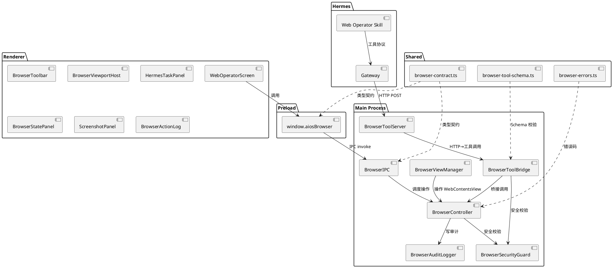

# Web Operator 模块技术设计文档

# **1. 实现模型**

## **1.1 上下文视图**

### 进程边界与职责划分

Web Operator 严格遵循 hermes-desktop 既有的三层进程隔离模型，所有浏览器操作仅在 Main Process 执行：

```
┌─────────────────────────────────────────────────────────────────┐
│                   Renderer Process (React 19)                   │
│  WebOperatorScreen → BrowserToolbar / HermesTaskPanel / ...    │
│  调用: window.aiosBrowser.*                                     │
│  禁止: Node.js / ipcRenderer / executeJavaScript                │
└────────────────────────┬────────────────────────────────────────┘
                         │ ipcRenderer.invoke("browser.*")
┌────────────────────────┴────────────────────────────────────────┐
│                 Preload Bridge (contextBridge)                   │
│  src/preload/browser-api.ts                                     │
│  暴露: window.aiosBrowser                                       │
│  禁止: 暴露原始 ipcRenderer                                      │
└────────────────────────┬────────────────────────────────────────┘
                         │ IPC (ipcMain.handle)
┌────────────────────────┴────────────────────────────────────────┐
│                  Main Process (Node.js)                          │
│  browser-view-manager.ts → WebContentsView 生命周期              │
│  browser-controller.ts  → 导航 / DOM 交互 / 截图 / 状态提取      │
│  browser-security.ts    → 域名白名单 / 敏感动作 / 密码字段拦截    │
│  browser-audit.ts       → JSONL 审计日志写入                     │
│  browser-ipc.ts         → IPC handler 注册                       │
│  browser-tool-bridge.ts → Hermes 工具调用 → Controller 桥接      │
│  browser-tool-server.ts → 127.0.0.1:8765 HTTP 工具服务器          │
└────────────────────────┬────────────────────────────────────────┘
                         │ HTTP POST /tools/browser.*
┌────────────────────────┴────────────────────────────────────────┐
│              Hermes Gateway (Python Backend)                     │
│  现有 chat streaming 通道 + Web Operator Skill                   │
│  禁止: 直接访问 Electron API                                     │
└─────────────────────────────────────────────────────────────────┘
```

### 数据流总览

```
用户手工操作路径:
  BrowserToolbar → window.aiosBrowser.open() → IPC "browser.open"
    → BrowserIPC → BrowserSecurityGuard(校验) → BrowserController(执行)
    → BrowserViewManager(操作 WebContentsView) → BrowserAuditLogger(记录)

Hermes AI 操作路径:
  Hermes Skill → HTTP POST /tools/browser.click
    → BrowserToolServer(接收) → BrowserToolBridge(桥接)
    → BrowserSecurityGuard(校验) → BrowserController(执行)
    → BrowserAuditLogger(记录, source=hermes)

敏感动作确认路径:
  BrowserSecurityGuard(识别敏感动作) → 返回 UNSAFE_ACTION_REQUIRES_CONFIRMATION
    → IPC 推送 pendingAction 至 Renderer → HermesTaskPanel(展示待确认操作)
    → 用户确认/拒绝 → IPC "browser.confirm_action" / "browser.reject_action"
    → BrowserController(执行/取消) → BrowserAuditLogger(记录 confirmed/rejected)
```

## **1.2 服务/组件总体架构**

### 架构图



### 模块依赖关系

```
browser-view-manager ──→ browser-controller
browser-controller   ──→ browser-security, browser-audit
browser-ipc          ──→ browser-controller
browser-tool-bridge  ──→ browser-controller, browser-security, browser-audit
browser-tool-server  ──→ browser-tool-bridge
browser-api (preload)──→ browser-contract (shared)
```

## **1.3 实现设计文档**

### 1.3.1 BrowserViewManager

**文件**: `src/main/browser/browser-view-manager.ts`

**职责**: WebContentsView 的创建、销毁、bounds 同步和生命周期管理。

```typescript
class BrowserViewManager {
  private view: WebContentsView | null;
  private readonly PARTITION = "persist:aios-external-web";
  private mainWindow: BrowserWindow;
  private boundsCallback: ((bounds: { x: number; y: number; width: number; height: number }) => void) | null;

  constructor(mainWindow: BrowserWindow);

  /** 创建 WebContentsView（单例），设置独立 partition，加载 URL */
  createView(url: string): Promise<void>;

  /** 在已有视图上导航至新 URL */
  navigate(url: string): Promise<void>;

  /** 销毁 WebContentsView，释放资源 */
  destroyView(): void;

  /** 同步 WebContentsView 的 bounds 与 Renderer 占位区域 */
  updateBounds(bounds: { x: number; y: number; width: number; height: number }): void;

  /** 获取外部 WebContentsView 的 webContents 实例 */
  getExternalWebContents(): Electron.WebContents | null;

  /** 视图是否已创建且可用 */
  isReady(): boolean;

  /** 注册 bounds 变更回调，用于 Renderer 占位区域通知 */
  onBoundsUpdate(callback: (bounds: BrowserViewBounds) => void): void;
}
```

**关键算法**:
- **单例模式**: `createView` 检查 `this.view` 是否存在，若存在则调用 `navigate` 复用
- **Partition 隔离**: 创建 `WebContentsView` 时通过 `session.fromPartition(this.PARTITION)` 设置独立会话
- **Bounds 同步**: Renderer 通过 IPC 发送占位区域坐标，`updateBounds` 将其映射为 WebContentsView 的 `setBounds` 调用
- **窗口 resize 监听**: 监听 `mainWindow` 的 `resize` 事件，触发 bounds 重新计算

### 1.3.2 BrowserController

**文件**: `src/main/browser/browser-controller.ts`

**职责**: 执行浏览器操作指令，是所有浏览器动作的统一入口。

```typescript
class BrowserController {
  private viewManager: BrowserViewManager;
  private securityGuard: BrowserSecurityGuard;
  private auditLogger: BrowserAuditLogger;
  private pendingActions: Map<string, PendingSensitiveAction>;

  constructor(viewManager: BrowserViewManager, securityGuard: BrowserSecurityGuard, auditLogger: BrowserAuditLogger);

  /** 打开外部 URL */
  openExternalUrl(request: BrowserOpenRequest): Promise<BrowserOpenResult>;

  /** 浏览器后退 */
  goBack(source: BrowserActionSource): Promise<BrowserActionResult>;

  /** 浏览器前进 */
  goForward(source: BrowserActionSource): Promise<BrowserActionResult>;

  /** 刷新当前页面 */
  reload(source: BrowserActionSource): Promise<BrowserActionResult>;

  /** 获取当前页面状态（title/url/inputs/buttons/links） */
  getPageState(source: BrowserActionSource): Promise<BrowserStateResult>;

  /** 截取当前页面截图 */
  captureScreenshot(source: BrowserActionSource): Promise<BrowserScreenshotResult>;

  /** 点击指定选择器元素 */
  clickSelector(request: BrowserClickRequest): Promise<BrowserActionResult>;

  /** 在指定选择器元素中输入文本 */
  typeIntoSelector(request: BrowserTypeRequest): Promise<BrowserActionResult>;

  /** 提取指定选择器下的表格数据 */
  extractTable(selector: string, source: BrowserActionSource): Promise<BrowserActionResult>;

  /** 确认挂起的敏感动作 */
  confirmAction(pendingActionId: string): Promise<BrowserActionResult>;

  /** 拒绝挂起的敏感动作 */
  rejectAction(pendingActionId: string): Promise<BrowserActionResult>;

  /** 获取审计日志 */
  getAuditLog(limit?: number): Promise<BrowserAuditRecord[]>;
}
```

**关键算法**:
- **操作前安全校验**: 每个操作方法先调用 `securityGuard` 对应校验方法
- **页面状态提取**: 通过 `webContents.executeJavaScript` 注入固定脚本提取 DOM 元素信息，禁止注入任意代码
- **敏感动作挂起**: 若 `securityGuard.isSensitiveAction()` 返回 true，生成 `pendingActionId`，存入 `pendingActions` Map，设置 5 分钟超时计时器
- **JS 注入白名单**: 仅允许 `__get_page_state__`、`__click_selector__`、`__type_selector__`、`__extract_table__` 四个固定脚本名

### 1.3.3 BrowserSecurityGuard

**文件**: `src/main/browser/browser-security.ts`

**职责**: 域名白名单校验、敏感动作识别、密码字段拦截。

```typescript
class BrowserSecurityGuard {
  private allowedDomains: string[];
  private configPath: string;
  private sensitiveKeywords: Set<string>;

  constructor(configPath: string);

  /** 加载域名白名单配置 */
  loadConfig(): Promise<void>;

  /** 校验 URL 域名是否在白名单中 */
  isDomainAllowed(url: string): boolean;

  /** 校验操作是否涉及密码字段 */
  isPasswordField(selector: string): boolean;

  /** 识别操作是否为敏感动作（基于元素语义） */
  isSensitiveAction(selector: string, elementInfo?: BrowserElementSummary): boolean;

  /** 综合校验，返回校验结果或错误码 */
  validateAction(request: BrowserActionRequest): BrowserSecurityCheckResult;

  /** 获取当前白名单配置 */
  getAllowedDomains(): string[];

  /** 重新加载配置（热更新） */
  reloadConfig(): Promise<void>;
}
```

**关键算法**:
- **域名匹配**: 支持精确匹配和通配符匹配（`*.example.com`），使用 `minimatch` 或手写 glob 匹配
- **敏感动作识别**: 基于元素选择器中的语义关键词（submit/approve/reject/delete/remove/payment/transfer/archive/publish/send），同时检查 `data-action`、`aria-label`、按钮文本
- **密码字段检测**: 检查选择器是否包含 `type=password` 或 `name*=password`
- **配置缺失降级**: 若 `web-operator.config.json` 不存在或格式错误，使用空白名单（所有请求均被拒绝）

**敏感关键词列表**:
```typescript
const SENSITIVE_ACTION_KEYWORDS = new Set([
  "submit", "approve", "reject", "delete", "remove",
  "payment", "transfer", "archive", "publish", "send"
]);
```

### 1.3.4 BrowserAuditLogger

**文件**: `src/main/browser/browser-audit.ts`

**职责**: 以 JSONL 格式追加写入审计日志，按日期轮转。

```typescript
class BrowserAuditLogger {
  private logDir: string;
  private currentDate: string;
  private writeStream: fs.WriteStream | null;

  constructor(logDir: string);

  /** 记录一条审计记录 */
  log(record: Omit<BrowserAuditRecord, "id" | "time">): Promise<BrowserAuditRecord>;

  /** 查询审计记录，支持 limit 限制 */
  query(limit?: number): Promise<BrowserAuditRecord[]>;

  /** 关闭写入流 */
  close(): void;

  /** 获取当前日志文件路径 */
  getCurrentLogPath(): string;
}
```

**关键算法**:
- **JSONL 追加写入**: 每条记录序列化为单行 JSON 后追加写入文件
- **日期轮转**: 每次写入前检查当前日期，若跨天则关闭旧流、创建新流
- **文本脱敏**: 对 `browser.type` 操作，`argsSummary` 中仅记录 `{ textLength: number }` 而非实际输入文本
- **UUID 生成**: 使用 `crypto.randomUUID()` 生成记录 ID
- **profileHome 路由**: 日志目录通过 `profileHome(profile?)` 计算，默认 `~/.hermes/desktop/web-operator/audit/`

### 1.3.5 BrowserIPC

**文件**: `src/main/browser/browser-ipc.ts`

**职责**: 注册所有 `browser.*` IPC handler，作为 Renderer 请求的入口。

```typescript
class BrowserIPC {
  private controller: BrowserController;

  constructor(controller: BrowserController);

  /** 注册所有 browser.* IPC handler */
  register(): void;

  /** 注销所有 handler（应用退出时） */
  unregister(): void;
}
```

**注册的 IPC Channel**:

| Channel | 请求类型 | 返回类型 | 说明 |
|---------|---------|---------|------|
| `browser.open` | `BrowserOpenRequest` | `BrowserOpenResult` | 打开 URL |
| `browser.back` | `{ source: BrowserActionSource }` | `BrowserActionResult` | 后退 |
| `browser.forward` | `{ source: BrowserActionSource }` | `BrowserActionResult` | 前进 |
| `browser.reload` | `{ source: BrowserActionSource }` | `BrowserActionResult` | 刷新 |
| `browser.get_state` | `{ source: BrowserActionSource }` | `BrowserStateResult` | 获取页面状态 |
| `browser.screenshot` | `{ source: BrowserActionSource }` | `BrowserScreenshotResult` | 截图 |
| `browser.click` | `BrowserClickRequest` | `BrowserActionResult` | 点击元素 |
| `browser.type` | `BrowserTypeRequest` | `BrowserActionResult` | 输入文本 |
| `browser.extract_table` | `{ selector: string; source: BrowserActionSource }` | `BrowserActionResult` | 提取表格 |
| `browser.get_audit_log` | `{ limit?: number }` | `BrowserAuditRecord[]` | 获取审计日志 |
| `browser.confirm_action` | `{ pendingActionId: string }` | `BrowserActionResult` | 确认敏感动作 |
| `browser.reject_action` | `{ pendingActionId: string }` | `BrowserActionResult` | 拒绝敏感动作 |
| `browser.update_bounds` | `BrowserViewBounds` | `void` | 更新视口位置 |
| `browser.on_pending_action` | (push event) | `PendingSensitiveAction` | 推送待确认操作 |

### 1.3.6 BrowserToolBridge

**文件**: `src/main/browser/browser-tool-bridge.ts`

**职责**: 将 Hermes 的 HTTP 工具调用请求转换为 BrowserController 方法调用。

```typescript
class BrowserToolBridge {
  private controller: BrowserController;
  private securityGuard: BrowserSecurityGuard;

  constructor(controller: BrowserController, securityGuard: BrowserSecurityGuard);

  /** 处理工具调用请求 */
  handleToolCall(toolName: string, params: Record<string, unknown>): Promise<BrowserActionResult>;

  /** 获取所有工具的 Schema 列表（供 Hermes 发现） */
  getToolSchemas(): BrowserToolSchema[];
}
```

**工具名到方法映射**:

| 工具名 | Controller 方法 | 备注 |
|--------|----------------|------|
| `browser.open` | `openExternalUrl` | source 强制 "hermes" |
| `browser.back` | `goBack` | |
| `browser.forward` | `goForward` | |
| `browser.reload` | `reload` | |
| `browser.get_state` | `getPageState` | |
| `browser.screenshot` | `captureScreenshot` | |
| `browser.click` | `clickSelector` | |
| `browser.type` | `typeIntoSelector` | |
| `browser.extract_table` | `extractTable` | |

### 1.3.7 BrowserToolServer

**文件**: `src/main/browser/browser-tool-server.ts`

**职责**: 在 `127.0.0.1:8765` 启动本地 HTTP 服务器，接收 Hermes 工具调用。

```typescript
class BrowserToolServer {
  private toolBridge: BrowserToolBridge;
  private server: http.Server | null;
  private port: number;
  private readonly BASE_PORT = 8765;
  private readonly MAX_PORT = 8775;

  constructor(toolBridge: BrowserToolBridge);

  /** 启动 HTTP 服务器，端口冲突时自动递增 */
  start(): Promise<number>;

  /** 停止 HTTP 服务器 */
  stop(): Promise<void>;

  /** 获取当前监听端口 */
  getPort(): number;

  /** 获取服务器是否运行中 */
  isRunning(): boolean;
}
```

**关键算法**:
- **端口递增**: 从 8765 开始尝试，若 `EADDRINUSE` 则尝试 8766，最多到 8775
- **仅绑定 127.0.0.1**: 禁止 `0.0.0.0`，确保不暴露到局域网
- **请求路由**: `POST /tools/:toolName` → `toolBridge.handleToolCall(toolName, body)`
- **GET /tools**: 返回 `toolBridge.getToolSchemas()` 的 JSON Schema 列表
- **超时控制**: 每个 HTTP 请求设置 30 秒超时
- **并发支持**: 使用 Node.js 原生 http 模块，天然支持 10+ 并发

### 1.3.8 Renderer 组件设计

**目录**: `src/renderer/src/screens/WebOperator/`

#### WebOperatorScreen

**文件**: `WebOperatorScreen.tsx`

**职责**: Web Operator 主界面容器，三栏布局编排。

```typescript
interface WebOperatorScreenProps {
  // 无需外部 props，通过内部 hooks 管理状态
}

const WebOperatorScreen: React.FC<WebOperatorScreenProps> = () => {
  // 三栏布局:
  // 左 (w-80): HermesTaskPanel
  // 中 (flex-1): BrowserToolbar + BrowserViewportHost
  // 右 (w-80): BrowserStatePanel + ScreenshotPanel + BrowserActionLog
};
```

**布局结构**:
```tsx
<div className="flex h-full">
  {/* 左栏 - Hermes 任务面板 */}
  <aside className="w-80 border-r flex flex-col">
    <HermesTaskPanel />
  </aside>

  {/* 中栏 - 浏览器视口 */}
  <main className="flex-1 flex flex-col">
    <BrowserToolbar onNavigate={handleNavigate} />
    <BrowserViewportHost className="flex-1" onBoundsUpdate={handleBoundsUpdate} />
  </main>

  {/* 右栏 - 状态/截图/日志 */}
  <aside className="w-80 border-l flex flex-col">
    <BrowserStatePanel />
    <ScreenshotPanel />
    <BrowserActionLog />
  </aside>
</div>
```

#### BrowserToolbar

**文件**: `BrowserToolbar.tsx`

```typescript
interface BrowserToolbarProps {
  onNavigate: (url: string) => void;
}

interface BrowserToolbarState {
  url: string;
  isAllowed: boolean;
  canGoBack: boolean;
  canGoForward: boolean;
}
```

**功能**: URL 输入框（回车触发导航）、后退/前进/刷新按钮、白名单状态指示灯

#### BrowserViewportHost

**文件**: `BrowserViewportHost.tsx`

```typescript
interface BrowserViewportHostProps {
  className?: string;
  onBoundsUpdate: (bounds: BrowserViewBounds) => void;
}
```

**功能**: 占位 `<div>` 容器，通过 `ResizeObserver` 监听尺寸变化，通过 IPC 通知 Main Process 更新 WebContentsView bounds

#### HermesTaskPanel

**文件**: `HermesTaskPanel.tsx`

```typescript
interface HermesTaskPanelState {
  taskInput: string;
  pendingActions: PendingSensitiveAction[];
  isProcessing: boolean;
}
```

**功能**: 任务输入区域、Hermes 操作计划展示、待确认敏感动作列表（含确认/拒绝按钮）

#### BrowserStatePanel

**文件**: `BrowserStatePanel.tsx`

```typescript
interface BrowserStatePanelState {
  title: string;
  url: string;
  inputs: BrowserElementSummary[];
  buttons: BrowserElementSummary[];
  links: { text: string; href: string; selectorHint?: string }[];
  isLoading: boolean;
}
```

**功能**: 展示当前页面的 title/URL/inputs/buttons/links 结构化信息

#### ScreenshotPanel

**文件**: `ScreenshotPanel.tsx`

```typescript
interface ScreenshotPanelState {
  base64: string | null;
  isCapturing: boolean;
  persistEnabled: boolean;
}
```

**功能**: 截图预览展示（base64 PNG）、截图按钮、持久化开关

#### BrowserActionLog

**文件**: `BrowserActionLog.tsx`

```typescript
interface BrowserActionLogState {
  records: BrowserAuditRecord[];
  filterSource: "all" | "user" | "hermes";
  filterStatus: "all" | "success" | "failed" | "confirmed" | "rejected";
}
```

**功能**: 审计日志列表（最近 100 条）、按 source/status 过滤、实时追加

### 1.3.9 状态管理方案

Renderer 侧不引入额外全局状态库（项目未使用 Zustand/Redux），采用以下方案：

1. **组件内 useState**: 单组件内部状态（如 URL 输入框值）
2. **Props 传递**: 父组件 WebOperatorScreen 管理跨组件共享状态，通过 props 下发
3. **自定义 Hooks**: 封装 `window.aiosBrowser` 调用逻辑
   - `useBrowserState()`: 管理页面状态（调用 `getState` + 轮询/事件订阅）
   - `useBrowserActions()`: 封装所有浏览器操作方法
   - `useAuditLog()`: 管理审计日志数据和过滤
   - `usePendingActions()`: 管理敏感动作确认/拒绝

**自定义 Hook 示例**:
```typescript
function useBrowserState() {
  const [state, setState] = useState<BrowserPageState | null>(null);
  const [isLoading, setIsLoading] = useState(false);

  const refresh = useCallback(async () => {
    setIsLoading(true);
    const result = await window.aiosBrowser.getState();
    if (result.ok && result.state) setState(result.state);
    setIsLoading(false);
  }, []);

  return { state, isLoading, refresh };
}
```

---

# **2. 接口设计**

## **2.1 总体设计**

### IPC 通信模式

- **请求-响应模式**: 所有 `browser.*` IPC 使用 `ipcRenderer.invoke` / `ipcMain.handle`（Promise-based）
- **推送事件模式**: `browser.on_pending_action` 使用 `webContents.send` 从 Main → Renderer 推送待确认操作
- **双向订阅模式**: `browser.on_audit_update` 使用 `webContents.send` 推送新增审计记录（Renderer 实时更新日志列表）

### Tool Bridge HTTP 协议

- **传输层**: HTTP/1.1，JSON body
- **路由格式**: `POST /tools/{toolName}`
- **发现端点**: `GET /tools` 返回工具 Schema 列表
- **响应格式**: 统一 `{ ok: boolean; errorCode?: string; message?: string; ...数据字段 }`

## **2.2 接口清单**

### 2.2.1 IPC 契约类型定义

**文件**: `src/shared/browser/browser-contract.ts`

```typescript
// ============ 枚举与基础类型 ============

/** 操作来源 */
export type BrowserActionSource = "user" | "hermes" | "system";

/** 浏览器操作类型 */
export type BrowserActionName =
  | "browser.open"
  | "browser.back"
  | "browser.forward"
  | "browser.reload"
  | "browser.get_state"
  | "browser.screenshot"
  | "browser.click"
  | "browser.type"
  | "browser.extract_table";

/** 操作结果状态 */
export type BrowserActionStatus =
  | "success"
  | "failed"
  | "blocked"
  | "confirmed"
  | "rejected"
  | "timeout";

/** 结构化错误码 */
export type BrowserErrorCode =
  | "EXTERNAL_WEB_VIEW_NOT_READY"
  | "DOMAIN_NOT_ALLOWED"
  | "SELECTOR_NOT_FOUND"
  | "PASSWORD_FIELD_BLOCKED"
  | "UNSAFE_ACTION_REQUIRES_CONFIRMATION"
  | "JAVASCRIPT_EXECUTION_FAILED"
  | "SCREENSHOT_FAILED";

// ============ 请求类型 ============

export interface BrowserOpenRequest {
  url: string;
  profile?: string;
  source: BrowserActionSource;
}

export interface BrowserClickRequest {
  selector: string;
  source: BrowserActionSource;
  requireConfirm?: boolean;
}

export interface BrowserTypeRequest {
  selector: string;
  text: string;
  source: BrowserActionSource;
}

export interface BrowserExtractTableRequest {
  selector: string;
  source: BrowserActionSource;
}

export interface BrowserConfirmActionRequest {
  pendingActionId: string;
}

export interface BrowserRejectActionRequest {
  pendingActionId: string;
}

export interface BrowserViewBounds {
  x: number;
  y: number;
  width: number;
  height: number;
}

// ============ 响应类型 ============

export interface BrowserActionResult {
  ok: boolean;
  errorCode?: BrowserErrorCode;
  message?: string;
}

export interface BrowserOpenResult extends BrowserActionResult {
  url?: string;
}

export interface BrowserElementSummary {
  index: number;
  tag: string;
  id?: string;
  name?: string;
  type?: string;
  text?: string;
  placeholder?: string;
  ariaLabel?: string;
  selectorHint?: string;
}

export interface BrowserPageState {
  title: string;
  url: string;
  text: string;
  inputs: BrowserElementSummary[];
  buttons: BrowserElementSummary[];
  links: Array<{
    text: string;
    href: string;
    selectorHint?: string;
  }>;
}

export interface BrowserStateResult extends BrowserActionResult {
  state?: BrowserPageState;
}

export interface BrowserScreenshotResult extends BrowserActionResult {
  mimeType?: "image/png";
  base64?: string;
}

// ============ 审计记录 ============

export interface BrowserAuditRecord {
  id: string;
  time: string;
  profile?: string;
  source: BrowserActionSource;
  action: BrowserActionName;
  url?: string;
  argsSummary?: Record<string, unknown>;
  status: BrowserActionStatus;
  errorCode?: BrowserErrorCode;
  message?: string;
}

// ============ 敏感动作 ============

export interface PendingSensitiveAction {
  pendingActionId: string;
  action: "click" | "type";
  selector: string;
  elementDescription: string;
  url: string;
  createdAt: string;
  expiresAt: string;
  /** 原始请求参数（type 操作的 text 等） */
  originalParams: Record<string, unknown>;
}

// ============ 安全校验结果 ============

export interface BrowserSecurityCheckResult {
  allowed: boolean;
  errorCode?: BrowserErrorCode;
  message?: string;
  isSensitiveAction?: boolean;
}
```

### 2.2.2 Preload API 定义

**文件**: `src/preload/browser-api.ts`

```typescript
export interface AiosBrowserAPI {
  // 导航
  open(request: BrowserOpenRequest): Promise<BrowserOpenResult>;
  back(): Promise<BrowserActionResult>;
  forward(): Promise<BrowserActionResult>;
  reload(): Promise<BrowserActionResult>;

  // 状态获取
  getState(): Promise<BrowserStateResult>;
  screenshot(): Promise<BrowserScreenshotResult>;

  // DOM 交互
  click(request: BrowserClickRequest): Promise<BrowserActionResult>;
  type(request: BrowserTypeRequest): Promise<BrowserActionResult>;
  extractTable(selector: string): Promise<BrowserActionResult>;

  // 审计
  getAuditLog(limit?: number): Promise<BrowserAuditRecord[]>;

  // 敏感动作确认
  confirmAction(pendingActionId: string): Promise<BrowserActionResult>;
  rejectAction(pendingActionId: string): Promise<BrowserActionResult>;

  // 视口同步
  updateBounds(bounds: BrowserViewBounds): Promise<void>;

  // 事件订阅
  onPendingAction(callback: (action: PendingSensitiveAction) => void): () => void;
  onAuditUpdate(callback: (record: BrowserAuditRecord) => void): () => void;
}
```

**Preload 实现模式**:
```typescript
// src/preload/browser-api.ts
const aiosBrowser: AiosBrowserAPI = {
  open: (request) => ipcRenderer.invoke("browser.open", request),
  back: () => ipcRenderer.invoke("browser.back", { source: "user" }),
  forward: () => ipcRenderer.invoke("browser.forward", { source: "user" }),
  reload: () => ipcRenderer.invoke("browser.reload", { source: "user" }),
  getState: () => ipcRenderer.invoke("browser.get_state", { source: "user" }),
  screenshot: () => ipcRenderer.invoke("browser.screenshot", { source: "user" }),
  click: (request) => ipcRenderer.invoke("browser.click", { ...request, source: "user" }),
  type: (request) => ipcRenderer.invoke("browser.type", { ...request, source: "user" }),
  extractTable: (selector) => ipcRenderer.invoke("browser.extract_table", { selector, source: "user" }),
  getAuditLog: (limit) => ipcRenderer.invoke("browser.get_audit_log", { limit }),
  confirmAction: (id) => ipcRenderer.invoke("browser.confirm_action", { pendingActionId: id }),
  rejectAction: (id) => ipcRenderer.invoke("browser.reject_action", { pendingActionId: id }),
  updateBounds: (bounds) => ipcRenderer.invoke("browser.update_bounds", bounds),
  onPendingAction: (callback) => {
    const handler = (_e: Electron.IpcRendererEvent, action: PendingSensitiveAction) => callback(action);
    ipcRenderer.on("browser.on_pending_action", handler);
    return () => ipcRenderer.removeListener("browser.on_pending_action", handler);
  },
  onAuditUpdate: (callback) => {
    const handler = (_e: Electron.IpcRendererEvent, record: BrowserAuditRecord) => callback(record);
    ipcRenderer.on("browser.on_audit_update", handler);
    return () => ipcRenderer.removeListener("browser.on_audit_update", handler);
  },
};
```

**类型声明扩展** (`src/preload/index.d.ts`):
```typescript
declare global {
  interface Window {
    electron: ElectronAPI;
    hermesAPI: HermesAPI;
    aiosBrowser: AiosBrowserAPI;  // 新增
  }
}
```

### 2.2.3 Tool Bridge HTTP 端点

**文件**: `src/main/browser/browser-tool-server.ts`

| 端点 | 方法 | 请求 Body | 响应 | 说明 |
|------|------|-----------|------|------|
| `/tools` | GET | - | `BrowserToolSchema[]` | 工具发现 |
| `/tools/browser.open` | POST | `{ url: string }` | `BrowserOpenResult` | 打开页面 |
| `/tools/browser.back` | POST | `{}` | `BrowserActionResult` | 后退 |
| `/tools/browser.forward` | POST | `{}` | `BrowserActionResult` | 前进 |
| `/tools/browser.reload` | POST | `{}` | `BrowserActionResult` | 刷新 |
| `/tools/browser.get_state` | POST | `{}` | `BrowserStateResult` | 获取页面状态 |
| `/tools/browser.screenshot` | POST | `{}` | `BrowserScreenshotResult` | 截图 |
| `/tools/browser.click` | POST | `{ selector: string }` | `BrowserActionResult` | 点击元素 |
| `/tools/browser.type` | POST | `{ selector: string; text: string }` | `BrowserActionResult` | 输入文本 |
| `/tools/browser.extract_table` | POST | `{ selector: string }` | `BrowserActionResult` | 提取表格 |

**HTTP 响应统一格式**:
```typescript
interface ToolBridgeResponse {
  ok: boolean;
  errorCode?: BrowserErrorCode;
  message?: string;
  data?: Record<string, unknown>;
}
```

### 2.2.4 Tool Schema 定义

**文件**: `src/shared/browser/browser-tool-schema.ts`

```typescript
export interface BrowserToolSchema {
  name: string;
  description: string;
  input_schema: {
    type: "object";
    properties: Record<string, { type: string; description?: string }>;
    required?: string[];
  };
}

export const browserToolSchemas: BrowserToolSchema[] = [
  {
    name: "browser.open",
    description: "Open an allowed external web page in Portal Desktop.",
    input_schema: {
      type: "object",
      properties: {
        url: { type: "string", description: "The URL to open" }
      },
      required: ["url"]
    }
  },
  {
    name: "browser.get_state",
    description: "Get current page title, URL, text, inputs, buttons and links.",
    input_schema: { type: "object", properties: {} }
  },
  {
    name: "browser.screenshot",
    description: "Capture screenshot of current page as base64 PNG.",
    input_schema: { type: "object", properties: {} }
  },
  {
    name: "browser.click",
    description: "Click page element by CSS selector.",
    input_schema: {
      type: "object",
      properties: {
        selector: { type: "string", description: "CSS selector of the element to click" }
      },
      required: ["selector"]
    }
  },
  {
    name: "browser.type",
    description: "Type text into input or textarea by CSS selector.",
    input_schema: {
      type: "object",
      properties: {
        selector: { type: "string", description: "CSS selector of the input element" },
        text: { type: "string", description: "Text to type" }
      },
      required: ["selector", "text"]
    }
  },
  {
    name: "browser.back",
    description: "Navigate back in browser history.",
    input_schema: { type: "object", properties: {} }
  },
  {
    name: "browser.forward",
    description: "Navigate forward in browser history.",
    input_schema: { type: "object", properties: {} }
  },
  {
    name: "browser.reload",
    description: "Reload current page.",
    input_schema: { type: "object", properties: {} }
  },
  {
    name: "browser.extract_table",
    description: "Extract table data from the page by CSS selector.",
    input_schema: {
      type: "object",
      properties: {
        selector: { type: "string", description: "CSS selector of the table element" }
      },
      required: ["selector"]
    }
  }
];
```

---

# **4. 数据模型**

## **4.1 设计目标**

1. **类型安全**: 所有数据模型使用 TypeScript 严格类型定义，禁止 `any`
2. **前后端共享**: 契约类型集中在 `src/shared/browser/` 目录
3. **审计不可篡改**: 审计记录追加写入 JSONL，不提供修改/删除接口
4. **敏感数据脱敏**: 审计记录中不存储密码明文，仅记录长度
5. **配置文件热加载**: 域名白名单配置支持运行时重新加载

## **4.2 模型实现**

### 4.2.1 域名白名单配置

**文件**: `~/.hermes/desktop/web-operator.config.json`

```typescript
interface WebOperatorConfig {
  /** 允许访问的域名列表，支持通配符 *.example.com */
  allowedDomains: string[];

  /** Tool Server 配置 */
  toolServer: {
    host: "127.0.0.1";
    port: number;  // 默认 8765
  };

  /** 是否启用敏感动作确认 */
  sensitiveActionConfirm: boolean;

  /** 默认域名拒绝行为 */
  defaultAction: "block" | "ask";
}
```

**默认配置**:
```json
{
  "allowedDomains": [],
  "toolServer": {
    "host": "127.0.0.1",
    "port": 8765
  },
  "sensitiveActionConfirm": true,
  "defaultAction": "block"
}
```

### 4.2.2 审计记录模型

**文件**: `~/.hermes/desktop/web-operator/audit/browser-audit-{YYYY-MM-DD}.jsonl`

每行一条 `BrowserAuditRecord`（定义见 2.2.1），追加写入，按日期轮转。

**审计记录示例**:
```jsonl
{"id":"a1b2c3","time":"2026-05-14T10:00:00.000Z","source":"user","action":"browser.open","url":"https://crm.example.com","status":"success","argsSummary":{"url":"https://crm.example.com"}}
{"id":"d4e5f6","time":"2026-05-14T10:00:05.000Z","source":"hermes","action":"browser.click","url":"https://crm.example.com","status":"blocked","errorCode":"UNSAFE_ACTION_REQUIRES_CONFIRMATION","argsSummary":{"selector":"button[data-action=delete]"}}
{"id":"g7h8i9","time":"2026-05-14T10:00:10.000Z","source":"hermes","action":"browser.type","status":"success","argsSummary":{"selector":"#search","textLength":8}}
```

### 4.2.3 错误码模型

**文件**: `src/shared/browser/browser-errors.ts`

```typescript
export const BrowserErrorCodes = {
  EXTERNAL_WEB_VIEW_NOT_READY: {
    code: "EXTERNAL_WEB_VIEW_NOT_READY" as const,
    message: "External web view is not ready or has been destroyed",
    httpStatus: 503
  },
  DOMAIN_NOT_ALLOWED: {
    code: "DOMAIN_NOT_ALLOWED" as const,
    message: "The requested domain is not in the allowed list",
    httpStatus: 403
  },
  SELECTOR_NOT_FOUND: {
    code: "SELECTOR_NOT_FOUND" as const,
    message: "No element found matching the given CSS selector",
    httpStatus: 404
  },
  PASSWORD_FIELD_BLOCKED: {
    code: "PASSWORD_FIELD_BLOCKED" as const,
    message: "Typing into password fields is not allowed",
    httpStatus: 403
  },
  UNSAFE_ACTION_REQUIRES_CONFIRMATION: {
    code: "UNSAFE_ACTION_REQUIRES_CONFIRMATION" as const,
    message: "This action requires user confirmation before execution",
    httpStatus: 403
  },
  JAVASCRIPT_EXECUTION_FAILED: {
    code: "JAVASCRIPT_EXECUTION_FAILED" as const,
    message: "JavaScript execution in web contents failed",
    httpStatus: 500
  },
  SCREENSHOT_FAILED: {
    code: "SCREENSHOT_FAILED" as const,
    message: "Failed to capture screenshot",
    httpStatus: 500
  }
} as const;

export type BrowserErrorCode = keyof typeof BrowserErrorCodes;

/** 创建结构化错误结果 */
export function createBrowserError(
  errorCode: BrowserErrorCode,
  overrides?: { message?: string }
): BrowserActionResult {
  return {
    ok: false,
    errorCode,
    message: overrides?.message ?? BrowserErrorCodes[errorCode].message
  };
}
```

### 4.2.4 挂起敏感动作模型

```typescript
interface PendingSensitiveAction {
  pendingActionId: string;       // UUID v4
  action: "click" | "type";     // 原始操作类型
  selector: string;             // 目标元素选择器
  elementDescription: string;   // 人类可读描述（从 get_state 获取）
  url: string;                  // 当前页面 URL
  createdAt: string;            // ISO 8601
  expiresAt: string;            // createdAt + 5min
  originalParams: Record<string, unknown>;  // 原始请求参数
}
```

**存储**: Main Process 内存中的 `Map<string, PendingSensitiveAction>`，配合 `setTimeout` 实现 5 分钟超时自动取消。

---

# **5. 安全机制实现方案**

## 5.1 Renderer 隔离

- **禁止 Node.js 访问**: Preload 仅通过 `contextBridge.exposeInMainWorld("aiosBrowser", ...)` 暴露受限 API
- **禁止 executeJavaScript**: 不向 Renderer 暴露任何可执行任意 JS 的接口
- **禁止 ipcRenderer 直传**: Preload 中不暴露 `ipcRenderer` 对象本身

## 5.2 域名白名单

- **配置加载**: 启动时从 `web-operator.config.json` 读取 `allowedDomains`
- **通配符匹配**: `*.example.com` 匹配所有子域名，使用 `minimatch` 库
- **默认拒绝**: 配置文件缺失或格式错误时，使用空白名单（全部拒绝）
- **URL 解析**: 使用 `new URL(urlString).hostname` 提取域名进行匹配

## 5.3 会话隔离

- **独立 Partition**: WebContentsView 使用 `persist:aios-external-web`，与主应用会话完全隔离
- **Cookie/Storage 隔离**: 外部 Web 页面的 cookies/localStorage/sessionStorage 存储在独立 partition 中
- **禁止数据泄漏**: `getPageState` 不返回 cookies、localStorage、sessionStorage、auth headers、csrf tokens

## 5.4 密码字段保护

- **选择器检测**: 若选择器含 `type=password` 或元素 name 包含 `password`/`passwd`/`pwd`，拒绝 type 操作
- **错误码**: 返回 `PASSWORD_FIELD_BLOCKED`
- **审计记录**: 记录 status="blocked"，errorCode="PASSWORD_FIELD_BLOCKED"

## 5.5 敏感动作确认

- **语义识别**: 基于元素 `data-action`、`aria-label`、文本内容、type 属性匹配敏感关键词
- **挂起机制**: 操作不立即执行，生成 `pendingActionId` 存入内存 Map，设置 5 分钟超时
- **用户裁决**: 通过 IPC 推送至 HermesTaskPanel，用户确认/拒绝后执行/取消
- **审计记录**: confirmed/rejected/timeout 三种状态均记录

## 5.6 Tool Server 安全

- **仅本地监听**: 绑定 `127.0.0.1`，禁止 `0.0.0.0`
- **无认证 (MVP)**: 首期版本仅靠 localhost 绑定保证安全，后续可增加 API Key 认证
- **请求校验**: Tool Bridge 对每个请求校验 tool_name 合法性和参数 Schema

---

# **6. 审计日志实现方案**

## 6.1 存储位置

```
默认: ~/.hermes/desktop/web-operator/audit/browser-audit-{YYYY-MM-DD}.jsonl
指定: ~/.hermes/profiles/<name>/desktop/web-operator/audit/browser-audit-{YYYY-MM-DD}.jsonl
```

## 6.2 写入机制

- **追加写入**: 使用 `fs.createWriteStream(path, { flags: 'a' })` 保持流打开
- **日期轮转**: 每次写入前检查 `new Date().toISOString().slice(0, 10)` 是否与当前日期一致，不一致则关闭旧流、创建新流
- **文本脱敏**: `browser.type` 操作的 `argsSummary` 中仅记录 `{ textLength: text.length }`
- **UUID v4**: 使用 `crypto.randomUUID()` 生成每条记录的 `id`

## 6.3 查询接口

- `getAuditLog(limit?)`: 读取当前日志文件最后 N 行（使用 `fs.readFileSync` + 逐行解析）
- **IPC**: `browser.get_audit_log` → Renderer 侧 BrowserActionLog 组件
- **实时推送**: 每次写入后通过 `webContents.send("browser.on_audit_update", record)` 推送至 Renderer

---

# **7. 错误处理策略**

## 7.1 错误码体系

所有错误使用结构化错误码（定义见 4.2.3），不使用字符串错误消息。

## 7.2 错误传播路径

```
Main Process (BrowserController) 抛出 BrowserError
  → BrowserIPC 捕获，返回 BrowserActionResult { ok: false, errorCode, message }
  → Preload 透传 Promise reject/resolve
  → Renderer 组件通过 hook 处理错误，展示用户友好提示
```

```
Main Process (BrowserController) 抛出 BrowserError
  → BrowserToolBridge 捕获，构造 ToolBridgeResponse { ok: false, errorCode, message }
  → BrowserToolServer 返回 HTTP 200 + 错误体
  → Hermes 收到错误响应，根据 errorCode 决定重试/报错/等待确认
```

## 7.3 超时策略

| 操作 | 超时时间 | 处理方式 |
|------|---------|---------|
| 页面加载 | 30s | 返回加载超时状态，不强制中断 |
| 截图捕获 | 5s | 返回 SCREENSHOT_FAILED |
| JS 执行 | 10s | 返回 JAVASCRIPT_EXECUTION_FAILED |
| Tool Bridge HTTP | 30s | 返回 HTTP 504 |
| 敏感动作确认 | 5min | 自动取消，记录 status=timeout |

## 7.4 降级策略

- **白名单配置缺失**: 使用空白名单，所有域名请求均被拒绝，UI 提示配置缺失
- **Tool Server 端口冲突**: 自动递增端口 8765→8775，全部失败则标记不可用
- **WebContentsView 创建失败**: 返回 EXTERNAL_WEB_VIEW_NOT_READY，UI 提示重试
- **Hermes Skill 缺失**: Hermes 不具备 Web 操作能力，回退到纯手工模式

---

# **8. 分阶段实施计划**

## Phase 1: Browser Main 模块（基座）

**目标**: 建立核心类型和安全基座

**新增文件**:
- `src/main/browser/browser-types.ts` — 内部类型定义
- `src/main/browser/browser-security.ts` — BrowserSecurityGuard
- `src/main/browser/browser-audit.ts` — BrowserAuditLogger
- `src/main/browser/browser-view-manager.ts` — BrowserViewManager
- `src/main/browser/browser-controller.ts` — BrowserController

**验收**:
- TypeScript 编译通过
- BrowserViewManager 可创建 WebContentsView
- Security guard 可校验域名白名单
- Audit logger 可写入 JSONL

## Phase 2: IPC 契约与 Preload API

**目标**: 打通 Renderer ↔ Main 通信管道

**新增文件**:
- `src/shared/browser/browser-contract.ts` — IPC 契约类型
- `src/shared/browser/browser-errors.ts` — 错误码定义
- `src/main/browser/browser-ipc.ts` — IPC handler 注册
- `src/preload/browser-api.ts` — Preload API 实现

**修改文件**:
- `src/main/index.ts` — 注册 browser IPC
- `src/preload/index.ts` — 暴露 window.aiosBrowser
- `src/preload/index.d.ts` — 扩展 Window 类型声明

**验收**:
- `window.aiosBrowser` 存在且类型正确
- `window.hermesAPI` 不受影响
- `browser.open` / `browser.get_state` / `browser.screenshot` IPC 可调用

## Phase 3: Renderer UI

**目标**: 构建 Web Operator 三栏交互界面

**新增文件**:
- `src/renderer/src/screens/WebOperator/WebOperatorScreen.tsx`
- `src/renderer/src/screens/WebOperator/BrowserToolbar.tsx`
- `src/renderer/src/screens/WebOperator/BrowserViewportHost.tsx`
- `src/renderer/src/screens/WebOperator/HermesTaskPanel.tsx`
- `src/renderer/src/screens/WebOperator/BrowserStatePanel.tsx`
- `src/renderer/src/screens/WebOperator/ScreenshotPanel.tsx`
- `src/renderer/src/screens/WebOperator/BrowserActionLog.tsx`
- `src/renderer/src/screens/WebOperator/hooks/` — 自定义 hooks

**修改文件**:
- `src/renderer/src/screens/Layout/Layout.tsx` — 新增 `web-operator` 视图

**新增 i18n**:
- `src/shared/i18n/locales/{en,zh-CN,es,pt-BR}/browser.ts` — Web Operator 国际化文案

**验收**:
- 侧栏可进入 Web Operator 视图
- URL 导航可用
- 页面状态/截图/审计日志可展示
- 现有 Chat 视图不受影响

## Phase 4: Tool Bridge Server

**目标**: Hermes 可通过 HTTP 调用浏览器工具

**新增文件**:
- `src/main/browser/browser-tool-bridge.ts` — BrowserToolBridge
- `src/main/browser/browser-tool-server.ts` — BrowserToolServer
- `src/shared/browser/browser-tool-schema.ts` — Tool Schema 定义

**修改文件**:
- `src/main/index.ts` — 启动 Tool Server

**验收**:
- `127.0.0.1:8765` HTTP 服务可接受请求
- `POST /tools/browser.get_state` 返回页面状态
- `GET /tools` 返回工具 Schema 列表
- Tool Server 不绑定 `0.0.0.0`

## Phase 5: Hermes Skill

**目标**: Hermes 具备 Web 操作能力与安全约束

**新增文件**:
- `resources/skills/web/web-operator/SKILL.md` — Skill 定义

**SKILL.md 核心规则**:
1. 执行 click/type/extract_table 前必须先调用 `browser.get_state`
2. 禁止对 `input[type=password]` 执行 `browser.type`
3. 敏感动作（submit/delete/approve 等）必须等待用户确认
4. 优先使用稳定选择器：id > name > aria-label > role
5. 对 ERP/CRM/OA 页面操作前必须先报告操作计划

**验收**:
- Skill 可被 Hermes 发现
- Hermes 可调用 `browser.get_state` 获取页面状态
- Hermes 拒绝密码字段操作

## Phase 6: 敏感动作确认流

**目标**: 完善安全交互闭环

**修改文件**:
- `src/main/browser/browser-security.ts` — 增强敏感动作识别
- `src/main/browser/browser-controller.ts` — 增加 confirmAction/rejectAction
- `src/main/browser/browser-ipc.ts` — 注册确认/拒绝 IPC + 推送事件
- `src/renderer/src/screens/WebOperator/HermesTaskPanel.tsx` — 确认/拒绝 UI

**验收**:
- 正常按钮点击直接执行
- 敏感按钮点击被拦截并推送至 UI
- 用户确认后操作执行，审计记录 status=confirmed
- 用户拒绝后操作取消，审计记录 status=rejected
- 5 分钟超时自动取消

---

# **9. 工程边界**

## 9.1 允许修改

```
src/main/browser/**                    # 新增目录
src/main/index.ts                      # 注册 IPC + 启动 Tool Server
src/preload/browser-api.ts             # 新增 Preload API
src/preload/index.ts                   # 暴露 window.aiosBrowser
src/preload/index.d.ts                 # 扩展 Window 类型
src/shared/browser/**                  # 新增共享契约
src/renderer/src/screens/WebOperator/** # 新增 UI 目录
src/renderer/src/screens/Layout/Layout.tsx  # 新增视图入口
src/shared/i18n/locales/**/browser.ts  # 新增国际化
resources/skills/web/web-operator/**   # 新增 Skill
```

## 9.2 禁止修改

```
src/main/hermes.ts       # Gateway 核心消息协议
src/main/sessions.ts     # Session 存储结构
src/main/memory.ts       # MEMORY.md 规则
Hermes Python backend    # 后端推理逻辑
现有 Chat streaming 事件名
现有 profileHome() 语义
src/renderer/src/screens/Chat/**  # 现有 Chat 视图
```
