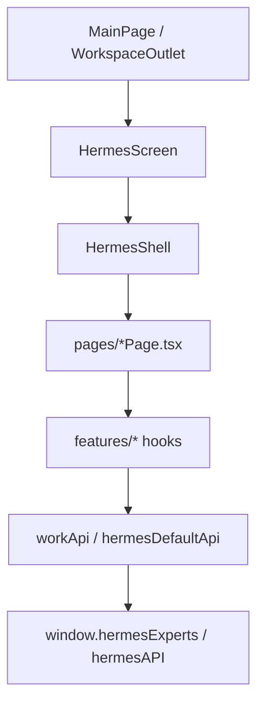

# 01 — 当前结构分析

## 1. 目标

让 Agent 在改代码前知道 **文件在哪、谁调用谁**，避免误改 MainPage 或重复造目录。

## 2. 不做范围

- 不移动 `screens/Hermes` 到 repo 外  
- 不在本 Spec 中描述 Main Process 实现细节（见 12-main-preload-boundary.md）

## 3. 涉及文件

### 3.1 全局壳层（Work 专家工作台 **外层**）

```text
Layout.tsx                          # 主界面编排，不承载 Hermes 内页逻辑
MainPage/                           # 顶栏 + outlet + StatusBar
workspace/workspace-registry.ts     # local-hermes 模块注册
components/workspace/WorkspaceRenderer.tsx  # 分发到 HermesScreen
```

### 3.2 Hermes Screen（**内层** Work 专家工作台）

```text
screens/Hermes/
  index.tsx                 # HermesScreen + Provider 栈
  constants.ts              # HERMES_NAV_ITEMS、LAYOUT 尺寸
  Hermes.css                # 全部 Hermes UI 样式（scoped .hermes-*）
  panels/HermesShell.tsx    # 三栏壳：Sidebar | Center | RightPanel
  components/HermesSidebar.tsx
  panels/HermesRightPanel.tsx
  registry/hermes-pages.tsx # lazy 页面注册
  model/                    # Work* 领域类型
  api/workApi.ts            # window.hermesExperts 封装
  api/hermesDefaultApi.ts   # window.hermesAPI（本地 default profile）
  features/                 # 业务 hooks
  pages/                    # 页面编排 + 页面级 components/
  context/                  # 跨页状态（尽量少增）
```

### 3.3 实际目录 vs PRD 理想目录

| PRD 理想 | 当前实现 | 说明 |
|----------|----------|------|
| `shell/HermesShell.tsx` | `panels/HermesShell.tsx` | 功能等价，搬迁延后 |
| `api/workbuddyApi.ts` | `api/workApi.ts` | 命名约定用 workApi |
| `registry/hermes-page-registry.ts` | `registry/hermes-pages.tsx` | 含 lazy + buildHermesPageDefinitions |
| `docs/specs/v1.3-workbuddy-product-line/` | 本 Pack | 本次建档 |

## 4. Provider 栈（index.tsx）

```text
HermesDefaultProvider
  └─ HermesWorkspaceProvider
       └─ HermesExpertsProvider   # Inspector/Chat：getExpertById；无 runs
            └─ HermesScreenInner → HermesShell
```

## 5. 数据流总览



## 6. 验收标准

- [ ] Agent 能区分「改 Layout」与「改 Hermes 内页」的边界  
- [ ] 新增页面落在 `pages/<Name>/`，不落在 `panels/` 业务逻辑里  

## 7. Cursor 执行提示

改 Hermes 功能前：`Read docs/specs/v1.3-workbuddy-product-line/03-layout-boundary.md` + 对应页面 Spec（06–10）。
