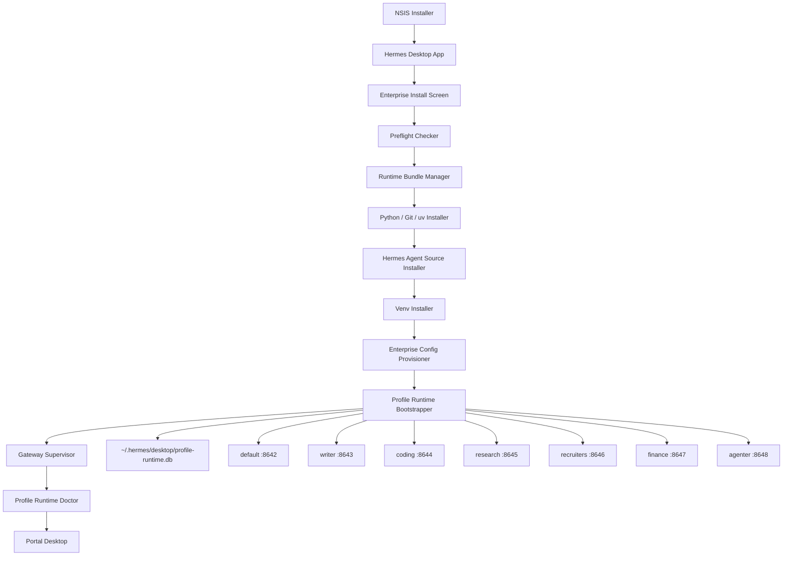

# Hermes Desktop V1.2 Windows 一键部署安装方案优化稿

版本定义：

```text
Hermes Desktop V1.2.1
主题：Windows One-Click Enterprise Deployment Pack
目标：在 Windows 10 以上系统完成 Hermes Desktop + Hermes Agent + Multi Profile Runtime 一键安装、启动、升级、修复、诊断
```

原 V1.0 安装 PRD 的目标是：安装 Hermes Desktop 后自动拉取私有 `hermes-agent`、创建 Python venv、安装依赖、生成 `~/.hermes/config.yaml` 与 `.env`、启动 Hermes Gateway，并支持升级、回滚、修复、无管理员权限部署。
V1.2 已经不是单 Gateway 桌面壳，而是 Multi Profile Runtime：稳定运行、SQLite 治理、Profile Entry、Delegation、Skill / Context Governance、Observability、Security Policy、Windows Deployment 都已经进入主线。

---

# 1. 核心结论

V1.0 安装方案需要升级为：

```text
Hermes Desktop V1.2.1 Windows Installer
  = Electron App Installer
  + Hermes Agent Runtime Bundle Installer
  + Multi Profile Runtime Bootstrapper
  + Enterprise Config Provisioner
  + Gateway Supervisor Installer
  + Profile Runtime Doctor
  + Update / Repair / Rollback Manager
```

不再只安装一个 `default` Hermes Gateway，而是一次性完成：

```text
1. 安装 Hermes Desktop 主程序
2. 安装或下载 hermes-agent runtime
3. 准备 Python / Git / uv / pip / wheels
4. 创建 shared venv
5. 初始化 ~/.hermes
6. 初始化 profile-runtime.db
7. 初始化 default / writer / coding / research / recruiters / finance / agenter
8. 写入 profile-runtime.yaml
9. 写入各 profile config.yaml / .env / SOUL.md / skills
10. 启动 default gateway
11. 可选启动全部 autoStart profile gateway
12. 进入 Portal Desktop 主界面
```

Windows 10 仍可作为企业内部兼容目标，但需要明确风险边界：Microsoft 已在 2025-10-14 结束 Windows 10 支持，设备仍可运行，但不再获得常规安全更新和技术支持。企业部署应同时规划 Windows 11 迁移或 ESU 策略。([微软支持][1])

---

# 2. 与 V1.0 的关键差异

| 项目         | V1.0 安装方案                  | V1.2.1 优化方案                                                             |
| ---------- | -------------------------- | ----------------------------------------------------------------------- |
| Runtime 目标 | 单 default gateway          | 多 Profile Gateway                                                       |
| 端口         | 8642                       | 8642-8648                                                               |
| 配置         | `~/.hermes/config.yaml`    | `~/.hermes/config.yaml` + `~/.hermes/profiles/*` + `profile-runtime.db` |
| 数据库        | 只关注 Hermes `state.db`      | 增加 Desktop `profile-runtime.db`                                         |
| 安装来源       | 私有 Git 为主                  | 普通员工用 Release Bundle，研发用 Git                                            |
| 运维能力       | update / rollback / repair | update / rollback / repair / doctor / profile reset / db backup         |
| UI         | Installing Screen          | Enterprise Install + Runtime Doctor + Profile Runtime Status            |
| 进程管理       | `startGateway()`           | MultiGatewaySupervisor                                                  |
| 审计         | 安装日志                       | 安装日志 + runtime_events + audit_events                                    |
| 安全         | token 不落盘                  | token 不进安装包、不进 deployment、不进日志，Git 模式隔离                                 |

---

# 3. Windows 安装模式重新定义

## 3.1 默认模式：Windows Native

```text
Windows 10 / 11 Client
  └─ Hermes Desktop
      ├─ Electron Main Process
      ├─ Runtime Bootstrapper
      ├─ Hermes Agent Runtime
      ├─ Multi Profile Gateway Supervisor
      └─ React Renderer UI
```

原因：

```text
1. Windows 10 Home 不适合作为默认 WSL2 部署目标。
2. WSL2 需要系统版本、虚拟化能力、Virtual Machine Platform。
3. 企业普通员工电脑可能没有管理员权限。
4. Windows Native 能做到无管理员权限安装。
5. Electron Main Process 已经负责进程、文件系统、IPC、Gateway 管理。
```

Microsoft WSL 文档要求 Windows 10 version 2004 / Build 19041 以上或 Windows 11 才能使用标准 `wsl --install`，WSL2 还涉及 Virtual Machine Platform 与虚拟化能力，因此不作为默认路径。([Microsoft Learn][2])

## 3.2 高级模式：WSL2

仅给研发、运维、Agent 工程师使用：

```text
Hermes Desktop Windows UI
  └─ WSL2 Ubuntu
      └─ hermes-agent
```

V1.2.1 不把 WSL2 做进普通员工一键安装主链路。

---

# 4. 安装包交付形态

## 4.1 推荐三件套

```text
AIOS-Hermes-Desktop-Setup-x64.exe
hermes-runtime-bundle.zip
deployment.json
```

## 4.2 runtime bundle 内容

```text
hermes-runtime-bundle.zip
  ├─ manifest.json
  ├─ checksums.sha256
  ├─ runtime/
  │   ├─ python/
  │   ├─ git/
  │   ├─ uv/
  │   └─ wheels/
  ├─ hermes-agent/
  │   └─ hermes-agent-release.zip
  ├─ profiles/
  │   ├─ profile-runtime.yaml
  │   ├─ souls/
  │   ├─ skills/
  │   └─ policies/
  └─ scripts/
      ├─ preflight.ps1
      └─ collect-logs.ps1
```

## 4.3 普通员工与研发人员分流

| 用户类型    | 安装来源                       | 认证方式                     | 结论    |
| ------- | -------------------------- | ------------------------ | ----- |
| 普通员工    | `hermes-agent-release.zip` | 无 Git 凭据                 | 默认    |
| 研发 / 运维 | 私有 Git clone               | GCM / SSH / Deploy Token | 高级模式  |
| 离线环境    | 离线完整 bundle                | 无外网                      | 内网装机包 |
| 灰度用户    | 内网 artifact server         | signed manifest          | 可控升级  |

原 V1.0 文档已经指出，普通员工不适合每台机器直接 clone 私有 Git，Release Zip 更适合降低凭据泄露风险、提升安装速度、支持 hash 校验和灰度升级。

Git 模式只保留给研发和运维。Windows 下 Git Credential Manager 可提供安全凭据存储，并支持 MFA。([GitHub 上的微软][3])

---

# 5. 安装目录优化

## 5.1 程序与 runtime 目录

```text
%LOCALAPPDATA%\AIOS-Hermes\
  app\
    Hermes Desktop.exe

  runtime\
    python\
    git\
    uv\
    wheels\

  agent\
    hermes-agent\
    source-manifest.json

  venv\
    Scripts\
      python.exe
      hermes.exe

  logs\
    install.log
    update.log
    repair.log
    gateway\
      default.log
      writer.log
      coding.log
      research.log
      recruiters.log
      finance.log
      agenter.log

  cache\
    downloads\
    extracted\
    backups\
```

## 5.2 用户数据目录

```text
%USERPROFILE%\.hermes\
  config.yaml
  .env
  state.db
  SOUL.md
  memories\
  skills\
  desktop\
    profile-runtime.db
    profile-runtime.yaml
    install-marker.json
    runtime-events.jsonl
    doctor-report.json
  profiles\
    writer\
    coding\
    research\
    recruiters\
    finance\
    agenter\
```

`~/.hermes` 仍是用户数据根目录。当前 hermes-desktop 已经以 `profileHome(profile?)` 作为 profile 文件路由函数，default 指向 `~/.hermes/`，命名 profile 指向 `~/.hermes/profiles/<name>/`，所有 profile 级文件操作必须继续走该路由。

---

# 6. V1.2.1 安装架构

当前 hermes-desktop 采用 Electron 三层模型：Renderer 只调用 `window.hermesAPI`，Preload 作为桥接层，Main Process 作为 IPC 注册中心和 Node.js 特权层，Python Backend 通过 HTTP SSE / child_process 对接；Gateway 地址为 `127.0.0.1:8642`。

V1.2.1 安装架构如下：



---

# 7. 安装流程优化

## 7.1 用户视角

```text
1. 用户双击 AIOS-Hermes-Desktop-Setup-x64.exe
2. 安装 Hermes Desktop 到 %LOCALAPPDATA%
3. 首次启动进入 Enterprise Install
4. 自动读取 deployment.json
5. 执行 Preflight
6. 准备 runtime bundle
7. 安装 Python / Git / uv / wheels
8. 安装 hermes-agent
9. 创建 venv
10. 初始化 ~/.hermes
11. 初始化 profile-runtime.db
12. 初始化 7 个 profile
13. 启动 default gateway
14. 执行 Runtime Doctor
15. 进入 Portal 主控页
```

## 7.2 Main Process 流程

```text
checkEnterpriseInstall()
  ↓
loadDeploymentConfig()
  ↓
acquireInstallLock()
  ↓
runPreflight()
  ↓
resolveRuntimeBundle()
  ↓
verifyBundleChecksum()
  ↓
installRuntimeTools()
  ↓
installHermesAgentSource()
  ↓
createOrReuseSharedVenv()
  ↓
installPythonDependencies()
  ↓
provisionDefaultHermesHome()
  ↓
bootstrapProfileRuntimeDb()
  ↓
bootstrapProfiles()
  ↓
installBundledSkills()
  ↓
applyPolicy()
  ↓
startDefaultGateway()
  ↓
optionalStartAutoStartProfiles()
  ↓
runRuntimeDoctor()
  ↓
writeInstallMarker()
  ↓
openAIOSWorkspace()
```

Python `venv` 是基于已有 Python 安装创建隔离虚拟环境，每个环境有独立 site-packages；V1.2.1 的 bundled Python 必须经过验证，确保支持 `venv`、`pip`、`ensurepip` 或等价安装链路。([Python documentation][4])

---

# 8. deployment.json V1.2.1

```json
{
  "schemaVersion": "1.2.1",
  "company": "your-company",
  "installMode": "windows-native",
  "installScope": "current-user",

  "desktop": {
    "channel": "stable",
    "autoUpdate": true,
    "updateProvider": "intranet-artifact",
    "updateUrl": "https://artifact.company.local/aios-hermes/desktop"
  },

  "runtimeBundle": {
    "sourceType": "artifact",
    "bundleUrl": "https://artifact.company.local/aios-hermes/runtime/hermes-runtime-bundle.zip",
    "bundleSha256": "",
    "offlineBundlePath": "",
    "allowFallbackToGit": false
  },

  "hermesAgent": {
    "sourceType": "release-zip",
    "version": "company-stable-2026.05",
    "gitUrl": "https://git.company.local/ai/hermes-agent.git",
    "branch": "company-stable",
    "commit": "",
    "tag": "",
    "authMode": "none",
    "shallowClone": true
  },

  "runtime": {
    "pythonVersion": "3.11",
    "useBundledPython": true,
    "useBundledGit": true,
    "useBundledUv": true,
    "pipIndexUrl": "https://pypi.company.local/simple",
    "trustedHost": "pypi.company.local",
    "preferWheelhouse": true,
    "wheelhousePath": "%LOCALAPPDATA%\\AIOS-Hermes\\runtime\\wheels"
  },

  "profiles": {
    "enabled": true,
    "profileRuntimeYaml": "%USERPROFILE%\\.hermes\\desktop\\profile-runtime.yaml",
    "autoStart": ["default"],
    "ports": {
      "default": 8642,
      "writer": 8643,
      "coding": 8644,
      "research": 8645,
      "recruiters": 8646,
      "finance": 8647,
      "agenter": 8648
    }
  },

  "gateway": {
    "host": "127.0.0.1",
    "healthPath": "/health",
    "startupTimeoutMs": 60000,
    "healthIntervalMs": 15000,
    "autoRestart": true
  },

  "models": {
    "defaultProvider": "ollama",
    "defaultModel": "gemma4-e4b",
    "providers": {
      "ollama": {
        "baseUrl": "http://127.0.0.1:11434/v1",
        "apiKeyEnv": "OLLAMA_API_KEY",
        "fallbackApiKey": "ollama"
      }
    }
  },

  "security": {
    "allowUserEditGitUrl": false,
    "allowGitBranchSwitch": false,
    "allowRemoteGateway": false,
    "verifyBundleSha256": true,
    "verifyManifestSignature": true,
    "maskSecretsInLogs": true,
    "allowedGatewayHost": "127.0.0.1"
  },

  "policy": {
    "enableProfilePolicy": true,
    "policyFile": "%USERPROFILE%\\.hermes\\desktop\\profile-policy.yaml"
  },

  "doctor": {
    "runAfterInstall": true,
    "exportReport": true
  }
}
```

---

# 9. Multi Profile Runtime 安装规则

## 9.1 共享代码，隔离 profile

```text
共享：
  %LOCALAPPDATA%\AIOS-Hermes\agent\hermes-agent
  %LOCALAPPDATA%\AIOS-Hermes\venv

隔离：
  %USERPROFILE%\.hermes
  %USERPROFILE%\.hermes\profiles\writer
  %USERPROFILE%\.hermes\profiles\coding
  %USERPROFILE%\.hermes\profiles\research
  %USERPROFILE%\.hermes\profiles\recruiters
  %USERPROFILE%\.hermes\profiles\finance
  %USERPROFILE%\.hermes\profiles\agenter
```

不能为每个 profile 复制一份 hermes-agent 源码和 venv。正确方式是：

```text
一个 hermes-agent codebase
一个 Python venv
多个 HERMES_HOME
多个 Gateway process
多个 api_server.port
```

## 9.2 profile 初始化矩阵

| Profile    | HERMES_HOME                                 | Port | AutoStart | Entry                |
| ---------- | ------------------------------------------- | ---: | --------- | -------------------- |
| default    | `%USERPROFILE%\.hermes`                     | 8642 | true      | Portal                |
| writer     | `%USERPROFILE%\.hermes\profiles\writer`     | 8643 | false     | Writer Workspace     |
| coding     | `%USERPROFILE%\.hermes\profiles\coding`     | 8644 | false     | Coding Workspace     |
| research   | `%USERPROFILE%\.hermes\profiles\research`   | 8645 | false     | Research Workspace   |
| recruiters | `%USERPROFILE%\.hermes\profiles\recruiters` | 8646 | false     | Recruiters Workspace |
| finance    | `%USERPROFILE%\.hermes\profiles\finance`    | 8647 | false     | Finance Workspace    |
| agenter    | `%USERPROFILE%\.hermes\profiles\agenter`    | 8648 | false     | Agenter Workspace    |

V1.2 的验收目标已经要求 7 个 profile 可长期同时运行，profile gateway 崩溃后可检测、恢复、定位原因，`profile-runtime.db` 支持 migration、backup、restore，Windows 10 内部电脑可一键部署、更新、诊断。

---

# 10. 新增 Main Process 模块

```text
src/main/enterprise/
  deployment-config.ts
  deployment-schema.ts
  runtime-bundle-manager.ts
  checksum-verifier.ts
  preflight-checker.ts
  runtime-bootstrapper.ts
  hermes-agent-source-installer.ts
  python-venv-installer.ts
  enterprise-config-provisioner.ts
  profile-runtime-bootstrapper.ts
  profile-policy-installer.ts
  enterprise-installer.ts
  enterprise-updater.ts
  enterprise-repair.ts
  enterprise-rollback.ts
  install-marker.ts
  install-lock.ts
  install-log.ts
  doctor/
    runtime-doctor.ts
    checks/
      check-windows-version.ts
      check-disk-space.ts
      check-runtime-files.ts
      check-python.ts
      check-venv.ts
      check-gateway-port.ts
      check-profile-runtime-db.ts
      check-profile-homes.ts
      check-skills.ts
      check-policy.ts
```

保留 V1.0 的 `src/main/enterprise/*` 方向，但把职责从“安装单 Hermes Agent”升级为“安装企业级 Multi Profile Runtime”。原文档也已经明确新增模块应走 Main domain module → `setupIPC()` → Preload typed wrapper → Renderer 调用的路径。

---

# 11. IPC / Preload 合约

## 11.1 IPC Channel

```text
enterprise:get-deployment-config
enterprise:validate-deployment-config
enterprise:preflight
enterprise:install
enterprise:install-cancel
enterprise:update
enterprise:repair
enterprise:rollback
enterprise:get-install-marker
enterprise:get-install-log
enterprise:open-log-dir
enterprise:run-doctor
enterprise:export-doctor-report
enterprise:get-runtime-bundle-status
```

## 11.2 Preload API

```ts
export interface EnterpriseInstallAPI {
  getDeploymentConfig(): Promise<DeploymentConfigResult>;
  validateDeploymentConfig(): Promise<ValidationResult>;

  runPreflight(): Promise<PreflightResult>;

  install(input?: EnterpriseInstallInput): Promise<EnterpriseInstallResult>;
  cancelInstall(): Promise<{ ok: boolean }>;

  update(input?: EnterpriseUpdateInput): Promise<EnterpriseUpdateResult>;
  repair(input?: EnterpriseRepairInput): Promise<EnterpriseRepairResult>;
  rollback(input: EnterpriseRollbackInput): Promise<EnterpriseRollbackResult>;

  getInstallMarker(): Promise<InstallMarker | null>;
  getInstallLog(input: { type: "install" | "update" | "repair" | "gateway" }): Promise<string>;
  openLogDir(): Promise<{ ok: boolean }>;

  runDoctor(input?: RuntimeDoctorInput): Promise<RuntimeDoctorReport>;
  exportDoctorReport(): Promise<{ ok: boolean; path: string }>;

  onEnterpriseInstallProgress(
    cb: (progress: EnterpriseInstallProgress) => void,
  ): () => void;
}
```

Renderer 不能直接访问 Node.js、文件系统或 SQLite。现有架构中 Renderer 通过 `window.hermesAPI.*` 调用，Preload 通过 `contextBridge` 暴露 API，Main Process 统一处理 IPC。

---

# 12. Enterprise Install UI

## 12.1 新增页面

```text
src/renderer/src/screens/EnterpriseInstall/
  EnterpriseInstallScreen.tsx
  DeploymentConfigPanel.tsx
  PreflightPanel.tsx
  RuntimeBundlePanel.tsx
  InstallProgressPanel.tsx
  ProfileBootstrapPanel.tsx
  DoctorPanel.tsx
  InstallErrorPanel.tsx
  InstallSuccessPanel.tsx
```

## 12.2 页面状态机

```text
splash
  ↓
checkInstall()
  ↓
enterprise-install-required
  ↓
load-deployment-config
  ↓
preflight
  ↓
runtime-bundle
  ↓
install-agent
  ↓
bootstrap-profiles
  ↓
start-gateway
  ↓
doctor
  ↓
setup
  ↓
main: AIOSWorkspace
```

当前 App 生命周期已经是 `splash → welcome → installing → setup → main(Layout)`，V1.2.1 只需要将 `installing` 替换为企业安装状态机，并在成功后进入 Portal Workspace。

---

# 13. Preflight 检查项

```text
P0 阻断项：
  1. Windows 版本不满足最低要求
  2. %LOCALAPPDATA% 不可写
  3. %USERPROFILE%\.hermes 不可写
  4. 磁盘空间不足
  5. runtime bundle 缺失或 hash 不匹配
  6. Python runtime 不可执行
  7. venv 创建失败
  8. 8642-8648 端口被非 Hermes 进程占用
  9. profile-runtime.db 不可创建
  10. deployment.json schema 不合法

P1 警告项：
  1. Windows 10 已过官方支持期
  2. 未检测到 Ollama
  3. 内网 PyPI 不可达，但 wheelhouse 可用
  4. Git 不可用，但当前是 release-zip 模式
  5. 杀毒软件可能拦截 runtime 目录

P2 信息项：
  1. 当前 Desktop 版本
  2. 当前 hermes-agent 版本
  3. 当前 runtime bundle 版本
  4. 当前 profile 数量
  5. 当前 gateway 状态
```

---

# 14. 安装日志与审计

```text
%LOCALAPPDATA%\AIOS-Hermes\logs\
  install.log
  update.log
  repair.log
  doctor.log
  gateway\
    default.log
    writer.log
    coding.log
    research.log
    recruiters.log
    finance.log
    agenter.log
```

`profile-runtime.db` 增加：

```sql
CREATE TABLE IF NOT EXISTS install_events (
  id TEXT PRIMARY KEY,
  phase TEXT NOT NULL,
  step TEXT NOT NULL,
  status TEXT NOT NULL,
  message TEXT,
  payload_json TEXT,
  error_code TEXT,
  started_at TEXT NOT NULL,
  completed_at TEXT
);

CREATE TABLE IF NOT EXISTS runtime_doctor_reports (
  id TEXT PRIMARY KEY,
  report_json TEXT NOT NULL,
  status TEXT NOT NULL,
  created_at TEXT NOT NULL
);
```

日志规则：

```text
1. 禁止输出 API Key / Token / Git Token。
2. Git URL 中如含 token，写日志前必须 mask。
3. pip install 输出需要过滤认证信息。
4. 所有 install/update/repair 事件同时写 install.log 与 install_events。
5. Doctor Report 可导出给 IT。
```

---

# 15. 更新、修复、回滚

## 15.1 Desktop 更新

使用 `electron-updater`，但发布源从 GitHub Releases 改为内网 artifact server。当前项目原本使用 electron-builder / electron-updater，并且 Windows 使用 NSIS 安装器；NSIS 的 `oneClick` 与 `perMachine` 选项可用于控制一键安装和当前用户安装。 ([Electron Builder][5])

推荐：

```yaml
win:
  target:
    - nsis

nsis:
  oneClick: true
  perMachine: false
  allowElevation: false
  createDesktopShortcut: true
  createStartMenuShortcut: true
```

## 15.2 hermes-agent 更新

```text
1. stop all gateway
2. backup install-marker
3. backup profile-runtime.db
4. backup ~/.hermes/config.yaml
5. 下载 hermes-agent-release.zip
6. 校验 sha256 / signature
7. 替换 %LOCALAPPDATA%\AIOS-Hermes\agent\hermes-agent
8. pip install -e 或 wheel install
9. run doctor
10. start default gateway
11. health check
12. 成功：更新 marker
13. 失败：自动 rollback
```

## 15.3 Repair Install

```text
repair levels:
  level 1: 修复 gateway pid / 端口 / health
  level 2: 修复 venv / 依赖
  level 3: 修复 hermes-agent 文件
  level 4: 修复 profile-runtime.db
  level 5: 重建 profile runtime，但保留用户 state.db / memories / sessions
```

## 15.4 Rollback

```text
rollback targets:
  desktop previous version
  hermes-agent previous version
  runtime bundle previous version
  profile-runtime.db backup
  profile config backup
```

---

# 16. 安全策略

```text
1. Gateway 仅允许 127.0.0.1。
2. 不创建 Windows Service。
3. 不写 HKLM。
4. 不强制改系统 PATH。
5. 不把 token 写入 deployment.json。
6. 不把 token 写入 install-marker。
7. 不把 token 写入日志。
8. 普通员工默认不接触 Git。
9. Release Bundle 必须校验 hash。
10. 可选 manifest 签名校验。
11. Profile policy 安装后只读保护。
12. Web Operator 敏感操作仍走 UI 确认队列。
```

V1.2 的 Security & Policy Pack 已经要求 profile operation policy、sensitive action policy、domain allowlist、tool allowlist、skill install policy、delegation allowlist、audit export。

---

# 17. Cursor Spec-Driven 任务拆分

```text
docs/specs/v1.2.1-windows-one-click-deployment/
  00-prd.md
  01-architecture.md
  02-deployment-config-schema.md
  03-runtime-bundle.md
  04-preflight-checker.md
  05-enterprise-installer.md
  06-profile-runtime-bootstrapper.md
  07-gateway-supervisor-install.md
  08-enterprise-update-repair-rollback.md
  09-runtime-doctor.md
  10-install-ui.md
  11-security-policy.md
  12-packaging-nsis.md
  13-acceptance-checklist.md
  14-cursor-execution-prompt.md
```

## Phase 1：Deployment Config + Schema

```text
新增：
src/main/enterprise/deployment-config.ts
src/main/enterprise/deployment-schema.ts

验收：
1. 可读取 %PROGRAMDATA%\AIOS-Hermes\deployment.json。
2. 无管理员权限时读取 %LOCALAPPDATA%\AIOS-Hermes\deployment.json。
3. schemaVersion=1.2.1 校验通过。
4. 配置错误返回结构化错误，不抛未捕获异常。
```

## Phase 2：Runtime Bundle Manager

```text
新增：
runtime-bundle-manager.ts
checksum-verifier.ts

验收：
1. 支持本地 bundle。
2. 支持内网 artifact 下载。
3. 支持 sha256 校验。
4. 支持解压到 cache/extracted。
5. bundle 损坏时阻断安装。
```

## Phase 3：Preflight Checker

```text
新增：
preflight-checker.ts
doctor/checks/*

验收：
1. 检查 Windows 版本。
2. 检查磁盘空间。
3. 检查 8642-8648 端口。
4. 检查 Python / Git / uv。
5. 检查 ~/.hermes 可写。
6. 检查 profile-runtime.db 可创建。
```

## Phase 4：Hermes Agent Installer

```text
新增：
hermes-agent-source-installer.ts
python-venv-installer.ts

验收：
1. release zip 模式可安装。
2. git 模式可 clone / fetch / checkout。
3. venv 可创建。
4. pip 可从 wheelhouse 安装。
5. 安装失败可 rollback。
```

## Phase 5：Profile Runtime Bootstrapper

```text
新增：
profile-runtime-bootstrapper.ts

验收：
1. 创建 profile-runtime.db。
2. 写入 7 个 profile。
3. 写入 8642-8648 runtime_instances。
4. 创建每个 profileHome。
5. 写入 SOUL.md / config.yaml / .env。
6. 安装 bundled skills。
```

## Phase 6：Gateway Supervisor 集成

```text
改造：
src/main/hermes.ts
src/main/profile-runtime/profile-gateway-supervisor.ts

验收：
1. default gateway 8642 可启动。
2. writer gateway 8643 可启动。
3. startAll / stopAll 正常。
4. 端口冲突能识别。
5. Gateway crash 后能记录 failed。
```

## Phase 7：Enterprise Install UI

```text
新增：
src/renderer/src/screens/EnterpriseInstall/*

验收：
1. 首次启动进入 Enterprise Install。
2. Preflight 结果可视化。
3. 安装进度可视化。
4. Doctor Report 可视化。
5. 安装成功进入 Portal。
6. 失败可打开日志和重试。
```

## Phase 8：Update / Repair / Rollback

```text
新增：
enterprise-updater.ts
enterprise-repair.ts
enterprise-rollback.ts

验收：
1. hermes-agent 可更新。
2. profile-runtime.db 更新前自动备份。
3. 更新失败自动回滚。
4. repair 可重建 venv。
5. repair 不删除用户 session / memory。
```

---

# 18. 最终验收清单

```text
安装验收：
  - Windows 10 / 11 当前用户安装成功
  - 无管理员权限安装成功
  - 不依赖 WSL2
  - 不修改系统 PATH
  - 不写 HKLM
  - 安装日志完整

Runtime 验收：
  - Python runtime 可用
  - venv 可用
  - hermes-agent 可用
  - /health 可用
  - /v1/chat/completions 可用

Profile 验收：
  - profile-runtime.db 创建成功
  - default/writer/coding/research/recruiters/finance/agenter 初始化成功
  - default 8642 启动成功
  - 其它 profile 可按需启动
  - profileHome 隔离正确

UI 验收：
  - 首次启动进入 Enterprise Install
  - 安装成功进入 Portal
  - Runtime Doctor 可运行
  - Settings 可显示 Desktop / Agent / Runtime / Profile 版本
  - 可打开 install/gateway/update 日志

安全验收：
  - token 不进入 deployment.json
  - token 不进入日志
  - gateway 只监听 127.0.0.1
  - release bundle hash 校验
  - Git 模式使用 GCM 或只读 deploy token
```

---

# 19. 最终落地路线

```text
MVP：
  1. NSIS 当前用户一键安装
  2. runtime bundle 本地解压
  3. release zip 安装 hermes-agent
  4. shared venv
  5. default gateway 启动
  6. profile-runtime.db 初始化
  7. Enterprise Install UI
  8. install.log

稳定版：
  1. 内网 artifact 下载
  2. sha256 校验
  3. update / rollback
  4. repair install
  5. Runtime Doctor
  6. 7 profile 生命周期管理

企业版：
  1. manifest 签名
  2. 灰度升级
  3. profile policy
  4. skill/profile 模板下发
  5. 日志导出
  6. 内网统一配置中心
```

V1.2.1 的安装方案重点不是“把 Python 项目打进 Electron”，而是把 Hermes Desktop 做成 **Windows 本地 Portal Runtime 管理器**：Desktop 负责安装、升级、修复、诊断、Profile Runtime 管理；Hermes Agent 保持 Python Backend 黑盒；Renderer 只通过 Preload IPC 调用 Main Process。

[1]: https://support.microsoft.com/en-us/windows/windows-10-support-has-ended-on-october-14-2025-2ca8b313-1946-43d3-b55c-2b95b107f281?utm_source=chatgpt.com "Windows 10 support has ended on October 14, 2025"
[2]: https://learn.microsoft.com/en-us/windows/wsl/install?utm_source=chatgpt.com "How to install Linux on Windows with WSL"
[3]: https://microsoft.github.io/Git-Credential-Manager-for-Windows/?utm_source=chatgpt.com "Git Credential Manager for Windows - Microsoft Open Source"
[4]: https://docs.python.org/3/library/venv.html?utm_source=chatgpt.com "venv — Creation of virtual environments"
[5]: https://www.electron.build/electron-builder.Interface.NsisOptions.html?utm_source=chatgpt.com "electron builder.Interface.NsisOptions"
