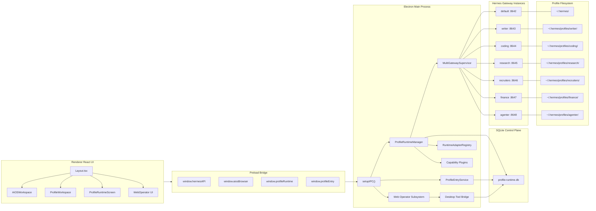
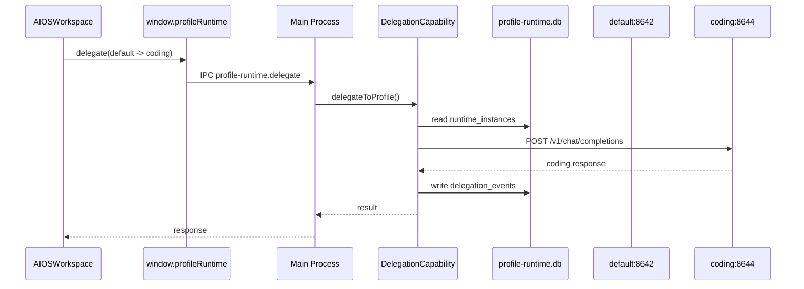

# Hermes Desktop V1.1 产品架构与功能需求 PRD

## Multi Profile Runtime + Profile Entry Workspace + Web Operator 集成版

## 1. 文档信息

```text
产品名称：Hermes Desktop
当前基线：V1.0 Web Operator 子系统
目标版本：V1.1 Multi Profile Runtime
文档类型：产品架构 + 功能需求 PRD + Cursor Spec-Driven 执行稿
目标代码库：hermes-desktop
```

V1.0 基线已经形成 Electron 三层进程模型：`main / preload / renderer / shared`，主进程负责 IPC、Gateway、配置、Session、Skills、Web Operator 等能力，Renderer 通过 Preload 调用能力，Python Gateway 作为外部进程提供 Hermes Agent 能力。
V1.0 已包含 `src/main/browser/` Web Operator 模块，包括 `browser-view-manager.ts`、`browser-controller.ts`、`browser-security.ts`、`browser-audit.ts`、`browser-ipc.ts`、`browser-tool-bridge.ts`、`browser-tool-server.ts`。

V1.1 在此基础上增加：

```text
1. 多 Profile Gateway 同时运行
2. Profile Runtime 可插拔架构
3. SQLite Runtime Control Plane
4. Profile Entry 独立页面入口
5. default profile 作为 AI-OS 主控入口
6. writer / coding / research / recruiters / finance / agenter 进入独立专家页
7. default 可调用其它 profile 能力
8. profile 间 skill 快速复制
9. profile 间指定 session 上下文共享
10. Web Operator 能力与多 profile runtime 打通
```

---

# 2. V1.1 产品目标

## 2.1 核心目标

```text
Hermes Desktop V1.1 = AI-OS Desktop 多智能体运行时控制台
```

V1.1 要把原本单 Hermes Gateway 桌面应用升级为本地多 Profile Agent Runtime：

```text
default     : AI-OS 主控入口，端口 8642
writer      : 写作生文专家，端口 8643
coding      : 代码生成专家，端口 8644
research    : 数据搜索专家，端口 8645
recruiters  : 招聘专家，端口 8646
finance     : 财经专家，端口 8647
agenter     : 智能体专家，端口 8648
```

每个 profile 是独立 Hermes Gateway 实例，拥有独立：

```text
config.yaml
.env
SOUL.md
state.db
skills/
memories/
desktop/
```

但所有 profile 的运行状态、入口、能力绑定、调用记录、上下文共享索引，由 V1.1 新增的 `profile-runtime.db` 统一管理。

---

# 3. V1.1 与 V1.0 的关系

## 3.1 V1.0 已有能力

V1.0 提供：

```text
Electron Main Process
  ├─ BrowserWindow
  ├─ WebContentsView
  ├─ BrowserController
  ├─ Browser IPC
  ├─ Browser Tool Bridge
  └─ Hermes Gateway Client

Preload
  ├─ window.hermesAPI
  └─ window.aiosBrowser

Renderer
  ├─ Layout
  ├─ Chat
  ├─ Skills
  ├─ Profiles
  ├─ Gateway
  └─ Web Operator Screen

Hermes Backend
  └─ default Gateway : 127.0.0.1:8642
```

已有主布局中已经包含 Web Operator 视图，路径为 `/web-operator`，页面结构是 Hermes 任务面板、浏览器视口、状态面板三栏布局。

## 3.2 V1.1 新增能力

V1.1 不替换 V1.0 Web Operator，而是在其上增加 Profile Runtime：

```text
V1.0 Web Operator
  + V1.1 Profile Runtime
  + V1.1 Profile Entry Router
  + V1.1 Multi Gateway Supervisor
  + V1.1 SQLite Control Plane
  + V1.1 Delegation Capability
  + V1.1 Skill Sync Capability
  + V1.1 Session Context Share Capability
```

---

# 4. 产品边界

## 4.1 本期包含

```text
1. 多 profile 配置导入
2. 多 profile Gateway 生命周期管理
3. SQLite runtime control plane
4. default AI-OS 主控工作台
5. specialist profile 独立 workspace
6. default 调用 specialist profile
7. profile 间 skill copy
8. profile 间 session context snapshot 共享
9. profile-aware Web Operator 调用审计
10. Cursor spec-driven 分阶段实现文档
```

## 4.2 本期不包含

```text
1. 不改 Hermes Python backend 推理协议
2. 不做多 BrowserWindow 架构
3. 不把 runtime 元数据写入 Hermes state.db
4. 不让 Renderer 直接访问 Node.js
5. 不让 default 直接写其它 profile 的 state.db
6. 不支持远程企业 profile server
7. 不做 Docker profile runtime
8. 不做跨设备 profile 同步
```

现有架构要求新增能力通过 Main 模块实现、在 `setupIPC()` 注册、通过 Preload 暴露给 Renderer；Renderer 不能绕过 Preload 直接访问 Node.js。

---

# 5. 总体架构

## 5.1 V1.1 总架构图



---

# 6. 核心架构原则

```text
1. 一个 profile = 一个 Hermes Gateway 实例。
2. 一个 profile = 一个独立 profileHome 目录。
3. 多 profile runtime 状态统一进入 profile-runtime.db。
4. profile-runtime.db 不能替代 Hermes state.db。
5. default 是主控 profile，不是普通专家 profile。
6. specialist profile 只负责对应领域任务。
7. default 调用 specialist 必须通过 Delegation Capability。
8. skill copy 必须通过 Skill Sync Capability。
9. session context 共享必须通过 Context Snapshot，不直接合并数据库。
10. Web Operator Tool Bridge 需要记录 profileId/sourceProfile。
11. Renderer 只能通过 Preload API 调用 Main。
12. Main Process 是唯一能管理进程、文件系统、SQLite 的层。
```

所有 profile 文件路径必须通过 `profileHome(profile?)` 路由；默认 profile 指向 `~/.hermes/`，命名 profile 指向 `~/.hermes/profiles/<name>/`，绕过该函数会破坏 profile 隔离。

---

# 7. 功能需求总览

| 模块                       | 功能                                  | 版本   |
| ------------------------ | ----------------------------------- | ---- |
| Profile Runtime DB       | 使用 SQLite 管理 profile runtime 元数据    | V1.1 |
| Config Importer          | 从 YAML 一键部署多个 profile               | V1.1 |
| Gateway Supervisor       | 同时启动 / 停止多个 Gateway                 | V1.1 |
| Runtime Adapter          | 可插拔运行时 adapter                      | V1.1 |
| Profile Entry Router     | default 进入 AI-OS，其它 profile 进入独立页面  | V1.1 |
| Delegation Capability    | default 调用其它 specialist profile     | V1.1 |
| Skill Sync               | profile 间复制 skill                   | V1.1 |
| Session Context Share    | session 上下文快照共享                     | V1.1 |
| Web Operator Integration | Web Operator 支持 profile-aware 调用和审计 | V1.1 |
| Runtime UI               | Profile Runtime 管理页面                | V1.1 |
| Specialist Workspace     | 每个 profile 独立工作页                    | V1.1 |

---

# 8. Profile Runtime 设计

## 8.1 Profile 列表

```text
default:
  role: AI-OS 主控调度专家
  port: 8642
  entry: aios-workspace
  capability:
    - delegation
    - skill-sync
    - session-share
    - web-operator

writer:
  role: 写作生文专家
  port: 8643
  entry: specialist-workspace

coding:
  role: 代码生成专家
  port: 8644
  entry: specialist-workspace

research:
  role: 数据搜索专家
  port: 8645
  entry: specialist-workspace

recruiters:
  role: 招聘专家
  port: 8646
  entry: specialist-workspace

finance:
  role: 财经专家
  port: 8647
  entry: specialist-workspace

agenter:
  role: 智能体专家
  port: 8648
  entry: specialist-workspace
```

## 8.2 Profile Runtime 状态

```ts
export type ProfileRuntimeStatus =
  | "not_deployed"
  | "stopped"
  | "starting"
  | "running"
  | "stopping"
  | "failed";
```

## 8.3 Gateway 端口规则

```text
1. default 固定 8642。
2. 其它 profile 默认使用 8643 - 8648。
3. 端口必须唯一。
4. Gateway 只允许绑定 127.0.0.1。
5. 端口冲突时阻止启动。
6. 端口占用但不是当前 profile 进程时，必须返回 PROFILE_PORT_CONFLICT。
```

---

# 9. 可插拔 Runtime Adapter

## 9.1 Adapter 类型

V1.1 实现：

```text
hermes-local
```

预留：

```text
hermes-remote
tool-only
docker-hermes
browser-operator
feishu-bridge
```

## 9.2 RuntimeAdapter 接口

```ts
export interface RuntimeAdapter {
  readonly type: string;
  readonly title: string;
  readonly version: string;

  validate(profileId: string): Promise<void>;
  deploy(profileId: string): Promise<void>;
  start(profileId: string): Promise<ProfileGatewayState>;
  stop(profileId: string): Promise<ProfileGatewayState>;
  restart(profileId: string): Promise<ProfileGatewayState>;
  health(profileId: string): Promise<ProfileGatewayState>;

  sendMessage(input: {
    profileId: string;
    message: string;
    sessionId?: string;
    history?: Array<{ role: string; content: string }>;
  }): Promise<{
    response: string;
    sessionId?: string;
  }>;
}
```

## 9.3 HermesLocalRuntimeAdapter

职责：

```text
1. 使用 profileHome(profileId) 定位 profile 目录。
2. 读取 profile-runtime.db 的 port / model / host。
3. 在启动前注入 config.yaml api_server.host / api_server.port。
4. spawn hermes gateway。
5. 轮询 /health。
6. 调用 /v1/chat/completions。
7. 写 runtime_instances 状态。
8. App before-quit 时停止所有 running gateway。
```

---

# 10. SQLite Control Plane

## 10.1 数据库位置

```text
~/.hermes/desktop/profile-runtime.db
```

使用全局 default root，不放入任意 specialist profile 目录。

## 10.2 核心表

```sql
CREATE TABLE IF NOT EXISTS profiles (
  id TEXT PRIMARY KEY,
  name TEXT NOT NULL UNIQUE,
  display_name TEXT NOT NULL,
  role TEXT NOT NULL,
  description TEXT,
  runtime_type TEXT NOT NULL,
  profile_home TEXT NOT NULL,
  enabled INTEGER NOT NULL DEFAULT 1,
  auto_start INTEGER NOT NULL DEFAULT 0,
  sort_order INTEGER NOT NULL DEFAULT 0,
  created_at TEXT NOT NULL,
  updated_at TEXT NOT NULL
);

CREATE TABLE IF NOT EXISTS runtime_instances (
  id TEXT PRIMARY KEY,
  profile_id TEXT NOT NULL,
  runtime_type TEXT NOT NULL,
  host TEXT NOT NULL DEFAULT '127.0.0.1',
  port INTEGER NOT NULL,
  base_url TEXT NOT NULL,
  status TEXT NOT NULL,
  pid INTEGER,
  started_at TEXT,
  stopped_at TEXT,
  last_health_check_at TEXT,
  last_error TEXT,
  created_at TEXT NOT NULL,
  updated_at TEXT NOT NULL,
  UNIQUE(host, port),
  FOREIGN KEY(profile_id) REFERENCES profiles(id) ON DELETE CASCADE
);

CREATE TABLE IF NOT EXISTS profile_entries (
  id TEXT PRIMARY KEY,
  profile_id TEXT NOT NULL,
  entry_type TEXT NOT NULL,
  route TEXT NOT NULL UNIQUE,
  title TEXT NOT NULL,
  icon TEXT,
  enabled INTEGER NOT NULL DEFAULT 1,
  sort_order INTEGER NOT NULL DEFAULT 0,
  config_json TEXT,
  created_at TEXT NOT NULL,
  updated_at TEXT NOT NULL,
  FOREIGN KEY(profile_id) REFERENCES profiles(id) ON DELETE CASCADE
);

CREATE TABLE IF NOT EXISTS profile_capabilities (
  id TEXT PRIMARY KEY,
  profile_id TEXT NOT NULL,
  capability_name TEXT NOT NULL,
  enabled INTEGER NOT NULL DEFAULT 1,
  config_json TEXT,
  created_at TEXT NOT NULL,
  updated_at TEXT NOT NULL,
  UNIQUE(profile_id, capability_name),
  FOREIGN KEY(profile_id) REFERENCES profiles(id) ON DELETE CASCADE
);

CREATE TABLE IF NOT EXISTS profile_skills (
  id TEXT PRIMARY KEY,
  profile_id TEXT NOT NULL,
  skill_path TEXT NOT NULL,
  skill_name TEXT NOT NULL,
  category TEXT,
  source_type TEXT NOT NULL,
  source_profile_id TEXT,
  filesystem_path TEXT NOT NULL,
  checksum TEXT,
  enabled INTEGER NOT NULL DEFAULT 1,
  installed_at TEXT NOT NULL,
  updated_at TEXT NOT NULL,
  UNIQUE(profile_id, skill_path),
  FOREIGN KEY(profile_id) REFERENCES profiles(id) ON DELETE CASCADE
);

CREATE TABLE IF NOT EXISTS skill_sync_events (
  id TEXT PRIMARY KEY,
  source_profile_id TEXT NOT NULL,
  target_profile_id TEXT NOT NULL,
  skill_path TEXT NOT NULL,
  action TEXT NOT NULL,
  overwrite INTEGER NOT NULL DEFAULT 0,
  backup_path TEXT,
  status TEXT NOT NULL,
  error_message TEXT,
  created_at TEXT NOT NULL
);

CREATE TABLE IF NOT EXISTS shared_contexts (
  id TEXT PRIMARY KEY,
  source_profile_id TEXT NOT NULL,
  source_session_id TEXT NOT NULL,
  target_profile_id TEXT NOT NULL,
  mode TEXT NOT NULL,
  title TEXT,
  summary TEXT,
  context_file_path TEXT NOT NULL,
  message_count INTEGER NOT NULL DEFAULT 0,
  max_chars INTEGER,
  checksum TEXT,
  status TEXT NOT NULL DEFAULT 'active',
  created_at TEXT NOT NULL,
  updated_at TEXT NOT NULL
);

CREATE TABLE IF NOT EXISTS delegation_events (
  id TEXT PRIMARY KEY,
  from_profile_id TEXT NOT NULL,
  to_profile_id TEXT NOT NULL,
  request_message TEXT NOT NULL,
  context_refs_json TEXT,
  response_summary TEXT,
  target_session_id TEXT,
  status TEXT NOT NULL,
  error_message TEXT,
  started_at TEXT NOT NULL,
  completed_at TEXT
);

CREATE TABLE IF NOT EXISTS audit_events (
  id TEXT PRIMARY KEY,
  event_type TEXT NOT NULL,
  profile_id TEXT,
  source TEXT NOT NULL,
  action TEXT NOT NULL,
  payload_json TEXT,
  status TEXT NOT NULL,
  error_message TEXT,
  created_at TEXT NOT NULL
);
```

---

# 11. 配置导入

## 11.1 配置文件位置

```text
~/.hermes/desktop/profile-runtime.yaml
```

内置模板：

```text
resources/profiles/profile-runtime.template.yaml
```

## 11.2 YAML 示例

```yaml
version: 1

runtime:
  db: sqlite
  defaultAdapter: hermes-local

gateway:
  host: "127.0.0.1"
  healthPath: "/health"

profiles:
  default:
    displayName: "AI-OS 主控"
    role: "主控调度专家"
    runtimeType: "hermes-local"
    enabled: true
    autoStart: true
    port: 8642
    model: "kimi/kimi-k2.5"
    entry:
      type: "aios-workspace"
      route: "aios"
      title: "AI-OS"
      icon: "layout-dashboard"
    capabilities:
      - delegation
      - skill-sync
      - session-share
      - web-operator

  writer:
    displayName: "Writer"
    role: "写作生文专家"
    runtimeType: "hermes-local"
    enabled: true
    autoStart: true
    port: 8643
    model: "kimi/kimi-k2.5"
    entry:
      type: "specialist-workspace"
      route: "profile/writer"
      title: "写作生文"
      icon: "pen-tool"

  coding:
    displayName: "Coding"
    role: "代码生成专家"
    runtimeType: "hermes-local"
    enabled: true
    autoStart: true
    port: 8644
    model: "kimi/kimi-k2.5"
    entry:
      type: "specialist-workspace"
      route: "profile/coding"
      title: "代码生成"
      icon: "code"

  research:
    displayName: "Research"
    role: "数据搜索专家"
    runtimeType: "hermes-local"
    enabled: true
    autoStart: true
    port: 8645
    model: "deepseek/deepseek-reasoner"
    entry:
      type: "specialist-workspace"
      route: "profile/research"
      title: "数据搜索"
      icon: "search"

  recruiters:
    displayName: "Recruiters"
    role: "招聘专家"
    runtimeType: "hermes-local"
    enabled: true
    autoStart: true
    port: 8646
    model: "kimi/kimi-k2.5"
    entry:
      type: "specialist-workspace"
      route: "profile/recruiters"
      title: "招聘专家"
      icon: "users"

  finance:
    displayName: "Finance"
    role: "财经专家"
    runtimeType: "hermes-local"
    enabled: true
    autoStart: true
    port: 8647
    model: "kimi/kimi-k2.5"
    entry:
      type: "specialist-workspace"
      route: "profile/finance"
      title: "财经分析"
      icon: "chart-line"

  agenter:
    displayName: "Agenter"
    role: "智能体专家"
    runtimeType: "hermes-local"
    enabled: true
    autoStart: true
    port: 8648
    model: "kimi/kimi-k2.5"
    entry:
      type: "specialist-workspace"
      route: "profile/agenter"
      title: "智能体专家"
      icon: "bot"
```

---

# 12. Profile Entry 页面入口

## 12.1 页面入口规则

```text
default -> AIOSWorkspaceScreen
writer -> ProfileWorkspaceScreen(profileId="writer")
coding -> ProfileWorkspaceScreen(profileId="coding")
research -> ProfileWorkspaceScreen(profileId="research")
recruiters -> ProfileWorkspaceScreen(profileId="recruiters")
finance -> ProfileWorkspaceScreen(profileId="finance")
agenter -> ProfileWorkspaceScreen(profileId="agenter")
```

## 12.2 左侧导航结构

```text
AI-OS
  └─ Default 主控

Experts
  ├─ 写作生文 writer
  ├─ 代码生成 coding
  ├─ 数据搜索 research
  ├─ 招聘专家 recruiters
  ├─ 财经专家 finance
  └─ 智能体专家 agenter

Runtime
  ├─ Profile Runtime
  └─ Gateway Monitor

Operator
  └─ Web Operator
```

## 12.3 AIOSWorkspace

```text
AIOSWorkspaceScreen
  ├─ AIOSMainChatPanel
  ├─ AIOSPortalPanel
  ├─ AIOSDelegationPanel
  ├─ AIOSProfileRuntimePanel
  ├─ AIOSTaskPanel
  └─ AIOSWebOperatorPanel
```

作用：

```text
1. 用户默认进入 AI-OS。
2. default profile 承担总控调度。
3. 可查看所有 specialist profile 状态。
4. 可向 writer/coding/research 等发起委派。
5. 可调用 Web Operator 操作外部页面。
6. 可汇总多个 profile 的输出。
```

## 12.4 Specialist Workspace

```text
ProfileWorkspaceScreen(profileId)
  ├─ ProfileHeader
  ├─ ProfileChatPanel
  ├─ ProfileSkillPanel
  ├─ ProfileContextPanel
  ├─ ProfileRuntimeLogPanel
  └─ ProfileWebOperatorPanel(optional)
```

所有 specialist workspace 复用统一组件，差异通过 `profile_page_layouts.layout_json` 控制。

---

# 13. default 调用其它 profile

## 13.1 Delegation Capability

default 通过 `DelegationCapability` 调用其它 profile：

```text
default -> writer
default -> coding
default -> research
default -> recruiters
default -> finance
default -> agenter
```

调用流程：



## 13.2 Delegation 请求类型

```ts
export interface DelegateToProfileRequest {
  fromProfile: string;
  toProfile: string;
  message: string;
  includeContextRefs?: string[];
  stream?: boolean;
}

export interface DelegateToProfileResult {
  ok: boolean;
  fromProfile: string;
  toProfile: string;
  response?: string;
  targetSessionId?: string;
  errorCode?: string;
  message?: string;
}
```

---

# 14. Skill Sync 功能需求

## 14.1 功能说明

任意 profile 的 skill 可快速复制给其它 profile。

示例：

```text
coding/spec-driver -> agenter
default/profile-delegation -> writer, coding, research
finance/cashflow -> default
```

## 14.2 复制规则

```text
source:
  profileHome(sourceProfile)/skills/<category>/<skill-name>

target:
  profileHome(targetProfile)/skills/<category>/<skill-name>
```

冲突策略：

```text
overwrite=false:
  目标存在则 skipped

overwrite=true:
  先备份到 desktop/skill-backups/<timestamp>/
  再覆盖
```

## 14.3 需求

```text
FR-SKILL-001：用户可选择 source profile。
FR-SKILL-002：用户可选择 source skill。
FR-SKILL-003：用户可多选 target profiles。
FR-SKILL-004：用户可选择是否 overwrite。
FR-SKILL-005：复制完成后写 profile_skills。
FR-SKILL-006：复制事件写 skill_sync_events。
FR-SKILL-007：复制失败必须返回结构化错误。
```

---

# 15. Session Context Share 功能需求

## 15.1 设计原则

不直接复制或合并 `state.db`，只生成 context snapshot。

原因：

```text
1. 避免 session id 冲突。
2. 避免破坏 FTS5 索引。
3. 避免跨 profile SQLite 写入风险。
4. 保持上下文共享可审计、可删除、可重放。
```

## 15.2 Snapshot 文件位置

```text
~/.hermes/profiles/<target>/desktop/shared-context/<sourceProfile>/<sourceSessionId>/context.md
```

## 15.3 context.md 格式

```md
---
id: ctx_coding_abc123_20260515_001
sourceProfile: coding
sourceSessionId: abc123
targetProfile: writer
mode: snapshot
createdAt: 2026-05-15T10:30:00.000Z
messageCount: 18
---

# Shared Session Context

## Source

Profile: coding
Session: abc123

## Summary

...

## Key Decisions

...

## Messages

...
```

## 15.4 需求

```text
FR-CTX-001：用户可选择 source profile。
FR-CTX-002：用户可选择 source session。
FR-CTX-003：用户可多选 target profiles。
FR-CTX-004：支持 snapshot / summary / full 三种模式。
FR-CTX-005：生成 context.md。
FR-CTX-006：写 shared_contexts。
FR-CTX-007：delegation 时可选择 includeContextRefs。
FR-CTX-008：用户可删除 shared context。
```

---

# 16. Web Operator 与 V1.1 集成

## 16.1 现状

V1.0 Web Operator 已具备：

```text
WebContentsView
BrowserController
Browser IPC
Preload API
WebOperator UI
Desktop Tool Bridge
Hermes web-operator skill
```

## 16.2 V1.1 扩展点

V1.1 需要让 Web Operator 具备 profile-aware 能力：

```text
1. Web Operator 操作来源需要记录 profileId。
2. default 可在 AIOSWorkspace 中使用 Web Operator。
3. specialist profile 可选择性进入 ProfileWebOperatorPanel。
4. Desktop Tool Bridge 接收请求时必须识别 sourceProfile。
5. browser audit 写入 audit_events。
6. Hermes web-operator skill 可复制到指定 profile。
7. Web Operator 的敏感操作确认仍由 Desktop UI 控制。
```

## 16.3 Tool Bridge 请求新增字段

```ts
export interface DesktopToolBridgeRequest {
  toolName: string;
  profileId: string;
  source: "user" | "hermes" | "system";
  gatewayPort?: number;
  args: Record<string, unknown>;
}
```

## 16.4 审计要求

```text
browser.open
browser.click
browser.type
browser.screenshot
browser.get_state
browser.extract_table
```

必须写入：

```text
audit_events.event_type = "web_operator"
audit_events.profile_id = source profile
audit_events.action = browser action
audit_events.status = success / failed / blocked
```

---

# 17. IPC / Preload API

## 17.1 新增 window.profileRuntime

```ts
export interface ProfileRuntimeAPI {
  importConfig(filePath: string): Promise<ImportRuntimeConfigResult>;

  listProfiles(): Promise<ProfileSummary[]>;
  getProfile(profileId: string): Promise<ProfileSummary>;

  startProfile(profileId: string): Promise<ProfileGatewayState>;
  stopProfile(profileId: string): Promise<ProfileGatewayState>;
  restartProfile(profileId: string): Promise<ProfileGatewayState>;
  startAllProfiles(): Promise<ProfileGatewayState[]>;
  stopAllProfiles(): Promise<ProfileGatewayState[]>;

  getRuntimeStatus(): Promise<ProfileGatewayState[]>;

  delegate(input: DelegateToProfileRequest): Promise<DelegateToProfileResult>;

  listProfileSkills(profileId: string): Promise<ProfileSkillSummary[]>;
  copySkill(input: CopySkillRequest): Promise<CopySkillResult>;

  listProfileSessions(profileId: string): Promise<ProfileSessionSummary[]>;
  shareSessionContext(
    input: ShareSessionContextRequest,
  ): Promise<ShareSessionContextResult>;

  listSharedContexts(profileId: string): Promise<SharedContextRef[]>;
  deleteSharedContext(contextId: string): Promise<{ ok: boolean }>;

  listAuditEvents(filter: AuditEventFilter): Promise<AuditEvent[]>;
}
```

## 17.2 新增 window.profileEntry

```ts
export interface ProfileEntryAPI {
  listProfileEntries(): Promise<ProfileEntrySummary[]>;
  getProfileEntry(profileId: string): Promise<ProfileEntrySummary>;
  openProfileEntry(profileId: string): Promise<OpenProfileEntryResult>;
  getProfilePageLayout(profileId: string): Promise<ProfilePageLayout>;
  updateProfilePageLayout(
    profileId: string,
    layout: ProfilePageLayout,
  ): Promise<ProfilePageLayout>;
}
```

## 17.3 新增 IPC Channel

```text
profile-runtime.import-config
profile-runtime.list-profiles
profile-runtime.get-profile
profile-runtime.start-profile
profile-runtime.stop-profile
profile-runtime.restart-profile
profile-runtime.start-all
profile-runtime.stop-all
profile-runtime.status
profile-runtime.delegate
profile-runtime.list-skills
profile-runtime.copy-skill
profile-runtime.list-sessions
profile-runtime.share-session-context
profile-runtime.list-shared-contexts
profile-runtime.delete-shared-context
profile-runtime.list-audit-events

profile-entry.list
profile-entry.get
profile-entry.open
profile-entry.get-layout
profile-entry.update-layout
```

---

# 18. 代码目录规划

## 18.1 Main Process

```text
src/main/profile-runtime/
  db/
    profile-runtime-db.ts
    profile-runtime-schema.sql
    profile-runtime-migrations.ts
    profile-runtime-repositories.ts

  adapters/
    runtime-adapter.ts
    hermes-local-runtime-adapter.ts
    hermes-remote-runtime-adapter.ts

  capabilities/
    profile-capability-plugin.ts
    delegation-capability.ts
    skill-sync-capability.ts
    session-share-capability.ts
    web-operator-capability.ts

  profile-runtime-manager.ts
  profile-gateway-supervisor.ts
  profile-runtime-config-importer.ts
  profile-runtime-registry.ts
  profile-runtime-ipc.ts
  profile-runtime-audit.ts

src/main/profile-entry/
  profile-entry-service.ts
  profile-entry-repository.ts
  profile-entry-ipc.ts
```

## 18.2 Preload

```text
src/preload/profile-runtime-api.ts
src/preload/profile-entry-api.ts
```

## 18.3 Shared

```text
src/shared/profile-runtime/
  profile-runtime-contract.ts
  profile-runtime-errors.ts

src/shared/profile-entry/
  profile-entry-contract.ts
  profile-entry-errors.ts
```

## 18.4 Renderer

```text
src/renderer/src/screens/AIOSWorkspace/
  AIOSWorkspaceScreen.tsx
  AIOSMainChatPanel.tsx
  AIOSPortalPanel.tsx
  AIOSDelegationPanel.tsx
  AIOSProfileRuntimePanel.tsx
  AIOSTaskPanel.tsx
  AIOSWebOperatorPanel.tsx

src/renderer/src/screens/ProfileWorkspace/
  ProfileWorkspaceScreen.tsx
  ProfileHeader.tsx
  ProfileChatPanel.tsx
  ProfileSkillPanel.tsx
  ProfileContextPanel.tsx
  ProfileRuntimeLogPanel.tsx
  ProfileWebOperatorPanel.tsx

src/renderer/src/screens/ProfileRuntime/
  ProfileRuntimeScreen.tsx
  ProfileRuntimeStatusPanel.tsx
  ProfileRuntimeImportPanel.tsx
  ProfileGatewayControlPanel.tsx
  ProfileDelegationPanel.tsx
  ProfileSkillSyncPanel.tsx
  ProfileSessionSharePanel.tsx
  ProfileAuditPanel.tsx

src/renderer/src/screens/ProfileEntry/
  ProfileEntrySidebar.tsx
  ProfileEntryCard.tsx
```

## 18.5 Resources

```text
resources/profiles/
  profile-runtime.template.yaml
  souls/
    default.SOUL.md
    writer.SOUL.md
    coding.SOUL.md
    research.SOUL.md
    recruiters.SOUL.md
    finance.SOUL.md
    agenter.SOUL.md

resources/skills/
  profile-runtime/
    delegation/SKILL.md
    skill-sync/SKILL.md
    session-share/SKILL.md
  web/
    web-operator/SKILL.md
```

---

# 19. UI 需求

## 19.1 AI-OS 主控页

```text
页面：AIOSWorkspaceScreen
入口：default profile
```

功能：

```text
1. 显示 default Gateway 状态。
2. 显示主控对话。
3. 显示全部 specialist profile 状态。
4. 支持向指定 profile 发起 delegation。
5. 支持选择 shared context。
6. 支持打开 Web Operator。
7. 支持查看 delegation result。
```

## 19.2 专家 Profile 页

```text
页面：ProfileWorkspaceScreen
入口：writer / coding / research / recruiters / finance / agenter
```

功能：

```text
1. 显示 profile header。
2. 显示独立 chat。
3. 显示该 profile sessions。
4. 显示该 profile skills。
5. 支持复制该 profile skill 到其它 profile。
6. 支持导出当前 session context。
7. 支持查看该 profile audit。
8. 可选显示 Web Operator panel。
```

## 19.3 Profile Runtime 管理页

功能：

```text
1. 导入 profile-runtime.yaml。
2. 查看所有 profile。
3. 查看每个 profile 的端口、状态、pid、baseUrl。
4. start / stop / restart 单 profile。
5. start all / stop all。
6. 查看 runtime audit。
7. 查看 delegation events。
8. 查看 skill sync events。
9. 查看 shared contexts。
```

---

# 20. 错误码

```text
PROFILE_NOT_FOUND
PROFILE_ALREADY_EXISTS
PROFILE_INVALID_NAME
PROFILE_CONFIG_INVALID
PROFILE_PORT_CONFLICT
PROFILE_RUNTIME_NOT_DEPLOYED
PROFILE_RUNTIME_START_FAILED
PROFILE_RUNTIME_STOP_FAILED
PROFILE_GATEWAY_HEALTH_TIMEOUT
PROFILE_ADAPTER_NOT_FOUND
PROFILE_CAPABILITY_NOT_ENABLED
PROFILE_DELEGATION_FAILED
PROFILE_SKILL_NOT_FOUND
PROFILE_SKILL_COPY_FAILED
PROFILE_CONTEXT_SOURCE_SESSION_NOT_FOUND
PROFILE_CONTEXT_SHARE_FAILED
PROFILE_ENTRY_NOT_FOUND
PROFILE_ENTRY_ROUTE_CONFLICT
WEB_OPERATOR_PROFILE_NOT_ALLOWED
```

---

# 21. 安全要求

```text
1. 所有 Gateway 只能监听 127.0.0.1。
2. profile-runtime.db 不保存 API Key 明文。
3. .env 仍保存在各 profile 目录。
4. Renderer 不允许 import Node.js。
5. Renderer 不允许直接访问 SQLite。
6. Renderer 不允许直接读写文件系统。
7. 所有文件操作必须经过 profileHome(profile?)。
8. default 不允许直接写 specialist state.db。
9. specialist 不允许直接写 default state.db。
10. Web Operator 敏感操作必须确认。
11. Tool Bridge 不允许绑定 0.0.0.0。
12. 所有 delegation / skill copy / context share / web operator action 必须写 audit。
```

---

# 22. Cursor Spec-Driven 执行目录

```text
docs/specs/v1.1-multi-profile-runtime/
  00-prd.md
  01-architecture.md
  02-sqlite-schema.md
  03-profile-runtime-config.md
  04-runtime-adapters.md
  05-gateway-supervisor.md
  06-profile-entry-router.md
  07-delegation-capability.md
  08-skill-sync.md
  09-session-context-share.md
  10-web-operator-integration.md
  11-ipc-preload-contract.md
  12-renderer-ui.md
  13-security-audit.md
  14-implementation-plan.md
  15-acceptance-checklist.md
  16-cursor-execution-prompt.md
```

---

# 23. 分阶段实施计划

## Phase 1：SQLite Runtime DB

```text
目标：
建立 profile-runtime.db、schema、migration、repository。

产物：
src/main/profile-runtime/db/**
src/shared/profile-runtime/profile-runtime-contract.ts
src/shared/profile-runtime/profile-runtime-errors.ts

验收：
1. profile-runtime.db 自动创建。
2. profiles 表可写入 7 个 profile。
3. runtime_instances 端口唯一约束生效。
4. migration 可重复执行。
```

## Phase 2：Config Importer

```text
目标：
导入 profile-runtime.yaml，生成 SQLite 记录和 profile 目录。

产物：
profile-runtime-config-importer.ts
resources/profiles/profile-runtime.template.yaml
resources/profiles/souls/*.SOUL.md

验收：
1. 导入 7 个 profile。
2. 创建 ~/.hermes/profiles/<name>/。
3. default 不被覆盖，除非 overwrite=true。
4. 端口冲突阻止导入。
```

## Phase 3：Runtime Adapter + Gateway Supervisor

```text
目标：
实现 hermes-local adapter 和多 gateway lifecycle。

产物：
runtime-adapter.ts
hermes-local-runtime-adapter.ts
profile-gateway-supervisor.ts
profile-runtime-manager.ts

验收：
1. default 启动 8642。
2. writer 启动 8643。
3. coding 启动 8644。
4. startAll 启动所有 autoStart profile。
5. stopAll 停止所有 profile。
```

## Phase 4：IPC + Preload

```text
目标：
暴露 window.profileRuntime 和 window.profileEntry。

产物：
profile-runtime-ipc.ts
profile-entry-ipc.ts
src/preload/profile-runtime-api.ts
src/preload/profile-entry-api.ts

验收：
1. Renderer 可调用 listProfiles。
2. Renderer 可调用 startProfile。
3. Renderer 可调用 openProfileEntry。
4. 不破坏 window.hermesAPI 和 window.aiosBrowser。
```

## Phase 5：Profile Entry Router + UI Shell

```text
目标：
default 进入 AIOSWorkspace，其它 profile 进入 ProfileWorkspace。

产物：
ProfileEntrySidebar.tsx
AIOSWorkspaceScreen.tsx
ProfileWorkspaceScreen.tsx

验收：
1. 点击 default 进入 AI-OS。
2. 点击 coding 进入 Coding Workspace。
3. 点击 finance 进入 Finance Workspace。
4. Layout 原有页面可正常访问。
```

## Phase 6：Delegation Capability

```text
目标：
default 可调用其它 profile。

产物：
delegation-capability.ts
ProfileDelegationPanel.tsx
AIOSDelegationPanel.tsx

验收：
1. default -> coding 调用成功。
2. default -> writer 调用成功。
3. 停止状态的目标 profile 可自动启动。
4. delegation_events 写入成功。
```

## Phase 7：Skill Sync

```text
目标：
profile 间复制 skill。

产物：
skill-sync-capability.ts
ProfileSkillSyncPanel.tsx

验收：
1. coding skill 可复制到 agenter。
2. default skill 可复制到多个 profile。
3. overwrite=false 时跳过。
4. overwrite=true 时备份并覆盖。
```

## Phase 8：Session Context Share

```text
目标：
指定 session 上下文共享给其它 profile。

产物：
session-share-capability.ts
ProfileSessionSharePanel.tsx
ProfileContextPanel.tsx

验收：
1. coding session 可共享给 writer。
2. context.md 生成成功。
3. shared_contexts 写入成功。
4. delegation 可携带 context ref。
```

## Phase 9：Web Operator Profile-Aware 集成

```text
目标：
Web Operator 支持 profileId/sourceProfile 审计和调用。

产物：
web-operator-capability.ts
AIOSWebOperatorPanel.tsx
ProfileWebOperatorPanel.tsx
扩展 browser audit 写入 audit_events

验收：
1. default 使用 Web Operator 时记录 default。
2. coding 使用 Web Operator 时记录 coding。
3. browser action 写入 audit_events。
4. 敏感操作仍要求确认。
```

---

# 24. 验收清单

## 24.1 Build

```text
- npm run typecheck 通过
- npm run lint 通过
- npm run build 通过
- 原 Chat 功能正常
- 原 Web Operator 功能正常
- 原 Skills / Sessions / Models / Settings 页面正常
```

## 24.2 Runtime

```text
- profile-runtime.db 创建成功
- 7 个 profile 导入成功
- 7 个 runtime_instances 写入成功
- 端口 8642 - 8648 正确
- startProfile / stopProfile / restartProfile 正常
- startAll / stopAll 正常
```

## 24.3 Entry

```text
- default 进入 AIOSWorkspace
- writer 进入 Writer Workspace
- coding 进入 Coding Workspace
- research 进入 Research Workspace
- recruiters 进入 Recruiters Workspace
- finance 进入 Finance Workspace
- agenter 进入 Agenter Workspace
```

## 24.4 Delegation

```text
- default 可调用 writer
- default 可调用 coding
- default 可调用 research
- default 可调用 recruiters
- default 可调用 finance
- default 可调用 agenter
- delegation_events 正常记录
```

## 24.5 Skill Sync

```text
- 单 skill 复制成功
- 多 target profile 复制成功
- overwrite=false skip 成功
- overwrite=true backup 成功
- skill_sync_events 正常记录
```

## 24.6 Context Share

```text
- source session 可读取
- context.md 可生成
- shared_contexts 可写入
- delegation 可携带 shared context
- delete shared context 成功
```

## 24.7 Web Operator

```text
- Web Operator 页面仍可打开
- default 可使用 Web Operator
- specialist workspace 可打开 Web Operator panel
- browser action 带 profileId 审计
- Desktop Tool Bridge 只监听 127.0.0.1
```

---

# 25. Cursor 总控 Prompt

```md
# Cursor Execution Prompt: Hermes Desktop V1.1 Multi Profile Runtime

You are working on hermes-desktop V1.1.

## Baseline

V1.0 already includes:
- WebContentsView
- BrowserController
- Browser IPC
- Preload API
- WebOperator UI
- Desktop Tool Bridge
- Hermes web-operator skill

## Goal

Implement V1.1:
- Multi Profile Runtime
- SQLite Control Plane
- Profile Entry Router
- default -> AIOSWorkspace
- specialist profiles -> independent ProfileWorkspace
- multiple Hermes Gateway instances
- delegation
- skill sync
- session context share
- profile-aware Web Operator integration

## Hard Rules

1. Do not modify Hermes Python backend.
2. Do not break existing Web Operator.
3. Do not break existing window.hermesAPI.
4. Do not break existing window.aiosBrowser.
5. Do not expose Node.js to Renderer.
6. Do not let Renderer access SQLite directly.
7. All file paths must use profileHome(profile?).
8. Do not write into another profile's state.db.
9. Use profile-runtime.db for runtime metadata only.
10. Gateway instances must bind only to 127.0.0.1.
11. All public IPC contracts must be typed.
12. No any in IPC contracts.
13. One phase = one commit.

## Execution Order

1. SQLite Runtime DB
2. Config Importer
3. Runtime Adapter + Gateway Supervisor
4. IPC + Preload
5. Profile Entry Router + UI Shell
6. Delegation Capability
7. Skill Sync
8. Session Context Share
9. Web Operator Profile-Aware Integration

## Commit Format

feat(v1.1-profile-runtime): phase-1 sqlite control plane
feat(v1.1-profile-runtime): phase-2 config importer
feat(v1.1-profile-runtime): phase-3 gateway supervisor
feat(v1.1-profile-runtime): phase-4 ipc preload
feat(v1.1-profile-entry): phase-5 workspace routing
feat(v1.1-capability): phase-6 delegation
feat(v1.1-capability): phase-7 skill sync
feat(v1.1-capability): phase-8 context share
feat(v1.1-web-operator): phase-9 profile aware integration
```

---

# 26. V1.1 最终产品形态

```text
Hermes Desktop V1.1

AI-OS
  └─ default profile
      ├─ 主控对话
      ├─ 多 profile 状态
      ├─ 任务委派
      ├─ Web Operator
      └─ 结果汇总

Experts
  ├─ writer page
  ├─ coding page
  ├─ research page
  ├─ recruiters page
  ├─ finance page
  └─ agenter page

Runtime
  ├─ profile-runtime.db
  ├─ 多 Gateway 启停
  ├─ Runtime Adapter
  ├─ Capability Plugin
  ├─ Skill Sync
  ├─ Context Share
  └─ Audit

Operator
  └─ V1.0 Web Operator profile-aware 扩展
```

V1.1 的关键不是增加多个聊天窗口，而是把 `hermes-desktop` 从单 Gateway 桌面壳升级为 **AI-OS Desktop 多 Profile Agent Runtime 控制台**。
Default 作为总控入口，Specialist profiles 作为独立能力页，Web Operator 作为跨 profile 的桌面自动化工具能力，SQLite 作为本地运行时控制面。
