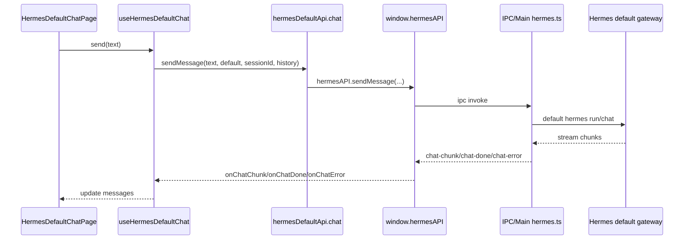

# PRD：ver5.6_hermes-default 模块功能

## 0. 源码依据

当前主导航页签由 `STATIC_WORKSPACE_MODULES` 生成，当前 `View` 类型包含 `aios-home / workspaces / task-workbench / web-operator / office / external-browser:*`，新增 `local-hermes` 必须同步修改 workspace registry、View 类型与 titleKey。([GitHub][1])

当前 `WorkspaceRenderer` 按 workspace module kind 分发到 `AIOSHomeScreen / WorkspacesScreen / TaskWorkbenchScreen / WebOperatorScreen / Office`，新增 Hermes 页签必须在该渲染器中单独挂载 `HermesScreen`。([GitHub][2])

当前 `Workspaces` 模块页面结构为 `WorkspacesScreen → WorkspacesShell → WorkspacesProvider → Sidebar / Center PageLoader / RightPanel`，ver5.6 的 `Hermes` 模块必须复用同等布局规格，但不能复用 `WorkspacesContext` 与 `workspacesApi`。([GitHub][3])

当前 `workspacesApi.ts` 依赖 `copilot-serve/profile-client`、`window.profileRuntime`、`window.workspaces`，并在聊天流中使用 `window.workspaceChat` 与 copilot-serve HTTP，因此不能作为 hermes-default 的数据层。([GitHub][4])

当前 `window.hermesAPI` 已暴露安装、配置、Gateway、Chat、Sessions、Profiles、Memory、Soul、Tools、Skills、Models、Cron、Logs 等 IPC 能力，ver5.6 的本地 Hermes 模块必须只通过该对象访问 Hermes default runtime。([GitHub][5])

---

## 1. 版本目标

版本号：`ver5.6_hermes-default`

新增本地 Hermes 操作模块：

```txt
src/renderer/src/screens/Hermes
```

模块目标：

1. 在 Main Top Nav 增加 `Local Hermes` 页签。
2. 页面布局、左侧导航、中心页面、右侧面板结构与 `src/renderer/src/screens/Workspaces` 保持一致。
3. 数据层固定操作本地 `hermes default`。
4. 所有接口调用必须走 `window.hermesAPI` IPC。
5. 禁止通过 `copilot-serve` 中转。
6. 禁止使用 `window.workspaceChat`。
7. 禁止使用 `window.profileRuntime`。
8. 禁止使用 `window.workspaces`。
9. 禁止在 `src/renderer/src/screens/Hermes/**` 中导入 `lib/copilot-serve/**`。

---

## 2. 功能边界

### 2.1 本期范围

| 模块           | 本期实现                                                                                                                           |
| ------------ | ------------------------------------------------------------------------------------------------------------------------------ |
| Main Top Nav | 增加 `Local Hermes` 顶层页签                                                                                                         |
| Hermes Shell | 三栏布局：左侧导航、中心操作页、右侧 Inspector                                                                                                   |
| Runtime      | default Gateway 启停、状态、日志、Hermes Home、模型配置                                                                                      |
| Chat         | 使用 `window.hermesAPI.sendMessage` 与 `onChatChunk/onChatDone/onChatError/onChatToolProgress`                                    |
| Sessions     | 使用 `listCachedSessions / syncSessionCache / getSessionMessages / searchSessions / updateSessionTitle`                          |
| Skills       | 使用 `listInstalledSkills / listBundledSkills / installSkill / uninstallSkill / getSkillContent`                                 |
| Memory       | 使用 `readMemory / writeUserProfile / addMemoryEntry / updateMemoryEntry / removeMemoryEntry / readSoul / writeSoul / resetSoul` |
| Tools        | 使用 `getToolsets / setToolsetEnabled`                                                                                           |
| Models       | 使用 `listModels / addModel / updateModel / removeModel / getModelConfig / setModelConfig`                                       |
| Providers    | 使用 `getEnv / setEnv / getConfig / setConfig / getCredentialPool / setCredentialPool`                                           |
| Logs         | 使用 `readLogs`                                                                                                                  |

### 2.2 不做范围

| 功能                               | 处理方式                                         |
| -------------------------------- | -------------------------------------------- |
| 多 Profile 并行 runtime             | 不接 `profileRuntime`                          |
| copilot-serve 状态、事件、API          | 不接入                                          |
| workspace-chat streaming service | 不接入                                          |
| profile workspace 文件树            | 不使用 `window.workspaces`                      |
| 附件上传                             | 本期隐藏上传入口                                     |
| 会话删除                             | `hermesAPI` 当前无 delete session IPC，本期不显示删除按钮 |
| Remote 用户端 Hermes Gateway        | 不接入                                          |
| Team Task Hub                    | 不接入                                          |

---

## 3. 顶层路由与导航

### 3.1 Workspace ID

新增静态 workspace id：

```ts
"local-hermes"
```

显示名称：

```ts
navigation.localHermes
```

中文：

```ts
localHermes: "Local Hermes"
```

英文：

```ts
localHermes: "Local Hermes"
```

### 3.2 修改文件

```txt
src/shared/workspace/workspace-contract.ts
src/renderer/src/types/desktop-shell.ts
src/renderer/src/workspace/workspace-registry.ts
src/shared/workspace/workspace-secondary-nav.ts
src/shared/i18n/locales/zh-CN/navigation.ts
src/shared/i18n/locales/en/navigation.ts
src/renderer/src/components/workspace/WorkspaceRenderer.tsx
```

### 3.3 修改要求

#### `workspace-contract.ts`

新增：

```ts
export type StaticWorkspaceId =
  | "aios-home"
  | "workspaces"
  | "local-hermes"
  | "task-workbench"
  | "web-operator"
  | "office";
```

`WorkspaceSource` 新增：

```ts
| "hermes"
```

#### `desktop-shell.ts`

`View` 新增：

```ts
| "local-hermes"
```

`VIEW_TITLE_KEYS` 新增：

```ts
"local-hermes": "navigation.localHermes"
```

#### `workspace-registry.ts`

在 `workspaces` 后增加：

```ts
{
  id: "local-hermes",
  titleKey: "navigation.localHermes",
  kind: "react",
  closeable: false,
  draggable: false,
  persistable: true,
  source: "hermes",
}
```

#### `workspace-secondary-nav.ts`

新增：

```ts
"local-hermes": []
```

`local-hermes` 使用模块内部左侧导航，不使用全局 secondary nav。

#### `WorkspaceRenderer.tsx`

新增导入：

```ts
import { HermesScreen } from "../../screens/Hermes";
```

在 `case "react"` 内增加优先分支：

```tsx
if (module.id === "local-hermes") {
  return (
    <ReactWorkspace active={workspaceId === "local-hermes"}>
      <WorkspaceShell>
        <HermesScreen
          activePanel={secondaryPanel}
          onPanelChange={onSecondaryPanelChange}
          onOpenRuntimeSettings={onOpenRuntimeSettings}
        />
      </WorkspaceShell>
    </ReactWorkspace>
  );
}
```

该分支必须放在 Workspaces fallback 之前。

---

## 4. 新模块目录结构

```txt
src/renderer/src/screens/Hermes/
├── index.tsx
├── Hermes.css
├── constants.ts
├── types.ts
├── api/
│   └── hermesDefaultApi.ts
├── context/
│   └── HermesDefaultContext.tsx
├── hooks/
│   ├── useHermesDefaultProfile.ts
│   ├── useHermesDefaultRuntime.ts
│   ├── useHermesDefaultSessions.ts
│   ├── useHermesDefaultChat.ts
│   ├── useHermesDefaultModels.ts
│   ├── useHermesDefaultMemory.ts
│   ├── useHermesDefaultSkills.ts
│   └── useHermesDefaultTools.ts
├── panels/
│   ├── HermesShell.tsx
│   ├── HermesRuntimePanel.tsx
│   ├── HermesRightPanel.tsx
│   └── HermesRightPanelRail.tsx
├── components/
│   ├── HermesSidebar.tsx
│   ├── HermesStatusCards.tsx
│   ├── HermesStatusBadge.tsx
│   ├── HermesPageErrorBoundary.tsx
│   └── HermesPageSkeleton.tsx
├── registry/
│   └── hermes-pages.tsx
└── pages/
    ├── Chat/
    │   ├── HermesDefaultChatPage.tsx
    │   ├── ChatScrollArea.tsx
    │   ├── ComposerBar.tsx
    │   └── StatusToast.tsx
    ├── Sessions/
    │   └── HermesSessionsPage.tsx
    ├── Skills/
    │   └── HermesSkillsPage.tsx
    ├── Tools/
    │   └── HermesToolsPage.tsx
    ├── Memory/
    │   └── HermesMemoryPage.tsx
    ├── Providers/
    │   └── HermesProvidersPage.tsx
    └── Models/
        └── HermesModelsPage.tsx
```

---

## 5. 常量定义

### `constants.ts`

```ts
export const HERMES_DEFAULT_PROFILE = "default" as const;

export const HERMES_DEFAULT_PROFILE_META = {
  id: "default",
  name: "default",
  displayName: "Hermes Default",
  roleName: "本地 Hermes",
  gatewayPort: 8642,
} as const;

export const STORAGE_KEYS = {
  activeRightTab: "hermesDefault.activeRightTab",
  collapsedRightPanel: "hermesDefault.collapsedRightPanel",
  collapsedLeftPanel: "hermesDefault.collapsedLeftPanel",
  activeNavItem: "hermesDefault.activeNavItem",
  activeSessionId: "hermesDefault.activeSessionId",
} as const;

export type HermesNavItemKey =
  | "chat"
  | "sessions"
  | "skills"
  | "tools"
  | "memory"
  | "providers"
  | "models";

export const HERMES_NAV_ITEMS = [
  { key: "chat", labelI18nKey: "workspaces.nav.chat", icon: "MessageSquare" },
  { key: "sessions", labelI18nKey: "workspaces.nav.sessions", icon: "History" },
  { key: "skills", labelI18nKey: "workspaces.nav.skills", icon: "Sparkles" },
  { key: "tools", labelI18nKey: "workspaces.nav.tools", icon: "Wrench" },
  { key: "memory", labelI18nKey: "workspaces.nav.memory", icon: "Brain" },
  { key: "providers", labelI18nKey: "workspaces.nav.providers", icon: "Server" },
  { key: "models", labelI18nKey: "workspaces.nav.models", icon: "Box" },
] as const;

export const LAYOUT = {
  sidebarWidthPx: 220,
  sidebarCollapsedWidthPx: 48,
  rightPanelWidthPx: 340,
  rightPanelCollapsedWidthPx: 48,
  centerMinWidthPx: 520,
} as const;
```

---

## 6. 数据层设计

### 6.1 文件

```txt
src/renderer/src/screens/Hermes/api/hermesDefaultApi.ts
```

### 6.2 约束

该文件是 `Hermes` 模块唯一数据出口。

禁止出现：

```ts
import ... from "../../../lib/copilot-serve"
window.workspaceChat
window.profileRuntime
window.workspaces
fetch("/api/v1
copilotServeFetch
ensureCopilotServeConfig
```

### 6.3 API 结构

```ts
import { HERMES_DEFAULT_PROFILE } from "../constants";

export const hermesDefaultApi = {
  profile: {
    async getDefaultProfile() {},
    async listProfilesForDisplay() {},
  },

  runtime: {
    async status() {},
    async start() {},
    async stop() {},
    async restart() {},
    async logs(lines = 200) {},
    async home() {},
    async doctor() {},
    async version() {},
  },

  chat: {
    async sendMessage(input) {},
    async abort() {},
    onChunk(callback) {},
    onDone(callback) {},
    onError(callback) {},
    onToolProgress(callback) {},
    onUsage(callback) {},
  },

  sessions: {
    async list(limit = 50, offset = 0) {},
    async sync() {},
    async search(query, limit = 20) {},
    async messages(sessionId) {},
    async rename(sessionId, title) {},
  },

  skills: {
    async installed() {},
    async bundled() {},
    async read(skillPath) {},
    async install(identifier) {},
    async uninstall(name) {},
  },

  memory: {
    async read() {},
    async readSoul() {},
    async writeSoul(content) {},
    async resetSoul() {},
    async addMemoryEntry(content) {},
    async updateMemoryEntry(index, content) {},
    async removeMemoryEntry(index) {},
    async writeUserProfile(content) {},
  },

  tools: {
    async list() {},
    async setEnabled(key, enabled) {},
  },

  models: {
    async list() {},
    async add(input) {},
    async update(id, fields) {},
    async remove(id) {},
    async getActive() {},
    async setActive(input) {},
  },

  providers: {
    async getEnv() {},
    async setEnv(key, value) {},
    async getConfig(key) {},
    async setConfig(key, value) {},
    async getCredentialPool() {},
    async setCredentialPool(provider, entries) {},
  },
};
```

### 6.4 固定 Profile 规则

所有 profile-aware IPC 调用必须显式传入：

```ts
HERMES_DEFAULT_PROFILE
```

示例：

```ts
window.hermesAPI.getModelConfig(HERMES_DEFAULT_PROFILE)
window.hermesAPI.readMemory(HERMES_DEFAULT_PROFILE)
window.hermesAPI.readSoul(HERMES_DEFAULT_PROFILE)
window.hermesAPI.getToolsets(HERMES_DEFAULT_PROFILE)
window.hermesAPI.listInstalledSkills(HERMES_DEFAULT_PROFILE)
window.hermesAPI.sendMessage(message, HERMES_DEFAULT_PROFILE, resumeSessionId, history)
```

---

## 7. 页面结构

### 7.1 `HermesScreen`

```tsx
export interface HermesScreenProps {
  activePanel?: string;
  onPanelChange?: (panel: string) => void;
  onOpenRuntimeSettings?: () => void;
}

export function HermesScreen(props: HermesScreenProps): React.JSX.Element {
  return (
    <div className="workspaces-screen hermes-screen">
      <HermesShell
        initialNavItem={props.activePanel}
        onNavItemChange={props.onPanelChange as any}
        onOpenRuntimeSettings={props.onOpenRuntimeSettings}
      />
    </div>
  );
}
```

CSS 复用 Workspaces 布局 class，新增 `hermes-*` class 只处理差异样式。

### 7.2 `HermesShell`

结构必须与 `WorkspacesShell` 对齐：

```tsx
<HermesDefaultProvider>
  <div className="workspaces-shell hermes-shell">
    <HermesStatusCards />
    <div className="workspaces-body">
      <HermesSidebar />
      <main className="workspaces-center">
        <div className="workspaces-center-scroll">
          <HermesPageLoader />
        </div>
      </main>
      <HermesRightPanel />
    </div>
  </div>
</HermesDefaultProvider>
```

---

## 8. Context 设计

### `HermesDefaultContext.tsx`

状态字段：

```ts
export interface HermesDefaultContextValue {
  activeSessionId: string | null;
  activeRightTab: "runtime" | "skills" | "memory" | "workspace";
  rightPanelCollapsed: boolean;
  leftPanelCollapsed: boolean;
  activeNavItem: HermesNavItemKey;

  setActiveSessionId(id: string | null): void;
  setActiveRightTab(tab: HermesRightInspectorTab): void;
  setRightPanelCollapsed(collapsed: boolean): void;
  setLeftPanelCollapsed(collapsed: boolean): void;
  setActiveNavItem(key: HermesNavItemKey): void;

  runtime: HermesDefaultRuntimeHandle;
  sessions: HermesSession[];
  sessionsLoading: boolean;
  sessionsKeyword: string;
  setSessionsKeyword(keyword: string): void;
  refreshSessions(): void;
  renameSession(sessionId: string, title: string): Promise<void>;
}
```

初始化规则：

```ts
activeNavItem 默认 "chat"
activeRightTab 默认 "runtime"
activeSessionId 从 hermesDefault.activeSessionId 读取
collapsed 状态使用 hermesDefault.* storage key
```

切换会话规则：

```ts
setActiveSessionId(id)
- 写入 localStorage
- Chat 页面自动加载 messages
```

新对话规则：

```ts
setActiveSessionId(null)
clear chat messages
abort current chat
```

---

## 9. Chat 页面

### 9.1 文件

```txt
src/renderer/src/screens/Hermes/pages/Chat/HermesDefaultChatPage.tsx
src/renderer/src/screens/Hermes/hooks/useHermesDefaultChat.ts
```

### 9.2 数据流



### 9.3 行为

1. 页面加载时注册 `onChatChunk / onChatDone / onChatError / onChatToolProgress / onChatUsage`。
2. 组件卸载时全部取消订阅。
3. 发送消息前检查 Gateway 状态。
4. Gateway 未运行时，Composer 显示 `Start Gateway`。
5. 点击 `Start Gateway` 调用 `window.hermesAPI.startGateway()`。
6. 发送成功后进入 `streaming`。
7. `onChatDone(sessionId)` 后：

   * 若返回 sessionId，写入 `activeSessionId`
   * 调用 `refreshSessions()`
8. 点击 Stop 调用 `window.hermesAPI.abortChat()`。
9. Clear 只清空当前 UI 消息，不删除磁盘 session。
10. Attachment 上传按钮隐藏。

### 9.4 禁止行为

```ts
window.workspaceChat.sendMessage(...)
window.workspaceChat.onChunk(...)
copilotServeFetch(...)
ensureCopilotServeConfig(...)
```

---

## 10. Sessions 页面

### 10.1 文件

```txt
src/renderer/src/screens/Hermes/pages/Sessions/HermesSessionsPage.tsx
src/renderer/src/screens/Hermes/hooks/useHermesDefaultSessions.ts
```

### 10.2 IPC 使用

```ts
window.hermesAPI.listCachedSessions(limit, offset)
window.hermesAPI.syncSessionCache()
window.hermesAPI.searchSessions(query, limit)
window.hermesAPI.getSessionMessages(sessionId)
window.hermesAPI.updateSessionTitle(sessionId, title)
```

### 10.3 页面行为

1. 默认读取 `listCachedSessions(50, 0)`。
2. 点击 Refresh 调用 `syncSessionCache()`。
3. 搜索框输入非空时调用 `searchSessions(query, 20)`。
4. 点击会话：

   * 设置 `activeSessionId`
   * 切换 `activeNavItem` 到 `chat`
   * Chat 页面加载 `getSessionMessages(sessionId)`
5. 重命名只调用 `updateSessionTitle`。
6. 删除按钮不显示。

---

## 11. Runtime 右侧面板

### 11.1 文件

```txt
src/renderer/src/screens/Hermes/panels/HermesRuntimePanel.tsx
```

### 11.2 使用 IPC

```ts
window.hermesAPI.gatewayStatus()
window.hermesAPI.startGateway()
window.hermesAPI.stopGateway()
window.hermesAPI.readLogs("gateway", 200)
window.hermesAPI.getHermesHome("default")
window.hermesAPI.getModelConfig("default")
window.hermesAPI.getHermesVersion()
window.hermesAPI.runHermesDoctor()
```

### 11.3 状态定义

```ts
type HermesGatewayUiStatus =
  | "running"
  | "stopped"
  | "starting"
  | "stopping"
  | "error";
```

### 11.4 行为

1. 首次挂载调用 `gatewayStatus()`。
2. Start：

   * 设置 `starting`
   * 调用 `startGateway()`
   * 调用 `gatewayStatus()`
3. Stop：

   * 设置 `stopping`
   * 调用 `stopGateway()`
   * 调用 `gatewayStatus()`
4. Restart：

   * 调用 `stopGateway()`
   * 等待 500ms
   * 调用 `startGateway()`
   * 调用 `gatewayStatus()`
5. Logs：

   * 点击刷新调用 `readLogs(undefined, 200)` 或 `readLogs("gateway", 200)`
6. 状态面板明确展示：

   * Profile：`default`
   * Gateway：`running/stopped`
   * Port：`8642`
   * Hermes Home
   * Provider
   * Model
   * Base URL

---

## 12. Skills 页面

### 12.1 IPC

```ts
window.hermesAPI.listInstalledSkills("default")
window.hermesAPI.listBundledSkills()
window.hermesAPI.getSkillContent(skillPath)
window.hermesAPI.installSkill(identifier, "default")
window.hermesAPI.uninstallSkill(name, "default")
```

### 12.2 行为

1. 左侧显示 installed skills。
2. 右侧显示 bundled skills。
3. 点击 skill 显示 markdown 内容。
4. Install / Uninstall 后刷新 installed + bundled。
5. 错误展示在页面顶部，不弹全局 toast。

---

## 13. Memory 页面

### 13.1 IPC

```ts
window.hermesAPI.readMemory("default")
window.hermesAPI.readSoul("default")
window.hermesAPI.writeSoul(content, "default")
window.hermesAPI.resetSoul("default")
window.hermesAPI.addMemoryEntry(content, "default")
window.hermesAPI.updateMemoryEntry(index, content, "default")
window.hermesAPI.removeMemoryEntry(index, "default")
window.hermesAPI.writeUserProfile(content, "default")
```

### 13.2 Tab

```txt
SOUL.md
MEMORY.md
USER.md
Stats
```

### 13.3 写入规则

| 文件        | 写入方式                      |
| --------- | ------------------------- |
| SOUL.md   | `writeSoul`               |
| MEMORY.md | memory entry 级别编辑，不直接整体覆盖 |
| USER.md   | `writeUserProfile`        |

---

## 14. Tools 页面

### IPC

```ts
window.hermesAPI.getToolsets("default")
window.hermesAPI.setToolsetEnabled(key, enabled, "default")
```

页面展示：

```txt
Toolset Key
Label
Description
Enabled Switch
```

切换开关后立即刷新列表。

---

## 15. Models 页面

### IPC

```ts
window.hermesAPI.listModels()
window.hermesAPI.addModel(name, provider, model, baseUrl)
window.hermesAPI.updateModel(id, fields)
window.hermesAPI.removeModel(id)
window.hermesAPI.getModelConfig("default")
window.hermesAPI.setModelConfig(provider, model, baseUrl, "default")
```

页面结构：

```txt
Active Model Card
Model List
Add/Edit Model Dialog
Set As Default Button
```

保存 active model 后刷新 Runtime Panel 的模型信息。

---

## 16. Providers 页面

### IPC

```ts
window.hermesAPI.getEnv("default")
window.hermesAPI.setEnv(key, value, "default")
window.hermesAPI.getConfig(key, "default")
window.hermesAPI.setConfig(key, value, "default")
window.hermesAPI.getCredentialPool()
window.hermesAPI.setCredentialPool(provider, entries)
```

页面分区：

```txt
Environment
Config
Credential Pool
Connection Mode Readonly
```

本期不修改 connection mode，避免影响全局 runtime 连接配置。

---

## 17. CSS 规则

### 17.1 文件

```txt
src/renderer/src/screens/Hermes/Hermes.css
```

### 17.2 规则

1. 允许复用 Workspaces class：

   * `workspaces-screen`
   * `workspaces-shell`
   * `workspaces-body`
   * `workspaces-center`
   * `workspaces-center-scroll`
   * `workspaces-panel-root`
2. Hermes 差异样式使用：

   * `hermes-screen`
   * `hermes-shell`
   * `hermes-status-card`
   * `hermes-runtime-panel`
3. 禁止在 Hermes 模块内新增破坏 Workspaces 布局的全局选择器。
4. 禁止修改 `Workspaces.css` 的既有语义。
5. 若必须补充公共样式，只新增低风险 class，不改原选择器行为。

---

## 18. Cursor 实施步骤

### Step 1：注册顶层页签

修改：

```txt
src/shared/workspace/workspace-contract.ts
src/renderer/src/types/desktop-shell.ts
src/renderer/src/workspace/workspace-registry.ts
src/shared/workspace/workspace-secondary-nav.ts
src/shared/i18n/locales/zh-CN/navigation.ts
src/shared/i18n/locales/en/navigation.ts
```

验收：

```txt
Main Top Nav 出现 Local Hermes
点击后 activeView = local-hermes
刷新后页签仍存在
```

### Step 2：挂载 Renderer

修改：

```txt
src/renderer/src/components/workspace/WorkspaceRenderer.tsx
```

新增：

```txt
src/renderer/src/screens/Hermes/index.tsx
src/renderer/src/screens/Hermes/Hermes.css
```

验收：

```txt
点击 Local Hermes 后渲染 HermesScreen
不影响 aios-home / workspaces / task-workbench / web-operator / office
```

### Step 3：实现 Hermes 数据层

新增：

```txt
src/renderer/src/screens/Hermes/api/hermesDefaultApi.ts
```

验收命令：

```bash
grep -R "copilot-serve\|workspaceChat\|profileRuntime\|window.workspaces\|copilotServeFetch\|ensureCopilotServeConfig" src/renderer/src/screens/Hermes
```

输出必须为空。

### Step 4：实现 Context 与 Hooks

新增：

```txt
src/renderer/src/screens/Hermes/context/HermesDefaultContext.tsx
src/renderer/src/screens/Hermes/hooks/*.ts
```

验收：

```txt
activeNavItem 持久化到 hermesDefault.activeNavItem
rightPanelCollapsed 持久化到 hermesDefault.collapsedRightPanel
leftPanelCollapsed 持久化到 hermesDefault.collapsedLeftPanel
activeSessionId 持久化到 hermesDefault.activeSessionId
```

### Step 5：实现三栏 Shell

新增：

```txt
src/renderer/src/screens/Hermes/panels/HermesShell.tsx
src/renderer/src/screens/Hermes/components/HermesSidebar.tsx
src/renderer/src/screens/Hermes/components/HermesStatusCards.tsx
src/renderer/src/screens/Hermes/panels/HermesRightPanel.tsx
src/renderer/src/screens/Hermes/panels/HermesRightPanelRail.tsx
src/renderer/src/screens/Hermes/panels/HermesRuntimePanel.tsx
```

验收：

```txt
页面结构与 Workspaces 一致
左侧导航可折叠
右侧面板可折叠
中心页面按 nav item 切换
```

### Step 6：实现页面

新增：

```txt
src/renderer/src/screens/Hermes/registry/hermes-pages.tsx
src/renderer/src/screens/Hermes/pages/Chat/HermesDefaultChatPage.tsx
src/renderer/src/screens/Hermes/pages/Sessions/HermesSessionsPage.tsx
src/renderer/src/screens/Hermes/pages/Skills/HermesSkillsPage.tsx
src/renderer/src/screens/Hermes/pages/Tools/HermesToolsPage.tsx
src/renderer/src/screens/Hermes/pages/Memory/HermesMemoryPage.tsx
src/renderer/src/screens/Hermes/pages/Providers/HermesProvidersPage.tsx
src/renderer/src/screens/Hermes/pages/Models/HermesModelsPage.tsx
```

验收：

```txt
Chat 能发送消息并接收 streaming chunk
Sessions 能读取本地 cache sessions
Skills 能读取 installed/bundled skills
Memory 能读取 default profile memory/soul/user
Tools 能开关 toolsets
Models 能显示并设置 default active model
Providers 能显示 default env/config
```

### Step 7：质量检查

项目已有脚本包含 `lint / typecheck / test / build / ci`。([GitHub][6])

执行：

```bash
npm run typecheck
npm run lint
npm test
npm run build
```

新增检查：

```bash
grep -R "copilot-serve\|workspaceChat\|profileRuntime\|window.workspaces\|copilotServeFetch\|ensureCopilotServeConfig" src/renderer/src/screens/Hermes
```

---

## 19. 验收标准

### 19.1 导航验收

```txt
Given 应用启动
When 用户点击 Main Top Nav 的 Local Hermes
Then 页面进入 local-hermes workspace
And 不打开 copilot-serve API
And 不触发 profileRuntime
```

### 19.2 Runtime 验收

```txt
Given Local Hermes 页面打开
When 点击 Start Gateway
Then 调用 window.hermesAPI.startGateway()
And Gateway 状态变为 running 或展示错误

When 点击 Stop Gateway
Then 调用 window.hermesAPI.stopGateway()
And Gateway 状态变为 stopped 或展示错误
```

### 19.3 Chat 验收

```txt
Given Gateway running
When 用户输入消息并发送
Then 调用 window.hermesAPI.sendMessage(message, "default", sessionId, history)
And 页面通过 onChatChunk 追加 assistant streaming 内容
And onChatDone 后刷新 sessions
```

### 19.4 Sessions 验收

```txt
Given 本地已有 Hermes sessions
When 打开 Sessions 页面
Then 调用 listCachedSessions
And 点击会话后进入 Chat
And Chat 加载 getSessionMessages(sessionId)
```

### 19.5 模块隔离验收

```txt
src/renderer/src/screens/Hermes/** 不允许出现：
- copilot-serve
- workspaceChat
- profileRuntime
- window.workspaces
- /api/v1
```

### 19.6 回归验收

```txt
aios-home 正常
workspaces 正常
task-workbench 正常
web-operator 正常
office 正常
external-browser:* 正常
Settings Drawer Hermes Runtime 正常
```

---

## 20. 关键实现原则

1. `Workspaces` 是团队/多 Profile 工作区。
2. `Hermes` 是本地 default Hermes 操作台。
3. `Hermes` 模块只认 `default` profile。
4. `Hermes` 模块只通过 `window.hermesAPI` 访问 Main IPC。
5. `Hermes` 模块不感知 copilot-serve。
6. `Hermes` 模块不感知 profileRuntime。
7. `Hermes` 模块不感知 workspaceChat。
8. UI 布局与 Workspaces 保持一致，数据层完全分离。

[1]: https://raw.githubusercontent.com/loudon84/ai-os-desktop/main/src/renderer/src/workspace/workspace-registry.ts "raw.githubusercontent.com"
[2]: https://raw.githubusercontent.com/loudon84/ai-os-desktop/main/src/renderer/src/components/workspace/WorkspaceRenderer.tsx "raw.githubusercontent.com"
[3]: https://raw.githubusercontent.com/loudon84/ai-os-desktop/main/src/renderer/src/screens/Workspaces/index.tsx "raw.githubusercontent.com"
[4]: https://raw.githubusercontent.com/loudon84/ai-os-desktop/main/src/renderer/src/screens/Workspaces/api/workspacesApi.ts "raw.githubusercontent.com"
[5]: https://raw.githubusercontent.com/loudon84/ai-os-desktop/main/src/preload/index.d.ts "raw.githubusercontent.com"
[6]: https://raw.githubusercontent.com/loudon84/ai-os-desktop/main/package.json "raw.githubusercontent.com"
